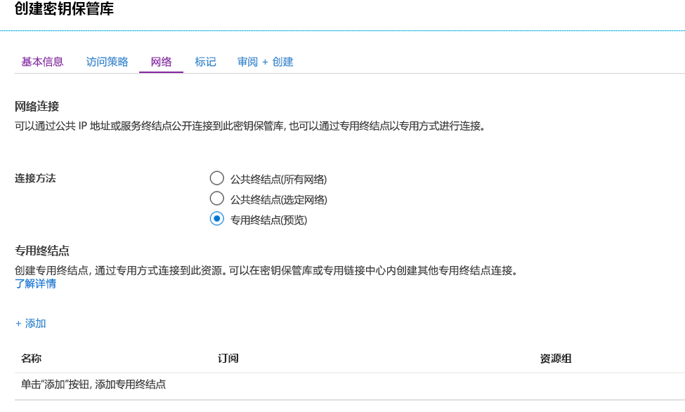
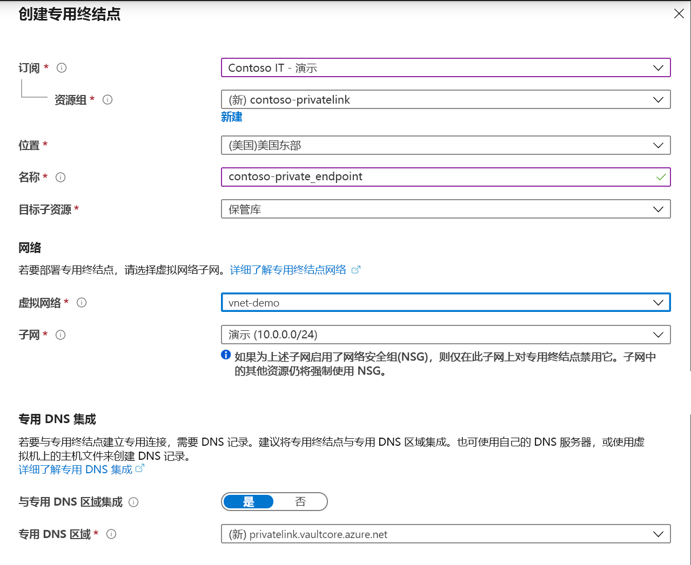
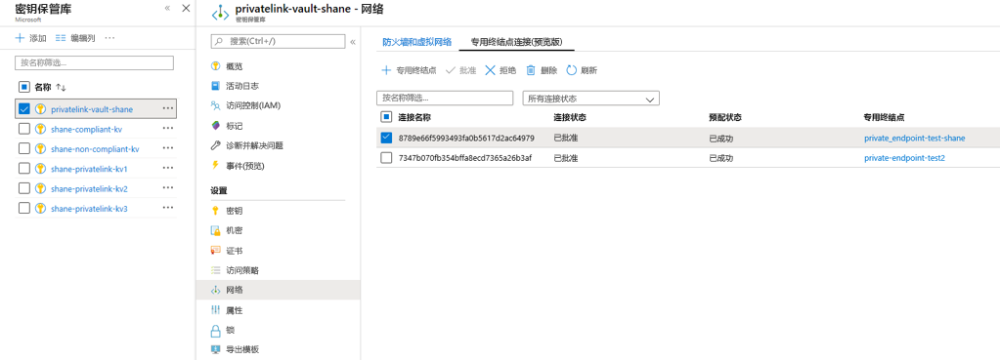

# <a name="integrate-key-vault-with-azure-private-link"></a>将 Key Vault 与 Azure 专用链接集成

使用 Azure 专用链接服务，可以通过虚拟网络中的专用终结点访问 Azure 服务（例如 Azure Key Vault、Azure 存储和 Azure Cosmos DB）以及 Azure 托管的客户服务/合作伙伴服务。

Azure 专用终结点是一个网络接口，可以通过私密且安全的方式将你连接到 Azure 专用链接支持的服务。 专用终结点使用 VNet 中的专用 IP 地址将服务有效接入 VNet 中。 发往服务的所有流量都可以通过专用终结点路由，因此不需要网关、NAT 设备、ExpressRoute 或 VPN 连接或公共 IP 地址。 虚拟网络与服务之间的流量将通过 Microsoft 主干网络，因此不会从公共 Internet 泄露。 可以连接到 Azure 资源的实例，从而获得最高级别的访问控制粒度。

有关详细信息，请参阅[什么是 Azure 专用链接？](../../private-link/private-link-overview.md)

## <a name="prerequisites"></a>先决条件

若要将 Key Vault 与 Azure 专用链接集成，需要准备好以下各项：

- 一个 Key Vault。
- 一个 Azure 虚拟网络。
- 虚拟网络中的子网。
- 对 Key Vault 和虚拟网络拥有所有者或参与者权限。

专用终结点和虚拟网络必须位于同一区域。 使用门户选择专用终结点的区域时，只会自动筛选该区域中的虚拟网络。 Key Vault 可以位于不同的区域。

专用终结点使用虚拟网络中的专用 IP 地址。

## <a name="establish-a-private-link-connection-to-key-vault-using-the-azure-portal"></a>使用 Azure 门户与 Key Vault 建立专用链接连接 

首先，遵循[使用 Azure 门户创建虚拟网络](../../virtual-network/quick-create-portal.md)中的步骤创建虚拟网络

然后可以创建新的 Key Vault，或者与现有的 Key Vault 建立专用链接连接。

### <a name="create-a-new-key-vault-and-establish-a-private-link-connection"></a>创建新 Key Vault 并建立专用链接连接

可以遵循[使用 Azure 门户在 Azure Key Vault 中设置和检索机密](../secrets/quick-create-portal.md)中的步骤创建新的 Key Vault

配置 Key Vault 基本设置后，选择“网络”选项卡并执行以下步骤：

1. 在“网络”选项卡中选中“专用终结点”单选按钮。
1. 单击“+ 添加”按钮添加专用终结点。

    
 
1. 在“创建专用终结点”边栏选项卡的“位置”字段中，选择虚拟网络所在的区域。 
1. 在“名称”字段中创建一个描述性的名称，用于标识此专用终结点。 
1. 从下拉菜单中，选择要在其中创建此专用终结点的虚拟网络和子网。 
1. 将“与专用区域 DNS 集成”选项保留不变。  
1. 选择“确定”。

    
 
现在可以看到配置的专用终结点。 可以使用相应的选项来删除和编辑此专用终结点。 选择“查看 + 创建”按钮并创建 Key Vault。 完成部署需要 5-10 分钟。 

### <a name="establish-a-private-link-connection-to-an-existing-key-vault"></a>与现有的 Key Vault 建立专用链接连接

如果已有 Key Vault，可以执行以下步骤创建专用链接连接：

1. 登录到 Azure 门户。 
1. 在搜索栏中键入“key vault”
1. 从列表中选择要将专用终结点添加到的 Key Vault。
1. 选择“设置”下的“网络”选项卡
1. 选择页面顶部的“专用终结点连接”选项卡
1. 选择页面顶部的“+ 专用终结点”按钮。

     

可以使用此边栏选项卡选择为任何 Azure 资源创建专用终结点。 可以使用下拉菜单选择资源类型并在目录中选择资源，或者使用资源 ID 连接到任何 Azure 资源。 将“与专用区域 DNS 集成”选项保留不变。  


## <a name="establish-a-private-link-connection-to-key-vault-using-cli"></a>使用 CLI 与 Key Vault 建立专用链接连接

### <a name="login-to-azure-cli"></a>登录到 Azure CLI
```console
az login 
```
### <a name="select-your-azure-subscription"></a>选择 Azure 订阅 
```console
az account set --subscription {AZURE SUBSCRIPTION ID}
```
### <a name="create-a-new-resource-group"></a>创建新的资源组 
```console
az group create -n {RG} -l {AZURE REGION}
```
### <a name="register-microsoftkeyvault-as-a-provider"></a>将 Microsoft.KeyVault 注册为提供程序 
```console
az provider register -n Microsoft.KeyVault
```
### <a name="create-a-new-key-vault"></a>创建新的密钥保管库
```console
az keyvault create --name {KEY VAULT NAME} --resource-group {RG} --location {AZURE REGION}
```
### <a name="turn-on-key-vault-firewall"></a>启用 Key Vault 防火墙
```console
az keyvault update --name {KEY VAULT NAME} --resource-group {RG} --default-action deny
```
### <a name="create-a-virtual-network"></a>创建虚拟网络
```console
az network vnet create --resource-group {RG} --name {vNet NAME} --location {AZURE REGION}
```
### <a name="add-a-subnet"></a>添加子网
```console
az network vnet subnet create --resource-group {RG} --vnet-name {vNet NAME} --name {subnet NAME} --address-prefixes {addressPrefix}
```
### <a name="disable-virtual-network-policies"></a>禁用虚拟网络策略 
```console
az network vnet subnet update --name {subnet NAME} --resource-group {RG} --vnet-name {vNet NAME} --disable-private-endpoint-network-policies true
```
### <a name="add-a-private-dns-zone"></a>添加专用 DNS 区域 
```console
az network private-dns zone create --resource-group {RG} --name privatelink.vaultcore.azure.net
```
### <a name="link-private-dns-zone-to-virtual-network"></a>将专用 DNS 区域链接到虚拟网络 
```console
az network private-dns link vnet create --resource-group {RG} --virtual-network {vNet NAME} --zone-name privatelink.vaultcore.azure.net --name {dnsZoneLinkName} --registration-enabled true
```
### <a name="add-private-dns-records"></a>添加专用 DNS 记录
```console
# https://docs.microsoft.com/en-us/azure/dns/private-dns-getstarted-cli#create-an-additional-dns-record
az network private-dns zone list -g $rg_name
az network private-dns record-set a add-record -g $rg_name -z "privatelink.vaultcore.azure.net" -n $vault_name -a $kv_network_interface_private_ip
az network private-dns record-set list -g $rg_name -z "privatelink.vaultcore.azure.net"

# From home/public network, you wil get a public IP. If inside a vnet with private zone, nslookup will resolve to the private ip.
nslookup $vault_name.vault.azure.net
nslookup $vault_name.privatelink.vaultcore.azure.net
```
### <a name="create-a-private-endpoint-automatically-approve"></a>创建专用终结点（自动批准） 
```console
az network private-endpoint create --resource-group {RG} --vnet-name {vNet NAME} --subnet {subnet NAME} --name {Private Endpoint Name}  --private-connection-resource-id "/subscriptions/{AZURE SUBSCRIPTION ID}/resourceGroups/{RG}/providers/Microsoft.KeyVault/vaults/ {KEY VAULT NAME}" --group-ids vault --connection-name {Private Link Connection Name} --location {AZURE REGION}
```
### <a name="create-a-private-endpoint-manually-request-approval"></a>创建专用终结点（手动请求批准） 
```console
az network private-endpoint create --resource-group {RG} --vnet-name {vNet NAME} --subnet {subnet NAME} --name {Private Endpoint Name}  --private-connection-resource-id "/subscriptions/{AZURE SUBSCRIPTION ID}/resourceGroups/{RG}/providers/Microsoft.KeyVault/vaults/ {KEY VAULT NAME}" --group-ids vault --connection-name {Private Link Connection Name} --location {AZURE REGION} --manual-request
```
### <a name="show-connection-status"></a>显示连接状态 
```console
az network private-endpoint show --resource-group {RG} --name {Private Endpoint Name}
```
## <a name="manage-private-link-connection"></a>管理专用链接连接

创建专用终结点时，必须批准连接。 如果要为其创建专用终结点的资源位于你的目录中，则你可以批准连接请求（前提是你有足够的权限）；如果连接到另一个目录中的 Azure 资源，则必须等待该资源的所有者批准连接请求。

有四种预配状态：

| 服务提供商操作 | 服务使用者专用终结点状态 | 说明 |
|--|--|--|
| 无 | 挂起的 | 连接是手动创建的，正等待专用链接资源所有者批准。 |
| 审批 | 已批准 | 连接已自动或手动批准，可供使用。 |
| 拒绝 | 已拒绝 | 连接被专用链接资源所有者拒绝。 |
| 删除 | 已断开连接 | 连接已被专用链接资源所有者删除，专用终结点仅供参考，应将其删除以清理资源。 |
 
###  <a name="how-to-manage-a-private-endpoint-connection-to-key-vault-using-the-azure-portal"></a>如何使用 Azure 门户管理与 Key Vault 建立的专用终结点连接 

1. 登录到 Azure 门户。
1. 在搜索栏中键入“key vault”
1. 选择要管理的 Key Vault。
1. 选择“网络”选项卡。
1. 如果有任何挂起的连接，则会列出预配状态为“挂起”的连接。 
1. 选择要批准的专用终结点
1. 选择“批准”按钮。
1. 如果你要拒绝任何专用终结点连接（不管是挂起的请求还是现有的连接），请选择该连接并单击“拒绝”按钮。

    

##  <a name="how-to-manage-a-private-endpoint-connection-to-key-vault-using-azure-cli"></a>如何使用 Azure CLI 管理与 Key Vault 建立的专用终结点连接

### <a name="approve-a-private-link-connection-request"></a>批准专用链接连接请求
```console
az keyvault private-endpoint-connection approve --approval-description {"OPTIONAL DESCRIPTION"} --resource-group {RG} --vault-name {KEY VAULT NAME} –name {PRIVATE LINK CONNECTION NAME}
```

### <a name="deny-a-private-link-connection-request"></a>拒绝专用链接连接请求
```console
az keyvault private-endpoint-connection reject --rejection-description {"OPTIONAL DESCRIPTION"} --resource-group {RG} --vault-name {KEY VAULT NAME} –name {PRIVATE LINK CONNECTION NAME}
```

### <a name="delete-a-private-link-connection-request"></a>删除专用链接连接请求
```console
az keyvault private-endpoint-connection delete --resource-group {RG} --vault-name {KEY VAULT NAME} --name {PRIVATE LINK CONNECTION NAME}
```

## <a name="validate-that-the-private-link-connection-works"></a>验证专用链接连接是否有效

应该验证专用终结点资源的同一子网中的资源是否可以通过专用 IP 地址连接到 Key Vault，以及它们是否具有正确的专用 DNS 区域集成。

首先，遵循[在 Azure 门户中创建 Windows 虚拟机](../../virtual-machines/windows/quick-create-portal.md)中的步骤创建一个虚拟机。

在“网络”选项卡中：

1. 指定虚拟网络和子网。 可以创建新的或选择现有的虚拟网络。 如果选择现有的虚拟网络，请确保区域匹配。
1. 指定公共 IP 资源。
1. 在“NIC 网络安全组”中选择“无”。
1. 在“负载均衡”中选择“否”。

打开命令行并运行以下命令：

```console
nslookup <your-key-vault-name>.vault.azure.net
```

如果运行 ns lookup　命令通过公共终结点解析 Key Vault 的 IP 地址，将会看到如下所示的结果：

```console
c:\ >nslookup <your-key-vault-name>.vault.azure.net

Non-authoritative answer:
Name:    
Address:  (public IP address)
Aliases:  <your-key-vault-name>.vault.azure.net
```

如果运行 ns lookup　命令通过专用终结点解析 Key Vault 的 IP 地址，将会看到如下所示的结果：

```console
c:\ >nslookup your_vault_name.vault.azure.net

Non-authoritative answer:
Name:    
Address:  10.1.0.5 (private IP address)
Aliases:  <your-key-vault-name>.vault.azure.net
          <your-key-vault-name>.privatelink.vaultcore.azure.net
```

## <a name="troubleshooting-guide"></a>故障排除指南

* 检查以确保专用终结点处于已批准状态。 
    1. 可以在 Azure 门户中检查并修复此问题。 打开 Key Vault 资源，然后单击“网络”选项。 
    2. 然后选择“专用终结点连接”选项卡。 
    3. 请确保连接状态为“已批准”并且预配状态为“成功”。 
    4. 还可以导航到专用终结点资源并在其中查看相同属性，然后仔细检查虚拟网络是否与所使用的网络匹配。

* 请检查以确保具有专用 DNS 区域资源。 
    1. 必须具有名称准确的专用 DNS 区域资源：privatelink.vaultcore.azure.net。 
    2. 若要了解如何对此进行设置，请参阅以下链接。 [专用 DNS 区域](https://docs.microsoft.com/azure/dns/private-dns-privatednszone)
    
* 请检查以确保专用 DNS 区域未链接到虚拟网络。 如果仍在返回公共 IP 地址，则可能存在该问题。 
    1. 如果专用区域 DNS 未链接到虚拟网络，则从虚拟网络发起的 DNS 查询会返回 Key Vault 的公共 IP 地址。 
    2. 在 Azure 门户中导航到专用 DNS 区域资源，然后单击虚拟网络链接选项。 
    4. 必须列出将对 Key Vault 执行调用的虚拟网络。 
    5. 如果它不存在，请添加它。 
    6. 有关详细步骤，请参阅以下文档[将虚拟网络链接到专用 DNS 区域](https://docs.microsoft.com/azure/dns/private-dns-getstarted-portal#link-the-virtual-network)

* 请检查以确保专用 DNS 区域不缺少 Key Vault 的 A 记录。 
    1. 导航到专用 DNS 区域页。 
    2. 单击“概述”，并检查是否存在具有 Key Vault 的简单名称（即 fabrikam）的 A 记录。 不要指定任何后缀。
    3. 确保检查拼写，并创建或修复 A 记录。 可以使用 3600（1小时）的 TTL。 
    4. 确保指定了正确的专用 IP 地址。 
    
* 检查以确保 A 记录具有正确的 IP 地址。 
    1. 可以通过在 Azure 门户中打开专用终结点资源来确认 IP 地址 
    2. 在 Azure 门户（而不是 Key Vault 资源）中导航到 Microsoft.Network/privateEndpoints 资源
    3. 在概述页中，查找网络接口，然后单击该链接。 
    4. 该链接显示 NIC 资源的概述，其中包含专用 IP 地址属性。 
    5. 验证这是否为在 A 记录中指定的正确 IP 地址。

## <a name="limitations-and-design-considerations"></a>限制和设计注意事项

> [!NOTE]
> 按订阅启用了专用终结点的密钥保管库数量是可调整的限制。 下面显示的限制是默认限制。 如果你想要为服务请求增加限制，请发送电子邮件到 akv-privatelink@microsoft.com。 我们将根据具体情况审批这些请求。

**定价**：有关定价信息，请参阅 [Azure 专用链接定价](https://azure.microsoft.com/pricing/details/private-link/)。

**限制**：Azure Key Vault 的专用终结点仅在 Azure 公共区域提供。

**每个 Key Vault 的专用终结点数目上限**：64。

每个订阅的包含专用终结点的默认 Key Vault 数目：400。

有关详细信息，请参阅 [Azure 专用链接服务：限制](../../private-link/private-link-service-overview.md#limitations)

## <a name="next-steps"></a>后续步骤

- 详细了解 [Azure 专用链接](../../private-link/private-link-service-overview.md)
- 详细了解 [Azure Key Vault](overview.md)
