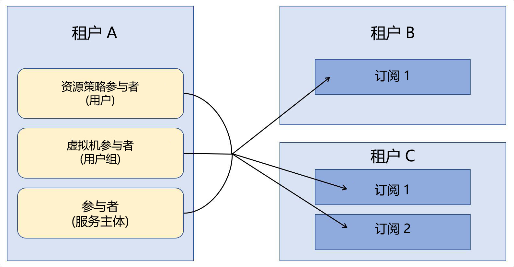

# 企业应用场景中的 Azure Lighthouse

Azure Lighthouse 的最常见应用场景包括：服务提供商使用 [Azure Lighthouse](../overview.md) 来管理其客户的 Azure Active Directory (Azure AD) 租户中的资源。 但是，Azure Lighthouse 的功能还可以简化使用多个 Azure AD 租户的企业中的跨租户管理。

## 单个租户与多个租户

对于大多数组织而言，单个 Azure AD 租户的管理比较轻松。 将所有资源部署在一个租户中可按该租户中的指定用户、用户组或服务主体来集中处理管理任务。 我们建议尽量对组织使用一个租户。

同时，在某些情况下，组织可能需要维护多个 Azure AD 租户。 这种情况有时是暂时性的，例如，在发生企业并购后，需要花费一定的时间来制定长期租户整合策略。 组织也可能需要持续维护多个租户（出于子公司完全独立、满足地理或法律要求等原因）。 如果需要多租户体系结构，可以使用 Azure 委托的资源管理来集中处理和简化管理操作。 可以登记多个租户中的订阅来实现 [Azure 委托的资源管理](azure-delegated-resource-management.md)，使管理租户中的指定用户能够以集中的可缩放方式执行[跨租户管理功能](cross-tenant-management-experience.md)。

## 租户管理体系结构

跨多个租户集中处理管理操作时，需要确定哪个租户包含要对其他租户执行管理操作的用户。 换言之，需要确定哪个租户是其他租户的管理租户。

For example, say your organization has a single tenant that we’ll call *Tenant A*. Your organization then acquires two additional tenants, *Tenant B* and *Tenant C*, and you have business reasons that require you to maintain them as separate tenants.

你的组织希望在所有租户中使用相同的策略定义、备份实践和安全流程。 由于已有用户（包括用户组和服务主体）负责在租户 A 中执行这些任务，因此，你可以登记租户 B 和租户 C 中的所有订阅，使租户 A 中的这些用户可以执行这些任务。

## 安全和访问注意事项

在大多数企业应用场景中，需要为 Azure 委托的资源管理委托整个订阅，不过，你也可以仅委托订阅中的特定资源组。

无论采用哪种方式，都需要确保[在定义哪些用户拥有资源访问权限时遵循最低特权的原则](recommended-security-practices.md#assign-permissions-to-groups-using-the-principle-of-least-privilege)。 这有助于确保用户只拥有执行所需任务而需要的权限，并可以减少意外出错的可能性。

Azure Lighthouse 和 Azure 委托的资源管理只在管理租户和被管理租户之间提供逻辑链接，而不会以物理方式移动数据或资源。 此外，访问始终只朝一个方向进行，即，从管理租户访问被管理租户。  在对被管理租户的资源执行管理操作时，管理租户中的用户和组应继续使用多重身份验证。

实施内部或外部监管与合规性准则的企业可以使用 [Azure 活动日志](https://docs.microsoft.com/azure/azure-monitor/platform/activity-logs-overview)来满足其透明性要求。 如果企业租户已在管理租户与被管理租户之间建立了关系，则每个租户中的用户可以通过查看记录的活动，来监视和洞察另一租户中的用户所执行的操作。

## 登记过程注意事项

可以通过部署 Azure 资源管理器模板，或者通过发布到 Azure 市场的托管服务套餐，以私密或公开方式将订阅（或订阅中的资源组）登记到 Azure 委托的资源管理。

由于企业用户通常可以获取企业租户的直接访问权限，并且无需营销或促销管理套餐，因此，直接使用 Azure 资源管理器模板进行部署通常速度更快且更简单。 尽管[登记指南](../how-to/onboard-customer.md)中提到的受众是服务提供商和客户，但企业也可以使用相同的过程。

如果需要，可以通过[将托管服务套餐发布到 Azure 市场](../how-to/publish-managed-services-offers.md)来登记企业中的租户。 为了确保该套餐仅适用于相应的租户，请务必将计划标记为“专用”。 使用专用计划时，可为你打算登记的每个租户提供订阅 ID，而其他任何人都无法获取你的套餐。

## 术语注释

对于企业中的跨租户管理，可将 Azure Lighthouse 文档中的服务提供商参考内容理解为适用于企业中的管理租户 — 即，包含要通过 Azure 委托的资源管理来管理其他租户资源的用户的租户。 同理，可将客户参考内容理解为适用于委托要通过管理租户中的用户管理的资源的租户。

例如，在上述示例中，可将租户 A 视为服务提供商租户（管理租户），将租户 B 和租户 C 视为客户租户。

在该示例中，具有相应权限的租户 A 用户可以在 Azure 门户的“我的客户”页中[查看和管理委托的资源](../how-to/view-manage-customers.md)。 同理，具有相应权限的租户 B 和租户 C 用户可以在 Azure 门户的“服务提供商”页中[查看和管理委托给租户 A 的资源](../how-to/view-manage-service-providers.md)。

## 后续步骤

- 了解[跨租户管理体验](cross-tenant-management-experience.md)。
- 了解 [Azure 委派资源管理](azure-delegated-resource-management.md)。