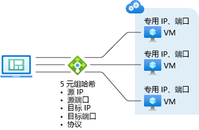

# 负载均衡器组件和限制
Azure 负载均衡器包含几个关键组件，用于执行其操作。  可以通过 Azure 门户、Azure CLI 或 Azure PowerShell 在你的订阅中配置这些组件。  

## 负载均衡器组件

* **前端 IP 配置**：负载均衡器的 IP 地址。 这是客户端的联系点。 这些地址可以是： 

    - **[公共 IP 地址](https://docs.microsoft.com/azure/virtual-network/virtual-network-public-ip-address)**
    - **[专用 IP 地址](https://docs.microsoft.com/azure/virtual-network/virtual-network-ip-addresses-overview-arm#private-ip-addresses)**

* **后端池**：将处理传入请求的虚拟机组或虚拟机规模集中的实例。 为了经济高效地扩展以满足大量传入流量，计算准则通常建议向后端池添加更多实例。 纵向扩展或缩减实例时，负载均衡器可即时通过自动重新配置来重新配置自身。 在后端池中添加或删除 VM 会重新配置负载均衡器，无需执行其他操作。 后端池的范围包括虚拟网络中的任何虚拟机。 后端池最多可包含 1000 个后端实例或 IP 配置。
基本负载均衡器具有有限的范围（可用性集），只能扩展到最多 300 个 IP 配置。 有关限制的详细信息，请参阅[负载均衡器限制](https://docs.microsoft.com/azure/azure-resource-manager/management/azure-subscription-service-limits#load-balancer)。 考虑后端池的设计方式时，可针对单个后端池资源的最小数字进行设计，从而进一步优化管理操作的持续时间。 在数据平面性能或规模中不存在任何差异。
* **运行状况探测**： **[运行状况探测](https://docs.microsoft.com/azure/load-balancer/load-balancer-custom-probe-overview)** 用于确定后端池中实例的运行状况。 可以定义运行状况探测的不正常阈值。 当探测无法响应时，负载均衡器会停止向状况不良的实例发送新连接。 探测失败不会影响现有连接。 
    
    连接将继续，直到应用程序： 
    - 结束流
    - 出现空闲超时
    - VM 关闭

    负载均衡器为终结点提供了不同的运行状况探测类型：
    - TCP
    - HTTP
    - HTTPS（带有传输层安全性 (TLS) 包装器的 HTTP 探测）
     
     基本负载均衡器不支持 HTTPS 探测。 此外，基本负载均衡器将终止所有 TCP 连接（包括已建立的连接）。 
    有关详细信息，请参阅[探测类型](load-balancer-custom-probe-overview.md#types)。

* **负载均衡规则**：负载均衡规则告知负载均衡器何时需要执行何种操作。 
* **入站 NAT 规则**：入站 NAT 规则将来自特定前端 IP 地址的特定端口的流量转发到虚拟网络中特定后端实例的特定端口。 **[端口转发](https://docs.microsoft.com/azure/load-balancer/tutorial-load-balancer-port-forwarding-portal)** 通过与负载均衡相同的基于哈希的分配来实现。 此功能的常见应用方案是与 Azure 虚拟网络中的单个 VM 实例建立远程桌面协议 (RDP) 或安全外壳 (SSH) 会话。 可将多个内部终结点映射到相同前端 IP 地址上的端口。 可以使用前端 IP 地址远程管理 VM，而无需额外配置跳转盒。
* **出站规则**： **[出站规则](https://docs.microsoft.com/azure/load-balancer/load-balancer-outbound-rules-overview)** 为标准负载均衡器的后端池识别的、要转换为前端的所有虚拟机或实例配置出站网络地址转换 (NAT)。
基本负载均衡器不支持出站规则。

## 负载均衡器的概念

负载均衡器为 TCP 和 UDP 应用程序提供以下基本功能：

* **负载均衡算法**：使用 Azure 负载均衡器可以创建负载均衡规则，以便将抵达前端的流量分配到后端池实例。 负载均衡器使用哈希算法来分配入站流（非字节），并重写发往后端池实例的流的标头。 当运行状况探测指示后端终结点正常时，可以使用一个服务器来接收新流量。
默认情况下，负载均衡器使用 5 元组哈希。 

   哈希包括： 

   - **源 IP 地址**
   - **源端口**
   - **目标 IP 地址**
   - **目标端口**
   - **用于将流映射到可用服务器的 IP 协议号** 

可以启用给定规则的 2 元组或 3 元组哈希，来与源 IP 地址创建关联。 同一数据包流量的所有数据包将会抵达负载均衡前端后面的同一实例。 当客户端从同一源 IP 启动新流时，源端口将会更改。 因此，5 元组哈希可能导致流量定向到不同的后端终结点。
有关详细信息，请参阅[配置 Azure 负载均衡器的分配模式](./load-balancer-distribution-mode.md)。 

下图显示了基于哈希的分配：

  

  图：  基于哈希的分发

* **应用程序独立性和透明度**：负载均衡器不直接与 TCP、UDP 或应用层交互。 可以支持任何 TCP 或 UDP 应用程序方案。 负载均衡器不会终止或产生流，与流的有效负载交互，也不提供任何应用层网关功能。 协议握手始终直接在客户端与后端池实例之间进行。 对入站流做出的响应始终是来自虚拟机的响应。 当流抵达虚拟机时，也会保留原始的源 IP 地址。
  * 每个终结点仅由某个 VM 应答。 例如，TCP 握手始终在客户端与选定的后端 VM 之间发生。 对前端请求做出的响应是后端 VM 生成的响应。 成功验证与前端的连接后，将会验证与至少一个后端虚拟机的端到端连接。
  * 应用程序有效负载对于负载均衡器是透明的。 可以支持任何 UDP 或 TCP 应用程序。
  * 由于负载均衡器不会与 TCP 有效负载进行交互并提供 TLS 卸载，因此你可以构建端到端的加密方案。 使用负载均衡器可通过终止虚拟机本身上的 TLS 连接来实现 TLS 应用程序的大规模横向扩展。 例如，将会根据添加到后端池的 VM 类型和数目限制 TLS 会话密钥容量。

* **出站连接**：从虚拟网络中的专用 IP 地址发往 Internet 上的公共 IP 地址的所有出站流量可以转换为负载均衡器的前端 IP 地址。 通过负载均衡规则将公共前端绑定到后端 VM 后，Azure 会将出站连接设定为公共前端的 IP 地址。 此配置具有以下优点：
  * 可以轻松地对服务进行升级和灾难恢复操作，因为前端可以动态映射到服务的其他实例。
  * 简化了访问控制列表 (ACL) 管理。 以前端 IP 表示的 ACL 不会随着服务的缩放或重新部署而更改。 将出站连接转换为较小数量的 IP 地址而不是计算机，可以减少实施安全收件人列表的负担。

  标准负载均衡器利用[可靠、可缩放且可预测的 SNAT 算法](load-balancer-outbound-connections.md#snat)。使用标准负载均衡器时，需要记住以下关键原则：

    - 负载均衡规则推断 SNAT 的编程方式。 负载均衡规则特定于协议。 SNAT 特定于协议，配置应反映这一点，而不是产生副作用。

    - **多个前端** 当有多个前端可用时，会使用所有前端，每个前端成倍增加可用的 SNAT 端口数。 希望出现或已遇到出站连接的高需求时，如果想要更多 SNAT 端口，还可以通过配置其他前端、规则和后端池，将增量 SNAT 端口库存添加到相同的虚拟机资源。

    - **控制用于出站的前端** 如果不希望某特定前端用于出站连接，可进行选择和控制。 如果要将出站连接限制为仅来自于特定前端 IP 地址，可以按需在表示出站映射的规则上禁用出站 SNAT。

    - **控制出站连接** 出站方案是显式的，指定出站连接后，该连接才会存在。 标准负载均衡器存在于虚拟网络的上下文中。  虚拟网络是独立的专用网络。  除非存在与公共 IP 地址的关联，否则不允许公共连接。  可以访问 [VNet 服务终结点](../virtual-network/virtual-network-service-endpoints-overview.md)，因为它们在虚拟网络内部并位于本地。  若要对虚拟网络外部的目标建立出站连接，可执行以下两个选项：
        - 将标准 SKU 公共 IP 地址作为实例层级公共 IP 地址分配到虚拟机资源；
        - 或者，将虚拟机资源放入公共标准负载均衡器的后端池中。

        上述两个选项均允许通过出站连接从虚拟网络访问虚拟网络的外部。 

        如果只有  一个内部标准负载均衡器与虚拟机资源所在的后端池关联，虚拟机仅可以访问虚拟网络资源和 [VNet 终结点](../virtual-network/virtual-network-service-endpoints-overview.md)。  可以按照上一段描述的步骤创建出站连接。

        未与标准 SKU 关联的虚拟机资源的出站连接保持不变。

        请查看[有关出站连接的详细讨论](load-balancer-outbound-connections.md)。

* **可用性区域**：标准负载均衡器在提供可用性区域的区域中支持其他功能。 这些功能可增量到所有标准负载均衡器提供的内容。  可用性区域配置可用于公共和内部标准负载均衡器这两种类型。
 区域冗余前端在发生区域故障后仍保留，并由所有区域中的专用基础结构同时提供。 
此外，可以保证特定区域的前端。 区域前端的运行状况取决于相应的区域，仅由一个区域中的专用基础结构提供。
跨区域负载均衡可用于后端池，且虚拟网络中的任何虚拟机资源均可成为后端池的一部分。
基本负载均衡器不支持区域。
有关详细信息，请查看[有关可用性区域相关功能的详细讨论](load-balancer-standard-availability-zones.md)和[可用性区域概述](../availability-zones/az-overview.md)。

* **HA 端口**：可以配置负载均衡规则，让应用程序具有缩放性，并且变得高度可靠。 使用 HA 端口负载均衡规则时，在内部标准负载均衡器的前端 IP 地址的每个临时端口上，标准负载均衡器对每个流提供负载均衡。  该功能对无法或不需要指定单个端口的其他方案也很有用。 使用 HA 端口负载均衡规则，可以为网络虚拟设备以及任何需要大范围入站端口的应用程序创建主动-被动或主动-被动 n+1 方案。  运行状况探测可用于确定接收新流的后端。  可使用网络安全组模拟端口范围方案。 基本负载均衡器不支持 HA 端口。
请查看[有关 HA 端口的详细讨论](load-balancer-ha-ports-overview.md)
>[!IMPORTANT]
> 如果计划使用网络虚拟设备，请咨询供应商以获取指南，了解他们的产品是否测试了 HA 端口，然后按照他们提供的特定指南进行实现。 

* **多个前端**：负载均衡器使用多个前端支持多项规则。  标准负载均衡器将其扩展到出站方案。  出站方案与入站负载均衡规则实质上存在逆反关系。  入站负载均衡规则还创建了出站连接的关联。 标准负载均衡器通过负载均衡规则使用与虚拟机资源关联的所有前端。  此外，使用负载均衡规则上的参数可以为了出站连接取消负载均衡规则，并允许选择特定前端（包括无前端）。

为进行比较，基本负载均衡器随机选择一个前端，且无法控制选择哪一个前端。
## 负载均衡器的类型

### 公共负载均衡器

公共负载均衡器将传入流量的公共 IP 地址和端口映射到 VM 的专用 IP 地址和端口。 负载均衡器将来自 VM 的响应流量映射到另一个方向。 你可以通过应用负载均衡规则，在多个 VM 或服务之间分配特定类型的流量。 例如，可将 Web 请求流量负载分配到多个 Web 服务器。

>[!NOTE]
>每个可用性集只能实现一个公共负载均衡器和一个内部负载均衡器。

下图显示了公共端口和 TCP 端口 80 之间的 Web 流量的负载均衡终结点，该流量由三个 VM 共享。 三个 VM 位于负载均衡集中。

图：*使用公共负载均衡器对 Web 流量进行均衡*

Internet 客户端将网页请求发送到 TCP 端口 80 上 Web 应用的公共 IP 地址。 Azure 负载均衡器在负载平衡集内的三个 VM 之间分配请求。 有关负载均衡器算法的详细信息，请参阅[负载均衡器的概念](concepts-limitations.md#load-balancer-concepts)。

默认情况下，Azure 负载均衡器在多个 VM 实例之间平均分发网络流量。 还可以配置会话关联。 有关详细信息，请参阅[配置 Azure 负载均衡器的分配模式](load-balancer-distribution-mode.md)。

### 内部负载均衡器。

与公共负载均衡器相比，内部负载均衡器仅将流量定向到虚拟网络中的资源，或定向到使用 VPN 访问 Azure 基础结构的资源。 Azure 基础结构会限制对虚拟网络的负载均衡前端 IP 地址的访问。 前端 IP 地址和虚拟网络不会直接在 Internet 终结点上公开。 内部业务线应用程序可在 Azure 中运行，并可从 Azure 内或从本地资源访问这些应用程序。

内部负载均衡器支持以下类型的负载均衡：

* **在虚拟网络中**：从虚拟网络中的 VM 负载均衡到同一虚拟网络中的一组 VM。
* **对于跨界虚拟网络**：从本地计算机负载均衡到同一虚拟网络中的一组 VM。
* **对于多层应用程序**：针对面向 Internet 的多层应用程序进行负载均衡，其中后端层不面向 Internet。 后端层需要针对面向 Internet 的层发出的流量进行负载均衡。 请参阅下一个图。
* **对于业务线应用程序**：使托管在 Azure 中的业务线应用程序实现负载均衡，而无需其他负载均衡器硬件或软件。 此方案将本地服务器包含在一组流量已实现负载均衡的计算机中。

图：*使用公共和内部负载均衡器对多层应用程序进行均衡*

## 负载均衡器 SKU 的比较

负载均衡器支持基本和标准 SKU。 这些 SKU 在场景规模、功能和定价方面有差异。 使用基本负载均衡器可以实现的任何场景可以通过标准负载均衡器来创建。 这两个 SKU 的 API 类似，都可以通过 SKU 的规范来调用。 从 `2017-08-01` API 开始，提供了支持负载均衡器和公共 IP 的 SKU 的 API。 这两个 SKU 具有相同的常规 API 和结构。

根据 SKU，完整的方案配置可能略有不同。 如果某篇文章仅适用于特定的 SKU，负载均衡器文档中会做出相应的标识。 请参阅下表来比较和了解差别。 有关详细信息，请参阅 [Azure 标准负载均衡器概述](load-balancer-standard-overview.md)。

>[!NOTE]
> Microsoft 建议使用标准负载均衡器。
独立 VM、可用性集和虚拟机规模集只能连接到一个 SKU，永远无法同时连接到两个 SKU。 与公共 IP 地址配合使用时，负载均衡器和公共 IP 地址 SKU 必须匹配。 负载均衡器和公共 IP SKU 不可变。

[!INCLUDE [comparison table](../../includes/load-balancer-comparison-table.md)]

有关详细信息，请参阅[负载均衡器限制](https://docs.microsoft.com/azure/azure-resource-manager/management/azure-subscription-service-limits#load-balancer)。 对于标准负载均衡器，请参阅[概述](load-balancer-standard-overview.md)、[定价](https://aka.ms/lbpricing)和 [SLA](https://aka.ms/lbsla)。

## 限制

- SKU 不可变。 无法更改现有资源的 SKU。
- 独立的虚拟机资源、可用性集资源或虚拟机规模集资源可以引用一个 SKU，绝不能同时引用两个。
- 负载均衡器规则不能跨越两个虚拟网络。  前端及其相关的后端实例必须位于相同的虚拟网络中。  
- 标准负载均衡器和公用 IP 资源不支持[移动订阅操作](../azure-resource-manager/management/move-resource-group-and-subscription.md)。
- 没有 VNet 和其他 Microsoft 平台服务的 Web 辅助角色只能从内部标准负载均衡器后面的实例进行访问。 请勿依赖此服务，因为相应的服务本身或底层平台可能会在不通知的情况下进行更改。 在仅使用内部标准负载均衡器时，必须始终假定需要明确创建[出站连接](load-balancer-outbound-connections.md)。

- 负载均衡器提供特定 TCP 或 UDP 协议的负载均衡和端口转发。 负载均衡规则和入站 NAT 规则支持 TCP 和 UDP，但不支持其他 IP 协议（包括 ICMP）。

  负载均衡器不会终止、响应 UDP 或 TCP 流的有效负载，也不与之交互。 它不是一个代理。 成功验证到前端的连接必须采用负载平衡或入站 NAT 规则中使用的同一协议。 至少一个虚拟机必须为客户端生成响应，才能查看前端的响应。

  未从前端负载均衡器收到带内响应表明没有任何虚拟机能够做出响应。 在虚拟机都不能做出响应的情况下，无法与负载均衡器前端交互。 此原则也适用于出站连接，其中的端口伪装 SNAT 仅支持 TCP 和 UDP。 其他任何 IP 协议（包括 ICMP）都会失败。 分配实例级公共 IP 地址即可缓解此问题。 有关详细信息，请参阅[了解 SNAT 和 PAT](load-balancer-outbound-connections.md#snat)。

- 内部负载均衡器不会将出站发起连接转换为内部负载均衡器的前端，因为两者都位于专用 IP 地址空间中。 公共负载均衡器提供从虚拟网络内部专用 IP 地址到公共 IP 地址的[出站连接](load-balancer-outbound-connections.md)。 对于内部负载均衡器，此方法可以避免不需要转换的唯一内部 IP 地址空间内发生 SNAT 端口耗尽。

  负面影响是，如果来自后端池中 VM 的出站流尝试流向该 VM 所在池中内部负载均衡器的前端，并映射回到自身，则这两个流的分支不会匹配。  由于它们不匹配，因此流会失败。 如果流未映射回到后端池中的同一 VM（在前端中创建了流的 VM），则该流将会成功。

  如果流映射回到自身，则出站流显示为源自 VM 并发往前端，并且相应的入站流显示为源自 VM 并发往自身。 从来宾操作系统的角度看，同一流的入站和出站部分在虚拟机内部不匹配。 TCP 堆栈不会将同一流的这两半看作是同一流的组成部分。 源和目标不匹配。 当流映射到后端池中的任何其他 VM 时，流的两半将会匹配，且 VM 可以响应流。

  此方案的缺点在于，当流返回到发起该流的同一后端时将出现间歇性的连接超时。 常见的解决方法包括：在内部负载均衡器后插入代理层并使用直接服务器返回 (DSR) 样式规则。 有关详细信息，请参阅 [Azure 负载均衡器的多个前端](load-balancer-multivip-overview.md)。

  可以将内部负载均衡器与任何第三方代理相结合，或使用内部[应用程序网关](../application-gateway/application-gateway-introduction.md)替代 HTTP/HTTPS 的代理方案。 尽管可以使用公共负载均衡器来缓解此问题，但最终的方案很容易导致 [SNAT 耗尽](load-balancer-outbound-connections.md#snat)。 除非有精心的管理，否则应避免此第二种方法。

- 通常，负载平衡规则不支持转发 IP 片段。 负载均衡规则不支持 UDP 和 TCP 数据包的 IP 片段。 高可用性端口负载均衡规则可用于转发现有 IP 片段。 有关详细信息，请参阅[高可用性端口概述](load-balancer-ha-ports-overview.md)。

## 后续步骤

- 请参阅[创建公共标准负载均衡器](quickstart-load-balancer-standard-public-portal.md)以开始使用负载均衡器：在已安装自定义 IIS 扩展的情况下创建 VM，然后对 VM 之间的 Web 应用进行负载均衡。
- 详细了解 [Azure 负载均衡器](load-balancer-overview.md)。
- 了解如何使用[标准负载均衡器和可用性区域](load-balancer-standard-availability-zones.md)。
- 了解[运行状况探测](load-balancer-custom-probe-overview.md)。
- 了解有关[标准负载均衡器诊断](load-balancer-standard-diagnostics.md)的信息。
- 了解如何[对出站连接使用负载均衡器](load-balancer-outbound-connections.md)。
- 了解[出站规则](load-balancer-outbound-rules-overview.md)。
- 了解如何[在空闲时重置 TCP](load-balancer-tcp-reset.md)。
- 了解[具有 HA 端口负载均衡规则的标准负载均衡器](load-balancer-ha-ports-overview.md)。
- 了解如何使用[具有多个前端的负载均衡器](load-balancer-multivip-overview.md)。
- 详细了解[网络安全组](../virtual-network/security-overview.md)。
