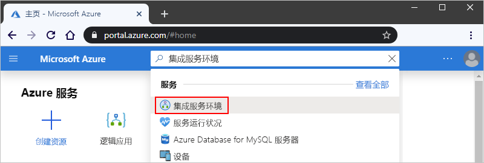
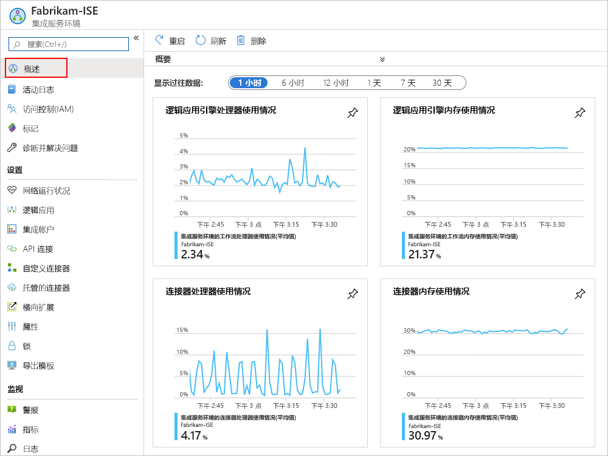
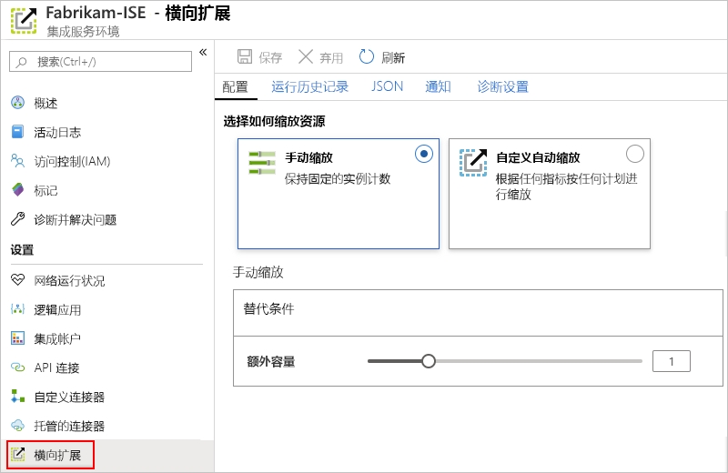

# 在 Azure 逻辑应用中管理集成服务环境（ISE）

本文介绍如何为[integration service 环境（ISE）](../logic-apps/connect-virtual-network-vnet-isolated-environment-overview.md)执行管理任务，例如：

* 管理 ISE 中的逻辑应用、连接、集成帐户和连接器等资源。
* 检查 ISE 的网络运行状况。
* 若要添加容量、重启 ISE 或删除 ISE，请按照本主题中的步骤进行操作。 若要将这些项目添加到 ISE，请参阅[将项目添加到 integration service 环境](../logic-apps/add-artifacts-integration-service-environment-ise.md)。

## 查看 ISE

1. 登录 [Azure 门户](https://portal.azure.com)。

1. 在门户的搜索框中，输入 "integration service 环境"，然后选择 " **Integration Service 环境**"。

   

1. 从结果列表中，选择你的 integration service 环境。

   

1. 转到下一节，查找 ISE 中的逻辑应用、连接、连接器或集成帐户。

## 检查网络运行状况

在 ISE 菜单上的 "**设置**" 下，选择 "**网络运行状况**"。 此窗格显示你的子网的运行状况状态以及其他服务的出站依赖关系。

## 管理逻辑应用

可以查看和管理 ISE 中的逻辑应用。

1. 在 ISE 菜单上的 "**设置**" 下，选择 "**逻辑应用**"。

   

1. 若要删除 ISE 中不再需要的逻辑应用，请选择这些逻辑应用，然后选择 "**删除**"。 若要确认是否要删除，请选择 **"是"** 。

## 管理 API 连接

可以查看和管理在 ISE 中运行的逻辑应用所创建的连接。

1. 在 ISE 菜单上的 "**设置**" 下，选择 " **API 连接**"。

   

1. 若要删除 ISE 中不再需要的连接，请选择这些连接，然后选择 "**删除**"。 若要确认是否要删除，请选择 **"是"** 。

## 管理 ISE 连接器

可以查看和管理部署到 ISE 的 API 连接器。

1. 在 ISE 菜单上的 "**设置**" 下，选择 "**托管连接器**"。

   

1. 若要删除你不希望在 ISE 中使用的连接器，请选择这些连接器，然后选择 "**删除**"。 若要确认是否要删除，请选择 **"是"** 。

## 管理自定义连接器

可以查看和管理部署到 ISE 的自定义连接器。

1. 在 ISE 菜单上的 "**设置**" 下，选择 "**自定义连接器**"。

   

1. 若要删除 ISE 中不再需要的自定义连接器，请选择这些连接器，然后选择 "**删除**"。 若要确认是否要删除，请选择 **"是"** 。

## 管理集成帐户

1. 在 ISE 菜单上的 "**设置**" 下，选择 "**集成帐户**"。

   

1. 若要在不再需要时从 ISE 中删除集成帐户，请选择这些集成帐户，然后选择 "**删除**"。

## 添加 ISE 容量

高级 ISE 基本单元具有固定容量，因此，如果需要更多的吞吐量，则可以在创建期间或之后添加更多缩放单位。 开发人员 SKU 不包括添加缩放单元的功能。

1. 在[Azure 门户](https://portal.azure.com)中，请前往 ISE。

1. 若要查看 ISE 的使用情况和性能指标，请在 ISE 菜单中选择 "**概述**"。

   

1. 在 "**设置**" 下，选择 "**横向扩展**"。在 "**配置**" 窗格上，从以下选项中进行选择：

   * [**手动缩放**](#manual-scale)：根据要使用的处理单元数进行缩放。
   * [**自定义自动缩放**](#custom-autoscale)：通过从各种条件中进行选择并指定满足条件的阈值条件，基于性能指标进行缩放。

   

### 手动缩放

1. 选择 "**手动缩放**" 后，在 "**其他容量**" 中选择要使用的缩放单位数。

   

1. 完成后，选择“保存”。

### 自定义自动缩放

1. 选择**自定义自动缩放**后，为**自动缩放设置名称**提供一个名称，并根据需要选择设置所属的 Azure 资源组。

   

1. 对于**默认**条件，请选择 "**基于指标缩放**" 或 "**缩放到特定实例计数**"。

   * 如果选择 "基于实例"，请输入处理单元的数量，该值介于0到10之间。

   * 如果选择 "基于指标"，请执行以下步骤：

     1. 在 "**规则**" 部分中，选择 "**添加规则**"。

     1. 在 "**缩放规则**" 窗格上，设置在触发规则时要执行的条件和操作。

     1. 对于 "**实例限制**"，请指定以下值：

        * **最小值**：要使用的处理单元的最小数量
        * **最大值**：要使用的处理单元的最大数目
        * **默认值**：如果在读取资源度量值时出现任何问题，且当前容量低于默认容量，则自动缩放将扩展到默认的处理单位数。 但是，如果当前容量超出了默认容量，则自动缩放不会缩小。

1. 若要添加其他条件，请选择 "**添加缩放条件**"。

1. 完成自动缩放设置后，请保存所做的更改。

## 重新启动 ISE

如果更改 DNS 服务器或 DNS 服务器设置，则必须重启 ISE，以便 ISE 可以选取这些更改。 重新启动高级 SKU ISE 不会导致停机，因为冗余和组件会在回收期间一次重新启动一个。 但是，开发人员 SKU ISE 会经历停机，因为没有冗余存在。 有关详细信息，请参阅[ISE sku](../logic-apps/connect-virtual-network-vnet-isolated-environment-overview.md#ise-level)。

1. 在[Azure 门户](https://portal.azure.com)中，请前往 ISE。

1. 在 ISE 菜单上，选择 "**概述**"。 在概述工具栏上，**重新启动**。

   

## 删除 ISE

删除不再需要的 ISE 或包含 ISE 的 Azure 资源组之前，请检查是否在包含这些资源的 Azure 资源组或 Azure 虚拟网络上没有策略或锁定，因为这些项可能会阻止删除。

删除 ISE 之后，在尝试删除 Azure 虚拟网络或子网之前，可能需要等待最多9小时。

## 后续步骤

* [将资源添加到 integration service 环境](../logic-apps/add-artifacts-integration-service-environment-ise.md)