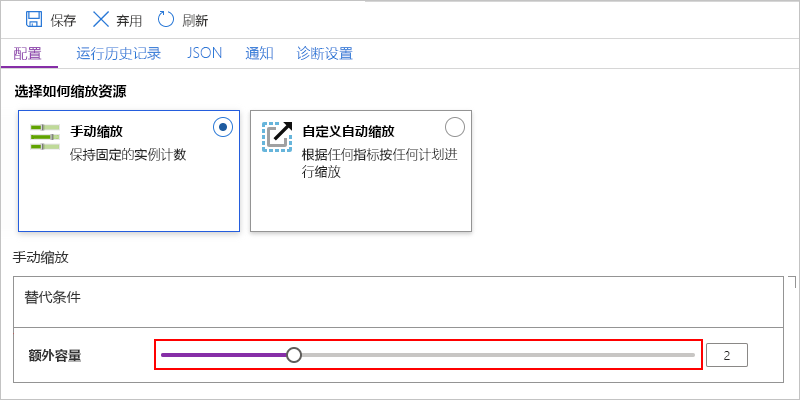
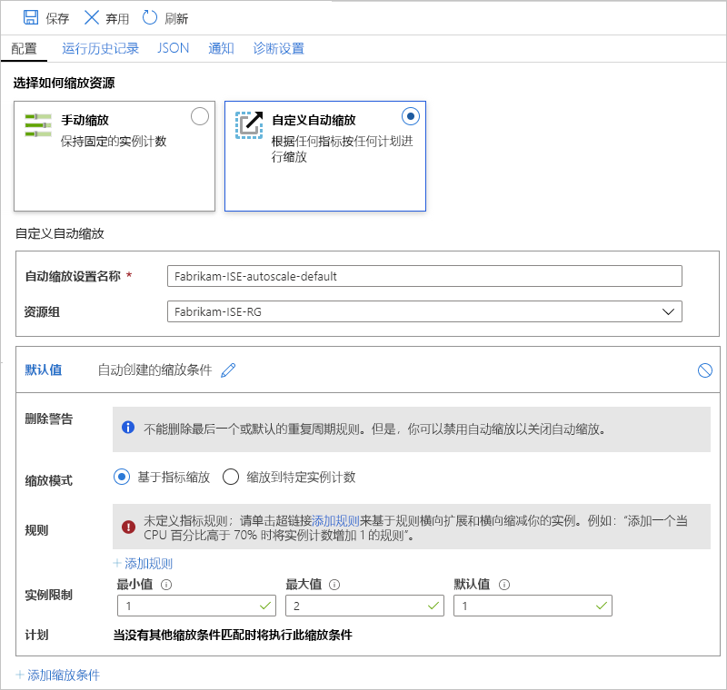

# 在 Azure 逻辑应用中管理集成服务环境 （ISE）

本文演示如何为[集成服务环境 （ISE）](../logic-apps/connect-virtual-network-vnet-isolated-environment-overview.md)执行管理任务，例如：

* 管理 ISE 中的逻辑应用、连接、集成帐户和连接器等资源。
* 检查 ISE 的网络运行状况。
* 添加容量、重新启动 ISE 或删除 ISE，请按照本主题中的步骤操作。 要将这些项目添加到 ISE，请参阅[向集成服务环境添加工件](../logic-apps/add-artifacts-integration-service-environment-ise.md)。

## 查看您的 ISE

1. 登录到 Azure[门户](https://portal.azure.com)。

1. 在门户的搜索框中，输入"集成服务环境"，然后选择**集成服务环境**。

   

1. 从结果列表中选择集成服务环境。

   

1. 继续下一节，在 ISE 中查找逻辑应用、连接、连接器或集成帐户。

## 检查网络运行状况

在 ISE 菜单上，**在"设置"** 下，选择 **"网络运行状况**"。 此窗格显示子网的运行状况和其他服务的出站依赖项。

## 管理逻辑应用

您可以查看和管理 ISE 中的逻辑应用。

1. 在 ISE 菜单上，**在"设置"** 下，选择 **"逻辑应用**"。

   

1. 要删除 ISE 中不再需要的逻辑应用，请选择这些逻辑应用，然后选择 **"删除**"。 要确认要删除，请选择"**是**"。

## 管理 API 连接

您可以查看和管理由 ISE 中运行的逻辑应用创建的连接。

1. 在 ISE 菜单上，**在"设置"** 下，选择**API 连接**。

   

1. 要删除 ISE 中不再需要的连接，请选择这些连接，然后选择 **"删除**"。 要确认要删除，请选择"**是**"。

## 管理 ISE 连接器

您可以查看和管理部署到 ISE 的 API 连接器。

1. 在 ISE 菜单上，**在"设置"** 下，选择 **"托管连接器**"。

   

1. 要删除 ISE 中不希望可用的连接器，请选择这些连接器，然后选择 **"删除**"。 要确认要删除，请选择"**是**"。

## 管理自定义连接器

您可以查看和管理部署到 ISE 的自定义连接器。

1. 在 ISE 菜单上，**在"设置"** 下，选择 **"自定义连接器**"。

   

1. 要删除 ISE 中不再需要的自定义连接器，请选择这些连接器，然后选择 **"删除**"。 要确认要删除，请选择"**是**"。

## 管理集成帐户

1. 在 ISE 菜单上，**在"设置"** 下，选择 **"集成帐户**"。

   

1. 要在不再需要时从 ISE 中删除集成帐户，请选择这些集成帐户，然后选择 **"删除**"。

## 添加 ISE 容量

高级 ISE 基本单位具有固定容量，因此，如果您需要更多吞吐量，可以在创建期间或之后添加更多缩放单位。 开发人员 SKU 不包括添加缩放单位的功能。

1. 在[Azure 门户](https://portal.azure.com)中，转到 ISE。

1. 要查看 ISE 的使用情况和性能指标，请在 ISE 菜单上选择 **"概述**"。

   

1. 在 **"设置"** 下，选择 **"横向缩小**"。在 **"配置"** 窗格中，从以下选项中进行选择：

   * [**手动缩放**](#manual-scale)：根据要使用的处理单位数进行缩放。
   * [**自定义自动缩放**](#custom-autoscale)：通过从各种条件中选择并指定满足该条件的阈值条件，根据性能指标进行缩放。

   

### 手动缩放

1. 选择 **"手动缩放**"后，选择 **"额外容量**"，选择要使用的缩放单位数。

   

1. 完成后，选择“保存”****。

### 自定义自动缩放

1. 选择 **"自定义自动缩放**"后，自动**缩放设置名称**为 "为设置提供名称"，并可以选择选择该设置所属的 Azure 资源组。

   

1. 对于 **"默认条件**"，选择 **"基于指标缩放"** 或 **"缩放"到特定实例计数**。

   * 如果选择基于实例，请输入处理单位的数字，该数字的值为 0 到 10。

   * 如果选择基于指标，请按照以下步骤操作：

     1. 在 **"规则"** 部分中，选择 **"添加规则**"。

     1. 在 **"缩放规则"** 窗格中，设置规则触发时要执行的操作。

     1. 对于**实例限制**，请指定以下值：

        * **最小**：要使用的最小处理单元数
        * **最大值**： 要使用的处理单元的最大数量
        * **默认值**：如果在读取资源指标时发生任何问题，并且当前容量低于默认容量，则自动缩放将扩展到默认的处理单位数。 但是，如果当前容量超过默认容量，自动缩放不会扩展。

1. 要添加其他条件，请选择 **"添加缩放条件**"。

1. 完成自动缩放设置后，请保存更改。

## 重新启动 ISE

如果更改 DNS 服务器或 DNS 服务器设置，必须重新启动 ISE，以便 ISE 可以选取这些更改。 重新启动高级 SKU ISE 不会由于冗余和组件在回收期间一次重新启动一个而导致停机。 但是，开发人员 SKU ISE 会因为不存在冗余而遇到停机。 有关详细信息，请参阅[ISE SKU](../logic-apps/connect-virtual-network-vnet-isolated-environment-overview.md#ise-level)。

1. 在[Azure 门户](https://portal.azure.com)中，转到 ISE。

1. 在 ISE 菜单上，选择 **"概述**"。 在"概述"工具栏上，**重新启动**。

   

## 删除 ISE

在删除不再需要的 ISE 或包含 ISE 的 Azure 资源组之前，请检查 Azure 资源组或 Azure 虚拟网络上的策略或锁是否没有，因为这些项目可以阻止删除。

删除 ISE 后，可能需要等待长达 9 小时才能尝试删除 Azure 虚拟网络或子网。

## 后续步骤

* [向集成服务环境添加资源](../logic-apps/add-artifacts-integration-service-environment-ise.md)