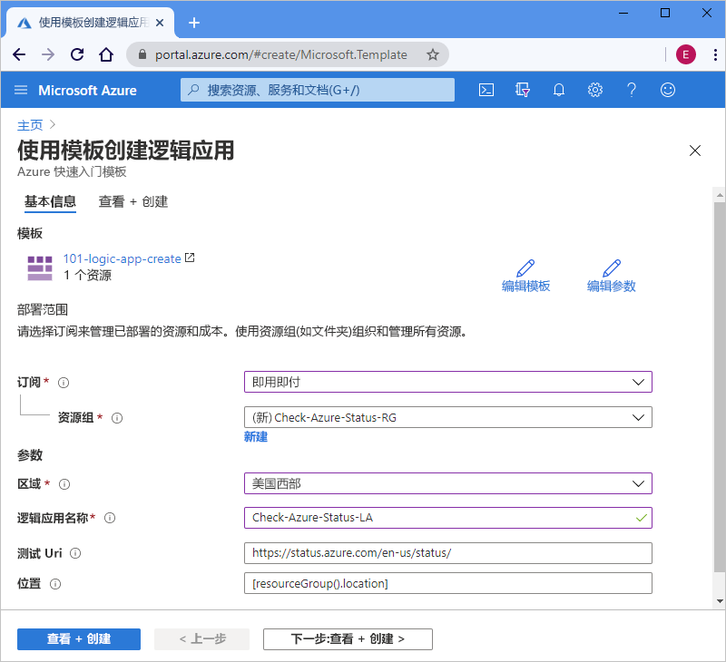

# <a name="quickstart-create-and-deploy-a-logic-app-workflow-by-using-an-arm-template"></a>快速入门：使用 ARM 模板创建和部署逻辑应用工作流

[Azure 逻辑应用](../logic-apps/logic-apps-overview.md)是一种云服务，可帮助你通过从[数百个连接器](https://docs.microsoft.com/connectors/connector-reference/connector-reference-logicapps-connectors)中进行选择来创建和运行自动化工作流，用于集成数据、应用、基于云的服务和本地系统。 本快速入门将重点介绍部署 Azure 资源管理器模板（ARM 模板）的过程以创建一个基本逻辑应用，用于计划按小时检查 Azure 的状态。 

[!INCLUDE [About Azure Resource Manager](../../includes/resource-manager-quickstart-introduction.md)]

如果你的环境满足先决条件，并且你熟悉如何使用 ARM 模板，请选择“部署到 Azure”按钮。 Azure 门户中会打开模板。

[](https://portal.azure.com/#create/Microsoft.Template/uri/https%3a%2f%2fraw.githubusercontent.com%2fAzure%2fazure-quickstart-templates%2fmaster%2f101-logic-app-create%2fazuredeploy.json)

## <a name="prerequisites"></a>先决条件

如果还没有 Azure 订阅，可以在开始前创建一个[免费 Azure 帐户](https://azure.microsoft.com/free/?WT.mc_id=A261C142F)。

## <a name="review-the-template"></a>查看模板

本快速入门使用[创建逻辑应用](https://azure.microsoft.com/resources/templates/101-logic-app-create/)模板，该模板可以在 [Azure 快速入门模板库](https://azure.microsoft.com/resources/templates)中找到，由于长度太长，因此无法在此处显示。 相反，可以在模板库中查看快速入门模板的[“azuredeploy.json 文件”](https://github.com/Azure/azure-quickstart-templates/blob/master/101-logic-app-create/azuredeploy.json)。

快速入门模板会创建一个逻辑应用工作流，该工作流使用定期触发器和 HTTP [内置操作](https://docs.microsoft.com/azure/connectors/apis-list#connector-types)，前者设置为每小时运行一次，后者则调用返回 Azure 状态的 URL。 内置操作是 Azure 逻辑应用平台的本机操作。

此模板创建以下 Azure 资源：

* [Microsoft.Logic/workflows](https://docs.microsoft.com/azure/templates/microsoft.logic/workflows)，它会为逻辑应用创建工作流。

若要查找更多用于 Azure 逻辑应用的快速入门模板，请查看库中的 [Microsoft.Logic](https://azure.microsoft.com/resources/templates/?resourceType=Microsoft.Logic) 模板。

<a name="deploy-template"></a>

## <a name="deploy-the-template"></a>部署模板

按照要用于部署快速入门模板的选项进行操作：

| 选项 | 说明 |
|--------|-------------|
| [Azure 门户](../logic-apps/quickstart-create-deploy-azure-resource-manager-template.md?tabs=azure-portal#deploy-template) | 如果你的 Azure 环境满足先决条件并且你能够熟练地使用 ARM 模板，那么这些步骤可帮助你直接登录到 Azure 并在 Azure 门户中打开快速入门模板。 有关详细信息，请参阅[使用 ARM 模板和 Azure 门户部署资源](../azure-resource-manager/templates/deploy-portal.md)。 |
| [Azure CLI](../logic-apps/quickstart-create-deploy-azure-resource-manager-template.md?tabs=azure-cli#deploy-template) | Azure 命令行接口 (Azure CLI) 是一组用于创建和管理 Azure 资源的命令。 若要运行这些命令，需要 Azure CLI 版本 2.6 或更高版本。 若要检查 CLI 版本，请键入 `az --version`。 有关详细信息，请参阅以下主题： <p><p>- [什么是 Azure CLI](https://docs.microsoft.com/cli/azure/what-is-azure-cli?view=azure-cli-latest) <br>- [Azure CLI 入门](https://docs.microsoft.com/cli/azure/get-started-with-azure-cli?view=azure-cli-latest) |
| [Azure PowerShell](../logic-apps/quickstart-create-deploy-azure-resource-manager-template.md?tabs=azure-powershell#deploy-template) | Azure PowerShell 提供一组使用 Azure 资源管理器模型来管理 Azure 资源的 cmdlet。 有关详细信息，请参阅以下主题： <p><p>- [Azure PowerShell 概述](https://docs.microsoft.com/powershell/azure/azurerm/overview) <br>- [Azure PowerShell Az 模块简介](https://docs.microsoft.com/powershell/azure/new-azureps-module-az) <br>- [Azure PowerShell 入门](https://docs.microsoft.com/powershell/azure/get-started-azureps) |
| [Azure 资源管理 REST API](../logic-apps/quickstart-create-deploy-azure-resource-manager-template.md?tabs=rest-api#deploy-template) | Azure 提供表述性状态转移 (REST) API，这些 API 是支持 HTTP 操作（方法）的服务终结点，用于创建、检索、更新或删除对服务资源的访问权限。 有关详细信息，请参阅 [Azure REST API 入门](https://docs.microsoft.com/rest/api/azure/)。 |
|||

<a name="deploy-azure-portal"></a>

#### <a name="portal"></a>[门户](#tab/azure-portal)

1. 选择以下图像以通过 Azure 帐户登录到 Azure 门户，并从中打开快速入门模板：

   [](https://portal.azure.com/#create/Microsoft.Template/uri/https%3a%2f%2fraw.githubusercontent.com%2fAzure%2fazure-quickstart-templates%2fmaster%2f101-logic-app-create%2fazuredeploy.json)

1. 在门户中的“使用模板创建逻辑应用”页面上，输入或选择这些值：

   | properties | 值 | 说明 |
   |----------|-------|-------------|
   | **订阅** | <*Azure-subscription-name*> | 要使用的 Azure 订阅的名称 |
   | **资源组** | <*Azure-resource-group-name*> | 新的或现有的 Azure 资源组的名称。 此示例使用 `Check-Azure-Status-RG`。 |
   | **区域** | <*Azure-region*> | 要使用逻辑应用的 Azure 数据中心区域。 此示例使用 `West US`。 |
   | **逻辑应用名称** | <*logic-app-name*> | 用于逻辑应用的名称。 此示例使用 `Check-Azure-Status-LA`。 |
   | **测试 Uri** | <*test-URI*> | 根据特定计划要调用的服务的 URI。 此示例使用 `https://status.azure.com/en-us/status/`，这是 Azure 状态页面。 |
   | **位置** |  <*Azure-region-for-all-resources*> | 用于所有资源的 Azure 区域（如果不同于默认值）。 此示例使用默认值 `[resourceGroup().location]`，这是资源组位置。 |
   ||||

   此处是使用了此示例中的值的页面：

   

1. 完成操作后，选择“查看 + 创建”。

1. 继续执行[查看已部署的资源](#review-deployed-resources)中的步骤。

#### <a name="cli"></a>[CLI](#tab/azure-cli)

```azurecli-interactive
read -p "Enter a project name name to use for generating resource names:" projectName &&
read -p "Enter the location, such as 'westus':" location &&
templateUri="https://raw.githubusercontent.com/Azure/azure-quickstart-templates/master/101-logic-app-create/azuredeploy.json" &&
resourceGroupName="${projectName}rg" &&
az group create --name $resourceGroupName --location "$location" &&
az deployment group create --resource-group $resourceGroupName --template-uri  $templateUri &&
echo "Press [ENTER] to continue ..." &&
read
```

有关详细信息，请参阅以下主题：

* [Azure CLI：az 部署组](https://docs.microsoft.com/cli/azure/deployment/group)
* [使用 ARM 模板和 Azure CLI 部署资源](../azure-resource-manager/templates/deploy-cli.md)

#### <a name="powershell"></a>[PowerShell](#tab/azure-powershell)

```azurepowershell-interactive
$projectName = Read-Host -Prompt "Enter a project name to use for generating resource names"
$location = Read-Host -Prompt "Enter the location, such as 'westus'"
$templateUri = "https://raw.githubusercontent.com/Azure/azure-quickstart-templates/master/101-logic-app-create/azuredeploy.json"

$resourceGroupName = "${projectName}rg"

New-AzResourceGroup -Name $resourceGroupName -Location "$location"
New-AzResourceGroupDeployment -ResourceGroupName $resourceGroupName -TemplateUri $templateUri

Read-Host -Prompt "Press [ENTER] to continue ..."
```

有关详细信息，请参阅以下主题：

* [Azure PowerShell:New-AzResourceGroup](https://docs.microsoft.com/powershell/module/az.resources/new-azresourcegroup)
* [Azure PowerShell:New-AzResourceGroupDeployment](https://docs.microsoft.com/powershell/module/az.resources/new-azresourcegroupdeployment)
* [使用 ARM 模板和 Azure PowerShell 部署资源](../azure-resource-manager/templates/deploy-powershell.md)

#### <a name="rest-api"></a>[REST API](#tab/rest-api)

1. 如果不想使用现有的 Azure 资源组，请按照此语法发出要发送到资源管理 REST API 的请求来创建新的资源组：

   ```http
   PUT https://management.azure.com/subscriptions/{subscriptionId}/resourcegroups/{resourceGroupName}?api-version=2019-10-01
   ```

   | 值 | 说明 |
   |-------|-------------|
   | `subscriptionId`| 要使用的 Azure 订阅的 GUID |
   | `resourceGroupName` | 要创建的 Azure 资源组的名称。 此示例使用 `Check-Azure-Status-RG`。 |
   |||

   例如：

   ```http
   PUT https://management.azure.com/subscriptions/xxxxXXXXxxxxXXXXX/resourcegroups/Check-Azure-Status-RG?api-version=2019-10-01
   ```

   有关详细信息，请参阅以下主题：

   * [Azure REST API 引用 - 如何调用 Azure REST API](https://docs.microsoft.com/rest/api/azure/)
   * [资源管理 REST API：资源组 - 创建或更新](https://docs.microsoft.com/rest/api/resources/resourcegroups/createorupdate)。

1. 若要将快速入门模板部署到资源组，请按照此语法发出要发送到资源管理 REST API 的请求：

   ```http
   PUT https://management.azure.com/subscriptions/{subscriptionId}/resourcegroups/{resourceGroupName}/providers/Microsoft.Resources/deployments/{deploymentName}?api-version=2019-10-01
   ```

   | 值 | 说明 |
   |-------|-------------|
   | `subscriptionId`| 要使用的 Azure 订阅的 GUID |
   | `resourceGroupName` | 要使用的 Azure 资源组的名称。 此示例使用 `Check-Azure-Status-RG`。 |
   | `deploymentName` | 用于部署的名称。 此示例使用 `Check-Azure-Status-LA`。 |
   |||

   例如：

   ```http
   PUT https://management.azure.com/subscriptions/xxxxXXXXxxxxXXXXX/resourcegroups/Check-Azure-Status-RG/providers/Microsoft.Resources/deployments/Check-Azure-Status-LA?api-version=2019-10-01
   ```

   有关详细信息，请参阅[资源管理 REST API：部署 - 创建或更新](https://docs.microsoft.com/rest/api/resources/deployments/createorupdate)。

1. 若要提供用于部署的值，例如 Azure 区域和快速入门模板的链接以及[参数文件](../azure-resource-manager/templates/template-parameters.md)（此文件包含部署时要使用的快速入门模板的值），请按照此语法发出要发送到资源管理 REST API 的请求主体：

   ```json
   {
      "location": "{Azure-region}",
      "properties": {
         "templateLink": {
            "uri": "{quickstart-template-URL}",
            "contentVersion": "1.0.0.0"
         },
         "parametersLink": {
            "uri": "{quickstart-template-parameter-file-URL}",
            "contentVersion": "1.0.0.0"
         },
         "mode": "Incremental"
      }
   }
   ```

   | properties | 值 | 说明 |
   |----------|-------|-------------|
   | `location`| <*Azure-region*> | 用于部署的 Azure 区域。 此示例使用 `West US`。 |
   | `templateLink` : `uri` | <*quickstart-template-URL*> | 用于部署的快速入门模板的 URL 位置： <p><p>`https://raw.githubusercontent.com/Azure/azure-quickstart-templates/master/101-logic-app-create/azuredeploy.json` 列中的一个值匹配。 |
   | `parametersLink` : `uri` | <*quickstart-template-parameter-file-URL*> | 用于部署的快速入门模板的参数文件的 URL 位置： <p><p>`https://raw.githubusercontent.com/Azure/azure-quickstart-templates/master/101-logic-app-create/azuredeploy.parameters.json` <p><p>有关资源管理器参数文件的详细信息，请参阅这些主题： <p><p>- [创建资源管理器参数文件](../azure-resource-manager/templates/parameter-files.md) <br>- [教程：使用参数文件部署 ARM 模板](../azure-resource-manager/templates/template-tutorial-use-parameter-file.md) |
   | `mode` | <*deployment-mode*> | 运行增量更新或完成更新。 此示例使用 `Incremental`，这是默认值。 有关详细信息，请参阅 [Azure 资源管理部署模式](https://docs.microsoft.com/azure/azure-resource-manager/templates/deployment-modes)。 |
   |||

   例如：

   ```json
   {
      "location": "West US",
      "properties": {
         "templateLink": {
            "uri": "https://raw.githubusercontent.com/Azure/azure-quickstart-templates/master/101-logic-app-create/azuredeploy.json",
            "contentVersion": "1.0.0.0"
         },
         "parametersLink": {
            "uri": "https://raw.githubusercontent.com/Azure/azure-quickstart-templates/master/101-logic-app-create/azuredeploy.parameters.json",
            "contentVersion": "1.0.0.0"
         },
         "mode": "Incremental"
      }
   }
   ```

有关详细信息，请参阅以下主题：

* [资源管理 REST API](https://docs.microsoft.com/rest/api/resources/)
* [使用 ARM 模板和资源管理器 REST API 部署资源](../azure-resource-manager/templates/deploy-rest.md)

---

<a name="review-deployed-resources"></a>

## <a name="review-deployed-resources"></a>查看已部署的资源

若要查看逻辑应用，可以使用 Azure 门户、运行使用 Azure CLI 或 Azure PowerShell 创建的脚本，或者使用逻辑应用 REST API。

### <a name="portal"></a>[门户](#tab/azure-portal)

1. 在 Azure 门户搜索框中，输入逻辑应用的名称，在此示例中为 `Check-Azure-Status-LA`。 从结果列表中，选择逻辑应用。

1. 在 Azure 门户中，找到并选择逻辑应用，在此示例中为 `Check-Azure-Status-RG`。

1. 在逻辑应用设计器打开后，可以查看通过快速入门模板创建的逻辑应用。

1. 若要测试逻辑应用，请在设计器工具栏上选择“运行”。

### <a name="cli"></a>[CLI](#tab/azure-cli)

```azurecli-interactive
echo "Enter your logic app name:" &&
read logicAppName &&
az logic workflow show --name $logicAppName &&
echo "Press [ENTER] to continue ..."
```

有关详细信息，请参阅 [Azure CLI：az 逻辑工作流展示](https://docs.microsoft.com/cli/azure/ext/logic/logic/workflow?view=azure-cli-latest#ext-logic-az-logic-workflow-show)。

### <a name="powershell"></a>[PowerShell](#tab/azure-powershell)

```azurepowershell-interactive
$logicAppName = Read-Host -Prompt "Enter your logic app name"
Get-AzLogicApp -Name $logicAppName
Write-Host "Press [ENTER] to continue..."
```

有关详细信息，请参阅 [Azure PowerShell：Get-AzLogicApp](https://docs.microsoft.com/powershell/module/az.logicapp/get-azlogicapp)。

### <a name="rest-api"></a>[REST API](#tab/rest-api)

```http
GET https://management.azure.com/subscriptions/{subscriptionId}/resourceGroups/{resourceGroupName}/providers/Microsoft.Logic/workflows/{workflowName}?api-version=2016-06-01
```

| 值 | 说明 |
|-------|-------------|
| `subscriptionId`| 部署了快速入门模板的 Azure 订阅的 GUID。 |
| `resourceGroupName` | 部署了快速入门模板的 Azure 资源组的名称。 此示例使用 `Check-Azure-Status-RG`。 |
| `workflowName` | 部署的逻辑应用的名称。 此示例使用 `Check-Azure-Status-LA`。 |
|||

例如：

```http
GET https://management.azure.com/subscriptions/xxxxXXXXxxxxXXXXX/resourceGroups/Check-Azure-Status-RG/providers/Microsoft.Logic/workflows/Check-Azure-Status-LA?api-version=2016-06-01
```

有关详细信息，请参阅[逻辑应用 REST API：工作流 - Get](https://docs.microsoft.com/rest/api/logic/workflows/get)。

---

## <a name="clean-up-resources"></a>清理资源

如果打算继续使用后续的快速入门和教程，则可能需要保留这些资源。 当不再需要逻辑应用时，可以通过使用 Azure 门户、Azure CLI、Azure PowerShell 或资源管理 REST API 删除资源组。

### <a name="portal"></a>[门户](#tab/azure-portal)

1. 在 Azure 门户中，找到并选择要删除的资源组，在此示例中为 `Check-Azure-Status-RG`。

1. 在资源组菜单上选择“概述”（如果尚未选择）。 在概述页面上，选择“删除资源组”。

1. 请输入资源组的名称以进行确认。

有关详细信息，请参阅[删除资源组](../azure-resource-manager/management/delete-resource-group.md?tabs=azure-portal#delete-resource-group)。

### <a name="cli"></a>[CLI](#tab/azure-cli)

```azurecli-interactive
echo "Enter your resource group name:" &&
read resourceGroupName &&
az group delete --name $resourceGroupName &&
echo "Press [ENTER] to continue ..."
```

有关详细信息。请参阅 [Azure CLI：az 组删除](https://docs.microsoft.com/cli/azure/group?view=azure-cli-latest#az-group-delete)。

### <a name="powershell"></a>[PowerShell](#tab/azure-powershell)

```azurepowershell-interactive
$resourceGroupName = Read-Host -Prompt "Enter the resource group name"
Remove-AzResourceGroup -Name $resourceGroupName
Write-Host "Press [ENTER] to continue..."
```

有关详细信息，请参阅 [Azure PowerShell：Remove-AzResourceGroup](https://docs.microsoft.com/powershell/module/azurerm.resources/remove-azurermresourcegroup)。

### <a name="rest-api"></a>[REST API](#tab/rest-api)

```http
DELETE https://management.azure.com/subscriptions/{subscriptionId}/resourcegroups/{resourceGroupName}?api-version=2019-10-01
```

| 值 | 说明 |
|-------|-------------|
| `subscriptionId`| 部署了快速入门模板的 Azure 订阅的 GUID。 |
| `resourceGroupName` | 部署了快速入门模板的 Azure 资源组的名称。 此示例使用 `Check-Azure-Status-RG`。 |
|||

例如：

```http
GET https://management.azure.com/subscriptions/xxxxXXXXxxxxXXXXX/resourceGroups/Check-Azure-Status-RG?api-version=2019-10-01
```

有关详细信息，请参阅[资源管理 REST API：资源组 - 删除](https://docs.microsoft.com/rest/api/resources/resourcegroups/delete)。

---

## <a name="next-steps"></a>后续步骤

> [!div class="nextstepaction"]
> [教程：创建和部署你的第一个 ARM 模板](../azure-resource-manager/templates/template-tutorial-create-first-template.md)