# 快速入门：使用 Azure 逻辑应用创建自动化任务、流程和工作流 - Visual Studio

可以通过 [Azure 逻辑应用](../logic-apps/logic-apps-overview.md)和 Visual Studio 创建工作流，以便自动完成用于跨企业和组织集成应用、数据、系统和服务的任务和流程。 本快速入门展示了如何通过在 Visual Studio 中创建逻辑应用并将这些应用部署到 Azure 来设计和构建这些工作流。 尽管可以在 Azure 门户中执行这些任务，但在需要将逻辑应用添加到源代码管理、发布不同的版本，以及为不同的部署环境创建 Azure 资源管理器模板时，也可以使用 Visual Studio。

如果不熟悉 Azure 逻辑应用，只希望了解基本概念，则可尝试[关于在 Azure 门户中创建逻辑应用的快速入门](../logic-apps/quickstart-create-first-logic-app-workflow.md)。 逻辑应用设计器在 Azure 门户和 Visual Studio 中的工作方式类似。

在本快速入门中，你将使用 Visual Studio 创建与 Azure 门户快速入门相同的逻辑应用。 此逻辑应用监视网站的 RSS 源，并针对该源中的每个新项发送电子邮件。 完成后的逻辑应用看起来与以下概略性的工作流类似：

## 先决条件

* Azure 帐户和订阅。 如果没有订阅，可以[注册免费的 Azure 帐户](https://azure.microsoft.com/free/)。 如果有 Azure 政府订阅，请按照以下附加步骤[为 Azure 政府云设置 Visual Studio](#azure-government)。

* 下载并安装以下工具（如果没有）：

  * [Visual Studio 2019、2017 或 2015 - Community Edition 或更高版本](https://aka.ms/download-visual-studio)。 本快速入门使用 Visual Studio Community 2017。

    > [!IMPORTANT]
    > 安装 Visual Studio 2019 或 2017 时，请务必选择“Azure 开发”工作负荷。

  * [用于 .NET 的 Microsoft Azure SDK（2.9.1 或更高版本）](https://azure.microsoft.com/downloads/)。 详细了解[用于 .NET 的 Azure SDK](/dotnet/azure/dotnet-tools?view=azure-dotnet)。

  * [Azure PowerShell](https://github.com/Azure/azure-powershell#installation)

  * 适用于所需版本的 Visual Studio 扩展的最新 Azure 逻辑应用工具：

    * [Visual Studio 2019](https://aka.ms/download-azure-logic-apps-tools-visual-studio-2019)

    * [Visual Studio 2017](https://aka.ms/download-azure-logic-apps-tools-visual-studio-2017)

    * [Visual Studio 2015](https://aka.ms/download-azure-logic-apps-tools-visual-studio-2015)
  
    可以直接从 Visual Studio Marketplace 下载并安装 Azure 逻辑应用工具，或了解[如何从 Visual Studio 内部安装此扩展](/visualstudio/ide/finding-and-using-visual-studio-extensions)。 完成安装后，请务必重启 Visual Studio。

* 使用嵌入式逻辑应用设计器时访问 Web

  设计器需要通过 Internet 连接在 Azure 中创建资源，以及从逻辑应用中的连接器读取属性和数据。

* 逻辑应用支持的（例如 Office 365 Outlook、Outlook.com 或 Gmail）电子邮件帐户。 至于其他提供商，请查看[此处的连接器列表](/connectors/)。 本示例使用 Office 365 Outlook。 如果使用其他提供商，整个步骤仍然是相同的，但 UI 可能稍有不同。

  > [!IMPORTANT]
  > 如果要使用 Gmail 连接器，则只有 G-Suite 商业帐户可以在逻辑应用中不受限制地使用此连接器。 如果有 Gmail 用户帐户，则只能将此连接器与 Google 批准的特定服务一起使用，也可以[创建用于通过 Gmail 连接器进行身份验证的 Google 客户端应用](/connectors/gmail/#authentication-and-bring-your-own-application)。 有关详细信息，请参阅 [Azure 逻辑应用中 Google 连接器的数据安全和隐私策略](../connectors/connectors-google-data-security-privacy-policy.md)。

## 设置适用于 Azure 政府的 Visual Studio

### Visual Studio 2017

可以使用 [Azure 环境选择器 Visual Studio 扩展](https://devblogs.microsoft.com/azuregov/introducing-the-azure-environment-selector-visual-studio-extension/)，你可以从 [Visual Studio Marketplace](https://marketplace.visualstudio.com/items?itemName=SteveMichelotti.AzureEnvironmentSelector) 下载并安装该扩展。

### Visual Studio 2019

若要在 Azure 逻辑应用中使用 Azure 政府订阅，需要[将 Azure 政府云的发现终结点添加到 Visual Studio](../azure-government/documentation-government-connect-vs.md)。 但在使用 Azure 政府帐户登录 Visual Studio 之前，需要重命名添加发现终结点后生成的 JSON 文件，请按照以下步骤操作：

1. 关闭 Visual Studio。

1. 在以下位置找到名为 `Azure U.S. Government-A3EC617673C6C70CC6B9472656832A26.Configuration` 的生成的 JSON 文件：

   `%localappdata%\.IdentityService\AadConfigurations`
 
1. 将该 JSON 文件重命名为 `AadProvider.Configuration.json`。

1. 重启 Visual Studio。

1. 继续按步骤操作，使用 Azure 政府帐户登录。

若要还原此设置，请删除以下位置的 JSON 文件，然后重启 Visual Studio：

`%localappdata%\.IdentityService\AadConfigurations\AadProvider.Configuration.json`

## 创建 Azure 资源组项目

若要开始，请创建 [Azure 资源组项目](../azure-resource-manager/templates/create-visual-studio-deployment-project.md)。 详细了解 [Azure 资源组和资源](../azure-resource-manager/management/overview.md)。

1. 启动 Visual Studio。 使用 Azure 帐户登录。

1. 在“文件”菜单中，选择“新建” > “项目”。 （键盘：Ctrl + Shift + N）

   

1. 在“已安装”下，选择“Visual C#”或“Visual Basic”  。 选择“云” > “Azure 资源组”。 为项目命名，例如：

   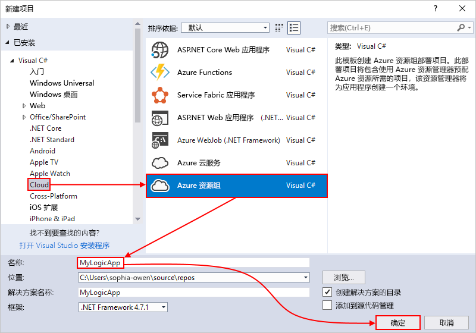

   > [!NOTE]
   > 资源组名称只能包含字母、数字、句点 (`.`)、下划线 (`_`)、连字符 (`-`) 和括号（`(`、`)`），但不能以句点 (`.`) 结尾。
   >
   > 如果“云”或“Azure 资源组”未显示，请确保安装 Azure SDK for Visual Studio。

   如果使用 Visual Studio 2019，请执行以下步骤：

   1. 在“创建新项目”框中，选择适用于 Visual C# 或 Visual Basic 的“Azure 资源组”项目。 选择“**下一步**”。

   1. 提供要使用的 Azure 资源组的名称和其他项目信息。 选择“创建” 。

1. 在模板列表中，选择“逻辑应用”模板。 选择“确定” 。

   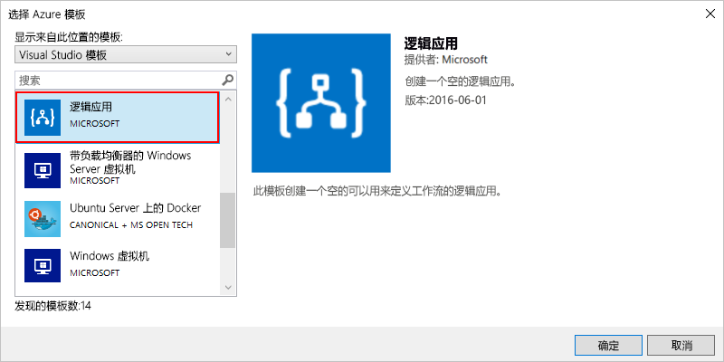

   在 Visual Studio 创建项目后，解决方案资源管理器会打开并显示你的解决方案。 在你的解决方案中，**LogicApp.json** 文件不仅存储逻辑应用定义，还是一个可以用于部署的 Azure 资源管理器模板。

   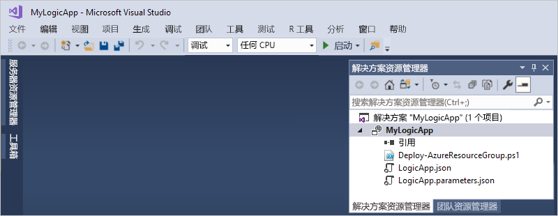

## 创建空白逻辑应用

在创建 Azure 资源组项目后，使用**空白逻辑应用**模板创建你的逻辑应用。

1. 在解决方案资源管理器中，打开 **LogicApp.json** 文件的快捷菜单。 选择“使用逻辑应用设计器打开”。 （键盘：Ctrl + L）

   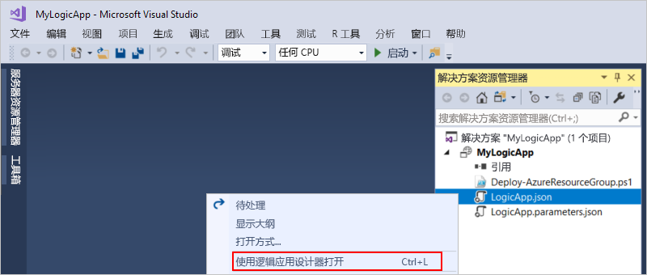

   > [!TIP]
   > 如果你的 Visual Studio 2019 中没有此命令，请检查是否安装了 Visual Studio 的最新更新。

   Visual Studio 会提示你提供用于为你的逻辑应用和连接创建并部署资源的 Azure 订阅和 Azure 资源组。

1. 对于“订阅”，请选择你的 Azure 订阅。 对于“资源组”，请选择“新建”以创建其他 Azure 资源组 。

   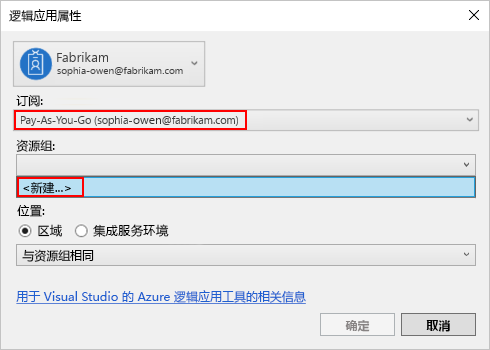

   | 设置 | 示例值 | 说明 |
   | ------- | ------------- | ----------- |
   | 用户帐户 | Fabrikam   sophia-owen@fabrikam.com | 登录 Visual Studio 时使用的帐户 |
   | **订阅** | 即用即付   (sophia-owen@fabrikam.com) | Azure 订阅的名称以及关联的帐户 |
   | **资源组** | MyLogicApp-RG   （美国西部） | 用于存储和部署逻辑应用资源的 Azure 资源组和位置 |
   | **位置** | **与资源组相同** | 用于部署逻辑应用的位置类型和特定位置。 位置类型可以是 Azure 区域，也可以是现有的[集成服务环境 (ISE)](connect-virtual-network-vnet-isolated-environment.md)。 
对于本快速入门，请将“位置类型”设置为“区域”，并将“**位置**”设置为“**与资源组相同**”。 
**注意**：创建资源组项目后，可以[更改位置类型和位置](manage-logic-apps-with-visual-studio.md#change-location)，但不同的位置类型会以不同的方式影响逻辑应用。 |
   ||||

1. 逻辑应用设计器会打开一个页面，其中显示了介绍视频和常用的触发器。 向下滚动，越过视频和触发器，找到“模板”，然后选择“空白逻辑应用”。

   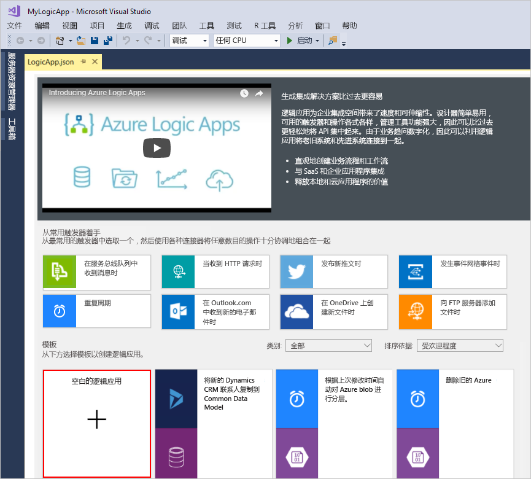

## 生成逻辑应用工作流

接下来，添加一个 RSS [触发器](../logic-apps/logic-apps-overview.md#logic-app-concepts)，该触发器在出现新的源项时触发。 每个逻辑应用都以触发器开头，该触发器在特定条件得到满足的情况下触发。 每当触发器触发时，逻辑应用引擎就会创建一个逻辑应用实例来运行工作流。

1. 在逻辑应用设计器的搜索框下，选择“全部”。 在搜索框中输入“rss”。 从触发器列表中选择此触发器：**发布源项时**

   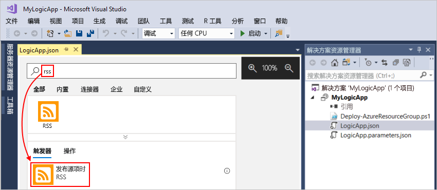

1. 在触发器出现在设计器中后，通过执行 [Azure 门户快速入门](../logic-apps/quickstart-create-first-logic-app-workflow.md#add-rss-trigger)中的工作流步骤来完成逻辑应用的构建。 完成后，逻辑应用如以下示例所示：

   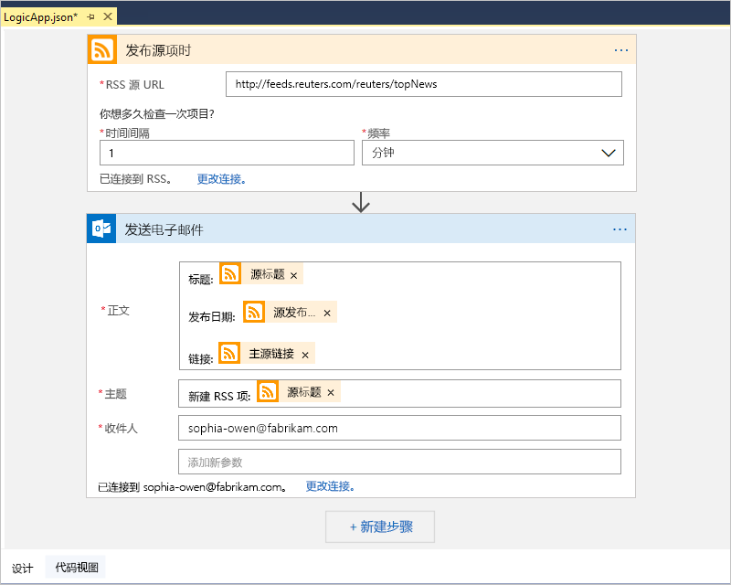

1. 保存你的 Visual Studio 解决方案。 （键盘：Ctrl + S）

## 将逻辑应用部署到 Azure

必须先将逻辑应用从 Visual Studio 部署到 Azure，然后才能运行并测试逻辑应用。

1. 在解决方案资源管理器的项目快捷菜单中，选择“部署” > “新建”。 如果出现系统提示，请使用 Azure 帐户登录。

   

1. 就此部署来说，请保留默认的 Azure 订阅、资源组和其他设置。 选择“部署”。

   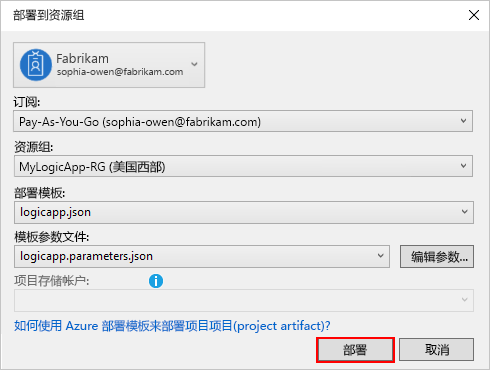

1. 如果“编辑参数”框出现，请为你的逻辑应用提供一个资源名称。 保存设置。

   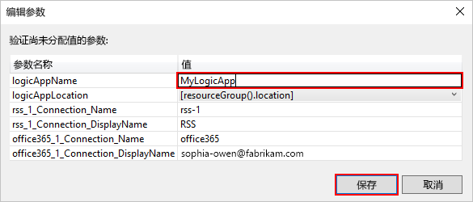

   部署开始时，应用的部署状态显示在 Visual Studio 的“输出”窗口中。 如果状态不显示，请打开“显示输出来源”列表，然后选择 Azure 资源组。

   

   如果所选连接器需要你提供输入，则会在背景中打开一个 PowerShell 窗口，提示你输入必需的密码或机密密钥。 输入该信息后，部署会继续。

   

   在部署完成后，你的逻辑应用会出现在 Azure 门户中，并会根据指定的计划（每隔一分钟）运行。 如果该触发器发现新的源项，则触发器会激发，这将创建运行你的逻辑应用操作的一个工作流实例。 你的逻辑应用会针对每个新项发送电子邮件。 反之，如果触发器未发现新项，则触发器不会激发，而是“跳过”工作流实例化。 逻辑应用会等到下一个间隔过后才进行检查。

   下面是此逻辑应用发送的示例电子邮件。 如果没有收到任何电子邮件，请检查垃圾邮件文件夹。

   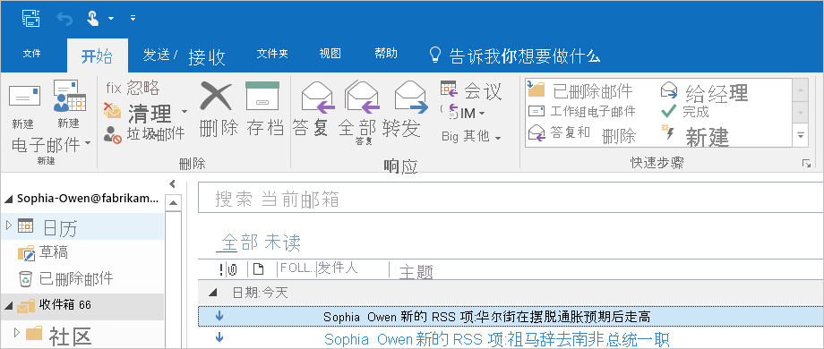

祝贺你，你已使用 Visual Studio 成功生成并部署了逻辑应用。 若要管理逻辑应用并查看其运行历史记录，请参阅[使用 Visual Studio 管理逻辑应用](../logic-apps/manage-logic-apps-with-visual-studio.md)。

## 添加新逻辑应用

如果你有现有的 Azure 资源组项目，则可以使用“JSON 大纲”窗口向该项目添加一个新的空白逻辑应用。

1. 在“解决方案资源管理器”中，打开 `<logic-app-name>.json` 文件。

1. 在“视图”菜单中，选择“其他窗口” > “JSON 大纲”。

1. 若要将资源添加到模板文件，请在“JSON 大纲”窗口顶部选择“添加资源”。 或者在“JSON 大纲”窗口中，打开“资源”快捷菜单，并选择“添加新资源” 。

   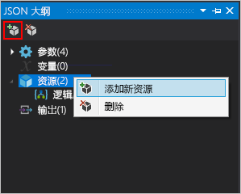

1. 在“添加资源”对话框中，在搜索框中，找到 `logic app` 并选择“逻辑应用” 。 为逻辑应用命名，并选择“添加”。

   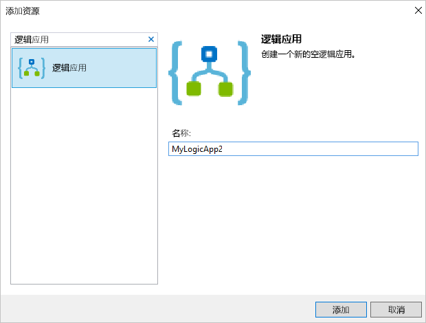

## 清理资源

完成逻辑应用后，删除包含你的逻辑应用和相关资源的资源组。

1. 使用创建逻辑应用时所使用的帐户登录到 [Azure 门户](https://portal.azure.com)。

1. 在 Azure 门户菜单上，选择“资源组”或从任意页面搜索并选择“资源组” 。 选择逻辑应用的资源组。

1. 在“概述”页上，选择“删除资源组” 。 输入资源组名称作为确认，然后选择“删除”。

   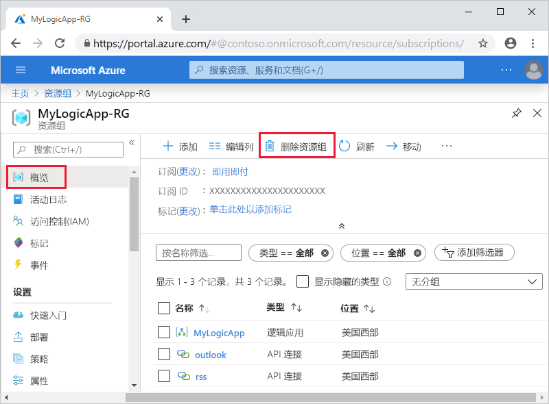

1. 从本地计算机删除 Visual Studio 解决方案。

## 后续步骤

本文介绍了如何使用 Visual Studio 生成、部署和运行逻辑应用。 若要了解如何使用 Visual Studio 管理和执行逻辑应用的高级部署，请参阅以下文章：

> [!div class="nextstepaction"]
> [使用 Visual Studio 管理逻辑应用](../logic-apps/manage-logic-apps-with-visual-studio.md)
