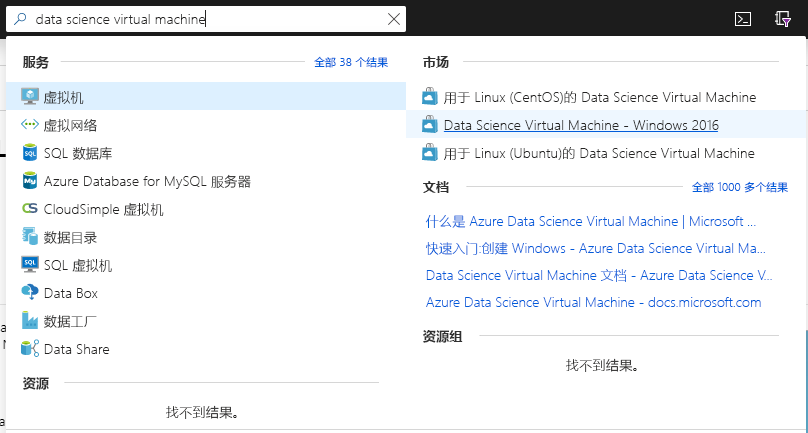
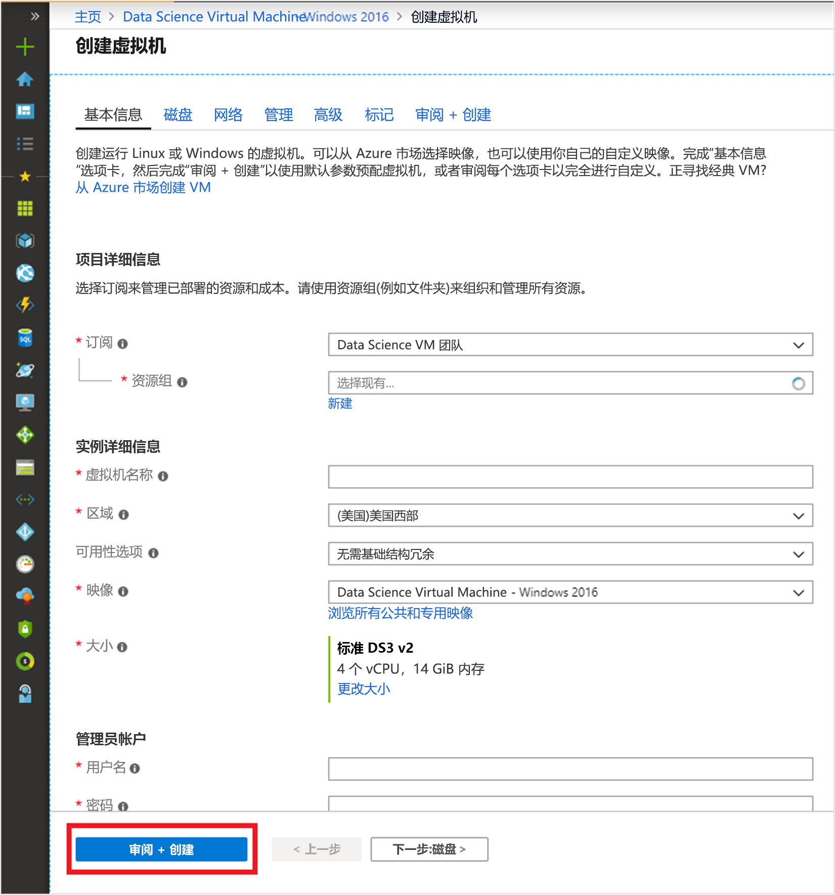

# 快速入门：设置适用于 Windows 的 Data Science Virtual Machine

启动并运行 Windows Data Science Virtual Machine。

## 先决条件

若要创建 Windows Data Science Virtual Machine，必须具备 Azure 订阅。 [免费试用 Azure](https://azure.com/free)。
请注意，Azure 免费帐户不支持启用 GPU 的虚拟机 SKU。

## 创建 DSVM

创建 DSVM 实例：

1. 转到 [Azure 门户](https://portal.azure.com) 如果你尚未登录到 Azure 帐户，系统可能会提示你登录。
1. 通过键入“data Science virtual machine”并选择“Data Science Virtual Machine - Windows 2016”来查找虚拟机列表。

    

1. 选择底部的“创建”按钮。 

    

1. 你应该被重定向到“创建虚拟机”边栏选项卡。
   

1. 填写“基本信息”  选项卡：
      * **订阅**：如果有多个订阅，请选择要在其上创建虚拟机并对其计费的订阅。 必须具有此订阅的资源创建权限。
      * **资源组**：新建资源组，或使用现有资源组。
      * **虚拟机名称**：输入虚拟机的名称。 这就是它在 Azure 门户中的显示方式。
      * **位置**：选择最合适的数据中心。 为获得最快的网络访问速度，请选择包含大部分数据，或者最接近实际位置的数据中心。 详细了解 [Azure 区域](https://azure.microsoft.com/global-infrastructure/regions/)。
      * **映像**：保留默认值。
      * **大小**：它应自动填充为适合一般工作负荷的大小。 详细了解 [Azure 中的 Windows VM 大小](../../virtual-machines/windows/sizes.md)。
      * **用户名**：输入管理员用户名。 这是你将用于登录到虚拟机的用户名，无需与 Azure 用户名相同。
      * **密码**：输入将用于登录到虚拟机的密码。    
1. 选择“查看 + 创建”  。
1. **查看 + 创建**
   * 验证输入的所有信息是否正确。 
   * 选择“创建”  。

> [!NOTE]
> * 无需为虚拟机上预装的软件支付许可费用。 你需要为在**大小**步骤中选择的服务器大小支付计算成本。
> * 预配过程将花费 10 到 20 分钟。 在 Azure 门户中可以查看 VM 的状态。

## 访问 DSVM

创建并预配 VM 后，请按照列出的步骤[连接到基于 Azure 的虚拟机](../../marketplace/cloud-partner-portal/virtual-machine/cpp-connect-vm.md)。 请使用创建虚拟机时在“基本信息”步骤中配置的管理员帐户凭据。  

现在，可以开始使用 VM 上安装并配置的工具。 可以通过“开始”菜单磁贴和桌面图标访问许多工具。 

还可以将 DSVM 附加到 Azure Notebooks，以在 VM 上运行 Jupyter Notebook，并绕过免费服务层的限制。 有关详细信息，请参阅[管理和配置 Notebooks 项目](../../notebooks/configure-manage-azure-notebooks-projects.md#manage-and-configure-projects)。

## 后续步骤

* 打开“开始”菜单探索 DSVM 上的工具。 
* 阅读[什么是 Azure 机器学习？](../service/overview-what-is-azure-ml.md)并尝试通过[教程](../index.yml)来了解 Azure 机器学习。
* 在文件资源管理器中浏览到 C:\Program Files\Microsoft\ML Server\R_SERVER\library\RevoScaleR\demoScripts，获取有关在 R 中使用支持企业级数据分析的 RevoScaleR 库的示例。 
* 阅读文章：[Data Science Virtual Machine 的十大功能](https://aka.ms/dsvmtenthings)。
* 通过使用 [Team Data Science Process](../team-data-science-process/index.yml)，了解如何系统地构建端到端分析解决方案。
* 访问 [Azure AI 库](https://gallery.cortanaintelligence.com)，获取在 Azure 上使用 Azure 机器学习和相关数据服务的机器学习和数据分析示例。 我们还在虚拟机的“开始”菜单与桌面上提供了此库的图标。 

