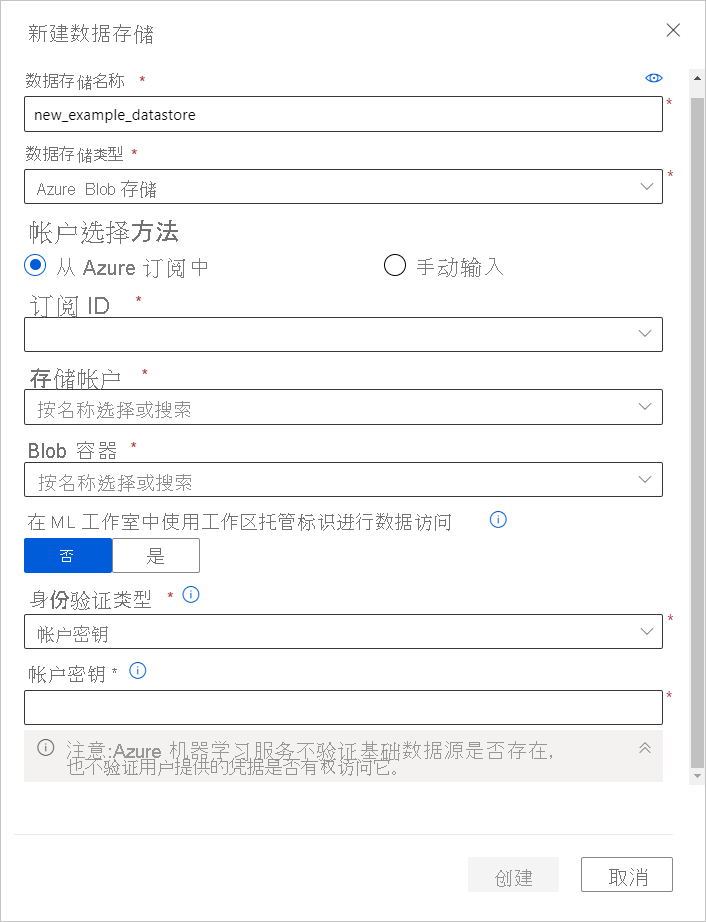

# <a name="access-data-in-azure-storage-services"></a>访问 Azure 存储服务中的数据
[!INCLUDE [aml-applies-to-basic-enterprise-sku](../../includes/aml-applies-to-basic-enterprise-sku.md)]

本文介绍如何通过 Azure 机器学习数据存储轻松访问 Azure 存储服务中的数据。 数据存储用于存储连接信息，如订阅 ID 和令牌授权。 当你使用数据存储时，你可以访问存储，而无需在脚本中对连接信息进行硬编码。 

可以从[这些 Azure 存储解决方案](#matrix)创建数据存储。 对于不支持的存储解决方案，并在机器学习试验期间节省数据出口成本，我们建议[将数据移动](#move)到支持的 Azure 存储解决方案。 

## <a name="prerequisites"></a>必备组件
需要：
- Azure 订阅。 如果没有 Azure 订阅，请在开始之前创建一个免费帐户。 试用[Azure 机器学习免费或付费版本](https://aka.ms/AMLFree)。

- 使用[azure blob 容器](https://docs.microsoft.com/azure/storage/blobs/storage-blobs-overview)或[azure 文件共享](https://docs.microsoft.com/azure/storage/files/storage-files-introduction)的 azure 存储帐户。

- [用于 Python 的 AZURE 机器学习 SDK](https://docs.microsoft.com/python/api/overview/azure/ml/intro?view=azure-ml-py)，或访问[Azure 机器学习 studio](https://ml.azure.com/)。

- Azure 机器学习工作区。
  
  [创建 Azure 机器学习工作区](how-to-manage-workspace.md)，或者通过 Python SDK 使用现有工作区：

   ```Python
   import azureml.core
   from azureml.core import Workspace, Datastore
        
   ws = Workspace.from_config()
   ```
<a name="matrix"></a>

## <a name="supported-data-storage-service-types"></a>支持的数据存储服务类型

数据存储目前支持将连接信息存储到下表中列出的存储服务。 目前不支持 Azure 数据仓库。 

| 存储&nbsp;类型 | 身份验证&nbsp;类型 | [Azure&nbsp;计算机&nbsp;学习工作室](https://ml.azure.com/) | [Azure&nbsp;计算机&nbsp;了解&nbsp; Python SDK](https://docs.microsoft.com/python/api/overview/azure/ml/intro?view=azure-ml-py) |  [Azure&nbsp;计算机&nbsp;学习 CLI](reference-azure-machine-learning-cli.md) | [Azure&nbsp;计算机&nbsp;学习&nbsp; Rest API](https://docs.microsoft.com/rest/api/azureml/)
---|---|---|---|---|---
[Azure&nbsp;Blob&nbsp;存储](https://docs.microsoft.com/azure/storage/blobs/storage-blobs-overview)| 帐户密钥 <br> SAS 令牌 | ✓ | ✓ | ✓ |✓
[Azure&nbsp;文件&nbsp;共享](https://docs.microsoft.com/azure/storage/files/storage-files-introduction)| 帐户密钥 <br> SAS 令牌 | ✓ | ✓ | ✓ |✓
[Azure&nbsp;Data Lake&nbsp;存储代&nbsp;1](https://docs.microsoft.com/azure/data-lake-store/)| 服务主体| ✓ | ✓ | ✓ |✓
[Azure&nbsp;Data Lake&nbsp;存储代&nbsp;2](https://docs.microsoft.com/azure/storage/blobs/data-lake-storage-introduction)| 服务主体| ✓ | ✓ | ✓ |✓
Azure&nbsp;SQL&nbsp;数据库| SQL 身份验证 <br>服务主体| ✓ | ✓ | ✓ |✓
Azure&nbsp;PostgreSQL | SQL 身份验证| ✓ | ✓ | ✓ |✓
用于&nbsp;MySQL 的 Azure&nbsp;数据库&nbsp; | SQL 身份验证|  | ✓ | ✓ |✓
Databricks&nbsp;文件&nbsp;系统| 无身份验证 | | ✓ | ✓ |✓ 

\* 仅支持本地计算目标方案

### <a name="storage-guidance"></a>存储指导原则

建议为 Azure blob 容器创建数据存储。  
标准存储和高级存储都适用于 blob。 尽管高级存储开销较高，但其速度越快，吞吐量也可能会提高定型运行的速度，特别是在您针对大型数据集进行训练时。 有关存储帐户的成本的信息，请参阅[Azure 定价计算器](https://azure.microsoft.com/pricing/calculator/?service=machine-learning-service)。

创建工作区时，会自动将 Azure blob 容器和 Azure 文件共享注册到工作区。 它们分别命名为 `workspaceblobstore` 和 `workspacefilestore`。 它们存储在附加到工作区的存储帐户中预配的 blob 容器和文件共享的连接信息。 `workspaceblobstore` 容器设置为默认数据存储。

<a name="access"></a>

## <a name="create-and-register-datastores"></a>创建和注册数据存储

将 Azure 存储解决方案注册为数据存储时，会自动创建数据存储并将其注册到特定的工作区。 可以使用 Python SDK 或 Azure 机器学习 studio 创建数据存储并将其注册到工作区。

>[!IMPORTANT]
> 作为当前数据存储创建和注册过程的一部分，Azure 机器学习验证用户提供的主体（用户名、服务主体或 SAS 令牌）是否有权访问基础存储服务。 
<br>
但是，对于 Azure Data Lake Storage 第1代和第2数据存储，在调用[`from_files()`](https://docs.microsoft.com/python/api/azureml-core/azureml.data.dataset_factory.filedatasetfactory?view=azure-ml-py)或[`from_delimited_files()`](https://docs.microsoft.com/python/api/azureml-core/azureml.data.dataset_factory.tabulardatasetfactory?view=azure-ml-py#from-parquet-files-path--validate-true--include-path-false--set-column-types-none--partition-format-none-)之类的数据访问方法时，会进行此验证。 

### <a name="python-sdk"></a>Python SDK

所有寄存器方法都在[`Datastore`](https://docs.microsoft.com/python/api/azureml-core/azureml.core.datastore(class)?view=azure-ml-py)类上，并将窗体 `register_azure_*`。

您可以使用[Azure 门户](https://portal.azure.com)查找填充 `register()` 方法所需的信息：

1. 选择左窗格中的 "**存储帐户**"，并选择要注册的存储帐户。 
2. 有关帐户名称、容器和文件共享名称等信息，请参阅**概述**页。 对于身份验证信息，如帐户密钥或 SAS 令牌，请在 "**设置**" 窗格中转到 "**访问密钥**"。 

> [!IMPORTANT]
> 如果你的存储帐户位于虚拟网络中，则仅支持创建 Azure blob 数据存储。 若要向你的工作区授予对你的存储帐户的访问权限，请将参数 `grant_workspace_access` 设置为 `True`。

以下示例演示如何将 Azure blob 容器、Azure 文件共享和 Azure Data Lake Storage 第2代作为数据存储进行注册。 对于其他存储服务，请参阅[`register_azure_*` 方法的参考文档](https://docs.microsoft.com/python/api/azureml-core/azureml.core.datastore.datastore?view=azure-ml-py#methods)。

#### <a name="blob-container"></a>Blob 容器

若要将 Azure blob 容器注册为数据存储，请使用[`register_azure_blob-container()`](https://docs.microsoft.com/python/api/azureml-core/azureml.core.datastore(class)?view=azure-ml-py#register-azure-blob-container-workspace--datastore-name--container-name--account-name--sas-token-none--account-key-none--protocol-none--endpoint-none--overwrite-false--create-if-not-exists-false--skip-validation-false--blob-cache-timeout-none--grant-workspace-access-false--subscription-id-none--resource-group-none-)。

以下代码创建 `blob_datastore_name` 数据存储并将其注册到 `ws` 工作区。 此数据存储使用提供的帐户密钥访问 `my-account-name` 存储帐户上的 `my-container-name` blob 容器。

```Python
blob_datastore_name='azblobsdk' # Name of the datastore to workspace
container_name=os.getenv("BLOB_CONTAINER", "<my-container-name>") # Name of Azure blob container
account_name=os.getenv("BLOB_ACCOUNTNAME", "<my-account-name>") # Storage account name
account_key=os.getenv("BLOB_ACCOUNT_KEY", "<my-account-key>") # Storage account key

blob_datastore = Datastore.register_azure_blob_container(workspace=ws, 
                                                         datastore_name=blob_datastore_name, 
                                                         container_name=container_name, 
                                                         account_name=account_name,
                                                         account_key=account_key)
```

#### <a name="file-share"></a>文件共享

若要将 Azure 文件共享注册为数据存储，请使用[`register_azure_file_share()`](https://docs.microsoft.com/python/api/azureml-core/azureml.core.datastore(class)?view=azure-ml-py#register-azure-file-share-workspace--datastore-name--file-share-name--account-name--sas-token-none--account-key-none--protocol-none--endpoint-none--overwrite-false--create-if-not-exists-false--skip-validation-false-)。 

以下代码创建 `file_datastore_name` 数据存储并将其注册到 `ws` 工作区。 此数据存储使用提供的帐户密钥访问 `my-account-name` 存储帐户上的 `my-fileshare-name` 文件共享。

```Python
file_datastore_name='azfilesharesdk' # Name of the datastore to workspace
file_share_name=os.getenv("FILE_SHARE_CONTAINER", "<my-fileshare-name>") # Name of Azure file share container
account_name=os.getenv("FILE_SHARE_ACCOUNTNAME", "<my-account-name>") # Storage account name
account_key=os.getenv("FILE_SHARE_ACCOUNT_KEY", "<my-account-key>") # Storage account key

file_datastore = Datastore.register_azure_file_share(workspace=ws,
                                                     datastore_name=file_datastore_name, 
                                                     file_share_name=file_share_name, 
                                                     account_name=account_name,
                                                     account_key=account_key)
```

#### <a name="azure-data-lake-storage-generation-2"></a>Azure Data Lake Storage 第2代

对于 Azure Data Lake Storage 第2代（ADLS 第2代）数据存储，请使用[register_azure_data_lake_gen2 （）](https://docs.microsoft.com/python/api/azureml-core/azureml.core.datastore.datastore?view=azure-ml-py#register-azure-data-lake-gen2-workspace--datastore-name--filesystem--account-name--tenant-id--client-id--client-secret--resource-url-none--authority-url-none--protocol-none--endpoint-none--overwrite-false-)来注册使用服务主体权限连接到 Azure DataLake Gen 2 存储的凭据数据存储。 详细了解[ADLS 第2代的访问控制设置](https://docs.microsoft.com/azure/storage/blobs/data-lake-storage-access-control)。 

以下代码创建 `adlsgen2_datastore_name` 数据存储并将其注册到 `ws` 工作区。 此数据存储通过使用所提供的服务主体凭据来访问 `account_name` 存储帐户的文件系统 `test`。

```python 
adlsgen2_datastore_name = 'adlsgen2datastore'

subscription_id=os.getenv("ADL_SUBSCRIPTION", "<my_subscription_id>") # subscription id of ADLS account
resource_group=os.getenv("ADL_RESOURCE_GROUP", "<my_resource_group>") # resource group of ADLS account

account_name=os.getenv("ADLSGEN2_ACCOUNTNAME", "<my_account_name>") # ADLS Gen2 account name
tenant_id=os.getenv("ADLSGEN2_TENANT", "<my_tenant_id>") # tenant id of service principal
client_id=os.getenv("ADLSGEN2_CLIENTID", "<my_client_id>") # client id of service principal
client_secret=os.getenv("ADLSGEN2_CLIENT_SECRET", "<my_client_secret>") # the secret of service principal

adlsgen2_datastore = Datastore.register_azure_data_lake_gen2(workspace=ws,
                                                             datastore_name=adlsgen2_datastore_name,
                                                             account_name=account_name, # ADLS Gen2 account name
                                                             filesystem='test', # ADLS Gen2 filesystem
                                                             tenant_id=tenant_id, # tenant id of service principal
                                                             client_id=client_id, # client id of service principal
                                                             client_secret=client_secret) # the secret of service principal
```

### <a name="azure-machine-learning-studio"></a>Azure 机器学习工作室 

在 Azure 机器学习 studio 中的几个步骤中创建新的数据存储：

1. 登录到 [Azure 机器学习工作室](https://ml.azure.com/)。
1. 在 "**管理**" 下的左窗格中选择 "**数据存储**"。
1. 选择 " **+ 新建数据存储**"。
1. 为新的数据存储填写表单。 该表单会根据你在 Azure 存储类型和身份验证类型中的选择智能地自行更新。
  
您可以找到在[Azure 门户](https://portal.azure.com)上填充窗体所需的信息。 选择左窗格中的 "**存储帐户**"，并选择要注册的存储帐户。 "**概述**" 页提供了帐户名称、容器和文件共享名称等信息。 对于身份验证项（如帐户密钥或 SAS 令牌），请在 "**设置**" 窗格中转到 "**帐户密钥**"。

下面的示例演示创建 Azure blob 数据存储时窗体的外观： 
    



<a name="get"></a>

## <a name="get-datastores-from-your-workspace"></a>从工作区获取数据存储

若要获取在当前工作区中注册的特定数据存储，请对 `Datastore` 类使用[`get()`](https://docs.microsoft.com/python/api/azureml-core/azureml.core.datastore(class)?view=azure-ml-py#get-workspace--datastore-name-)静态方法：

```Python
# Get a named datastore from the current workspace
datastore = Datastore.get(ws, datastore_name='your datastore name')
```
若要获取在给定工作区中注册的数据存储的列表，可以使用工作区对象的[`datastores`](https://docs.microsoft.com/python/api/azureml-core/azureml.core.workspace%28class%29?view=azure-ml-py#datastores)属性：

```Python
# List all datastores registered in the current workspace
datastores = ws.datastores
for name, datastore in datastores.items():
    print(name, datastore.datastore_type)
```

若要获取工作区的默认数据存储，请使用以下行：

```Python
datastore = ws.get_default_datastore()
```

若要为当前工作区定义不同的默认数据存储，请对工作区对象使用[`set_default_datastore()`](https://docs.microsoft.com/python/api/azureml-core/azureml.core.workspace(class)?view=azure-ml-py#set-default-datastore-name-)方法：

```Python
# Define the default datastore for the current workspace
ws.set_default_datastore('your datastore name')
```

<a name="up-and-down"></a>
## <a name="upload-and-download-data"></a>上传和下载数据

以下示例中所述的[`upload()`](https://docs.microsoft.com/python/api/azureml-core/azureml.data.azure_storage_datastore.azureblobdatastore?view=azure-ml-py#upload-src-dir--target-path-none--overwrite-false--show-progress-true-)和[`download()`](https://docs.microsoft.com/python/api/azureml-core/azureml.data.azure_storage_datastore.azureblobdatastore?view=azure-ml-py#download-target-path--prefix-none--overwrite-false--show-progress-true-)方法特定于、和对[AzureBlobDatastore](https://docs.microsoft.com/python/api/azureml-core/azureml.data.azure_storage_datastore.azureblobdatastore?view=azure-ml-py)和[AzureFileDatastore](https://docs.microsoft.com/python/api/azureml-core/azureml.data.azure_storage_datastore.azurefiledatastore?view=azure-ml-py)类的操作相同。

### <a name="upload"></a>上载

使用 Python SDK 将目录或单个文件上传到数据存储：

```Python
datastore.upload(src_dir='your source directory',
                 target_path='your target path',
                 overwrite=True,
                 show_progress=True)
```

`target_path` 参数指定要上传的文件共享（或 blob 容器）中的位置。 默认为 `None`，因此数据上传到 root。 如果 `overwrite=True`，则将覆盖 `target_path` 上的任何现有数据。

还可以通过 `upload_files()` 方法将单个文件的列表上载到数据存储。

### <a name="download"></a>下载

将数据从数据存储下载到本地文件系统：

```Python
datastore.download(target_path='your target path',
                   prefix='your prefix',
                   show_progress=True)
```

`target_path` 参数是要将数据下载到其中的本地目录的位置。 若要在文件共享（或 blob 容器）中指定要下载到的文件夹路径，请提供 `prefix` 的路径。 如果 `None``prefix`，则将下载文件共享（或 blob 容器）的所有内容。

<a name="train"></a>

## <a name="access-your-data-during-training"></a>在定型过程中访问数据

若要与数据存储中的数据进行交互，或将数据打包到可用于机器学习任务（例如培训）的可耗用对象，请[创建一个 Azure 机器学习数据集](how-to-create-register-datasets.md)。 数据集提供了将表格数据加载到 pandas 或 Spark 数据帧的函数。 数据集还可以从 Azure Blob 存储、Azure 文件、Azure Data Lake Storage Gen1、Azure Data Lake Storage Gen2、Azure SQL 数据库和 Azure Database for PostgreSQL 下载或装载任何格式的文件。 [详细了解如何对数据集进行训练](how-to-train-with-datasets.md)。

### <a name="accessing-source-code-during-training"></a>在定型期间访问源代码

与 Azure 文件共享相比，azure Blob 存储具有更高的吞吐量速度，并将扩展到大量并行启动的作业。 出于此原因，我们建议配置运行以使用 Blob 存储来传输源代码文件。

下面的代码示例在运行配置中指定用于源代码传输的 blob 数据存储：

```python 
# workspaceblobstore is the default blob storage
run_config.source_directory_data_store = "workspaceblobstore" 
```

## <a name="access-data-during-scoring"></a>在评分过程中访问数据

Azure 机器学习提供多种方法来使用模型进行评分。 其中一些方法不提供对数据存储的访问权限。 使用下表来了解在评分期间允许访问数据存储的方法：

| 方法 | 数据存储访问 | Description |
| ----- | :-----: | ----- |
| [批处理预测](how-to-use-parallel-run-step.md) | ✔ | 异步对大量数据进行预测。 |
| [Web 服务](how-to-deploy-and-where.md) | &nbsp; | 将模型部署为 web 服务。 |
| [Azure IoT Edge 模块](how-to-deploy-and-where.md) | &nbsp; | 将模型部署到 IoT Edge 设备。 |

如果 SDK 无法提供对数据存储的访问权限，则可以通过使用相关的 Azure SDK 访问数据来创建自定义代码。 例如，[用于 Python 的 Azure 存储 SDK](https://github.com/Azure/azure-storage-python)是一个客户端库，可用于访问 blob 或文件中存储的数据。

<a name="move"></a>

## <a name="move-data-to-supported-azure-storage-solutions"></a>将数据移到支持的 Azure 存储解决方案

Azure 机器学习支持访问 Azure Blob 存储、Azure 文件、Azure Data Lake Storage Gen1、Azure Data Lake Storage Gen2、Azure SQL 数据库和 Azure Database for PostgreSQL 中的数据。 如果正在使用不受支持的存储，建议使用[Azure 数据工厂和这些步骤](https://docs.microsoft.com/azure/data-factory/quickstart-create-data-factory-copy-data-tool)将数据移动到支持的 azure 存储解决方案。 将数据移动到支持的存储可以帮助你在机器学习试验期间节省数据传出成本。 

Azure 数据工厂提供高效且复原的数据传输，其中包含80个以上的预生成连接器，无需额外付费。 这些连接器包括 Azure 数据服务、本地数据源、Amazon S3 和 Redshift 以及 Google BigQuery。

## <a name="next-steps"></a>后续步骤

* [创建 Azure 机器学习数据集](how-to-create-register-datasets.md)
* [定型模型](how-to-train-ml-models.md)
* [部署模型](how-to-deploy-and-where.md)
