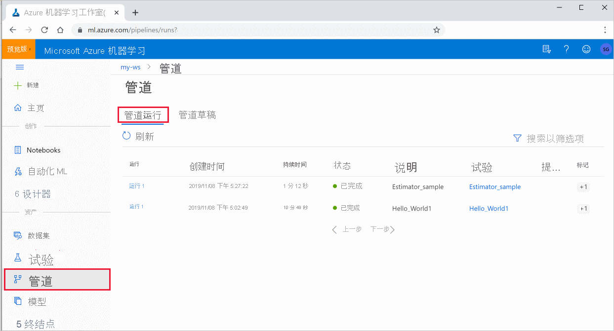
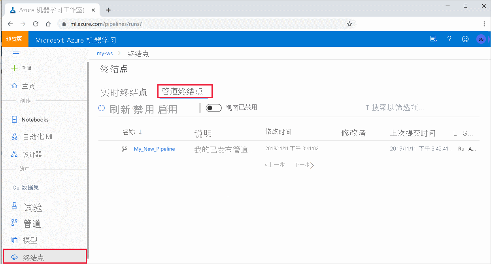

# <a name="create-and-run-machine-learning-pipelines-with-azure-machine-learning-sdk"></a>使用 Azure 机器学习 SDK 创建和运行机器学习管道

[!INCLUDE [applies-to-skus](../../includes/aml-applies-to-basic-enterprise-sku.md)]

本文介绍如何使用 [Azure 机器学习 SDK](https://docs.microsoft.com/python/api/overview/azure/ml/intro?view=azure-ml-py) 创建、发布、运行和跟踪[机器学习管道](concept-ml-pipelines.md)。  使用 **ML 管道**创建将各个 ML 阶段整合到一起的工作流，然后将该管道发布到 Azure 机器学习工作区供以后访问或者与其他人共享。  ML 管道非常适合用于批量评分方案，它们可以使用各种计算，重复使用步骤而不是重新运行步骤，以及与其他人共享 ML 工作流。

尽管可以使用一种称作 [Azure 管道](https://docs.microsoft.com/azure/devops/pipelines/targets/azure-machine-learning?context=azure%2Fmachine-learning%2Fservice%2Fcontext%2Fml-context&view=azure-devops&tabs=yaml)的不同类型的管道来实现 ML 任务的 CI/CD 自动化，但这种类型的管道永远不会存储在工作区中。 [比较这些不同的管道](concept-ml-pipelines.md#which-azure-pipeline-technology-should-i-use)。

ML 管道的每个阶段（例如数据准备和模型训练）可以包含一个或多个步骤。

Azure 机器学习[工作区](how-to-manage-workspace.md)的成员可以看到创建的 ML 管道。 

ML 管道使用远程计算目标进行计算，以及存储与该管道关联的中间数据和最终数据。 这些管道可以在支持的 [Azure 存储](https://docs.microsoft.com/azure/storage/)位置读取和写入数据。

如果没有 Azure 订阅，请在开始操作前先创建一个免费帐户。 试用[免费版或付费版 Azure 机器学习](https://aka.ms/AMLFree)。

## <a name="prerequisites"></a>先决条件

* 创建用于保存所有管道资源的 [Azure 机器学习工作区](how-to-manage-workspace.md)。

* [配置开发环境](how-to-configure-environment.md)以安装 Azure 机器学习 sdk，或使用已安装 sdk 的[Azure 机器学习计算实例](concept-compute-instance.md)。

首先附加工作区：

```Python
import azureml.core
from azureml.core import Workspace, Datastore

ws = Workspace.from_config()
```

## <a name="set-up-machine-learning-resources"></a>设置机器学习资源

创建运行 ML 管道所需的资源：

* 设置一个数据存储，用于访问管道步骤中所需的数据。

* 配置 `Dataset` 对象，使之指向驻留在数据存储中的或可在数据存储中访问的持久性数据。 为在管道步骤间传递的临时数据配置 `PipelineData` 对象。 

* 设置[计算目标](concept-azure-machine-learning-architecture.md#compute-targets)，管道步骤将在其上运行。

### <a name="set-up-a-datastore"></a>设置数据存储

数据存储用于存储可供管道访问的数据。 每个工作区有一个默认的数据存储。 可以注册其他数据存储。 

创建工作区时，会将 [Azure 文件存储](https://docs.microsoft.com/azure/storage/files/storage-files-introduction)和 [Azure Blob 存储](https://docs.microsoft.com/azure/storage/blobs/storage-blobs-introduction)附加到该工作区。 已注册一个用于连接 Azure Blob 存储的默认数据存储。 要了解详细信息，请参阅[确定何时使用 Azure 文件存储、Azure Blob 或 Azure 磁盘](https://docs.microsoft.com/azure/storage/common/storage-decide-blobs-files-disks)。 

```python
# Default datastore 
def_data_store = ws.get_default_datastore()

# Get the blob storage associated with the workspace
def_blob_store = Datastore(ws, "workspaceblobstore")

# Get file storage associated with the workspace
def_file_store = Datastore(ws, "workspacefilestore")

```

将数据文件或目录上传到数据存储，以便可以在管道中访问它们。 此示例使用 Blob 存储作为数据存储：

```python
def_blob_store.upload_files(
    ["iris.csv"],
    target_path="train-dataset",
    overwrite=True)
```

一个管道包含一个或多个步骤。 步骤是在计算目标上运行的单元。 步骤可能会使用数据源，并生成“中间”数据。 步骤可以创建数据，例如模型、包含模型和依赖文件的目录，或临时数据。 然后，此数据可供管道中的其他后续步骤使用。

若要详细了解如何将管道连接到数据，请参阅[如何访问数据](how-to-access-data.md)和[如何注册数据集](how-to-create-register-datasets.md)这两篇文章。 

### <a name="configure-data-using-dataset-and-pipelinedata-objects"></a>使用 `Dataset` 和 `PipelineData` 对象配置数据

你刚刚创建了一个可在管道中作为步骤输入引用的数据源。 向管道提供数据的首选方法是使用 [Dataset](https://docs.microsoft.com/python/api/azureml-core/azureml.core.dataset.Dataset) 对象。 `Dataset` 对象指向驻留在数据存储中的或者可从数据存储或 Web URL 访问的数据。 `Dataset` 类是抽象类，因此，你将创建一个 `FileDataset` 的实例（引用一个或多个文件）或一个 `TabularDataset` 的实例（基于一个或多个包含分隔数据列的文件创建）。

`Dataset` 对象支持版本控制、差异分析和汇总统计。 `Dataset` 是惰性评估的（类似于 Python 生成器），有效的做法是通过拆分或筛选来划分其子集。 

使用 [from_file](https://docs.microsoft.com/python/api/azureml-core/azureml.data.dataset_factory.filedatasetfactory?view=azure-ml-py#from-files-path--validate-true-) 或 [from_delimited_files](https://docs.microsoft.com/python/api/azureml-core/azureml.data.dataset_factory.tabulardatasetfactory?view=azure-ml-py#from-delimited-files-path--validate-true--include-path-false--infer-column-types-true--set-column-types-none--separator------header-true--partition-format-none--support-multi-line-false-) 之类的方法创建 `Dataset`。

```python
from azureml.core import Dataset

iris_tabular_dataset = Dataset.Tabular.from_delimited_files([(def_blob_store, 'train-dataset/iris.csv')])
```

中间数据（或步骤输出）由 [PipelineData](https://docs.microsoft.com/python/api/azureml-pipeline-core/azureml.pipeline.core.pipelinedata?view=azure-ml-py) 对象表示。 `output_data1` 生成为步骤的输出，并用作一个或多个后续步骤的输入。 `PipelineData` 在步骤之间引入数据依赖项，并在管道中创建隐式执行顺序。 稍后在创建管道步骤时将使用此对象。

```python
from azureml.pipeline.core import PipelineData

output_data1 = PipelineData(
    "output_data1",
    datastore=def_blob_store,
    output_name="output_data1")
```

有关使用数据集和管道数据的更多详细信息和示例代码，可参阅[将数据移入 ML 管道步骤和在 ML 管道步骤之间移动数据 (Python)](how-to-move-data-in-out-of-pipelines.md)。

## <a name="set-up-a-compute-target"></a>设置计算目标

在 Azure 机器学习中，术语“计算”（或“计算目标”）是指在机器学习管道中执行计算步骤的计算机或群集 。   有关计算目标的完整列表以及如何创建计算目标并将其附加到工作区的详细信息，请参阅[模型训练的计算目标](how-to-set-up-training-targets.md)。  无论是在训练模型还是运行管道步骤，创建和/或附加计算目标的过程都是相同的。 创建并附加计算目标后，请使用[管道步骤](#steps)中的 `ComputeTarget` 对象。

> [!IMPORTANT]
> 内部远程作业不支持对计算目标执行管理操作。 由于机器学习管道作为远程作业提交，因此请勿对管道内的计算目标使用管理操作。

下面是创建和附加计算目标的示例：

* Azure 机器学习计算
* Azure Databricks 
* Azure Data Lake Analytics

[!INCLUDE [low-pri-note](../../includes/machine-learning-low-pri-vm.md)]

### <a name="azure-machine-learning-compute"></a>Azure 机器学习计算

可以创建 Azure 机器学习计算用于运行步骤。

```python
from azureml.core.compute import ComputeTarget, AmlCompute

compute_name = "aml-compute"
vm_size = "STANDARD_NC6"
if compute_name in ws.compute_targets:
    compute_target = ws.compute_targets[compute_name]
    if compute_target and type(compute_target) is AmlCompute:
        print('Found compute target: ' + compute_name)
else:
    print('Creating a new compute target...')
    provisioning_config = AmlCompute.provisioning_configuration(vm_size=vm_size,  # STANDARD_NC6 is GPU-enabled
                                                                min_nodes=0,
                                                                max_nodes=4)
    # create the compute target
    compute_target = ComputeTarget.create(
        ws, compute_name, provisioning_config)

    # Can poll for a minimum number of nodes and for a specific timeout.
    # If no min node count is provided it will use the scale settings for the cluster
    compute_target.wait_for_completion(
        show_output=True, min_node_count=None, timeout_in_minutes=20)

    # For a more detailed view of current cluster status, use the 'status' property
    print(compute_target.status.serialize())
```

### <a name="azure-databricks"></a><a id="databricks"></a>Azure Databricks

Azure Databricks 是 Azure 云中基于 Apache Spark 的环境。 它可以用作 Azure 机器学习管道的计算目标。

请先创建 Azure Databricks 工作区，然后再使用该工作区。 若要创建工作区资源，请参阅[在 Azure Databricks 中运行 Spark 作业](https://docs.microsoft.com/azure/azure-databricks/quickstart-create-databricks-workspace-portal)文档。

要将 Azure Databricks 附加为计算目标，请提供以下信息：

* __Databricks 计算名称__：要分配给此计算资源的名称。
* __Databricks 工作区名称__：Azure Databricks 工作区的名称。
* __Databricks 访问令牌__：用于对 Azure Databricks 进行身份验证的访问令牌。 若要生成访问令牌，请参阅[身份验证](https://docs.azuredatabricks.net/dev-tools/api/latest/authentication.html)文档。

以下代码演示如何使用 Azure 机器学习 SDK 将 Azure Databricks 附加为计算目标（Databricks 工作区需要与 AML 工作区位于同一个订阅中）：

```python
import os
from azureml.core.compute import ComputeTarget, DatabricksCompute
from azureml.exceptions import ComputeTargetException

databricks_compute_name = os.environ.get(
    "AML_DATABRICKS_COMPUTE_NAME", "<databricks_compute_name>")
databricks_workspace_name = os.environ.get(
    "AML_DATABRICKS_WORKSPACE", "<databricks_workspace_name>")
databricks_resource_group = os.environ.get(
    "AML_DATABRICKS_RESOURCE_GROUP", "<databricks_resource_group>")
databricks_access_token = os.environ.get(
    "AML_DATABRICKS_ACCESS_TOKEN", "<databricks_access_token>")

try:
    databricks_compute = ComputeTarget(
        workspace=ws, name=databricks_compute_name)
    print('Compute target already exists')
except ComputeTargetException:
    print('compute not found')
    print('databricks_compute_name {}'.format(databricks_compute_name))
    print('databricks_workspace_name {}'.format(databricks_workspace_name))
    print('databricks_access_token {}'.format(databricks_access_token))

    # Create attach config
    attach_config = DatabricksCompute.attach_configuration(resource_group=databricks_resource_group,
                                                           workspace_name=databricks_workspace_name,
                                                           access_token=databricks_access_token)
    databricks_compute = ComputeTarget.attach(
        ws,
        databricks_compute_name,
        attach_config
    )

    databricks_compute.wait_for_completion(True)
```

有关更详细的示例，请参阅 GitHub 上的 [示例笔记本](https://aka.ms/pl-databricks)。

### <a name="azure-data-lake-analytics"></a><a id="adla"></a>Azure Data Lake Analytics

Azure Data Lake Analytics 是 Azure 云中的大数据分析平台。 它可以用作 Azure 机器学习管道的计算目标。

使用该平台之前，请先创建 Azure Data Lake Analytics 帐户。 若要创建此资源，请参阅 [Azure Data Lake Analytics 入门](https://docs.microsoft.com/azure/data-lake-analytics/data-lake-analytics-get-started-portal)文档。

若要将 Data Lake Analytics 附加为计算目标，必须使用 Azure 机器学习 SDK 并提供以下信息：

* __计算名称__：要分配给此计算资源的名称。
* __资源组__：包含 Data Lake Analytics 帐户的资源组。
* __帐户名称__：Data Lake Analytics 帐户名。

以下代码演示如何将 Data Lake Analytics 附加为计算目标：

```python
import os
from azureml.core.compute import ComputeTarget, AdlaCompute
from azureml.exceptions import ComputeTargetException


adla_compute_name = os.environ.get(
    "AML_ADLA_COMPUTE_NAME", "<adla_compute_name>")
adla_resource_group = os.environ.get(
    "AML_ADLA_RESOURCE_GROUP", "<adla_resource_group>")
adla_account_name = os.environ.get(
    "AML_ADLA_ACCOUNT_NAME", "<adla_account_name>")

try:
    adla_compute = ComputeTarget(workspace=ws, name=adla_compute_name)
    print('Compute target already exists')
except ComputeTargetException:
    print('compute not found')
    print('adla_compute_name {}'.format(adla_compute_name))
    print('adla_resource_id {}'.format(adla_resource_group))
    print('adla_account_name {}'.format(adla_account_name))
    # create attach config
    attach_config = AdlaCompute.attach_configuration(resource_group=adla_resource_group,
                                                     account_name=adla_account_name)
    # Attach ADLA
    adla_compute = ComputeTarget.attach(
        ws,
        adla_compute_name,
        attach_config
    )

    adla_compute.wait_for_completion(True)
```

有关更详细的示例，请参阅 GitHub 上的 [示例笔记本](https://aka.ms/pl-adla)。

> [!TIP]
> Azure 机器学习管道只能处理 Data Lake Analytics 帐户的默认数据存储中存储的数据。 如果需要处理的数据不在默认存储中，可以在训练之前使用 [`DataTransferStep`](https://docs.microsoft.com/python/api/azureml-pipeline-steps/azureml.pipeline.steps.data_transfer_step.datatransferstep?view=azure-ml-py) 复制数据。

## <a name="construct-your-pipeline-steps"></a><a id="steps"></a>构造管道步骤

创建计算目标并将其附加到工作区后，就可以定义管道步骤了。 可以通过 Azure 机器学习 SDK 使用许多内置步骤。 这些步骤中最基本的步骤是 [PythonScriptStep](https://docs.microsoft.com/python/api/azureml-pipeline-steps/azureml.pipeline.steps.python_script_step.pythonscriptstep?view=azure-ml-py)，即在指定的计算目标中运行 Python 脚本：

```python
from azureml.pipeline.steps import PythonScriptStep

ds_input = my_dataset.as_named_input('input1')

trainStep = PythonScriptStep(
    script_name="train.py",
    arguments=["--input", ds_input.as_download(), "--output", output_data1],
    inputs=[ds_input],
    outputs=[output_data1],
    compute_target=compute_target,
    source_directory=project_folder,
    allow_reuse=True
)
```

在协作环境中使用管道时，重复使用以前的结果 (`allow_reuse`) 非常关键，因为消除不必要的重新运行可以提高敏捷性。 当步骤的 script_name、输入和参数保持不变时，“重复使用”是默认行为。 重复使用步骤的输出时，作业不会提交到计算，而是前一运行的结果立即可供下一步骤的运行使用。 如果 `allow_reuse` 设置为 false，则在管道执行过程中将始终为此步骤生成新的运行。 

定义步骤后，使用其中的部分或所有步骤生成管道。

> [!NOTE]
> 定义步骤或生成管道时，不会将任何文件或数据上传到 Azure 机器学习。

```python
# list of steps to run
compareModels = [trainStep, extractStep, compareStep]

from azureml.pipeline.core import Pipeline

# Build the pipeline
pipeline1 = Pipeline(workspace=ws, steps=[compareModels])
```

以下示例使用前面创建的 Azure Databricks 计算目标： 

```python
from azureml.pipeline.steps import DatabricksStep

dbStep = DatabricksStep(
    name="databricksmodule",
    inputs=[step_1_input],
    outputs=[step_1_output],
    num_workers=1,
    notebook_path=notebook_path,
    notebook_params={'myparam': 'testparam'},
    run_name='demo run name',
    compute_target=databricks_compute,
    allow_reuse=False
)
# List of steps to run
steps = [dbStep]

# Build the pipeline
pipeline1 = Pipeline(workspace=ws, steps=steps)
```

### <a name="use-a-dataset"></a>使用数据集 

从 Azure Blob 存储、Azure 文件存储、Azure Data Lake Storage Gen1、Azure Data Lake Storage Gen2、Azure SQL 数据库和 Azure Database for PostgreSQL 创建的数据集可以用作任何管道步骤的输入。 可以将输出写入 [DataTransferStep](https://docs.microsoft.com/python/api/azureml-pipeline-steps/azureml.pipeline.steps.datatransferstep?view=azure-ml-py)、[DatabricksStep](https://docs.microsoft.com/python/api/azureml-pipeline-steps/azureml.pipeline.steps.databricks_step.databricksstep?view=azure-ml-py)，如果要将数据写入特定数据存储，请使用 [PipelineData](https://docs.microsoft.com/python/api/azureml-pipeline-core/azureml.pipeline.core.pipelinedata?view=azure-ml-py)。 

> [!IMPORTANT]
> 仅 Azure Blob 和 Azure 文件共享数据存储支持使用 PipelineData 将输出数据写回到数据存储。 目前 [ADLS Gen 2 数据存储](https://docs.microsoft.com/python/api/azureml-core/azureml.data.azure_data_lake_datastore.azuredatalakegen2datastore?view=azure-ml-py)不支持此功能。

```python
dataset_consuming_step = PythonScriptStep(
    script_name="iris_train.py",
    inputs=[iris_tabular_dataset.as_named_input("iris_data")],
    compute_target=compute_target,
    source_directory=project_folder
)
```

然后，使用 [Run.input_datasets](https://docs.microsoft.com/python/api/azureml-core/azureml.core.run.run?view=azure-ml-py#input-datasets) 字典检索管道中的数据集。

```python
# iris_train.py
from azureml.core import Run, Dataset

run_context = Run.get_context()
iris_dataset = run_context.input_datasets['iris_data']
dataframe = iris_dataset.to_pandas_dataframe()
```

`Run.get_context()` 行值得强调。 此函数检索 `Run`（表示当前试验运行）。 在上面的示例中，我们使用它来检索已注册数据集。 `Run` 对象的另一个常见用途是检索试验本身和试验所在的工作区： 

```python
# Within a PythonScriptStep

ws = Run.get_context().experiment.workspace
```

有关更多详细信息（包括传递数据和访问数据的替代方法），请参阅[将数据移入 ML 管道步骤和在 ML 管道步骤之间移动数据 (Python)](how-to-move-data-in-out-of-pipelines.md)。

## <a name="submit-the-pipeline"></a>提交管道

提交管道时，Azure 机器学习将检查每个步骤的依赖项，并上传指定的源目录的快照。 如果未指定源目录，则上传当前的本地目录。 该快照也作为试验的一部分存储在工作区中。

> [!IMPORTANT]
> [!INCLUDE [amlinclude-info](../../includes/machine-learning-amlignore-gitignore.md)]
>
> 有关详细信息，请参阅[快照](concept-azure-machine-learning-architecture.md#snapshots)。

```python
from azureml.core import Experiment

# Submit the pipeline to be run
pipeline_run1 = Experiment(ws, 'Compare_Models_Exp').submit(pipeline1)
pipeline_run1.wait_for_completion()
```

第一次运行管道时，Azure 机器学习会：

* 将项目快照从与工作区关联的 Blob 存储下载到计算目标。
* 生成对应于管道中每个步骤的 Docker 映像。
* 将每个步骤的 Docker 映像从容器注册表下载到计算目标。
* 配置对 `Dataset` 和 `PipelineData` 对象的访问权限。 在 `as_mount()` 访问模式下，FUSE 用于提供虚拟访问。 如果不支持装载，或者用户将访问权限指定为 `as_download()`，则改为将数据复制到计算目标。
* 运行在步骤定义中指定的计算目标中的步骤。 
* 创建项目，例如日志、stdout 和 stderr、指标以及步骤指定的输出。 然后上传这些项目并将其保存在用户的默认数据存储中。


有关详细信息，请参阅 [Experiment 类](https://docs.microsoft.com/python/api/azureml-core/azureml.core.experiment.experiment?view=azure-ml-py)参考。

### <a name="view-results-of-a-pipeline"></a>查看管道的结果

在工作室中查看所有管道的列表及其运行详细信息：

1. 登录到 [Azure 机器学习工作室](https://ml.azure.com)。

1. [查看工作区](how-to-manage-workspace.md#view)。

1. 在左侧，选择“管道”以查看所有管道运行。
 
 
1. 选择特定的管道以查看运行结果。

## <a name="git-tracking-and-integration"></a>Git 跟踪与集成

如果以本地 Git 存储库作为源目录开始训练运行，有关存储库的信息将存储在运行历史记录中。 有关详细信息，请参阅 [Azure 机器学习的 Git 集成](concept-train-model-git-integration.md)。

## <a name="publish-a-pipeline"></a>发布管道

可以发布一个管道，以便稍后结合不同的输入运行该管道。 要使已发布的管道的 REST 终结点接受参数，在发布之前必须将该管道参数化。

1. 若要创建管道参数，请使用带默认值的 [PipelineParameter](https://docs.microsoft.com/python/api/azureml-pipeline-core/azureml.pipeline.core.graph.pipelineparameter?view=azure-ml-py) 对象。

   ```python
   from azureml.pipeline.core.graph import PipelineParameter
   
   pipeline_param = PipelineParameter(
     name="pipeline_arg",
     default_value=10)
   ```

2. 按如下所示，将此 `PipelineParameter` 对象作为参数添加到管道中的任一步骤：

   ```python
   compareStep = PythonScriptStep(
     script_name="compare.py",
     arguments=["--comp_data1", comp_data1, "--comp_data2", comp_data2, "--output_data", out_data3, "--param1", pipeline_param],
     inputs=[ comp_data1, comp_data2],
     outputs=[out_data3],
     compute_target=compute_target,
     source_directory=project_folder)
   ```

3. 发布此管道，调用时它会接受参数。

   ```python
   published_pipeline1 = pipeline_run1.publish_pipeline(
        name="My_Published_Pipeline",
        description="My Published Pipeline Description",
        version="1.0")
   ```

### <a name="run-a-published-pipeline"></a>运行已发布的管道

所有已发布的管道都具有 REST 终结点。 使用管道终结点，可以从任何外部系统（包括非 Python 客户端）触发管道运行。 在批量评分和重新训练方案中，此终结点支持“托管可重复性”。

若要调用上述管道的运行，需要使用 [AzureCliAuthentication 类](https://docs.microsoft.com/python/api/azureml-core/azureml.core.authentication.azurecliauthentication?view=azure-ml-py)参考中所述的 Azure Active Directory 身份验证标头令牌，或在 [Azure 机器学习中的身份验证](https://aka.ms/pl-restep-auth)笔记本中获取详细信息。

```python
from azureml.pipeline.core import PublishedPipeline
import requests

response = requests.post(published_pipeline1.endpoint,
                         headers=aad_token,
                         json={"ExperimentName": "My_Pipeline",
                               "ParameterAssignments": {"pipeline_arg": 20}})
```

## <a name="create-a-versioned-pipeline-endpoint"></a>创建版本受控的管道终结点

可以创建包含多个已发布管道的管道终结点。 可以像使用已发布的管道一样使用此终结点，但在迭代和更新 ML 管道时，它可以充当固定的 REST 终结点。

```python
from azureml.pipeline.core import PipelineEndpoint

published_pipeline = PipelineEndpoint.get(workspace=ws, name="My_Published_Pipeline")
pipeline_endpoint = PipelineEndpoint.publish(workspace=ws, name="PipelineEndpointTest",
                                            pipeline=published_pipeline, description="Test description Notebook")
```

### <a name="submit-a-job-to-a-pipeline-endpoint"></a>将作业提交到管道终结点

可将作业提交到管道终结点的默认版本：

```python
pipeline_endpoint_by_name = PipelineEndpoint.get(workspace=ws, name="PipelineEndpointTest")
run_id = pipeline_endpoint_by_name.submit("PipelineEndpointExperiment")
print(run_id)
```

还可将作业提交到特定的版本：

```python
run_id = pipeline_endpoint_by_name.submit("PipelineEndpointExperiment", pipeline_version="0")
print(run_id)
```

可以使用 REST API 来完成相同的操作：

```python
rest_endpoint = pipeline_endpoint_by_name.endpoint
response = requests.post(rest_endpoint, 
                         headers=aad_token, 
                         json={"ExperimentName": "PipelineEndpointExperiment",
                               "RunSource": "API",
                               "ParameterAssignments": {"1": "united", "2":"city"}})
```

### <a name="use-published-pipelines-in-the-studio"></a>在工作室中使用已发布的管道

也可以从工作室运行已发布的管道：

1. 登录到 [Azure 机器学习工作室](https://ml.azure.com)。

1. [查看工作区](how-to-manage-workspace.md#view)。

1. 在左侧选择“终结点”。

1. 在顶部选择“管道终结点”。
 

1. 选择要运行的特定管道，使用或查看管道终结点的先前运行的结果。

### <a name="disable-a-published-pipeline"></a>禁用已发布的管道

若要在已发布管道的列表中隐藏某个管道，请在工作室或 SDK 中禁用它：

```python
# Get the pipeline by using its ID from Azure Machine Learning studio
p = PublishedPipeline.get(ws, id="068f4885-7088-424b-8ce2-eeb9ba5381a6")
p.disable()
```

可以使用 `p.enable()` 再次启用它。 有关详细信息，请参阅 [PublishedPipeline 类](https://docs.microsoft.com/python/api/azureml-pipeline-core/azureml.pipeline.core.publishedpipeline?view=azure-ml-py)参考。

## <a name="caching--reuse"></a>缓存和重复使用  

若要优化和自定义管道的行为，可以围绕缓存和重复使用采取某些措施。 例如，可以选择：
+ 在[步骤定义](https://docs.microsoft.com/python/api/azureml-pipeline-steps/?view=azure-ml-py)期间通过设置 `allow_reuse=False` 来**禁用默认的重复使用步骤运行输出的行为**。 在协作环境中使用管道时，“重复使用”非常关键，因为消除不必要的运行可以提高敏捷性。 但是，可以选择禁用重复使用。
+ 使用 `pipeline_run = exp.submit(pipeline, regenerate_outputs=False)` **强制对运行中的所有步骤重新生成输出**

默认情况下，已启用步骤的 `allow_reuse`，步骤定义中指定的 `source_directory` 将进行哈希处理。 因此，如果给定步骤的脚本保持不变（`script_name`、输入和参数），并且 ` source_directory` 中未发生任何其他更改，则会重复使用前一个步骤运行的输出，不会将作业提交到计算，并且前一运行的结果立即可供下一步骤使用。

```python
step = PythonScriptStep(name="Hello World",
                        script_name="hello_world.py",
                        compute_target=aml_compute,
                        source_directory=source_directory,
                        allow_reuse=False,
                        hash_paths=['hello_world.ipynb'])
```

## <a name="next-steps"></a>后续步骤

- 使用 [GitHub 上的这些 Jupyter Notebook](https://aka.ms/aml-pipeline-readme) 以进一步探索机器学习管道。
- 参阅有关 [azureml-pipelines-core](https://docs.microsoft.com/python/api/azureml-pipeline-core/?view=azure-ml-py) 包和 [azureml-pipelines-steps](https://docs.microsoft.com/python/api/azureml-pipeline-steps/?view=azure-ml-py) 包的 SDK 参考帮助信息。
- 参阅[操作指南](how-to-debug-pipelines.md)，获取有关调试管道和排查管道问题的提示。

[!INCLUDE [aml-clone-in-azure-notebook](../../includes/aml-clone-for-examples.md)]
