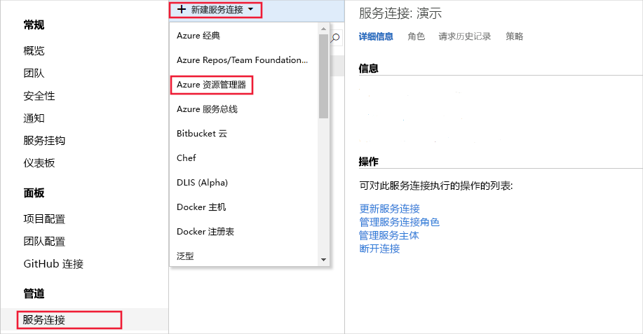
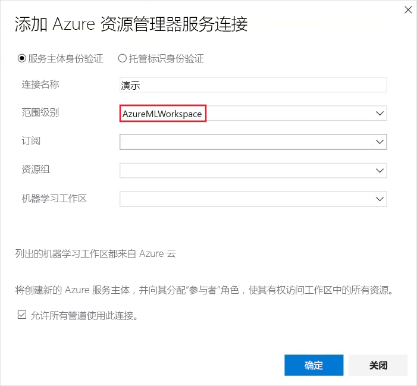
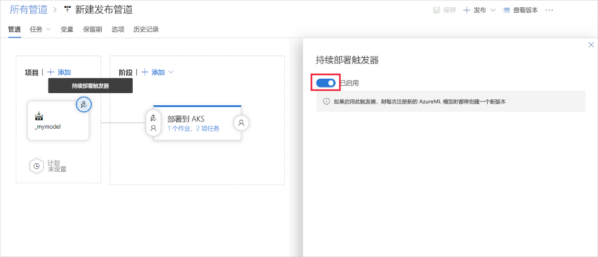

# <a name="deploy-models-with-azure-machine-learning"></a>部署模型与 Azure 机器学习
[!INCLUDE [applies-to-skus](../../includes/aml-applies-to-basic-enterprise-sku.md)]

了解如何在 Azure 云中将机器学习模型部署为 web 服务，或 Azure IoT Edge 设备。

无论[你在何处部署](#target)模型，工作流都是类似的：

1. 注册模型。
1. 准备部署。 （指定资产，使用量，计算目标。）
1. 将模型部署到计算目标。
1. 测试已部署的模型，也称为 "web 服务"。

有关部署工作流中所涉及的概念的详细信息，请参阅[管理、部署和监视具有 Azure 机器学习的模型](concept-model-management-and-deployment.md)。

## <a name="prerequisites"></a>必备条件

- Azure 机器学习工作区。 有关详细信息，请参阅[创建 Azure 机器学习工作区](how-to-manage-workspace.md)。

- 模型。 如果没有训练的模型，则可以使用[本教程](https://aka.ms/azml-deploy-cloud)中提供的模型和依赖项文件。

- [机器学习服务的 Azure CLI 扩展](reference-azure-machine-learning-cli.md)、[用于 PYTHON 的 Azure 机器学习 SDK](https://docs.microsoft.com/python/api/overview/azure/ml/intro?view=azure-ml-py)或[Azure 机器学习 Visual Studio Code 扩展](tutorial-setup-vscode-extension.md)。

## <a name="connect-to-your-workspace"></a>连接到你的工作区

下面的代码演示如何使用缓存到本地开发环境中的信息连接到 Azure 机器学习工作区：

+ **使用 SDK**

   ```python
   from azureml.core import Workspace
   ws = Workspace.from_config(path=".file-path/ws_config.json")
   ```

  有关使用 SDK 连接到工作区的详细信息，请参阅适用于[Python 的 AZURE 机器学习 SDK](https://docs.microsoft.com/python/api/overview/azure/ml/intro?view=azure-ml-py#workspace)文档。

+ **使用 CLI**

   使用 CLI 时，请使用 `-w` 或 `--workspace-name` 参数指定命令的工作区。

+ **使用 VS Code**

   使用 VS Code 时，可以使用图形界面选择工作区。 有关详细信息，请参阅 VS Code 扩展文档中的 "[部署和管理模型](tutorial-train-deploy-image-classification-model-vscode.md#deploy-the-model)"。

## <a id="registermodel"></a>注册模型

已注册的模型是组成模型的一个或多个文件的逻辑容器。 例如，如果您有一个存储在多个文件中的模型，则可以在工作区中将其注册为一个模型。 注册文件后，可以下载或部署已注册的模型，并接收注册的所有文件。

> [!TIP]
> 注册模型时，需要提供云位置（来自定型运行）或本地目录的路径。 此路径只是在注册过程中查找要上载的文件。 它不需要与条目脚本中使用的路径匹配。 有关详细信息，请参阅[在输入脚本中查找模型文件](#locate-model-files-in-your-entry-script)。

机器学习模型注册到 Azure 机器学习工作区中。 模型可以来自 Azure 机器学习或从其他位置。 下面的示例演示如何注册模型。

### <a name="register-a-model-from-an-experiment-run"></a>从试验运行注册模型

本节中的代码片段演示如何从定型运行注册模型：

> [!IMPORTANT]
> 若要使用这些代码段，你需要先执行一个训练运行，并且需要有权访问 `Run` 对象（SDK 示例）或运行 ID 值（CLI 示例）。 有关定型模型的详细信息，请参阅[为模型定型设置计算目标](how-to-set-up-training-targets.md)。

+ **使用 SDK**

  使用 SDK 训练模型时，可以接收[Run](https://docs.microsoft.com/python/api/azureml-core/azureml.core.run.run?view=azure-ml-py) Object 或[AutoMLRun](/python/api/azureml-train-automl-client/azureml.train.automl.run.automlrun)对象，具体取决于模型的定型方式。 每个对象都可用于注册由试验运行创建的模型。

  + 从 `azureml.core.Run` 对象注册模型：
 
    ```python
    model = run.register_model(model_name='sklearn_mnist', model_path='outputs/sklearn_mnist_model.pkl')
    print(model.name, model.id, model.version, sep='\t')
    ```

    `model_path` 参数引用模型的云位置。 在此示例中，使用单个文件的路径。 若要在模型注册中包含多个文件，请将 `model_path` 设置为包含文件的文件夹的路径。 有关详细信息，请参阅[运行 register_model](https://docs.microsoft.com/python/api/azureml-core/azureml.core.run.run?view=azure-ml-py#register-model-model-name--model-path-none--tags-none--properties-none--model-framework-none--model-framework-version-none--description-none--datasets-none--sample-input-dataset-none--sample-output-dataset-none--resource-configuration-none----kwargs-)文档。

  + 从 `azureml.train.automl.run.AutoMLRun` 对象注册模型：

    ```python
        description = 'My AutoML Model'
        model = run.register_model(description = description)

        print(run.model_id)
    ```

    在此示例中，未指定 `metric` 和 `iteration` 参数，因此将注册具有最佳主要指标的迭代。 使用从运行返回的 `model_id` 值，而不是模型名称。

    有关详细信息，请参阅[Register_model AutoMLRun](/python/api/azureml-train-automl-client/azureml.train.automl.run.automlrun#register-model-model-name-none--description-none--tags-none--iteration-none--metric-none-)文档。

+ **使用 CLI**

  ```azurecli-interactive
  az ml model register -n sklearn_mnist  --asset-path outputs/sklearn_mnist_model.pkl  --experiment-name myexperiment --run-id myrunid
  ```

  [!INCLUDE [install extension](../../includes/machine-learning-service-install-extension.md)]

  `--asset-path` 参数引用模型的云位置。 在此示例中，使用单个文件的路径。 若要在模型注册中包含多个文件，请将 `--asset-path` 设置为包含文件的文件夹的路径。

+ **使用 VS Code**

  使用任何模型文件或文件夹，通过使用[VS Code](tutorial-train-deploy-image-classification-model-vscode.md#deploy-the-model)扩展插件来注册模型。

### <a name="register-a-model-from-a-local-file"></a>从本地文件注册模型

您可以通过提供模型的本地路径来注册模型。 你可以提供文件夹或单个文件的路径。 您可以使用此方法来注册使用 Azure 机器学习训练的模型，然后再下载。 你还可以使用此方法来注册在 Azure 机器学习之外训练的模型。

[!INCLUDE [trusted models](../../includes/machine-learning-service-trusted-model.md)]

+ **使用 SDK 和 ONNX**

    ```python
    import os
    import urllib.request
    from azureml.core.model import Model
    # Download model
    onnx_model_url = "https://www.cntk.ai/OnnxModels/mnist/opset_7/mnist.tar.gz"
    urllib.request.urlretrieve(onnx_model_url, filename="mnist.tar.gz")
    os.system('tar xvzf mnist.tar.gz')
    # Register model
    model = Model.register(workspace = ws,
                            model_path ="mnist/model.onnx",
                            model_name = "onnx_mnist",
                            tags = {"onnx": "demo"},
                            description = "MNIST image classification CNN from ONNX Model Zoo",)
    ```

  若要在模型注册中包含多个文件，请将 `model_path` 设置为包含文件的文件夹的路径。

+ **使用 CLI**

  ```azurecli-interactive
  az ml model register -n onnx_mnist -p mnist/model.onnx
  ```

  若要在模型注册中包含多个文件，请将 `-p` 设置为包含文件的文件夹的路径。

**估计时间**：约10秒。

有关详细信息，请参阅[模型类](https://docs.microsoft.com/python/api/azureml-core/azureml.core.model.model?view=azure-ml-py)的文档。

若要详细了解如何使用 Azure 机器学习外部训练的模型，请参阅[如何部署现有模型](how-to-deploy-existing-model.md)。

<a name="target"></a>

## <a name="choose-a-compute-target"></a>选择计算目标

你可以使用以下计算目标或计算资源来托管你的 web 服务部署：

[!INCLUDE [aml-compute-target-deploy](../../includes/aml-compute-target-deploy.md)]

## <a name="single-versus-multi-model-endpoints"></a>单个和多模型终结点
Azure ML 支持在单个终结点后部署单个或多个模型。

多模型终结点使用共享容器来承载多个模型。 这有助于降低开销，提高利用率，并使你能够将模块组合到整体中。 在部署脚本中指定的模型将装载并在服务容器的磁盘上提供，你可以按需将其加载到内存中，并基于在评分时间请求的特定模型进行评分。

有关演示如何使用单个容器化终结点后面的多个模型的 E2E 示例，请参阅[此示例](https://github.com/Azure/MachineLearningNotebooks/tree/master/how-to-use-azureml/deployment/deploy-multi-model)

## <a name="prepare-deployment-artifacts"></a>准备部署项目

若要部署模型，需要以下各项：

* **& 源代码依赖项的条目脚本**。 此脚本接受请求，使用模型为请求评分，并返回结果。

    > [!IMPORTANT]
    > * 条目脚本特定于您的模型。 它必须了解传入请求数据的格式、模型所需的数据格式，以及返回给客户端的数据的格式。
    >
    >   如果请求数据的格式不能由模型使用，则该脚本可以将其转换为可接受的格式。 它还可以在将响应返回给客户端之前对其进行转换。
    >
    > * Web 服务和 IoT Edge 部署无法访问工作区数据存储或数据集。 如果部署的服务需要访问存储在部署之外的数据（例如 Azure 存储帐户中的数据），则必须使用相关的 SDK 开发自定义代码解决方案。 例如，[用于 Python 的 Azure 存储 SDK](https://github.com/Azure/azure-storage-python)。
    >
    >   可能适用于你的方案的一种替代方法是[批处理预测](how-to-use-parallel-run-step.md)，它在评分期间提供对数据存储区的访问。

* **推理环境**。 运行模型所需的已安装包依赖项的基本映像。

* 托管已部署模型的计算目标的**部署配置**。 此配置描述运行模型所需的内存和 CPU 需求等因素。

这些项封装为*推理配置*和*部署配置*。 推理配置引用入口脚本和其他依赖项。 使用 SDK 执行部署时，以编程方式定义这些配置。 使用 CLI 时，可在 JSON 文件中定义它们。

### <a id="script"></a>1. 定义条目脚本和依赖项

条目脚本接收提交给已部署 web 服务的数据，并将其传递给模型。 然后，该脚本接收模型返回的响应，并将该响应返回给客户端。 *该脚本特定于您的模型*。 它必须了解模型需要的数据并返回数据。

该脚本包含用于加载和运行模型的两个函数：

* `init()`：通常，此函数将模型加载到全局对象。 当 web 服务的 Docker 容器启动时，此函数只运行一次。

* `run(input_data)`：此函数使用模型根据输入数据来预测值。 运行的输入和输出通常使用 JSON 进行序列化和反序列化。 也可以处理原始二进制数据。 在将数据发送到模型之前，或将其返回到客户端之前，可以转换数据。

#### <a name="locate-model-files-in-your-entry-script"></a>在条目脚本中找到模型文件

可以通过两种方法在条目脚本中查找模型：
* `AZUREML_MODEL_DIR`：包含模型位置路径的环境变量。
* `Model.get_model_path`：一个 API，该 API 使用注册的模型名称返回模型文件的路径。

##### <a name="azureml_model_dir"></a>AZUREML_MODEL_DIR

AZUREML_MODEL_DIR 是在服务部署过程中创建的环境变量。 您可以使用此环境变量来查找部署的模型的位置。

下表描述了 AZUREML_MODEL_DIR 的值，具体取决于部署的模型数：

| 部署 | 环境变量值 |
| ----- | ----- |
| 单个模型 | 包含模型的文件夹的路径。 |
| 多个模型 | 包含所有模型的文件夹的路径。 按名称和版本在此文件夹中查找模型（`$MODEL_NAME/$VERSION`） |

在模型注册和部署过程中，会将模型放置在 AZUREML_MODEL_DIR 路径中，并保留它们的原始文件名。

若要获取条目脚本中的模型文件的路径，请将环境变量与要查找的文件路径组合在一起。

**单个模型示例**
```python
# Example when the model is a file
model_path = os.path.join(os.getenv('AZUREML_MODEL_DIR'), 'sklearn_regression_model.pkl')

# Example when the model is a folder containing a file
file_path = os.path.join(os.getenv('AZUREML_MODEL_DIR'), 'my_model_folder', 'sklearn_regression_model.pkl')
```

**多个模型示例**
```python
# Example when the model is a file, and the deployment contains multiple models
model_path = os.path.join(os.getenv('AZUREML_MODEL_DIR'), 'sklearn_model', '1', 'sklearn_regression_model.pkl')
```

##### <a name="get_model_path"></a>get_model_path

在注册模型时，提供用于在注册表中管理该模型的模型名称。 将此名称与[model. get_model_path （）](https://docs.microsoft.com/python/api/azureml-core/azureml.core.model.model?view=azure-ml-py#get-model-path-model-name--version-none---workspace-none-)方法一起使用以检索模型文件的路径或本地文件系统上的文件。 如果注册文件夹或文件集合，此 API 将返回包含这些文件的目录的路径。

注册模型时，请为其指定一个名称。 该名称对应于模型的放置位置，无论是在本地，还是在服务部署过程中。

> [!IMPORTANT]
> 如果使用自动机器学习来定型模型，则会将 `model_id` 值用作模型名称。 有关注册和部署使用自动机器学习进行训练的模型的示例，请参阅 GitHub 上的[Azure/MachineLearningNotebooks](https://github.com/Azure/MachineLearningNotebooks/tree/master/how-to-use-azureml/automated-machine-learning/classification-bank-marketing-all-features) 。

下面的示例将返回名为 `sklearn_mnist_model.pkl` 的单个文件的路径（使用名称 `sklearn_mnist`注册）：

```python
model_path = Model.get_model_path('sklearn_mnist')
```

<a id="schema"></a>

#### <a name="optional-automatic-schema-generation"></a>可有可无自动生成架构

若要为 web 服务自动生成架构，请在一个已定义的类型对象的构造函数中提供输入和/或输出的示例。 类型和示例用于自动创建架构。 然后 Azure 机器学习在部署过程中创建 web 服务的[OpenAPI](https://swagger.io/docs/specification/about/) （Swagger）规范。

当前支持这些类型：

* `pandas`
* `numpy`
* `pyspark`
* 标准 Python 对象

若要使用架构生成，请将 `inference-schema` 包包含在 Conda 环境文件中。 有关此包的详细信息，请参阅[https://github.com/Azure/InferenceSchema](https://github.com/Azure/InferenceSchema)。

##### <a name="example-dependencies-file"></a>示例依赖关系文件

以下 YAML 是用于推理的 Conda 依赖项文件的一个示例。 请注意，必须使用版本 > = 1.0.45 作为 pip 依赖项指示 azureml 默认值，因为它包含将模型托管为 web 服务所需的功能。

```YAML
name: project_environment
dependencies:
  - python=3.6.2
  - scikit-learn=0.20.0
  - pip:
      # You must list azureml-defaults as a pip dependency
    - azureml-defaults>=1.0.45
    - inference-schema[numpy-support]
```

> [!IMPORTANT]
> 如果依赖关系通过 Conda 和 pip （来自 PyPi）提供，Microsoft 建议使用 Conda 版本，因为 Conda 包通常附带预生成的二进制文件，使安装更可靠。
>
> 有关详细信息，请参阅[了解 Conda 和 Pip](https://www.anaconda.com/understanding-conda-and-pip/)。
>
> 若要通过 Conda 检查依赖关系是否可用，请使用 `conda search <package-name>` 命令，或使用[https://anaconda.org/anaconda/repo](https://anaconda.org/anaconda/repo)和[https://anaconda.org/conda-forge/repo](https://anaconda.org/conda-forge/repo)的包索引。

如果要使用自动架构生成，则入口脚本必须导入 `inference-schema` 包。

定义 `input_sample` 和 `output_sample` 变量中的输入和输出示例格式，表示 web 服务的请求和响应格式。 在 `run()` 函数的 input 和 output 函数修饰器中使用这些示例。 以下 scikit-learn 示例使用架构生成。

##### <a name="example-entry-script"></a>示例条目脚本

下面的示例演示如何接受并返回 JSON 数据：

```python
#Example: scikit-learn and Swagger
import json
import numpy as np
import os
from sklearn.externals import joblib
from sklearn.linear_model import Ridge

from inference_schema.schema_decorators import input_schema, output_schema
from inference_schema.parameter_types.numpy_parameter_type import NumpyParameterType


def init():
    global model
    # AZUREML_MODEL_DIR is an environment variable created during deployment. Join this path with the filename of the model file.
    # It holds the path to the directory that contains the deployed model (./azureml-models/$MODEL_NAME/$VERSION).
    # If there are multiple models, this value is the path to the directory containing all deployed models (./azureml-models).
    # Alternatively: model_path = Model.get_model_path('sklearn_mnist')
    model_path = os.path.join(os.getenv('AZUREML_MODEL_DIR'), 'sklearn_mnist_model.pkl')
    # Deserialize the model file back into a sklearn model
    model = joblib.load(model_path)


input_sample = np.array([[10, 9, 8, 7, 6, 5, 4, 3, 2, 1]])
output_sample = np.array([3726.995])


@input_schema('data', NumpyParameterType(input_sample))
@output_schema(NumpyParameterType(output_sample))
def run(data):
    try:
        result = model.predict(data)
        # You can return any data type, as long as it is JSON serializable.
        return result.tolist()
    except Exception as e:
        error = str(e)
        return error
```

下面的示例演示如何使用数据帧将输入数据定义为 `<key: value>` 字典。 此方法支持从 Power BI 使用已部署的 web 服务。 （[了解有关如何从 Power BI 使用 web 服务的详细信息](https://docs.microsoft.com/power-bi/service-machine-learning-integration)。）

```python
import json
import pickle
import numpy as np
import pandas as pd
import azureml.train.automl
from sklearn.externals import joblib
from azureml.core.model import Model

from inference_schema.schema_decorators import input_schema, output_schema
from inference_schema.parameter_types.numpy_parameter_type import NumpyParameterType
from inference_schema.parameter_types.pandas_parameter_type import PandasParameterType


def init():
    global model
    # Replace filename if needed.
    model_path = os.path.join(os.getenv('AZUREML_MODEL_DIR'), 'model_file.pkl')
    # Deserialize the model file back into a sklearn model.
    model = joblib.load(model_path)


input_sample = pd.DataFrame(data=[{
    # This is a decimal type sample. Use the data type that reflects this column in your data.
    "input_name_1": 5.1,
    # This is a string type sample. Use the data type that reflects this column in your data.
    "input_name_2": "value2",
    # This is an integer type sample. Use the data type that reflects this column in your data.
    "input_name_3": 3
}])

# This is an integer type sample. Use the data type that reflects the expected result.
output_sample = np.array([0])


@input_schema('data', PandasParameterType(input_sample))
@output_schema(NumpyParameterType(output_sample))
def run(data):
    try:
        result = model.predict(data)
        # You can return any data type, as long as it is JSON serializable.
        return result.tolist()
    except Exception as e:
        error = str(e)
        return error
```

有关更多示例，请参阅以下脚本：

* [PyTorch](https://github.com/Azure/MachineLearningNotebooks/tree/master/how-to-use-azureml/ml-frameworks/pytorch)
* [TensorFlow](https://github.com/Azure/MachineLearningNotebooks/tree/master/how-to-use-azureml/ml-frameworks/tensorflow)
* [Keras](https://github.com/Azure/MachineLearningNotebooks/tree/master/how-to-use-azureml/training-with-deep-learning/train-hyperparameter-tune-deploy-with-keras)
* [ONNX](https://github.com/Azure/MachineLearningNotebooks/blob/master/how-to-use-azureml/deployment/onnx/)

<a id="binary"></a>

#### <a name="binary-data"></a>Binary data

如果模型接受二进制数据（如图像），则必须修改部署所用的 `score.py` 文件，以接受原始 HTTP 请求。 若要接受原始数据，请在输入脚本中使用 `AMLRequest` 类，并向 `run()` 函数添加 `@rawhttp` 修饰器。

下面是接受二进制数据的 `score.py` 的示例：

```python
from azureml.contrib.services.aml_request import AMLRequest, rawhttp
from azureml.contrib.services.aml_response import AMLResponse


def init():
    print("This is init()")


@rawhttp
def run(request):
    print("This is run()")
    print("Request: [{0}]".format(request))
    if request.method == 'GET':
        # For this example, just return the URL for GETs.
        respBody = str.encode(request.full_path)
        return AMLResponse(respBody, 200)
    elif request.method == 'POST':
        reqBody = request.get_data(False)
        # For a real-world solution, you would load the data from reqBody
        # and send it to the model. Then return the response.

        # For demonstration purposes, this example just returns the posted data as the response.
        return AMLResponse(reqBody, 200)
    else:
        return AMLResponse("bad request", 500)
```

> [!IMPORTANT]
> `AMLRequest` 类在 `azureml.contrib` 命名空间中。 此命名空间中的实体会在我们改进服务时经常更改。 此命名空间中的任何内容都应被视为 Microsoft 不完全支持的预览。
>
> 如果需要在本地开发环境中对此进行测试，可以使用以下命令安装组件：
>
> ```shell
> pip install azureml-contrib-services
> ```

<a id="cors"></a>

#### <a name="cross-origin-resource-sharing-cors"></a>跨域资源共享（CORS）

跨域资源共享是一种允许网页上的资源从另一个域请求的方式。 CORS 通过客户端请求发送的 HTTP 标头进行工作，并随服务响应一起返回。 有关 CORS 和有效标头的详细信息，请参阅维基百科中的[跨域资源共享](https://en.wikipedia.org/wiki/Cross-origin_resource_sharing)。

若要配置模型部署以支持 CORS，请在条目脚本中使用 `AMLResponse` 类。 此类允许您设置响应对象的标头。

下面的示例从入口脚本中设置响应的 `Access-Control-Allow-Origin` 标头：

```python
from azureml.contrib.services.aml_response import AMLResponse

def init():
    print("This is init()")

def run(request):
    print("This is run()")
    print("Request: [{0}]".format(request))
    if request.method == 'GET':
        # For this example, just return the URL for GETs.
        respBody = str.encode(request.full_path)
        return AMLResponse(respBody, 200)
    elif request.method == 'POST':
        reqBody = request.get_data(False)
        # For a real-world solution, you would load the data from reqBody
        # and send it to the model. Then return the response.

        # For demonstration purposes, this example
        # adds a header and returns the request body.
        resp = AMLResponse(reqBody, 200)
        resp.headers['Access-Control-Allow-Origin'] = "http://www.example.com"
        return resp
    else:
        return AMLResponse("bad request", 500)
```

> [!IMPORTANT]
> `AMLResponse` 类在 `azureml.contrib` 命名空间中。 此命名空间中的实体会在我们改进服务时经常更改。 此命名空间中的任何内容都应被视为 Microsoft 不完全支持的预览。
>
> 如果需要在本地开发环境中对此进行测试，可以使用以下命令安装组件：
>
> ```shell
> pip install azureml-contrib-services
> ```

### <a name="2-define-your-inference-environment"></a>2. 定义推理环境

推理配置介绍了如何配置模型以便进行预测。 此配置不是你的输入脚本的一部分。 它引用您的条目脚本，并用于查找部署所需的所有资源。 稍后在部署模型时使用。

推理配置使用 Azure 机器学习环境来定义部署所需的软件依赖项。 利用环境，你可以创建、管理和重复使用培训和部署所需的软件依赖项。 下面的示例演示如何从工作区加载环境，并将其用于推理配置：

```python
from azureml.core.environment import Environment
from azureml.core.model import InferenceConfig

myenv = Environment.get(workspace=ws, name="myenv", version="1")
inference_config = InferenceConfig(entry_script="x/y/score.py",
                                   environment=myenv)
```

有关环境的详细信息，请参阅[创建和管理用于定型和部署的环境](how-to-use-environments.md)。

你还可以直接指定依赖关系，而无需使用环境。 下面的示例演示如何创建从 Conda 文件加载软件依赖项的推理配置：

有关环境的详细信息，请参阅[创建和管理用于定型和部署的环境](how-to-use-environments.md)。

有关推理配置的详细信息，请参阅[InferenceConfig](https://docs.microsoft.com/python/api/azureml-core/azureml.core.model.inferenceconfig?view=azure-ml-py)类文档。

有关将自定义 Docker 映像与推理配置配合使用的信息，请参阅[如何使用自定义 docker 映像部署模型](how-to-deploy-custom-docker-image.md)。

### <a name="cli-example-of-inferenceconfig"></a>InferenceConfig 的 CLI 示例

[!INCLUDE [inference config](../../includes/machine-learning-service-inference-config.md)]

以下命令演示如何使用 CLI 部署模型：

```azurecli-interactive
az ml model deploy -n myservice -m mymodel:1 --ic inferenceconfig.json
```

在此示例中，配置指定以下设置：

* 该模型需要 Python。
* [条目脚本](#script)，用于处理发送到已部署服务的 web 请求。
* 描述推理所需 Python 包的 Conda 文件。

有关将自定义 Docker 映像与推理配置配合使用的信息，请参阅[如何使用自定义 docker 映像部署模型](how-to-deploy-custom-docker-image.md)。

### <a name="3-define-your-deployment-configuration"></a>3. 定义部署配置

在部署您的模型之前，您必须定义部署配置。 *部署配置特定于将托管 web 服务的计算目标。* 例如，当你在本地部署模型时，必须指定服务接受请求的端口。 部署配置不是你的输入脚本的一部分。 它用于定义将托管模型和条目脚本的计算目标的特征。

例如，如果没有与工作区关联的 Azure Kubernetes Service （AKS）实例，则可能还需要创建计算资源。

下表提供了为每个计算目标创建部署配置的示例：

| 计算目标 | 部署配置示例 |
| ----- | ----- |
| Local | `deployment_config = LocalWebservice.deploy_configuration(port=8890)` |
| Azure 容器实例 | `deployment_config = AciWebservice.deploy_configuration(cpu_cores = 1, memory_gb = 1)` |
| Azure Kubernetes 服务 | `deployment_config = AksWebservice.deploy_configuration(cpu_cores = 1, memory_gb = 1)` |

可从 `azureml.core.webservice`导入本地、Azure 容器实例和 AKS web 服务的类：

```python
from azureml.core.webservice import AciWebservice, AksWebservice, LocalWebservice
```

## <a name="deploy-to-target"></a>部署到目标

部署使用推理配置部署配置来部署模型。 不管计算目标如何，部署过程都是类似的。 部署到 AKS 的情况略有不同，因为必须提供对 AKS 群集的引用。

### <a name="securing-deployments-with-ssl"></a>用 SSL 保护部署

有关如何保护 web 服务部署的详细信息，请参阅[使用 SSL 保护 web 服务](how-to-secure-web-service.md#enable)。

### <a id="local"></a>本地部署

若要在本地部署模型，需要在本地计算机上安装 Docker。

#### <a name="using-the-sdk"></a>使用 SDK

```python
from azureml.core.webservice import LocalWebservice, Webservice

deployment_config = LocalWebservice.deploy_configuration(port=8890)
service = Model.deploy(ws, "myservice", [model], inference_config, deployment_config)
service.wait_for_deployment(show_output = True)
print(service.state)
```

有关详细信息，请参阅[LocalWebservice](https://docs.microsoft.com/python/api/azureml-core/azureml.core.webservice.local.localwebservice?view=azure-ml-py)、 [Model （）](https://docs.microsoft.com/python/api/azureml-core/azureml.core.model.model?view=azure-ml-py#deploy-workspace--name--models--inference-config-none--deployment-config-none--deployment-target-none--overwrite-false-)和[Webservice](https://docs.microsoft.com/python/api/azureml-core/azureml.core.webservice.webservice?view=azure-ml-py)的相关文档。

#### <a name="using-the-cli"></a>使用 CLI

若要使用 CLI 部署模型，请使用以下命令。 将 `mymodel:1` 替换为注册的模型的名称和版本：

```azurecli-interactive
az ml model deploy -m mymodel:1 --ic inferenceconfig.json --dc deploymentconfig.json
```

[!INCLUDE [aml-local-deploy-config](../../includes/machine-learning-service-local-deploy-config.md)]

有关详细信息，请参阅[az ml 模型部署](https://docs.microsoft.com/cli/azure/ext/azure-cli-ml/ml/model?view=azure-cli-latest#ext-azure-cli-ml-az-ml-model-deploy)文档。

### <a name="understanding-service-state"></a>了解服务状态

在模型部署过程中，你可能会在服务状态发生更改的情况下进行完全部署。

下表描述了不同的服务状态：

| Webservice 状态 | 说明 | 最终状态？
| ----- | ----- | ----- |
| 转为 | 服务正在部署过程中。 | 否 |
| 不正常 | 该服务已部署，但当前无法访问。  | 否 |
| 主机设 | 由于缺少资源，此时无法部署该服务。 | 否 |
| 失败 | 由于出现错误或崩溃，服务部署失败。 | 是 |
| 正常 | 服务正常，终结点可用。 | 是 |

### <a id="notebookvm"></a>计算实例 web 服务（开发/测试）

请参阅[将模型部署到 Azure 机器学习计算实例](how-to-deploy-local-container-notebook-vm.md)。

### <a id="aci"></a>Azure 容器实例（开发/测试）

请参阅[部署到 Azure 容器实例](how-to-deploy-azure-container-instance.md)。

### <a id="aks"></a>Azure Kubernetes 服务（开发/测试和生产）

请参阅[部署到 Azure Kubernetes 服务](how-to-deploy-azure-kubernetes-service.md)。

### <a name="ab-testing-controlled-rollout"></a>A/B 测试（受控推出）
有关详细信息，请参阅[ML 模型的受控推出](how-to-deploy-azure-kubernetes-service.md#deploy-models-to-aks-using-controlled-rollout-preview)。

## <a name="consume-web-services"></a>使用 Web 服务

每个已部署的 web 服务都提供 REST 终结点，因此可以使用任何编程语言创建客户端应用程序。
如果为服务启用了基于密钥的身份验证，则需要提供服务密钥作为请求标头中的令牌。
如果已为服务启用基于令牌的身份验证，则需要提供 Azure 机器学习的 JSON Web 令牌（JWT）作为请求标头中的持有者令牌。 

主要区别在于，**密钥是静态的，可以手动重新生成**，并且**令牌需要在过期时刷新**。 Azure 容器实例和 Azure Kubernetes 服务部署的 web 服务支持基于密钥的身份验证，基于令牌的身份验证**仅**适用于 Azure Kubernetes 服务部署。 有关详细信息和特定代码示例，请参阅身份验证的操作[方法](how-to-setup-authentication.md#web-service-authentication)。

> [!TIP]
> 部署服务后，可以检索架构 JSON 文档。 使用部署的 web 服务中的[swagger_uri 属性](https://docs.microsoft.com/python/api/azureml-core/azureml.core.webservice.local.localwebservice?view=azure-ml-py#swagger-uri)（例如，`service.swagger_uri`）获取本地 Web 服务 swagger 文件的 uri。

### <a name="request-response-consumption"></a>请求-响应消耗

下面是如何在 Python 中调用服务的示例：
```python
import requests
import json

headers = {'Content-Type': 'application/json'}

if service.auth_enabled:
    headers['Authorization'] = 'Bearer '+service.get_keys()[0]
elif service.token_auth_enabled:
    headers['Authorization'] = 'Bearer '+service.get_token()[0]

print(headers)

test_sample = json.dumps({'data': [
    [1, 2, 3, 4, 5, 6, 7, 8, 9, 10],
    [10, 9, 8, 7, 6, 5, 4, 3, 2, 1]
]})

response = requests.post(
    service.scoring_uri, data=test_sample, headers=headers)
print(response.status_code)
print(response.elapsed)
print(response.json())
```

有关详细信息，请参阅[创建使用 web 服务的客户端应用程序](how-to-consume-web-service.md)。

### <a name="web-service-schema-openapi-specification"></a>Web 服务架构（OpenAPI 规范）

如果你在部署中使用了自动生成架构，则可以使用[swagger_uri 属性](https://docs.microsoft.com/python/api/azureml-core/azureml.core.webservice.local.localwebservice?view=azure-ml-py#swagger-uri)获取服务的 OpenAPI 规范的地址。 （例如，`print(service.swagger_uri)`。）使用 GET 请求，或在浏览器中打开 URI 以检索该规范。

以下 JSON 文档是为部署生成的架构（OpenAPI 规范）的示例：

```json
{
    "swagger": "2.0",
    "info": {
        "title": "myservice",
        "description": "API specification for Azure Machine Learning myservice",
        "version": "1.0"
    },
    "schemes": [
        "https"
    ],
    "consumes": [
        "application/json"
    ],
    "produces": [
        "application/json"
    ],
    "securityDefinitions": {
        "Bearer": {
            "type": "apiKey",
            "name": "Authorization",
            "in": "header",
            "description": "For example: Bearer abc123"
        }
    },
    "paths": {
        "/": {
            "get": {
                "operationId": "ServiceHealthCheck",
                "description": "Simple health check endpoint to ensure the service is up at any given point.",
                "responses": {
                    "200": {
                        "description": "If service is up and running, this response will be returned with the content 'Healthy'",
                        "schema": {
                            "type": "string"
                        },
                        "examples": {
                            "application/json": "Healthy"
                        }
                    },
                    "default": {
                        "description": "The service failed to execute due to an error.",
                        "schema": {
                            "$ref": "#/definitions/ErrorResponse"
                        }
                    }
                }
            }
        },
        "/score": {
            "post": {
                "operationId": "RunMLService",
                "description": "Run web service's model and get the prediction output",
                "security": [
                    {
                        "Bearer": []
                    }
                ],
                "parameters": [
                    {
                        "name": "serviceInputPayload",
                        "in": "body",
                        "description": "The input payload for executing the real-time machine learning service.",
                        "schema": {
                            "$ref": "#/definitions/ServiceInput"
                        }
                    }
                ],
                "responses": {
                    "200": {
                        "description": "The service processed the input correctly and provided a result prediction, if applicable.",
                        "schema": {
                            "$ref": "#/definitions/ServiceOutput"
                        }
                    },
                    "default": {
                        "description": "The service failed to execute due to an error.",
                        "schema": {
                            "$ref": "#/definitions/ErrorResponse"
                        }
                    }
                }
            }
        }
    },
    "definitions": {
        "ServiceInput": {
            "type": "object",
            "properties": {
                "data": {
                    "type": "array",
                    "items": {
                        "type": "array",
                        "items": {
                            "type": "integer",
                            "format": "int64"
                        }
                    }
                }
            },
            "example": {
                "data": [
                    [ 10, 9, 8, 7, 6, 5, 4, 3, 2, 1 ]
                ]
            }
        },
        "ServiceOutput": {
            "type": "array",
            "items": {
                "type": "number",
                "format": "double"
            },
            "example": [
                3726.995
            ]
        },
        "ErrorResponse": {
            "type": "object",
            "properties": {
                "status_code": {
                    "type": "integer",
                    "format": "int32"
                },
                "message": {
                    "type": "string"
                }
            }
        }
    }
}
```

有关详细信息，请参阅[OpenAPI 规范](https://swagger.io/specification/)。

有关可根据规范创建客户端库的实用工具，请参阅[codegen](https://github.com/swagger-api/swagger-codegen)。

### <a id="azuremlcompute"></a>批处理推理
Azure 机器学习通过 Azure 机器学习创建和管理计算目标。 它们可用于来自 Azure 机器学习管道的批处理预测。

有关使用 Azure 机器学习计算进行批处理推理的演练，请参阅[如何运行批预测](tutorial-pipeline-batch-scoring-classification.md)。

### <a id="iotedge"></a>IoT Edge 推理
对部署到边缘的支持处于预览阶段。 有关详细信息，请参阅[将 Azure 机器学习部署为 IoT Edge 模块](https://docs.microsoft.com/azure/iot-edge/tutorial-deploy-machine-learning)。


## <a id="update"></a>更新 web 服务

[!INCLUDE [aml-update-web-service](../../includes/machine-learning-update-web-service.md)]

## <a name="continuously-deploy-models"></a>持续部署模型

可以使用[Azure DevOps](https://azure.microsoft.com/services/devops/)的机器学习扩展来持续部署模型。 如果在 Azure 机器学习工作区中注册了新的机器学习模型，则可以使用 Azure DevOps 的机器学习扩展来触发部署管道。

1. 注册[Azure Pipelines](https://docs.microsoft.com/azure/devops/pipelines/get-started/pipelines-sign-up?view=azure-devops)，这会使应用程序持续集成和交付到任何平台或云。 （请注意，Azure Pipelines 与[机器学习管道](concept-ml-pipelines.md#compare)不同。）

1. [创建 Azure DevOps 项目。](https://docs.microsoft.com/azure/devops/organizations/projects/create-project?view=azure-devops)

1. 安装[Azure Pipelines 的机器学习扩展](https://marketplace.visualstudio.com/items?itemName=ms-air-aiagility.vss-services-azureml&targetId=6756afbe-7032-4a36-9cb6-2771710cadc2&utm_source=vstsproduct&utm_medium=ExtHubManageList)。

1. 使用服务连接设置与 Azure 机器学习工作区的服务主体连接，以便你可以访问你的项目。 单击 "项目设置"，选择 "**服务连接**"，然后选择 " **Azure 资源管理器**：

    [](media/how-to-deploy-and-where/view-service-connection-expanded.png)

1. 在 "**作用域级别**" 列表中，选择 " **AzureMLWorkspace**"，然后输入其余值：

    

1. 若要使用 Azure Pipelines 持续部署机器学习模型，请在 "管道" 下选择 "**发布**"。 添加新项目，然后选择**AzureML 模型**项目和前面创建的服务连接。 选择要触发部署的模型和版本：

    [](media/how-to-deploy-and-where/enable-modeltrigger-artifact-expanded.png)

1. 对模型项目启用模型触发器。 启用触发器时，每次在工作区中注册该模型的指定版本（即最新版本）时，都将触发 Azure DevOps release 管道。

    [](media/how-to-deploy-and-where/set-modeltrigger-expanded.png)

有关更多示例项目和示例，请参阅 GitHub 中的以下示例存储库：

* [Microsoft/MLOps](https://github.com/Microsoft/MLOps)
* [Microsoft/MLOpsPython](https://github.com/microsoft/MLOpsPython)

## <a name="download-a-model"></a>下载模型
如果要下载模型以便在自己的执行环境中使用它，则可以使用以下 SDK/CLI 命令执行此操作：

SDK
```python
model_path = Model(ws,'mymodel').download()
```

CLI：
```azurecli-interactive
az ml model download --model-id mymodel:1 --target-dir model_folder
```

## <a name="preview-no-code-model-deployment"></a>效果无代码模型部署

无代码模型部署目前处于预览阶段，支持以下机器学习框架：

### <a name="tensorflow-savedmodel-format"></a>Tensorflow SavedModel 格式
需要以**SavedModel 格式**注册 Tensorflow 模型，才能使用无代码模型部署。

请参阅[此链接](https://www.tensorflow.org/guide/saved_model)，了解有关如何创建 SavedModel 的信息。

```python
from azureml.core import Model

model = Model.register(workspace=ws,
                       model_name='flowers',                        # Name of the registered model in your workspace.
                       model_path='./flowers_model',                # Local Tensorflow SavedModel folder to upload and register as a model.
                       model_framework=Model.Framework.TENSORFLOW,  # Framework used to create the model.
                       model_framework_version='1.14.0',            # Version of Tensorflow used to create the model.
                       description='Flowers model')

service_name = 'tensorflow-flower-service'
service = Model.deploy(ws, service_name, [model])
```

### <a name="onnx-models"></a>ONNX 模型

任何 ONNX 推理图形都支持 ONNX 模型注册和部署。 当前不支持预处理和 postprocess 步骤。

下面是有关如何注册和部署 MNIST ONNX 模型的示例：

```python
from azureml.core import Model

model = Model.register(workspace=ws,
                       model_name='mnist-sample',                  # Name of the registered model in your workspace.
                       model_path='mnist-model.onnx',              # Local ONNX model to upload and register as a model.
                       model_framework=Model.Framework.ONNX ,      # Framework used to create the model.
                       model_framework_version='1.3',              # Version of ONNX used to create the model.
                       description='Onnx MNIST model')

service_name = 'onnx-mnist-service'
service = Model.deploy(ws, service_name, [model])
```

### <a name="scikit-learn-models"></a>Scikit-learn-了解模型

并非所有内置 scikit-learn 模型类型都支持代码模型部署。

下面的示例演示如何注册和部署不带额外代码的 spark-sklearn 模型：

```python
from azureml.core import Model
from azureml.core.resource_configuration import ResourceConfiguration

model = Model.register(workspace=ws,
                       model_name='my-sklearn-model',                # Name of the registered model in your workspace.
                       model_path='./sklearn_regression_model.pkl',  # Local file to upload and register as a model.
                       model_framework=Model.Framework.SCIKITLEARN,  # Framework used to create the model.
                       model_framework_version='0.19.1',             # Version of scikit-learn used to create the model.
                       resource_configuration=ResourceConfiguration(cpu=1, memory_in_gb=0.5),
                       description='Ridge regression model to predict diabetes progression.',
                       tags={'area': 'diabetes', 'type': 'regression'})
                       
service_name = 'my-sklearn-service'
service = Model.deploy(ws, service_name, [model])
```

注意：这些依赖项包含在预生成的 spark-sklearn 推理容器中：

```yaml
    - azureml-defaults
    - inference-schema[numpy-support]
    - scikit-learn
    - numpy
```

## <a name="package-models"></a>包模型

在某些情况下，你可能想要在不部署模型的情况下创建 Docker 映像（例如，你打算[部署到 Azure App Service](how-to-deploy-app-service.md)）。 或者，你可能想要下载映像并在本地 Docker 安装上运行它。 甚至可能需要下载用于生成映像的文件、对其进行检查、修改，并手动生成映像。

模型打包使你可以执行这些操作。 它将托管模型所需的所有资产打包为 web 服务，并允许下载完全生成的 Docker 映像或生成文件所需的文件。 可以通过两种方式使用模型打包：

**下载打包模型：** 下载包含模型以及将其作为 web 服务托管所需的其他文件的 Docker 映像。

**生成 Dockerfile：** 下载构建 Docker 映像所需的 Dockerfile、model、entry 脚本和其他资产。 然后，你可以在本地生成映像之前检查文件或进行更改。

这两个包都可用于获取本地 Docker 映像。

> [!TIP]
> 创建包类似于部署模型。 使用已注册的模型和推理配置。

> [!IMPORTANT]
> 若要下载完全生成的映像或在本地生成映像，需要在开发环境中安装[Docker](https://www.docker.com) 。

### <a name="download-a-packaged-model"></a>下载打包模型

下面的示例生成一个映像，该映像已在工作区的 Azure 容器注册表中注册：

```python
package = Model.package(ws, [model], inference_config)
package.wait_for_creation(show_output=True)
```

创建包后，可以使用 `package.pull()` 将映像请求到本地 Docker 环境。 此命令的输出将显示映像的名称。 例如： 

`Status: Downloaded newer image for myworkspacef78fd10.azurecr.io/package:20190822181338` 列中的一个值匹配。 

下载模型后，使用 `docker images` 命令来列出本地映像：

```text
REPOSITORY                               TAG                 IMAGE ID            CREATED             SIZE
myworkspacef78fd10.azurecr.io/package    20190822181338      7ff48015d5bd        4 minutes ago       1.43GB
```

若要基于此映像启动本地容器，请使用以下命令从 shell 或命令行启动命名容器。 使用 `docker images` 命令返回的映像 ID 替换 `<imageid>` 值。

```bash
docker run -p 6789:5001 --name mycontainer <imageid>
```

此命令启动名为 `myimage`的最新映像版本。 它将本地端口6789映射到 web 服务正在侦听的容器中的端口（5001）。 它还将 `mycontainer` 名称分配给容器，使容器更易于停止。 启动容器后，可以将请求提交到 `http://localhost:6789/score`。

### <a name="generate-a-dockerfile-and-dependencies"></a>生成 Dockerfile 和依赖项

下面的示例演示如何下载 Dockerfile、模型以及在本地生成映像所需的其他资产。 `generate_dockerfile=True` 参数指示你需要文件，而不是完全生成的映像。

```python
package = Model.package(ws, [model], inference_config, generate_dockerfile=True)
package.wait_for_creation(show_output=True)
# Download the package.
package.save("./imagefiles")
# Get the Azure container registry that the model/Dockerfile uses.
acr=package.get_container_registry()
print("Address:", acr.address)
print("Username:", acr.username)
print("Password:", acr.password)
```

此代码将生成映像所需的文件下载到 `imagefiles` 目录。 已保存文件中包含的 Dockerfile 引用存储在 Azure 容器注册表中的基本映像。 在本地 Docker 安装上生成映像时，需要使用地址、用户名和密码对注册表进行身份验证。 使用以下步骤通过本地 Docker 安装生成映像：

1. 在 shell 或命令行会话中，使用以下命令通过 Azure 容器注册表对 Docker 进行身份验证。 将 `<address>`、`<username>`和 `<password>` 替换为 `package.get_container_registry()`检索的值。

    ```bash
    docker login <address> -u <username> -p <password>
    ```

2. 若要生成映像，请使用以下命令。 将 `<imagefiles>` 替换为 `package.save()` 保存文件的目录的路径。

    ```bash
    docker build --tag myimage <imagefiles>
    ```

    此命令将映像名称设置为 `myimage`。

若要验证是否已生成映像，请使用 `docker images` 命令。 你应在列表中看到 `myimage` 的图像：

```text
REPOSITORY      TAG                 IMAGE ID            CREATED             SIZE
<none>          <none>              2d5ee0bf3b3b        49 seconds ago      1.43GB
myimage         latest              739f22498d64        3 minutes ago       1.43GB
```

若要基于此映像启动新的容器，请使用以下命令：

```bash
docker run -p 6789:5001 --name mycontainer myimage:latest
```

此命令启动名为 `myimage`的最新映像版本。 它将本地端口6789映射到 web 服务正在侦听的容器中的端口（5001）。 它还将 `mycontainer` 名称分配给容器，使容器更易于停止。 启动容器后，可以将请求提交到 `http://localhost:6789/score`。

### <a name="example-client-to-test-the-local-container"></a>测试本地容器的示例客户端

以下代码是可与容器一起使用的 Python 客户端的示例：

```python
import requests
import json

# URL for the web service.
scoring_uri = 'http://localhost:6789/score'

# Two sets of data to score, so we get two results back.
data = {"data":
        [
            [ 1,2,3,4,5,6,7,8,9,10 ],
            [ 10,9,8,7,6,5,4,3,2,1 ]
        ]
        }
# Convert to JSON string.
input_data = json.dumps(data)

# Set the content type.
headers = {'Content-Type': 'application/json'}

# Make the request and display the response.
resp = requests.post(scoring_uri, input_data, headers=headers)
print(resp.text)
```

例如，使用其他编程语言的客户端，请参阅[使用部署为 web 服务的模型](how-to-consume-web-service.md)。

### <a name="stop-the-docker-container"></a>停止 Docker 容器

若要停止容器，请在不同的 shell 或命令行中使用以下命令：

```bash
docker kill mycontainer
```

## <a name="clean-up-resources"></a>清理资源

若要删除已部署的 Web 服务，请使用 `service.delete()`。
若要删除已注册的模型，请使用 `model.delete()`。

有关详细信息，请参阅[WebService （）](https://docs.microsoft.com/python/api/azureml-core/azureml.core.webservice(class)?view=azure-ml-py#delete--)和 Model 的文档[（）](https://docs.microsoft.com/python/api/azureml-core/azureml.core.model.model?view=azure-ml-py#delete--)。

## <a name="next-steps"></a>后续步骤

* [如何使用自定义 Docker 映像部署模型](how-to-deploy-custom-docker-image.md)
* [部署故障排除](how-to-troubleshoot-deployment.md)
* [使用 SSL 保护 Azure 机器学习 Web 服务](how-to-secure-web-service.md)
* [使用部署为 web 服务的 Azure 机器学习模型](how-to-consume-web-service.md)
* [使用 Application Insights 监视 Azure 机器学习模型](how-to-enable-app-insights.md)
* [为生产环境中的模型收集数据](how-to-enable-data-collection.md)

