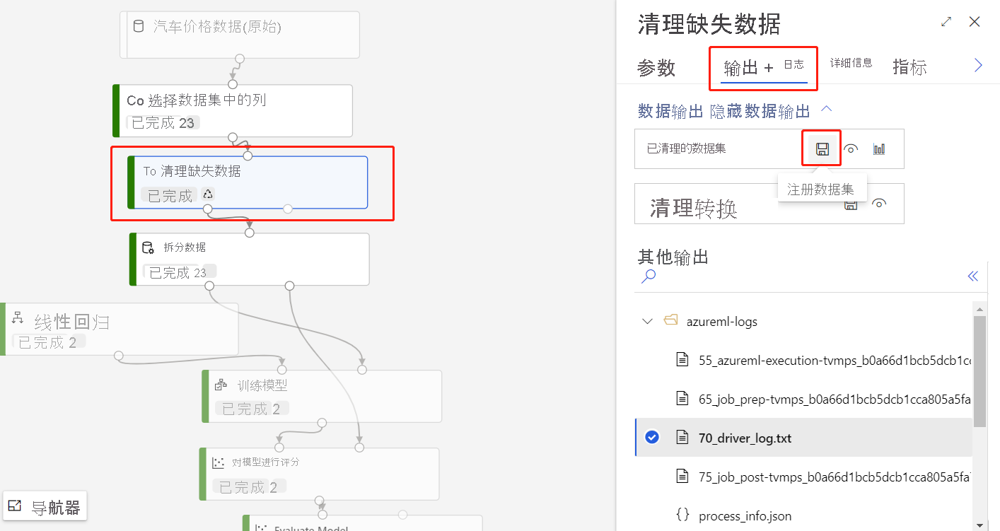
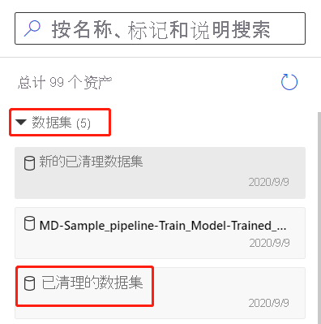

# 将数据导入 Azure 机器学习设计器（预览版）

在本文中，您将了解如何在设计器中导入自己的数据以创建自定义解决方案。 有两种方法可以将数据导入设计器： 

* **Azure 机器学习数据集**- 在 Azure 机器学习中注册[数据集](concept-data.md#datasets)，以启用可帮助您管理数据的高级功能。
* **导入数据模块**- 使用[导入数据](algorithm-module-reference/import-data.md)模块直接从联机数据源访问数据。

## 使用 Azure 机器学习数据集

我们建议您使用[数据集](concept-data.md#datasets)将数据导入设计器。 注册数据集时，可以充分利用高级数据功能，如[版本控制、跟踪](how-to-version-track-datasets.md)和[数据监视](how-to-monitor-datasets.md)。

### 注册数据集

您可以[通过 SDK 或](how-to-create-register-datasets.md#use-the-sdk)在 Azure[机器学习工作室直观地](how-to-create-register-datasets.md#use-the-ui)注册现有数据集。

您还可以将任何设计器模块的输出注册为数据集。

1. 选择输出要注册数据的模块。

1. 在属性窗格中，选择 **"输出** > **注册"数据集**。

    

### 使用数据集

可以在"**数据集** > **我的数据集**"下，在模块调色板中找到已注册的数据集。 要使用数据集，请将其拖放到管道画布上。 然后，将数据集的输出端口连接到调色板中的其他模块。

> [!NOTE]
> 设计器目前仅支持处理[表格数据集](how-to-create-register-datasets.md#dataset-types)。 如果要使用[文件数据集](how-to-create-register-datasets.md#dataset-types)，请使用适用于 Python 和 R 的 Azure 机器学习 SDK。

## 使用导入数据模块导入数据

虽然我们建议您使用数据集导入数据，但也可以使用["导入数据"](algorithm-module-reference/import-data.md)模块。 导入数据模块跳过在 Azure 机器学习中注册数据集，并直接从[数据存储](concept-data.md#datastores)或 HTTP URL 导入数据。

有关如何使用导入数据模块的详细信息，请参阅[导入数据参考页](algorithm-module-reference/import-data.md)。

> [!NOTE]
> 如果数据集的列太多，则可能会遇到以下错误："由于大小限制，验证失败"。 为了避免这种情况，[请在数据集界面中注册数据集](how-to-create-register-datasets.md#use-the-ui)。

## 支持的来源

本节列出设计器支持的数据源。 数据从数据存储或[表格数据集](how-to-create-register-datasets.md#dataset-types)进入设计器。

### 数据存储源
有关受支持的数据存储源的列表，请参阅[Azure 存储服务中的访问数据](how-to-access-data.md#supported-data-storage-service-types)。

### 表格数据集源

设计器支持从以下源创建的表格数据集：
 * 带分隔符的文件
 * JSON 文件
 * Parquet 文件
 * SQL 查询

## 数据类型

设计人员内部识别以下数据类型：

* String
* Integer
* Decimal
* Boolean
* Date

设计器使用内部数据类型在模块之间传递数据。 您可以使用["转换为数据集"](algorithm-module-reference/convert-to-dataset.md)模块显式将数据转换为数据表格式。 任何接受内部格式以外的格式的模块都将在将数据传递给下一个模块之前静默转换数据。

## 数据约束

设计器中的模块受计算目标大小的限制。 对于较大的数据集，应使用较大的 Azure 机器学习计算资源。 有关 Azure 机器学习计算的详细信息，请参阅[Azure 机器学习中的计算目标是什么？](concept-compute-target.md#azure-machine-learning-compute-managed)

## 后续步骤

通过教程了解设计师的基础知识[：与设计师一起预测汽车价格](tutorial-designer-automobile-price-train-score.md)。
