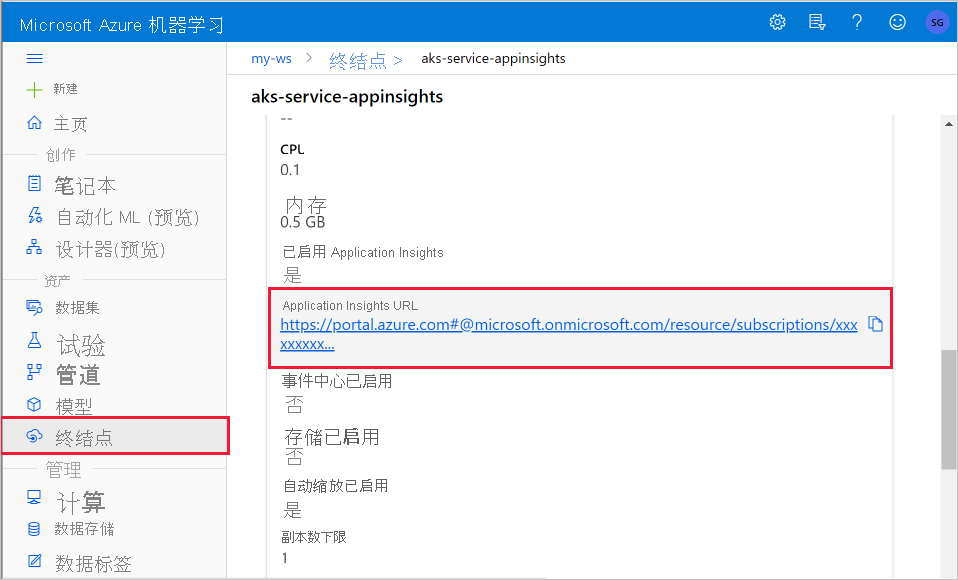

# <a name="monitor-and-collect-data-from-ml-web-service-endpoints"></a>监视机器学习 Web 服务终结点以及从中收集数据
[!INCLUDE [applies-to-skus](../../includes/aml-applies-to-basic-enterprise-sku.md)]

本文介绍如何在 Azure Kubernetes Service (AKS) 或 Azure 容器)  (实例（通过通过查询日志和启用 Azure 应用程序 Insights）中收集和监视部署到 Azure Service 中 web 服务终结点的模型： 
* [Azure 机器学习 Python SDK](#python)
* [Azure 机器学习工作室](#studio) (https://ml.azure.com )

除了收集终结点的输出数据和响应之外，还可以监视：

* 请求速率、响应时间和失败率
* 依赖项速率、响应时间和失败率
* 异常

[详细了解 Azure Application Insights](../azure-monitor/app/app-insights-overview.md)。 


## <a name="prerequisites"></a>先决条件

* 如果没有 Azure 订阅，请在开始操作前先创建一个免费帐户。 立即试用 [Azure 机器学习的免费版或付费版](https://aka.ms/AMLFree)

* 已安装 Azure 机器学习工作区、一个包含脚本的本地目录以及用于 Python 的 Azure 机器学习 SDK。 若要了解如何满足这些先决条件，请参阅[如何配置开发环境](how-to-configure-environment.md)

* 要部署到 Azure Kubernetes 服务 (AKS) 或 Azure 容器实例 (ACI) 的经过训练的机器学习模型。 如果没有模型，请参阅[训练图像分类模型](tutorial-train-models-with-aml.md)教程

## <a name="query-logs-for-deployed-models"></a>已部署模型的查询日志

若要从以前部署的 Web 服务检索日志，请加载该服务并使用 `get_logs()` 函数。 日志可以包含有关部署期间发生的任何错误的详细信息。

```python
from azureml.core.webservice import Webservice

# load existing web service
service = Webservice(name="service-name", workspace=ws)
logs = service.get_logs()
```

## <a name="web-service-metadata-and-response-data"></a>Web 服务元数据和响应数据

> [!IMPORTANT]
> Azure Application Insights 仅记录最多 64kb 的有效负载。 如果达到此限制，可能会出现内存不足或未记录任何信息等错误。

若要将请求的信息记录到 Web 服务，请将 `print` 语句添加到 score.py 文件。 每个 `print` 语句都会在 Application Insights 的跟踪表中的消息 `STDOUT` 下生成一个条目。 `print` 语句的内容将依次包含在跟踪表的 `customDimensions` 和 `Contents` 下。 如果打印 JSON 字符串，它会在 `Contents` 下的跟踪输出中生成分层数据结构。

你可以直接查询 Azure Application Insights 来访问此数据，或者设置到存储帐户的[连续导出](https://docs.microsoft.com/azure/azure-monitor/app/export-telemetry)以保留更长时间或进一步进行处理。 然后，可以在 Azure 机器学习中使用模型数据来设置标签、重新训练、可解释性、数据分析或其他用途。 


<a name="python"></a>

## <a name="use-python-sdk-to-configure"></a>使用 Python SDK 进行配置 

### <a name="update-a-deployed-service"></a>更新已部署的服务

1. 在工作区中标识该服务。 `ws` 的值是工作区的名称

    ```python
    from azureml.core.webservice import Webservice
    aks_service= Webservice(ws, "my-service-name")
    ```
2. 更新服务并启用 Azure Application Insights

    ```python
    aks_service.update(enable_app_insights=True)
    ```

### <a name="log-custom-traces-in-your-service"></a>在服务中记录自定义跟踪

如果要记录自定义跟踪，请遵循[部署方式和部署位置](how-to-deploy-and-where.md)文档中适用于 AKS 或 ACI 的标准部署过程。 然后，使用以下步骤：

1. 若要在推理期间将数据发送到 Application Insights，请通过添加 print 语句来更新评分文件。 若要记录更复杂的信息（例如请求数据和响应），请使用 JSON 结构。 下面的示例 score.py 文件记录模型初始化的时间、推理期间的输入和输出以及发生任何错误的时间：

    > [!IMPORTANT]
    > Azure Application Insights 仅记录最多 64kb 的有效负载。 如果达到此限制，则可能会出现诸如内存不足或不会记录任何信息之类的错误。 如果要记录的数据大于 64kb，应使用[为生产环境中的模型收集数据](how-to-enable-data-collection.md)中的信息，将其存储到 Blob 存储中。
    
    ```python
    import pickle
    import json
    import numpy 
    from sklearn.externals import joblib
    from sklearn.linear_model import Ridge
    from azureml.core.model import Model
    import time

    def init():
        global model
        #Print statement for appinsights custom traces:
        print ("model initialized" + time.strftime("%H:%M:%S"))
        
        # note here "sklearn_regression_model.pkl" is the name of the model registered under the workspace
        # this call should return the path to the model.pkl file on the local disk.
        model_path = Model.get_model_path(model_name = 'sklearn_regression_model.pkl')
        
        # deserialize the model file back into a sklearn model
        model = joblib.load(model_path)
    

    # note you can pass in multiple rows for scoring
    def run(raw_data):
        try:
            data = json.loads(raw_data)['data']
            data = numpy.array(data)
            result = model.predict(data)
            # Log the input and output data to appinsights:
            info = {
                "input": raw_data,
                "output": result.tolist()
                }
            print(json.dumps(info))
            # you can return any datatype as long as it is JSON-serializable
            return result.tolist()
        except Exception as e:
            error = str(e)
            print (error + time.strftime("%H:%M:%S"))
            return error
    ```

2. 更新服务配置
    
    ```python
    config = Webservice.deploy_configuration(enable_app_insights=True)
    ```

3. 生成一个映像并将它部署到 [AKS 或 ACI](how-to-deploy-and-where.md) 上。

有关日志记录和数据收集的详细信息，请参阅在生产中[Azure 机器学习启用日志记录](how-to-enable-logging.md)和[从模型收集数据](how-to-enable-data-collection.md)。

### <a name="disable-tracking-in-python"></a>在 Python 中禁用跟踪

若要禁用 Azure Application Insights，请使用以下代码：

```python 
## replace <service_name> with the name of the web service
<service_name>.update(enable_app_insights=False)
```

<a name="studio"></a>

## <a name="use-azure-machine-learning-studio-to-configure"></a>使用 Azure 机器学习工作室配置

当你准备好按照以下步骤部署模型时，还可以从 Azure 机器学习工作室启用 Azure Application Insights。

1. 登录到你的工作区 (https://ml.azure.com/ )
1. 转到“模型”并选择要部署的模型
1. 选择“+部署”
1. 填充“部署模型”窗体
1. 展开“高级”菜单

    
1. 选择“启用 Application Insights 诊断和数据收集”

    

## <a name="view-metrics-and-logs"></a>查看指标和日志

服务的数据将存储在 Azure Application Insights 帐户中，此帐户与 Azure 机器学习位于同一资源组。
查看数据：

1. 在[工作室](https://ml.azure.com/)中中转到 Azure 机器学习工作区。
1. 选择“终结点”。
1. 选择已部署的服务。
1. 向下滚动以查找**Application Insights url**并选择链接。

    [](././media/how-to-enable-app-insights/appinsightsloc.png#lightbox)

1. 在 Application Insights 中，从左侧列表中的 "**概述**" 选项卡或 "__监视__" 部分，选择 "__日志__"。

    [](./media/how-to-enable-app-insights/overview.png#lightbox)

1. 若要查看从 score.py 文件记录的信息，请查看跟踪表。 以下查询搜索记录了输入值的日志：

    ```kusto
    traces
    | where customDimensions contains "input"
    | limit 10
    ```

   [](././media/how-to-enable-app-insights/model-data-trace.png#lightbox)

若要详细了解如何使用 Azure Application Insights，请参阅[什么是 Application Insights？](../azure-monitor/app/app-insights-overview.md)。

## <a name="export-data-for-further-processing-and-longer-retention"></a>导出数据以便进一步处理并保留更长时间

>[!Important]
> Azure Application Insights 仅支持导出到 Blob 存储。 [从 App Insights 中导出遥测数据](https://docs.microsoft.com/azure/azure-monitor/app/export-telemetry#continuous-export-advanced-storage-configuration)列出了此导出功能的其他限制。

可以使用 Azure Application Insights 的[连续导出](https://docs.microsoft.com/azure/azure-monitor/app/export-telemetry)将消息发送到受支持的存储帐户，可以在其中设置更长的保留期。 数据以 JSON 格式存储，可以轻松对其进行分析来提取模型数据。 

可以根据需要使用 Azure 数据工厂、Azure ML Pipelines 或其他数据处理工具来转换数据。 转换数据后，可以在 Azure 机器学习工作区中将其注册为数据集。 若要执行此操作，请参阅[如何创建和注册数据集](how-to-create-register-datasets.md)。

:::image type="content" source="media/how-to-enable-app-insights/continuous-export-setup.png" alt-text="连续导出":::


## <a name="example-notebook"></a>示例笔记本

[enable-app-insights-in-production-service.ipynb](https://github.com/Azure/MachineLearningNotebooks/blob/master/how-to-use-azureml/deployment/enable-app-insights-in-production-service/enable-app-insights-in-production-service.ipynb) 笔记本演示了本文所述的概念。 
 
[!INCLUDE [aml-clone-in-azure-notebook](../../includes/aml-clone-for-examples.md)]

## <a name="next-steps"></a>后续步骤

* 参阅[如何将模型部署到 Azure Kubernetes 服务群集](https://docs.microsoft.com/azure/machine-learning/how-to-deploy-azure-kubernetes-service)或[如何将模型部署到 Azure 容器实例](https://docs.microsoft.com/azure/machine-learning/how-to-deploy-azure-container-instance)来将模型部署到 Web 服务终结点，并启用 Azure Application Insights 来利用数据收集和终结点监视
* 参阅 [MLOps：使用 Azure 机器学习管理、部署和监视模型](https://docs.microsoft.com/azure/machine-learning/concept-model-management-and-deployment)，详细了解在生产中利用从模型收集的数据。 此类数据有助于持续改进你的机器学习流程
