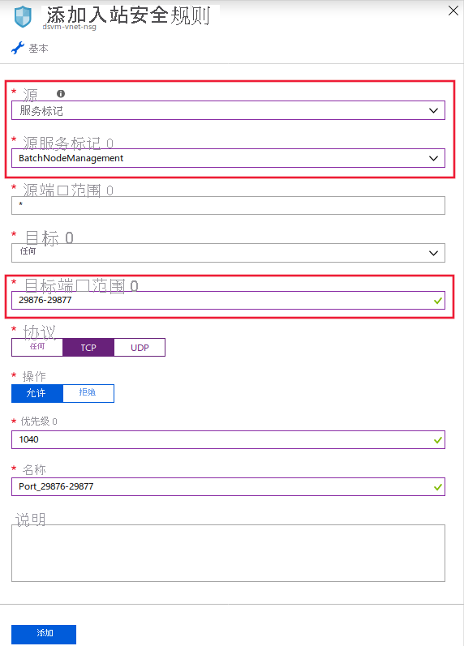
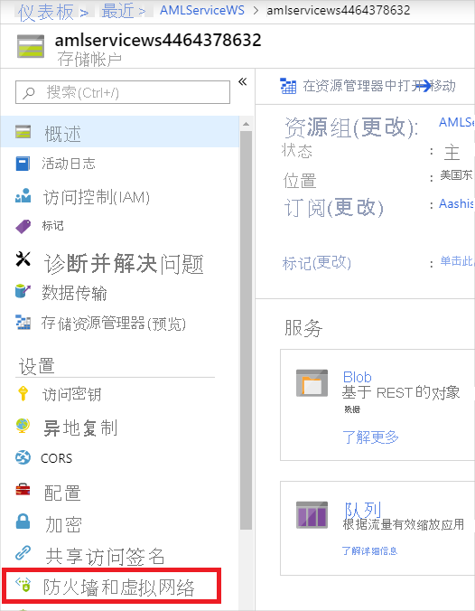

# <a name="secure-your-machine-learning-lifecycles-with-private-virtual-networks"></a>使用专用虚拟网络保护机器学习生命周期
[!INCLUDE [applies-to-skus](../../includes/aml-applies-to-basic-enterprise-sku.md)]

在本文中，你将了解如何在 Azure 虚拟网络 (VNet) 中隔离 Azure 机器学习中的试验/训练作业和推理/评分作业。 你还将了解一些高级安全设置，这些信息对于基本或试验用例来说不是必需的。

> [!WARNING]
> 如果基础存储位于虚拟网络中，用户将无法使用 Azure 机器学习工作室 Web 体验，具体包括：
> - 拖放设计器
> - 用于自动化机器学习的 UI
> - 用于数据标签的 UI
> - 用于数据集的 UI
> - 笔记本
> 
> 如果你尝试，则会看到类似于以下错误的消息：`__Error: Unable to profile this dataset. This might be because your data is stored behind a virtual network or your data does not support profile.__`

## <a name="what-is-a-vnet"></a>什么是 VNet？

虚拟网络起到安全边界的作用，将你的 Azure 资源与公共 Internet 隔离开来。 你也可以将 Azure 虚拟网络加入本地网络。 通过联接网络，可以安全地训练模型，并访问已部署的模型来进行推理。

Azure 机器学习依赖其他 Azure 服务，以便计算资源（亦称为[“计算目标”](concept-compute-target.md)）可以训练和部署模型。 可以在虚拟网络中创建这些目标。 例如，可以使用 Azure 机器学习计算来训练模型，然后将模型部署到 Azure Kubernetes 服务 (AKS)。 


## <a name="prerequisites"></a>先决条件

+ Azure 机器学习[工作区](how-to-manage-workspace.md)。

+ 掌握 [Azure 虚拟网络服务](https://docs.microsoft.com/azure/virtual-network/virtual-networks-overview)和 [IP 网络](https://docs.microsoft.com/azure/virtual-network/virtual-network-ip-addresses-overview-arm)的一般应用知识。

+ 用于计算资源的预先存在的虚拟网络和子网。

## <a name="private-endpoints"></a>专用终结点

还可以[启用 Azure 专用链接](how-to-configure-private-link.md)，以使用专用终结点连接到工作区。 专用终结点是虚拟网络中的一组专用 IP 地址。 [了解如何设置此专用终结点](how-to-configure-private-link.md)。


> [!TIP]
> 可以结合使用虚拟网络和专用链接，以保护你的工作区和其他 Azure 资源之间的通信。 不过，有些组合需要 Enterprise Edition 工作区。 若要了解哪些方案需要 Enterprise Edition，请参阅下表：
>
> | 场景 | Enterprise</br>edition | 基本</br>edition |
> | ----- |:-----:|:-----:| 
> | 无虚拟网络或专用链接 | ✔ | ✔ |
> | 无专用链接的工作区。 虚拟网络中的其他资源（Azure 容器注册表除外） | ✔ | ✔ |
> | 无专用链接的工作区。 有专用链接的其他资源 | ✔ | |
> | 有专用链接的工作区。 虚拟网络中的其他资源（Azure 容器注册表除外） | ✔ | ✔ |
> | 有专用链接的工作区和其他任何资源 | ✔ | |
> | 有专用链接的工作区。 无专用链接或虚拟网络的其他资源 | ✔ | ✔ |
> | 虚拟网络中的 Azure 容器注册表 | ✔ | |
> | 工作区的客户托管密钥 | ✔ | |
> 

> [!WARNING]
> 在已启用专用链接的工作区中，不支持 Azure 机器学习计算实例预览。
> 
> Azure 机器学习不支持使用已启用专用链接的 Azure Kubernetes 服务。 相反，可以在虚拟网络中使用 Azure Kubernetes 服务。 有关详细信息，请参阅[在 Azure 虚拟网络中保护 Azure ML 试验和推理作业](how-to-enable-virtual-network.md)。


<a id="amlcompute"></a>

## <a name="compute-clusters--instances"></a><a name="compute-instance"></a>计算群集和实例

若要在虚拟网络中使用[托管 Azure 机器学习计算目标](concept-compute-target.md#azure-machine-learning-compute-managed)或 [Azure 机器学习计算实例](concept-compute-instance.md)，必须满足以下网络要求：

> [!div class="checklist"]
> * 虚拟网络必须与 Azure 机器学习工作区位于同一订阅和区域中。
> * 为计算实例或群集指定的子网必须有足够的未分配 IP 地址来容纳目标 VM 数。 如果子网没有足够的未分配 IP 地址，只会部分分配计算群集。
> * 检查虚拟网络的订阅或资源组上的安全策略或锁是否限制管理虚拟网络的权限。 如果你打算通过限制流量来保护虚拟网络，请为计算服务保留一些打开的端口。 有关详细信息，请参阅[所需的端口](#mlcports)部分。
> * 若要将多个计算实例或群集置于一个虚拟网络中，可能需要请求为一个或多个资源增加配额。
> * 如果工作区的一个或多个 Azure 存储帐户也在虚拟网络中受保护，它们必须与 Azure 机器学习计算实例或群集位于同一虚拟网络中。 
> * 为了让计算实例 Jupyter 功能可以正常运行，请确保没有禁用 Web 套接字通信。

> [!TIP]
> 机器学习计算实例或群集自动在包含虚拟网络的资源组中分配更多网络资源。 对于每个计算实例或群集，此服务分配以下资源：
> 
> * 一个网络安全组
> * 一个公共 IP 地址
> * 一个负载均衡器
> 
> 对于群集，每当群集纵向缩减为 0 个节点时，这些资源都会被删除（并重新创建）；但对于实例，这些资源会一直保留到实例完全删除（停止并不会删除资源）。 
> 这些资源受订阅的[资源配额](https://docs.microsoft.com/azure/azure-resource-manager/management/azure-subscription-service-limits)限制。


### <a name="required-ports"></a><a id="mlcports"></a>所需的端口

机器学习计算目前使用 Azure Batch 服务在指定的虚拟网络中预配 VM。 子网必须允许来自 Batch 服务的入站通信。 使用这种通信，可以计划机器学习计算节点上的运行，并能与 Azure 存储和其他资源进行通信。 Batch 服务在附加到 VM 的网络接口 (NIC) 级别添加网络安全组 (NSG)。 这些 NSG 自动配置允许以下流量的入站和出站规则：

- 端口 29876 和 29877 上来自服务标记 BatchNodeManagement 的入站 TCP 流量。

    

- （可选）端口 22 上的入站 TCP 流量，以允许远程访问。 只有要在公共 IP 上使用 SSH 进行连接时，才使用此端口。

- 任何端口上通往虚拟网络的出站流量。

- 任何端口上通往 Internet 的出站流量。

- 对于计算实例，端口 44224 上来自服务标记 AzureMachineLearning 的入站 TCP 流量。

在 Batch 配置的 NSG 中修改或添加入站或出站规则时，请务必小心。 如果 NSG 阻止与计算节点通信，那么计算服务会将计算节点的状态设置为“不可用”。

你不需要在子网级别指定 NSG，因为 Azure Batch 服务会配置它自己的 NSG。 不过，如果指定的子网有关联的 NSG 或防火墙，请按照前面所述来配置入站和出站安全规则。

下面两个图展示了 Azure 门户中的 NSG 规则配置：

:::image type="content" source="./media/how-to-enable-virtual-network/amlcompute-virtual-network-inbound.png" alt-text="用于机器学习计算的入站 NSG 规则" border="true":::


### <a name="limit-outbound-connectivity-from-the-virtual-network"></a><a id="limiting-outbound-from-vnet"></a> 限制来自虚拟网络的出站连接

如果不想使用默认出站规则，而是要限制虚拟网络的出站访问，请按照以下步骤操作：

- 使用 NSG 规则来拒绝出站 Internet 连接。

- 对于计算实例或计算群集，限制为出站流量只能流向以下项：
   - Azure 存储，通过使用服务标记 Storage.RegionName。 其中 `{RegionName}` 是 Azure 区域名称。
   - Azure 容器注册表，通过使用服务标记 AzureContainerRegistry.RegionName。 其中 `{RegionName}` 是 Azure 区域名称。
   - Azure 机器学习，通过使用服务标记 AzureMachineLearning
   - Azure 资源管理器，通过使用服务标记 AzureResourceManager
   - Azure Active Directory，通过使用服务标记 AzureActiveDirectory

下图展示了 Azure 门户中的 NSG 规则配置：

[](./media/how-to-enable-virtual-network/limited-outbound-nsg-exp.png#lightbox)

> [!NOTE]
> 如果你打算使用 Microsoft 提供的默认 Docker 映像，并启用用户托管的依赖项，那么还必须使用服务标记 MicrosoftContainerRegistry.Region_Name（例如，MicrosoftContainerRegistry.EastUS）。
>
> 如果训练脚本中有类似于以下代码片段的代码，就需要此配置：
>
> __RunConfig 训练__
> ```python
> # create a new runconfig object
> run_config = RunConfiguration()
> 
> # configure Docker 
> run_config.environment.docker.enabled = True
> # For GPU, use DEFAULT_GPU_IMAGE
> run_config.environment.docker.base_image = DEFAULT_CPU_IMAGE 
> run_config.environment.python.user_managed_dependencies = True
> ```
>
> __估算器训练__
> ```python
> est = Estimator(source_directory='.',
>                 script_params=script_params,
>                 compute_target='local',
>                 entry_script='dummy_train.py',
>                 user_managed=True)
> run = exp.submit(est)
> ```

### <a name="user-defined-routes-for-forced-tunneling"></a>用户定义的用于强制隧道的路由

若要结合使用强制隧道和机器学习计算，请将[用户定义的路由 (UDR)](https://docs.microsoft.com/azure/virtual-network/virtual-networks-udr-overview) 添加到包含计算资源的子网。

* 为 Azure Batch 服务在资源所在区域中使用的每个 IP 地址建立 UDR。 借助这些 UDR，Batch 服务可以与计算节点进行通信，以便进行任务计划编制。 还要添加资源所在的 Azure 机器学习服务 IP 地址，因为这是访问计算实例所必需的。 若要获取 Batch 服务和 Azure 机器学习服务的 IP 地址列表，请使用以下方法之一：

    * 下载 [Azure IP 范围和服务标记](https://www.microsoft.com/download/details.aspx?id=56519)，并在文件中搜索 `BatchNodeManagement.<region>` 和 `AzureMachineLearning.<region>`（其中 `<region>` 是你的 Azure 区域）。

    * 使用 [Azure CLI](https://docs.microsoft.com/cli/azure/install-azure-cli?view=azure-cli-latest) 来下载信息。 下面的示例下载 IP 地址信息，并筛选掉美国东部 2 区域的信息：

        ```azurecli-interactive
        az network list-service-tags -l "East US 2" --query "values[?starts_with(id, 'Batch')] | [?properties.region=='eastus2']"
        az network list-service-tags -l "East US 2" --query "values[?starts_with(id, 'AzureMachineLearning')] | [?properties.region=='eastus2']"
        ```

* 流向 Azure 存储的出站流量不得被本地网络设备阻止。 具体而言，URL 的格式为 `<account>.table.core.windows.net`、`<account>.queue.core.windows.net` 和 `<account>.blob.core.windows.net`。

添加 UDR 时，为每个相关 Batch IP 地址前缀定义路由，并将“下一个跃点类型”设置为“Internet”。 下图展示了 Azure 门户中的此 UDR 示例：


有关详细信息，请参阅[在虚拟网络中创建 Azure Batch 池](../batch/batch-virtual-network.md#user-defined-routes-for-forced-tunneling)。

### <a name="create-a-compute-cluster-in-a-virtual-network"></a>在虚拟网络中创建计算群集

若要创建机器学习计算群集，请按照以下步骤操作：

1. 登录 [Azure 机器学习工作室](https://ml.azure.com/)，然后选择你的订阅和工作区。

1. 选择左侧的“计算”。

1. 在中心内选择“训练群集”，然后选择“+”。

1. 在“新建训练群集”对话框中，展开“高级设置”部分。

1. 若要将此计算资源配置为使用虚拟网络，请在“配置虚拟网络”部分中执行以下操作：

    1. 在“资源组”下拉列表中，选择包含虚拟网络的资源组。
    1. 在“虚拟网络”下拉列表中，选择包含子网的虚拟网络。
    1. 在“子网”下拉列表中，选择要使用的子网。

   

也可以使用 Azure 机器学习 SDK 创建机器学习计算群集。 以下代码在名为 `mynetwork` 的虚拟网络的 `default` 子网中创建新的机器学习计算群集：

```python
from azureml.core.compute import ComputeTarget, AmlCompute
from azureml.core.compute_target import ComputeTargetException

# The Azure virtual network name, subnet, and resource group
vnet_name = 'mynetwork'
subnet_name = 'default'
vnet_resourcegroup_name = 'mygroup'

# Choose a name for your CPU cluster
cpu_cluster_name = "cpucluster"

# Verify that cluster does not exist already
try:
    cpu_cluster = ComputeTarget(workspace=ws, name=cpu_cluster_name)
    print("Found existing cpucluster")
except ComputeTargetException:
    print("Creating new cpucluster")

    # Specify the configuration for the new cluster
    compute_config = AmlCompute.provisioning_configuration(vm_size="STANDARD_D2_V2",
                                                           min_nodes=0,
                                                           max_nodes=4,
                                                           vnet_resourcegroup_name=vnet_resourcegroup_name,
                                                           vnet_name=vnet_name,
                                                           subnet_name=subnet_name)

    # Create the cluster with the specified name and configuration
    cpu_cluster = ComputeTarget.create(ws, cpu_cluster_name, compute_config)

    # Wait for the cluster to be completed, show the output log
    cpu_cluster.wait_for_completion(show_output=True)
```

创建过程完成后，通过在试验中使用群集来训练模型。 有关详细信息，请参阅[选择并使用用于训练的计算目标](how-to-set-up-training-targets.md)。

## <a name="use-a-storage-account-for-your-workspace"></a>使用工作区的存储帐户

若要在虚拟网络中使用工作区的 Azure 存储帐户，请按照以下步骤操作：

1. 在虚拟网络后面创建计算资源（例如，机器学习计算实例或群集），或将计算资源附加到工作区（例如，HDInsight 群集、虚拟机或 Azure Kubernetes 服务群集）。 计算资源可用于试验或模型部署。

   有关详细信息，请参阅本文中的[使用机器学习计算](#amlcompute)、[使用虚拟机或 HDInsight 群集](#vmorhdi)和[使用 Azure Kubernetes 服务](#aksvnet)部分。

1. 在 Azure 门户中，转到附加到工作区的存储。

   [](./media/how-to-enable-virtual-network/workspace-storage.png#lightbox)

1. 在“Azure 存储”页上，选择“防火墙和虚拟网络”。

   

1. 在“防火墙和虚拟网络”页上，执行以下操作：
    - 选择“所选网络”。
    - 在“虚拟网络”下，选择“添加现有虚拟网络”链接。 此操作会添加计算所在的虚拟网络（见第 1 步）。

        > [!IMPORTANT]
        > 存储帐户必须与用于训练或推理的计算实例或群集位于同一虚拟网络和子网中。

    - 选中“允许受信任的 Microsoft 服务访问此存储帐户”复选框。

    > [!IMPORTANT]
    > 使用 Azure 机器学习 SDK 时，开发环境必须能够连接到 Azure 存储帐户。 当存储帐户位于虚拟网络中时，防火墙必须允许从开发环境的 IP 地址进行访问。
    >
    > 若要启用对存储帐户的访问，请在开发客户端的 Web 浏览器中访问存储帐户的“防火墙和虚拟网络”。 然后，使用“添加客户端 IP 地址”复选框将客户端的 IP 地址添加到“地址范围”。 也可以使用“地址范围”字段手动输入开发环境的 IP 地址。 在客户端的 IP 地址已添加后，它就可以使用 SDK 访问存储帐户了。

   [](./media/how-to-enable-virtual-network/storage-firewalls-and-virtual-networks-page.png#lightbox)

> [!IMPORTANT]
> 可以将用于 Azure 机器学习的默认存储帐户和/或非默认存储帐户置于虚拟网络中。
>
> 默认存储帐户是在你创建工作区时自动预配的。
>
> 对于非默认存储帐户，使用 [`Workspace.create()` 函数](https://docs.microsoft.com/python/api/azureml-core/azureml.core.workspace(class)?view=azure-ml-py#create-name--auth-none--subscription-id-none--resource-group-none--location-none--create-resource-group-true--sku--basic---friendly-name-none--storage-account-none--key-vault-none--app-insights-none--container-registry-none--cmk-keyvault-none--resource-cmk-uri-none--hbi-workspace-false--default-cpu-compute-target-none--default-gpu-compute-target-none--exist-ok-false--show-output-true-)中的 `storage_account` 参数，可以按 Azure 资源 ID 指定自定义存储帐户。


<a id="aksvnet"></a>

## <a name="azure-kubernetes-service"></a>Azure Kubernetes 服务

若要将虚拟网络中的 Azure Kubernetes 服务 (AKS) 添加到工作区，请按照以下步骤操作：

> [!IMPORTANT]
> 在开始以下过程之前，请先完成[在 Azure Kubernetes 服务 (AKS) 中配置高级网络](https://docs.microsoft.com/azure/aks/configure-azure-cni#prerequisites)操作指南中的先决条件，并计划群集的 IP 地址。
>
> AKS 实例和 Azure 虚拟网络必须位于同一区域中。 如果你在虚拟网络中保护工作区使用的一个或多个 Azure 存储帐户，它们必须与 AKS 实例位于同一虚拟网络中。

> [!WARNING]
> Azure 机器学习不支持使用已启用专用链接的 Azure Kubernetes 服务。

1. 登录 [Azure 机器学习工作室](https://ml.azure.com/)，然后选择你的订阅和工作区。

1. 选择左侧的“计算”。

1. 在中心内选择“推理群集”，然后选择“+”。

1. 在“新建推理群集”对话框中，选择“网络配置”下的“高级”。

1. 若要将此计算资源配置为使用虚拟网络，请执行以下操作：

    1. 在“资源组”下拉列表中，选择包含虚拟网络的资源组。
    1. 在“虚拟网络”下拉列表中，选择包含子网的虚拟网络。
    1. 在“子网”下拉列表中，选择子网。
    1. 在“Kubernetes 服务地址范围”框中，输入 Kubernetes 服务地址范围。 此地址范围使用采用无类别域间路由 (CIDR) 表示法的 IP 范围来定义可用于群集的 IP 地址。 它不得与任何子网 IP 范围重叠（例如，10.0.0.0/16）。
    1. 在“Kubernetes DNS 服务 IP 地址”框中，输入 Kubernetes DNS 服务 IP 地址。 此 IP 地址将分配给 Kubernetes DNS 服务。 它必须在 Kubernetes 服务地址范围内（例如，10.0.0.10）。
    1. 在“Docker 桥地址”框中，输入 Docker 桥地址。 此 IP 地址将分配给 Docker 网桥。 它不得在任何子网 IP 范围内或在 Kubernetes 服务地址范围内（例如，172.17.0.1/16）。

   

1. 确保控制虚拟网络的 NSG 组已为评分终结点启用了入站安全规则，以便可以从虚拟网络外部调用它。
   > [!IMPORTANT]
   > 保留 NSG 的默认出站规则。 有关详细信息，请参阅[安全组](https://docs.microsoft.com/azure/virtual-network/security-overview#default-security-rules)中的“默认安全规则”。

   [](./media/how-to-enable-virtual-network/aks-vnet-inbound-nsg-scoring.png#lightbox)

也可以使用 Azure 机器学习 SDK 在虚拟网络中添加 Azure Kubernetes 服务。 如果虚拟网络中已有 AKS 群集，请将它附加到工作区，如[如何部署到 AKS](how-to-deploy-and-where.md) 中所述。 以下代码在名为 `mynetwork` 的虚拟网络的 `default` 子网中新建 AKS 实例：

```python
from azureml.core.compute import ComputeTarget, AksCompute

# Create the compute configuration and set virtual network information
config = AksCompute.provisioning_configuration(location="eastus2")
config.vnet_resourcegroup_name = "mygroup"
config.vnet_name = "mynetwork"
config.subnet_name = "default"
config.service_cidr = "10.0.0.0/16"
config.dns_service_ip = "10.0.0.10"
config.docker_bridge_cidr = "172.17.0.1/16"

# Create the compute target
aks_target = ComputeTarget.create(workspace=ws,
                                  name="myaks",
                                  provisioning_configuration=config)
```

创建过程完成后，可以在虚拟网络后面的 AKS 群集上运行推理或模型评分。 有关详细信息，请参阅[如何部署 AKS](how-to-deploy-and-where.md)。

### <a name="use-private-ips-with-azure-kubernetes-service"></a>结合使用专用 IP 和 Azure Kubernetes 服务

默认情况下，公共 IP 地址分配给 AKS 部署。 在虚拟网络中使用 AKS 时，可以改用专用 IP 地址。 只能从虚拟网络或已联接的网络内部访问专用 IP 地址。

启用专用 IP 地址的方法为，将 AKS 配置为使用内部负载均衡器。 

> [!IMPORTANT]
> 无法在创建 Azure Kubernetes 服务群集时启用专用 IP。 必须将它作为对现有群集的更新来启用。

以下代码片段展示了如何新建 AKS 群集，然后将它更新为使用专用 IP/内部负载均衡器：

```python
import azureml.core
from azureml.core.compute.aks import AksUpdateConfiguration
from azureml.core.compute import AksCompute, ComputeTarget

# Verify that cluster does not exist already
try:
    aks_target = AksCompute(workspace=ws, name=aks_cluster_name)
    print("Found existing aks cluster")

except:
    print("Creating new aks cluster")

    # Subnet to use for AKS
    subnet_name = "default"
    # Create AKS configuration
    prov_config = AksCompute.provisioning_configuration(location = "eastus2")
    # Set info for existing virtual network to create the cluster in
    prov_config.vnet_resourcegroup_name = "myvnetresourcegroup"
    prov_config.vnet_name = "myvnetname"
    prov_config.service_cidr = "10.0.0.0/16"
    prov_config.dns_service_ip = "10.0.0.10"
    prov_config.subnet_name = subnet_name
    prov_config.docker_bridge_cidr = "172.17.0.1/16"

    # Create compute target
    aks_target = ComputeTarget.create(workspace = ws, name = "myaks", provisioning_configuration = prov_config)
    # Wait for the operation to complete
    aks_target.wait_for_completion(show_output = True)
    
    # Update AKS configuration to use an internal load balancer
    update_config = AksUpdateConfiguration(None, "InternalLoadBalancer", subnet_name)
    aks_target.update(update_config)
    # Wait for the operation to complete
    aks_target.wait_for_completion(show_output = True)
```

__Azure CLI__

```azurecli-interactive
az rest --method put --uri https://management.azure.com/subscriptions/<subscription-id>/resourceGroups/<resource-group>/providers/Microsoft.MachineLearningServices/workspaces/<workspace>/computes/<compute>?api-version=2018-11-19 --body @body.json
```

命令引用的 `body.json` 文件的内容类似于以下 JSON 文档：

```json
{ 
    "location": "<region>", 
    "properties": { 
        "resourceId": "/subscriptions/<subscription-id>/resourcegroups/<resource-group>/providers/Microsoft.ContainerService/managedClusters/<aks-resource-name>", 
        "computeType": "AKS", 
        "provisioningState": "Succeeded", 
        "properties": { 
            "loadBalancerType": "InternalLoadBalancer", 
            "agentCount": <agent-count>, 
            "agentVmSize": "vm-size", 
            "clusterFqdn": "<cluster-fqdn>" 
        } 
    } 
} 
```

> [!NOTE]
> 目前，无法在现有群集上执行附加操作时配置负载均衡器。 必须先附加群集，再执行更新操作来更改负载均衡器。

若要详细了解如何结合使用内部负载均衡器与 AKS，请参阅[结合使用内部负载均衡器与 Azure Kubernetes 服务](/azure/aks/internal-lb)。

## <a name="use-azure-container-instances-aci"></a>使用 Azure 容器实例 (ACI)

Azure 容器实例在部署模型时动态创建。 你必须为部署使用的子网启用子网委派，Azure 机器学习才能在虚拟网络中创建 ACI。

若要将虚拟网络中的 ACI 用于工作区，请按照以下步骤操作：

1. 若要在虚拟网络上启用子网委派，请参阅[添加或删除子网委派](../virtual-network/manage-subnet-delegation.md)一文中的信息。 可以在创建虚拟网络时启用委派，也可以将它添加到现有网络。

    > [!IMPORTANT]
    > 启用委派时，使用 `Microsoft.ContainerInstance/containerGroups` 作为“将子网委派给服务”值。

2. 使用 [AciWebservice.deploy_configuration()](https://docs.microsoft.com/python/api/azureml-core/azureml.core.webservice.aci.aciwebservice?view=azure-ml-py#deploy-configuration-cpu-cores-none--memory-gb-none--tags-none--properties-none--description-none--location-none--auth-enabled-none--ssl-enabled-none--enable-app-insights-none--ssl-cert-pem-file-none--ssl-key-pem-file-none--ssl-cname-none--dns-name-label-none--primary-key-none--secondary-key-none--collect-model-data-none--cmk-vault-base-url-none--cmk-key-name-none--cmk-key-version-none--vnet-name-none--subnet-name-none-) 部署模型（使用 `vnet_name` 和 `subnet_name` 参数）。 将这些参数设置为启用了委派的虚拟网络名称和子网。

## <a name="azure-firewall"></a>Azure 防火墙

若要了解如何结合使用 Azure 机器学习和 Azure 防火墙，请参阅[在 Azure 防火墙后面使用 Azure 机器学习工作区](how-to-access-azureml-behind-firewall.md)。

## <a name="azure-container-registry"></a>Azure 容器注册表

> [!IMPORTANT]
> 可以将 Azure 容器注册表 (ACR) 置于虚拟网络中，但必须先满足以下先决条件：
>
> * Azure 机器学习工作区必须是 Enterprise Edition。 若要了解如何升级，请参阅[升级到 Enterprise Edition](how-to-manage-workspace.md#upgrade)。
> * Azure 容器注册表必须是高级版。 若要详细了解如何升级，请参阅[更改 SKU](/azure/container-registry/container-registry-skus#changing-skus)。
> * Azure 容器注册表必须与用于训练或推理的存储帐户和计算目标位于同一虚拟网络和子网中。
> * Azure 机器学习工作区必须包含 [Azure 机器学习计算群集](how-to-set-up-training-targets.md#amlcompute)。
>
>     如果 ACR 位于虚拟网络后面，Azure 机器学习无法使用它来直接生成 Docker 映像。 而是使用计算群集来生成映像。

1. 若要查找工作区的 Azure 容器注册表的名称，请使用以下方法之一：

    __Azure 门户__

    在工作区的“概述”部分中，“注册表”值链接到 Azure 容器注册表。

    :::image type="content" source="./media/how-to-enable-virtual-network/azure-machine-learning-container-registry.png" alt-text="工作区的 Azure 容器注册表" border="true":::

    __Azure CLI__

    如果[安装了用于 Azure CLI 的机器学习扩展](reference-azure-machine-learning-cli.md)，可以运行 `az ml workspace show` 命令来显示工作区信息。

    ```azurecli-interactive
    az ml workspace show -w yourworkspacename -g resourcegroupname --query 'containerRegistry'
    ```

    此命令会返回类似于 `"/subscriptions/{GUID}/resourceGroups/{resourcegroupname}/providers/Microsoft.ContainerRegistry/registries/{ACRname}"` 的值。 此字符串的最后一部分是工作区的 Azure 容器注册表的名称。

1. 若要限制对虚拟网络的访问，请按照[为注册表配置网络访问](../container-registry/container-registry-vnet.md#configure-network-access-for-registry)中的步骤操作。 添加虚拟网络时，为 Azure 机器学习资源选择虚拟网络和子网。

1. 使用 Azure 机器学习 Python SDK 将计算群集配置为生成 Docker 映像。 下面的代码片段展示了如何执行此操作：

    ```python
    from azureml.core import Workspace
    # Load workspace from an existing config file
    ws = Workspace.from_config()
    # Update the workspace to use an existing compute cluster
    ws.update(image_build_compute = 'mycomputecluster')
    ```

    > [!IMPORTANT]
    > 存储帐户、计算群集和 Azure 容器注册表必须都位于虚拟网络的同一子网中。
    
    有关详细信息，请参阅 [update()](https://docs.microsoft.com/python/api/azureml-core/azureml.core.workspace.workspace?view=azure-ml-py#update-friendly-name-none--description-none--tags-none--image-build-compute-none--enable-data-actions-none-) 方法参考。

1. 必须应用以下 Azure 资源管理器模板。 借助此模板，工作区可以与 ACR 进行通信。

    ```json
    {
    "$schema": "https://schema.management.azure.com/schemas/2015-01-01/deploymentTemplate.json#",
    "contentVersion": "1.0.0.0",
    "parameters": {
        "keyVaultArmId": {
        "type": "string"
        },
        "workspaceName": {
        "type": "string"
        },
        "containerRegistryArmId": {
        "type": "string"
        },
        "applicationInsightsArmId": {
        "type": "string"
        },
        "storageAccountArmId": {
        "type": "string"
        },
        "location": {
        "type": "string"
        }
    },
    "resources": [
        {
        "type": "Microsoft.MachineLearningServices/workspaces",
        "apiVersion": "2019-11-01",
        "name": "[parameters('workspaceName')]",
        "location": "[parameters('location')]",
        "identity": {
            "type": "SystemAssigned"
        },
        "sku": {
            "tier": "enterprise",
            "name": "enterprise"
        },
        "properties": {
            "sharedPrivateLinkResources":
    [{"Name":"Acr","Properties":{"PrivateLinkResourceId":"[concat(parameters('containerRegistryArmId'), '/privateLinkResources/registry')]","GroupId":"registry","RequestMessage":"Approve","Status":"Pending"}}],
            "keyVault": "[parameters('keyVaultArmId')]",
            "containerRegistry": "[parameters('containerRegistryArmId')]",
            "applicationInsights": "[parameters('applicationInsightsArmId')]",
            "storageAccount": "[parameters('storageAccountArmId')]"
        }
        }
    ]
    }
    ```
    
## <a name="azure-data-lake-storage"></a>Azure Data Lake Storage

Azure Data Lake Storage Gen2 是一组基于 Azure Blob 存储的大数据分析功能。 它可以用来存储用于使用 Azure 机器学习训练模型的数据。 

若要在 Azure 机器学习工作区的虚拟网络中使用 Data Lake Storage Gen2，请按照以下步骤操作：

1. 创建 Azure Data Lake Storage Gen2 帐户。 有关详细信息，请参阅[创建 Azure Data Lake Storage Gen2 存储帐户](../storage/blobs/data-lake-storage-quickstart-create-account.md)。

1. 按照前面部分[使用工作区的存储帐户](#use-a-storage-account-for-your-workspace)中的第 2-4 步操作，将帐户置于虚拟网络中。

在虚拟网络中结合使用 Azure 机器学习与 Data Lake Storage Gen2 时，请遵循以下指南：

* 如果使用 SDK 创建数据集，且运行代码的系统不在虚拟网络中，请使用 `validate=False` 参数。 此参数会跳过验证（如果系统与存储帐户不在同一虚拟网络中，验证会失败）。 有关详细信息，请参阅 [from_files()](https://docs.microsoft.com/python/api/azureml-core/azureml.data.dataset_factory.filedatasetfactory?view=azure-ml-py#from-files-path--validate-true-) 方法。

* 如果你使用 Azure 机器学习计算实例或计算群集来通过数据集训练模型，它必须与存储帐户位于同一虚拟网络中。

## <a name="key-vault-instance"></a>密钥保管库实例 

Azure 机器学习使用与工作区关联的密钥保管库实例来存储以下凭据：
* 关联的存储帐户连接字符串
* Azure 容器存储库实例的密码
* 数据存储的连接字符串

若要在虚拟网络后面结合使用 Azure 机器学习试验功能与 Azure Key Vault，请按照以下步骤操作：

1. 转到与工作区关联的密钥保管库。

   [](./media/how-to-enable-virtual-network/workspace-key-vault.png#lightbox)

1. 在“Key Vault”页上的左侧窗格中，选择“防火墙和虚拟网络”。

   

1. 在“防火墙和虚拟网络”页上，执行以下操作：
    - 在“允许的访问来源”下，选择“所选网络”。
    - 在“虚拟网络”下，选择“添加现有虚拟网络”，以添加试验计算所在的虚拟网络。
    - 在“允许受信任的 Microsoft 服务跳过此防火墙”下，选中“是”。

   [](./media/how-to-enable-virtual-network/key-vault-firewalls-and-virtual-networks-page.png#lightbox)


## <a name="azure-databricks"></a>Azure Databricks

若要将虚拟网络中的 Azure Databricks 用于工作区，必须满足以下要求：

> [!div class="checklist"]
> * 虚拟网络必须与 Azure 机器学习工作区位于同一订阅和区域中。
> * 如果工作区的一个或多个 Azure 存储帐户也在虚拟网络中受保护，它们必须与 Azure Databricks 群集位于同一虚拟网络中。
> * 除了 Azure Databricks 使用的 databricks-private 和 databricks-public 子网之外，还需要为虚拟网络创建的默认子网。

若要详细了解如何结合使用 Azure Databricks 和虚拟网络，请参阅[在 Azure 虚拟网络中部署 Azure Databricks](https://docs.azuredatabricks.net/administration-guide/cloud-configurations/azure/vnet-inject.html)。

<a id="vmorhdi"></a>

## <a name="virtual-machine-or-hdinsight-cluster"></a>虚拟机或 HDInsight 群集

> [!IMPORTANT]
> Azure 机器学习只支持运行 Ubuntu 的虚拟机。

若要将虚拟网络中的虚拟机或 Azure HDInsight 群集用于工作区，请按照以下步骤操作：

1. 使用 Azure 门户或 Azure CLI 创建 VM 或 HDInsight 群集，然后将群集置于 Azure 虚拟网络中。 有关详细信息，请参阅以下文章：
    * [为 Linux VM 创建和管理 Azure 虚拟网络](https://docs.microsoft.com/azure/virtual-machines/linux/tutorial-virtual-network)

    * [使用 Azure 虚拟网络扩展 HDInsight](https://docs.microsoft.com/azure/hdinsight/hdinsight-extend-hadoop-virtual-network)

1. 为了让 Azure 机器学习能够与 VM 或群集上的 SSH 端口进行通信，请为网络安全组配置源条目。 SSH 端口通常是端口 22。 若要允许来自此源的流量，请执行以下操作：

    * 在“源”下拉列表中，选择“服务标记”。

    * 在“源服务标记”下拉列表中，选择“AzureMachineLearning”。

    * 在“源端口范围”下拉列表中，选择“*”。

    * 在“目标”下拉列表中，选择“任何”。

    * 在“目标端口范围”下拉列表中，选择“22”。

    * 在“协议”下，选择“任何”。

    * 在“操作”下，选择“允许”。

   

    保留网络安全组的默认出站规则。 有关详细信息，请参阅[安全组](https://docs.microsoft.com/azure/virtual-network/security-overview#default-security-rules)中的“默认安全规则”。

    如果不想使用默认出站规则，而是要限制虚拟网络的出站访问，请参阅[限制来自虚拟网络的出站连接](#limiting-outbound-from-vnet)部分。

1. 将 VM 或 HDInsight 群集附加到 Azure 机器学习工作区。 有关详细信息，请参阅[设置模型训练的计算目标](how-to-set-up-training-targets.md)。


## <a name="next-steps"></a>后续步骤

* [设置训练环境](how-to-set-up-training-targets.md)
* [设置专用终结点](how-to-configure-private-link.md)
* [模型部署位置](how-to-deploy-and-where.md)
* [使用 TLS 通过 Azure 机器学习保护 Web 服务](how-to-secure-web-service.md)
