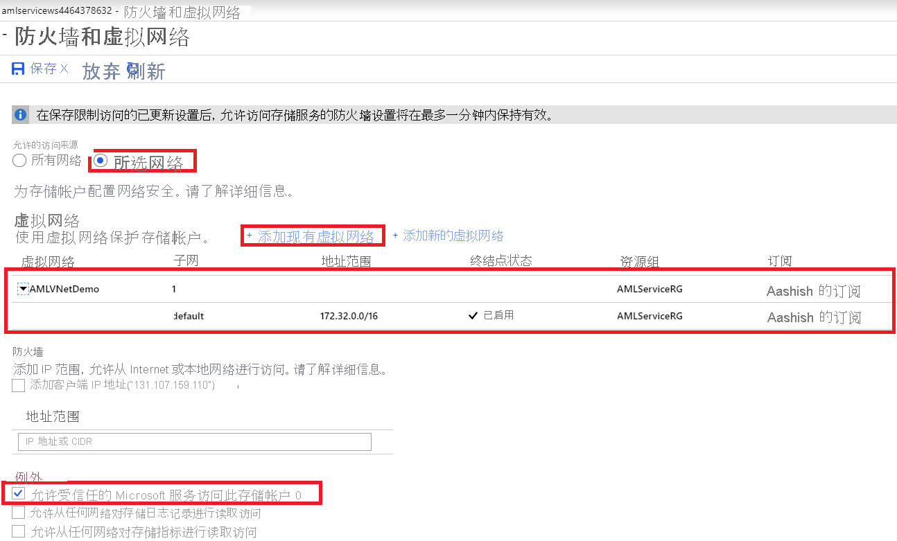
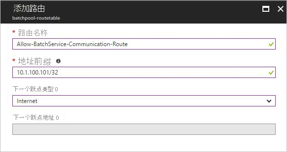
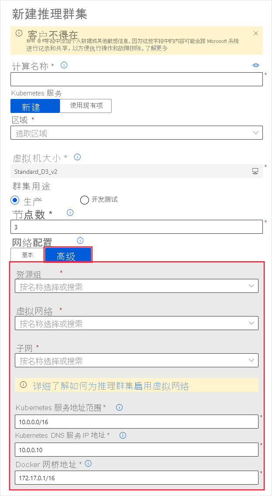

# <a name="secure-azure-ml-experimentation-and-inference-jobs-within-an-azure-virtual-network"></a>在 Azure 虚拟网络中保护 Azure ML 试验和推理作业
[!INCLUDE [applies-to-skus](../../includes/aml-applies-to-basic-enterprise-sku.md)]

本文介绍如何在 Azure 虚拟网络 (VNet) 中保护 Azure 机器学习中的试验/训练作业和推理/评分作业。

**虚拟网络**充当安全边界，将 Azure 资源与公共 Internet 隔离开来。 你也可以将 Azure 虚拟网络加入本地网络。 加入网络后，可以安全训练模型，以及访问用于推理的已部署模型。

Azure 机器学习依赖于其他 Azure 服务提供计算资源。 计算资源或[计算目标](concept-compute-target.md)用于训练和部署模型。 可以在虚拟网络中创建目标。 例如，可以使用 Microsoft Data Science Virtual Machine 来训练模型，然后将该模型部署到 Azure Kubernetes 服务 (AKS)。 有关虚拟网络的详细信息，请参阅[Azure 虚拟网络概述](https://docs.microsoft.com/azure/virtual-network/virtual-networks-overview)。

本文还将提供有关高级安全设置的详细信息（在基本或试验用例中不需要这些信息）。** 本文的某些部分提供各种方案的配置信息。 无需按顺序遵循本文中的说明，也不需要遵循所有的说明。

> [!TIP]
> 除非有专门的说明，否则可以在机器学习管道和非管道工作流（例如脚本运行）中使用虚拟网络中的存储帐户或计算目标等资源。

> [!WARNING]
> 如果基础存储已启用虚拟网络，Microsoft 不支持使用 Azure 机器学习工作室功能，如自动 ML、数据集、数据标记、设计器和笔记本。

## <a name="prerequisites"></a>先决条件

+ Azure 机器学习[工作区](how-to-manage-workspace.md)。

+ 对 [Azure 虚拟网络服务](https://docs.microsoft.com/azure/virtual-network/virtual-networks-overview)和 [IP 网络](https://docs.microsoft.com/azure/virtual-network/virtual-network-ip-addresses-overview-arm)具备一般性的实践知识。

+ 预先存在一个要与计算资源配合使用的虚拟网络和子网。

## <a name="use-a-storage-account-for-your-workspace"></a>对工作区使用存储帐户

> [!WARNING]
> 如果数据科学家使用 Azure 机器学习设计器，则在虚拟网络内从存储帐户可视化数据时，他们将收到错误。 以下文本是它们收到的错误：
>
> __错误：无法分析此数据集。这可能是因为您的数据存储在虚拟网络后面，或者您的数据不支持配置文件。__

要在虚拟网络中对工作区使用 Azure 存储帐户，请使用以下步骤：

1. 在虚拟网络的后面创建一个计算资源（例如机器学习计算实例或群集），或者将某个计算资源（例如 HDInsight 群集、虚拟机或 Azure Kubernetes 服务群集）附加到工作区。 该计算资源可用于试验或模型部署。

   有关详细信息，请参阅本文的[使用机器学习计算](#amlcompute)、[使用虚拟机或 HDInsight 群集](#vmorhdi)和[使用 Azure Kubernetes 服务](#aksvnet)部分。

1. 在 Azure 门户中，转到已附加到工作区的存储。

   [](./media/how-to-enable-virtual-network/workspace-storage.png#lightbox)

1. 在“Azure 存储”页上，选择“防火墙和虚拟网络”。****____

   

1. 在__防火墙和虚拟网络__页面上，执行以下操作：
    - 选择“所选网络”。____
    - 在“虚拟网络”下，选择“添加现有的虚拟网络”链接。________ 此操作将添加计算资源所在的虚拟网络（参阅步骤 1）。

        > [!IMPORTANT]
        > 存储帐户必须与用于训练或推理的计算实例或群集位于同一虚拟网络和子网中。

    - 选中“允许受信任的 Microsoft 服务访问此存储帐户”复选框。____

    > [!IMPORTANT]
    > 使用 Azure 机器学习 SDK 时，开发环境必须能够连接到 Azure 存储帐户。 当存储帐户位于虚拟网络中时，防火墙必须允许从开发环境的 IP 地址进行访问。
    >
    > 若要启用对存储帐户的访问，请从开发客户端上的 Web 浏览器访问存储帐户的“防火墙和虚拟网络”。____** 然后选中“添加客户端 IP 地址”复选框，将客户端的 IP 地址添加到“地址范围”。________ 也可以使用“地址范围”字段手动输入开发环境的 IP 地址。____ 添加客户端的 IP 地址后，该客户端可以使用 SDK 访问存储帐户。

   [](./media/how-to-enable-virtual-network/storage-firewalls-and-virtual-networks-page.png#lightbox)

> [!IMPORTANT]
> 可将 Azure 机器学习的默认存储帐户或者将非默认存储帐户放在虚拟网络中。____
>
> 创建工作区时，会自动预配默认存储帐户。
>
> 对于非默认存储帐户，`storage_account`[`Workspace.create()`函数](https://docs.microsoft.com/python/api/azureml-core/azureml.core.workspace(class)?view=azure-ml-py#create-name--auth-none--subscription-id-none--resource-group-none--location-none--create-resource-group-true--sku--basic---friendly-name-none--storage-account-none--key-vault-none--app-insights-none--container-registry-none--cmk-keyvault-none--resource-cmk-uri-none--hbi-workspace-false--default-cpu-compute-target-none--default-gpu-compute-target-none--exist-ok-false--show-output-true-)中的参数允许您按 Azure 资源 ID 指定自定义存储帐户。

## <a name="use-azure-data-lake-storage-gen-2"></a>使用 Azure 数据存储第 2 代

Azure 数据存储第 2 代是一组基于 Azure Blob 存储构建的大数据分析功能。 它可用于存储用于使用 Azure 机器学习训练模型的数据。 

要在 Azure 机器学习工作区的虚拟网络中使用数据湖存储第 2 代，请使用以下步骤：

1. 创建 Azure 数据存储第 2 代帐户。 有关详细信息，请参阅创建[Azure 数据湖存储 Gen2 存储帐户](../storage/blobs/data-lake-storage-quickstart-create-account.md)。

1. 使用上一节中的步骤[2-4，使用工作区的存储帐户](#use-a-storage-account-for-your-workspace)，将帐户放入虚拟网络中。

在虚拟网络中将 Azure 机器学习与数据存储第 2 代一起使用时，请使用以下指南：

* 如果使用 SDK__创建数据集__，并且运行代码的系统__不在虚拟网络中__，请使用 参数`validate=False`。 此参数跳过验证，如果系统与存储帐户的虚拟网络不同，验证将失败。 有关详细信息，请参阅[from_files（）](https://docs.microsoft.com/python/api/azureml-core/azureml.data.dataset_factory.filedatasetfactory?view=azure-ml-py#from-files-path--validate-true-)方法。

* 当使用 Azure 机器学习计算实例或计算群集使用数据集训练模型时，它必须与存储帐户位于同一虚拟网络中。

## <a name="use-a-key-vault-instance-with-your-workspace"></a>将 Key Vault 实例与工作区配合使用

Azure 机器学习使用与工作区关联的 Key Vault 实例来存储以下凭据：
* 关联的存储帐户连接字符串
* Azure 容器存储库实例的密码
* 数据存储的连接字符串

要将 Azure 机器学习实验功能与虚拟网络后面的 Azure 密钥保管库一起使用，请使用以下步骤：

1. 转到与工作区关联的 Key Vault。

   [](./media/how-to-enable-virtual-network/workspace-key-vault.png#lightbox)

1. 在“Key Vault”页上的左侧窗格中，选择“防火墙和虚拟网络”。****____

   

1. 在__防火墙和虚拟网络__页面上，执行以下操作：
    - 在“允许的访问来源”____ 下，选择“所选网络”____。
    - 在“虚拟网络”下，选择“添加现有的虚拟网络”，以添加试验计算资源所在的虚拟网络。________
    - 在“允许受信任的 Microsoft 服务跳过此防火墙”下选择“是”。________

   [](./media/how-to-enable-virtual-network/key-vault-firewalls-and-virtual-networks-page.png#lightbox)

<a id="amlcompute"></a>

## <a name="use-a-machine-learning-compute"></a><a name="compute-instance"></a>使用机器学习计算

若要在虚拟网络中使用 Azure 机器学习计算实例或计算群集，必须满足以下网络要求：

> [!div class="checklist"]
> * 该虚拟网络必须与 Azure 机器学习工作区位于同一订阅和区域。
> * 为计算实例或群集指定的子网必须具有足够的未分配 IP 地址，以容纳目标 VM 数目。 如果该子网没有足够的未分配 IP 地址，则只会为计算群集分配一部分资源。
> * 检查对虚拟网络的订阅或资源组实施的安全策略或锁定是否限制了管理虚拟网络所需的权限。 如果你打算通过限制流量来保护虚拟网络，请为计算服务保持打开某些端口。 有关详细信息，请参阅[所需的端口](#mlcports)部分。
> * 若要将多个计算实例或群集放入一个虚拟网络，可能需要请求提高一个或多个资源的配额。
> * 如果工作区的 Azure 存储帐户也在虚拟网络中受保护，则它们必须与 Azure 机器学习计算实例或群集位于同一虚拟网络中。 

> [!TIP]
> 机器学习计算实例或群集自动在包含虚拟网络的资源组中分配更多网络资源。 对于每个计算实例或群集，该服务将分配以下资源：
> 
> * 一个网络安全组
> * 一个公共 IP 地址
> * 一个负载均衡器
> 
> 这些资源受订阅的[资源配额](https://docs.microsoft.com/azure/azure-resource-manager/management/azure-subscription-service-limits)限制。


### <a name="required-ports"></a><a id="mlcports"></a>所需的端口

机器学习计算目前使用 Azure Batch 服务在指定的虚拟网络中预配 VM。 子网必须允许来自 Batch 服务的入站通信。 可以使用这种通信在机器学习计算节点上计划运行，以及与 Azure 存储和其他资源进行通信。 Batch 服务在附加到 VM 的网络接口 (NIC) 级别添加网络安全组 (NSG)。 这些 NSG 自动配置允许以下流量的入站和出站规则：

- 端口 29876 和 29877 上的来自 __BatchNodeManagement__ 服务标记的入站 TCP 流量。____

    

- （可选）端口 22 上允许远程访问的入站 TCP 流量。 仅当要在公共 IP 上使用 SSH 进行连接时，才使用此端口。

- 任何端口上通往虚拟网络的出站流量。

- 任何端口上通往 Internet 的出站流量。

- 对于端口 44224 上的来自 __AzureMachineLearning__ 服务标记的计算实例入站 TCP 流量。____

在 Batch 配置的 NSG 中修改或添加入站或出站规则时，请务必小心。 如果 NSG 阻止与计算节点通信，则计算服务会将计算节点的状态设置为不可用。

不需要在子网级别指定 NSG，因为 Azure Batch 会配置自身的 NSG。 但是，如果指定的子网具有关联的 NSG 或防火墙，请如前所述配置入站和出站安全规则。

下图显示了 Azure 门户中的 NSG 规则配置：

[](./media/how-to-enable-virtual-network/amlcompute-virtual-network-inbound.png#lightbox)


### <a name="limit-outbound-connectivity-from-the-virtual-network"></a><a id="limiting-outbound-from-vnet"></a> 限制来自虚拟网络的出站连接

如果不想使用默认出站规则，并且确实希望限制虚拟网络的出站访问，请使用以下步骤：

- 使用 NSG 规则拒绝出站 Internet 连接。

- 对于__计算实例__或__计算群集__，将出站流量限制为以下项：
   - 使用存储__的服务标记____.区域名称__的 Azure 存储。 Azure`{RegionName}`区域的名称在哪里。
   - Azure 容器注册表，通过使用 Azure__容器注册.区域名称____的服务标记__。 Azure`{RegionName}`区域的名称在哪里。
   - Azure 机器学习 - 使用 __AzureMachineLearning__ 的服务标记____
   - 使用__Azure 资源管理器____的服务标记__，Azure 资源管理器
   - 使用__Azure ActiveDirectory__ __的服务标记__，Azure 活动目录

下图显示了 Azure 门户中的 NSG 规则配置：

[](./media/how-to-enable-virtual-network/limited-outbound-nsg-exp.png#lightbox)

> [!NOTE]
> 如果您计划使用 Microsoft 提供的默认 Docker 映像，并启用用户托管依赖项，则还必须使用__Microsoft 容器注册.Region_Name（__ 例如，Microsoft 容器注册.EastUS）__的服务标记__。
>
> 当您在培训脚本中具有类似于以下代码段的代码时，需要此配置：
>
> __运行配置培训__
> ```python
> # create a new runconfig object
> run_config = RunConfiguration()
> 
> # configure Docker 
> run_config.environment.docker.enabled = True
> # For GPU, use DEFAULT_GPU_IMAGE
> run_config.environment.docker.base_image = DEFAULT_CPU_IMAGE 
> run_config.environment.python.user_managed_dependencies = True
> ```
>
> __估算器培训__
> ```python
> est = Estimator(source_directory='.',
>                 script_params=script_params,
>                 compute_target='local',
>                 entry_script='dummy_train.py',
>                 user_managed=True)
> run = exp.submit(est)
> ```

### <a name="user-defined-routes-for-forced-tunneling"></a>用户定义的用于强制隧道的路由

若要在机器学习计算中使用强制隧道，请将[用户定义的路由 (UDR)](https://docs.microsoft.com/azure/virtual-network/virtual-networks-udr-overview) 添加到包含计算资源的子网。

* 为资源所在区域中的 Azure Batch 服务使用的每个 IP 地址建立一个 UDR。 这些 UDR 使 Batch 服务能够与计算节点通信，以计划任务。 若要获取 Batch 服务的 IP 地址列表，请使用以下方法之一：

    * 下载 [Azure IP 范围和服务标记](https://www.microsoft.com/download/details.aspx?id=56519)，并在文件中搜索 `BatchNodeManagement.<region>`（其中，`<region>` 是你的 Azure 区域）。

    * 使用 [Azure CLI](https://docs.microsoft.com/cli/azure/install-azure-cli?view=azure-cli-latest) 下载信息。 以下示例下载 IP 地址信息，并筛选出“美国东部 2”区域的信息：

        ```azurecli-interactive
        az network list-service-tags -l "East US 2" --query "values[?starts_with(id, 'Batch')] | [?properties.region=='eastus2']"
        ```

* 发往 Azure 存储的出站流量不能被本地网络设备阻止。 具体而言，URL 采用 `<account>.table.core.windows.net`、`<account>.queue.core.windows.net` 和 `<account>.blob.core.windows.net` 格式。

添加 UDR 时，请为每个相关的 Batch IP 地址前缀定义路由，并将“下一跃点类型”设置为“Internet”。________ 下图显示了 Azure 门户中此 UDR 的示例：



有关详细信息，请参阅[在虚拟网络中创建 Azure Batch 池](../batch/batch-virtual-network.md#user-defined-routes-for-forced-tunneling)。

### <a name="create-a-compute-cluster-in-a-virtual-network"></a>在虚拟网络中创建计算群集

要创建机器学习计算群集，请使用以下步骤：

1. 登录到[Azure 机器学习工作室](https://ml.azure.com/)，然后选择订阅和工作区。

1. 选择左侧的“计算”____。

1. 从中心选择__训练群集__，然后选择__+__。

1. 在 __"新建训练群集"__ 对话框中，展开 __"高级设置"__ 部分。

1. 要将此计算资源配置为使用虚拟网络，请在 __"配置虚拟网络__"部分执行以下操作：

    1. 在“资源组”下拉列表中，选择包含虚拟网络的资源组。____
    1. 在“虚拟网络”下拉列表中，选择包含子网的虚拟网络。____
    1. 在“子网”下拉列表中，选择要使用的子网。____

   

也可以使用 Azure 机器学习 SDK 创建机器学习计算群集。 以下代码在名为 `mynetwork` 的虚拟网络的 `default` 子网中创建新的机器学习计算群集：

```python
from azureml.core.compute import ComputeTarget, AmlCompute
from azureml.core.compute_target import ComputeTargetException

# The Azure virtual network name, subnet, and resource group
vnet_name = 'mynetwork'
subnet_name = 'default'
vnet_resourcegroup_name = 'mygroup'

# Choose a name for your CPU cluster
cpu_cluster_name = "cpucluster"

# Verify that cluster does not exist already
try:
    cpu_cluster = ComputeTarget(workspace=ws, name=cpu_cluster_name)
    print("Found existing cpucluster")
except ComputeTargetException:
    print("Creating new cpucluster")

    # Specify the configuration for the new cluster
    compute_config = AmlCompute.provisioning_configuration(vm_size="STANDARD_D2_V2",
                                                           min_nodes=0,
                                                           max_nodes=4,
                                                           vnet_resourcegroup_name=vnet_resourcegroup_name,
                                                           vnet_name=vnet_name,
                                                           subnet_name=subnet_name)

    # Create the cluster with the specified name and configuration
    cpu_cluster = ComputeTarget.create(ws, cpu_cluster_name, compute_config)

    # Wait for the cluster to be completed, show the output log
    cpu_cluster.wait_for_completion(show_output=True)
```

创建过程完成后，请在试验中使用该群集训练模型。 有关详细信息，请参阅[选择并使用用于训练的计算目标](how-to-set-up-training-targets.md)。

## <a name="use-azure-databricks"></a>使用 Azure Databricks

若要将虚拟网络中的 Azure Databricks 与工作区配合使用，必须满足以下要求：

> [!div class="checklist"]
> * 该虚拟网络必须与 Azure 机器学习工作区位于同一订阅和区域。
> * 如果工作区的 Azure 存储帐户也在虚拟网络中受保护，则它们必须与 Azure Databricks 群集位于同一虚拟网络中。
> * 除了 Azure Databricks 使用的 __databricks-private__ 和 __databricks-public__ 子网以外，还需要为虚拟网络创建 __default__ 子网。

有关在虚拟网络中使用 Azure Databricks 的具体信息，请参阅[在 Azure 虚拟网络中部署 Azure Databricks](https://docs.azuredatabricks.net/administration-guide/cloud-configurations/azure/vnet-inject.html)。

<a id="vmorhdi"></a>

## <a name="use-a-virtual-machine-or-hdinsight-cluster"></a>使用虚拟机或 HDInsight 群集

> [!IMPORTANT]
> Azure 机器学习仅支持运行 Ubuntu 的虚拟机。

要在具有工作区的虚拟网络中使用虚拟机或 Azure HDInsight 群集，请使用以下步骤：

1. 使用 Azure 门户或 Azure CLI 创建 VM 或 HDInsight 群集，并将群集放入 Azure 虚拟网络。 有关详细信息，请参阅以下文章：
    * [为 Linux VM 创建和管理 Azure 虚拟网络](https://docs.microsoft.com/azure/virtual-machines/linux/tutorial-virtual-network)

    * [使用 Azure 虚拟网络扩展 HDInsight](https://docs.microsoft.com/azure/hdinsight/hdinsight-extend-hadoop-virtual-network)

1. 若要允许 Azure 机器学习与 VM 或群集上的 SSH 端口通信，请为网络安全组配置一个源条目。 SSH 端口通常是端口 22。 要允许来自此源的流量，请执行以下操作：

    * 在“源”下拉列表中，选择“服务标记”。________

    * 在“源服务标记”下拉列表中，选择“AzureMachineLearning”。________

    * 在“源端口范围”下拉列表中，选择 __*__。____

    * 在“目标”下拉列表中，选择“任何”。________

    * 在“目标端口范围”下拉列表中，选择“22”。________

    * 在“协议”下，选择“任何”。________

    * 在“操作”下，选择“允许”。________

   

    保留网络安全组的默认出站规则。 有关详细信息，请参阅[安全组](https://docs.microsoft.com/azure/virtual-network/security-overview#default-security-rules)中的“默认安全规则”。

    如果你不想要使用默认出站规则，同时想要限制虚拟网络的出站访问，请参阅[限制来自虚拟网络的出站连接](#limiting-outbound-from-vnet)部分。

1. 将 VM 或 HDInsight 群集附加到 Azure 机器学习工作区。 有关详细信息，请参阅[设置模型训练的计算目标](how-to-set-up-training-targets.md)。

<a id="aksvnet"></a>

## <a name="use-azure-kubernetes-service-aks"></a>使用 Azure Kubernetes 服务 (AKS)

要将虚拟网络中的 AKS 添加到工作区，请使用以下步骤：

> [!IMPORTANT]
> 在开始执行以下过程之前，请满足[在 Azure Kubernetes 服务 (AKS) 中配置高级网络](https://docs.microsoft.com/azure/aks/configure-advanced-networking#prerequisites)操作指南中的先决条件，并规划好群集的 IP 地址。
>
> AKS 实例和 Azure 虚拟网络必须位于同一区域。 如果在虚拟网络中保护工作区使用的 Azure 存储帐户，这些帐户必须与 AKS 实例位于同一虚拟网络中。

> [!WARNING]
> Azure 机器学习不支持使用启用专用链接的 Azure 库伯奈斯服务。

1. 登录到[Azure 机器学习工作室](https://ml.azure.com/)，然后选择订阅和工作区。

1. 选择左侧的“计算”____。

1. 从中心选择 __"推理"群集__，然后选择__+__。

1. 在 __"新建推理群集"__ 对话框中，在 __"网络配置__"下选择 __"高级__"。

1. 要使用此计算资源使用虚拟网络，请执行以下操作：

    1. 在“资源组”下拉列表中，选择包含虚拟网络的资源组。____
    1. 在“虚拟网络”下拉列表中，选择包含子网的虚拟网络。____
    1. 在“子网”下拉列表中选择子网。____
    1. 在“Kubernetes 服务地址范围”中，输入 Kubernetes 服务地址范围。____ 此地址范围使用无类域间路由 (CIDR) 表示法表示的 IP 范围来定义群集可用的 IP 地址。 此范围不得与任何子网 IP 范围重叠（例如 10.0.0.0/16）。
    1. 在“Kubernetes DNS 服务 IP 地址”框中，输入 Kubernetes DNS 服务 IP 地址。____ 此 IP 地址将分配给 Kubernetes DNS 服务。 此 IP 地址必须在 Kubernetes 服务地址范围内（例如 10.0.0.10）。
    1. 在“Docker 网桥地址”框中，输入 Docker 网桥地址。____ 此 IP 地址将分配给 Docker 网桥。 此 IP 地址不得在任何子网 IP 范围或 Kubernetes 服务地址范围内（例如 172.17.0.1/16）。

   

1. 确保用于控制虚拟网络的 NSG 组包含一条已为评分终结点启用的入站安全规则，以便可以从虚拟网络外部调用此终结点。
   > [!IMPORTANT]
   > 保留 NSG 的默认出站规则。 有关详细信息，请参阅[安全组](https://docs.microsoft.com/azure/virtual-network/security-overview#default-security-rules)中的“默认安全规则”。

   [](./media/how-to-enable-virtual-network/aks-vnet-inbound-nsg-scoring.png#lightbox)

也可以使用 Azure 机器学习 SDK 在虚拟网络中添加 Azure Kubernetes 服务。 如果虚拟网络中已有一个 AKS 群集，请根据[如何部署到 AKS](how-to-deploy-and-where.md) 中所述，将此群集附加到工作区。 以下代码在名为 `mynetwork` 的虚拟网络的 `default` 子网中创建新的 AKS 实例：

```python
from azureml.core.compute import ComputeTarget, AksCompute

# Create the compute configuration and set virtual network information
config = AksCompute.provisioning_configuration(location="eastus2")
config.vnet_resourcegroup_name = "mygroup"
config.vnet_name = "mynetwork"
config.subnet_name = "default"
config.service_cidr = "10.0.0.0/16"
config.dns_service_ip = "10.0.0.10"
config.docker_bridge_cidr = "172.17.0.1/16"

# Create the compute target
aks_target = ComputeTarget.create(workspace=ws,
                                  name="myaks",
                                  provisioning_configuration=config)
```

创建过程完成后，可在虚拟网络后面的 AKS 群集上运行推理或模型评分。 有关详细信息，请参阅[如何部署 AKS](how-to-deploy-and-where.md)。

### <a name="use-private-ips-with-azure-kubernetes-service"></a>将专用 IP 与 Azure 库伯奈斯服务一起使用

默认情况下，公共 IP 地址分配给 AKS 部署。 在虚拟网络中使用 AKS 时，可以使用专用 IP 地址。 专用 IP 地址只能通过虚拟网络或联接网络内部访问。

通过配置 AKS 来使用_内部负载均衡器_，启用专用 IP 地址。 

> [!IMPORTANT]
> 创建 Azure 库伯奈斯服务群集时，无法启用专用 IP。 必须将其作为对现有群集的更新启用。

以下代码段演示如何**创建新的 AKS 群集**，然后更新它以使用专用 IP/内部负载均衡器：

```python
import azureml.core
from azureml.core.compute.aks import AksUpdateConfiguration
from azureml.core.compute import AksCompute, ComputeTarget

# Verify that cluster does not exist already
try:
    aks_target = AksCompute(workspace=ws, name=aks_cluster_name)
    print("Found existing aks cluster")

except:
    print("Creating new aks cluster")

    # Create AKS configuration
    prov_config = AksCompute.provisioning_configuration(location = "eastus2")
    # Set info for existing virtual network to create the cluster in
    prov_config.vnet_resourcegroup_name = "myvnetresourcegroup"
    prov_config.vnet_name = "myvnetname"
    prov_config.service_cidr = "10.0.0.0/16"
    prov_config.dns_service_ip = "10.0.0.10"
    prov_config.subnet_name = "default"
    prov_config.docker_bridge_cidr = "172.17.0.1/16"

    # Create compute target
    aks_target = ComputeTarget.create(workspace = ws, name = "myaks", provisioning_configuration = prov_config)
    # Wait for the operation to complete
    aks_target.wait_for_completion(show_output = True)
    
    # Update AKS configuration to use an internal load balancer
    update_config = AksUpdateConfiguration(None, "InternalLoadBalancer", "default")
    aks_target.update(update_config)
    # Wait for the operation to complete
    aks_target.wait_for_completion(show_output = True)
```

__Azure CLI__

```azurecli-interactive
az rest --method put --uri https://management.azure.com"/subscriptions/<subscription-id>/resourcegroups/<resource-group>/providers/Microsoft.ContainerService/managedClusters/<aks-resource-id>?api-version=2018-11-19 --body @body.json
```

命令引用`body.json`的文件内容类似于以下 JSON 文档：

```json
{ 
    "location": "<region>", 
    "properties": { 
        "resourceId": "/subscriptions/<subscription-id>/resourcegroups/<resource-group>/providers/Microsoft.ContainerService/managedClusters/<aks-resource-id>", 
        "computeType": "AKS", 
        "provisioningState": "Succeeded", 
        "properties": { 
            "loadBalancerType": "InternalLoadBalancer", 
            "agentCount": <agent-count>, 
            "agentVmSize": "vm-size", 
            "clusterFqdn": "<cluster-fqdn>" 
        } 
    } 
} 
```

> [!NOTE]
> 当前，在现有群集上执行__附加__操作时，无法配置负载均衡器。 必须首先附加群集，然后执行更新操作以更改负载均衡器。

有关将内部负载均衡器与 AKS 一起使用的详细信息，请参阅[使用 Azure Kubernetes 服务使用内部负载均衡器](/azure/aks/internal-lb)。

## <a name="use-azure-firewall"></a>使用 Azure 防火墙

使用 Azure 防火墙时，必须将网络规则配置为允许发往或来自以下地址的流量：

- `*.batchai.core.windows.net`
- `ml.azure.com`
- `*.azureml.ms`
- `*.experiments.azureml.net`
- `*.modelmanagement.azureml.net`
- `mlworkspace.azure.ai`
- `*.aether.ms`

添加规则时，请将“协议”设置为“任何”，并将端口设置为 `*`。____

有关配置网络规则的详细信息，请参阅[部署和配置 Azure 防火墙](/azure/firewall/tutorial-firewall-deploy-portal#configure-a-network-rule)。

## <a name="use-azure-container-registry"></a>使用 Azure 容器注册表

> [!IMPORTANT]
> Azure 容器注册表 （ACR） 可以放在虚拟网络中，但必须满足以下先决条件：
>
> * Azure 机器学习工作区必须是企业版。 有关升级的信息，请参阅[升级到企业版](how-to-manage-workspace.md#upgrade)。
> * Azure 容器注册表必须是高级版本。 有关升级的详细信息，请参阅更改[SKU](/azure/container-registry/container-registry-skus#changing-skus)。
> * Azure 容器注册表必须与用于定型或推理的存储帐户和计算目标位于同一虚拟网络和子网中。
> * Azure 机器学习工作区必须包含[Azure 机器学习计算群集](how-to-set-up-training-targets.md#amlcompute)。
>
>     当 ACR 位于虚拟网络后面时，Azure 机器学习不能使用它直接生成 Docker 映像。 相反，计算群集用于生成映像。

1. 要查找工作区的 Azure 容器注册表的名称，请使用以下方法之一：

    __Azure 门户__

    从工作区的概述部分，"__注册表__"值链接到 Azure 容器注册表。

    

    __Azure CLI__

    如果已[为 Azure CLI 安装了机器学习扩展](reference-azure-machine-learning-cli.md)，则可以使用 命令`az ml workspace show`显示工作区信息。

    ```azurecli-interactive
    az ml workspace show -w yourworkspacename -g resourcegroupname --query 'containerRegistry'
    ```

    此命令会返回类似于 `"/subscriptions/{GUID}/resourceGroups/{resourcegroupname}/providers/Microsoft.ContainerRegistry/registries/{ACRname}"` 的值。 字符串的最后一部分是工作区的 Azure 容器注册表的名称。

1. 要限制对虚拟网络的访问，请使用[注册表的"配置网络访问"](../container-registry/container-registry-vnet.md#configure-network-access-for-registry)中的步骤。 添加虚拟网络时，为 Azure 机器学习资源选择虚拟网络和子网。

1. 使用 Azure 机器学习 Python SDK 配置计算群集以生成 Docker 映像。 以下代码段演示如何执行此操作：

    ```python
    from azureml.core import Workspace
    # Load workspace from an existing config file
    ws = Workspace.from_config()
    # Update the workspace to use an existing compute cluster
    ws.update(image_build_compute = 'mycomputecluster')
    ```

    > [!IMPORTANT]
    > 存储帐户、计算群集和 Azure 容器注册表必须都位于虚拟网络的同一子网中。
    
    有关详细信息，请参阅[update（）](https://docs.microsoft.com/python/api/azureml-core/azureml.core.workspace.workspace?view=azure-ml-py#update-friendly-name-none--description-none--tags-none--image-build-compute-none--enable-data-actions-none-)方法引用。

1. 如果对 Azure 机器学习工作区使用专用链接，并将工作区的 Azure 容器注册表放在虚拟网络中，则还必须应用以下 Azure 资源管理器模板。 此模板使工作区能够通过专用链路与 ACR 通信。

    ```json
    {
    "$schema": "https://schema.management.azure.com/schemas/2015-01-01/deploymentTemplate.json#",
    "contentVersion": "1.0.0.0",
    "parameters": {
        "keyVaultArmId": {
        "type": "string"
        },
        "workspaceName": {
        "type": "string"
        },
        "containerRegistryArmId": {
        "type": "string"
        },
        "applicationInsightsArmId": {
        "type": "string"
        },
        "storageAccountArmId": {
        "type": "string"
        },
        "location": {
        "type": "string"
        }
    },
    "resources": [
        {
        "type": "Microsoft.MachineLearningServices/workspaces",
        "apiVersion": "2019-11-01",
        "name": "[parameters('workspaceName')]",
        "location": "[parameters('location')]",
        "identity": {
            "type": "SystemAssigned"
        },
        "sku": {
            "tier": "enterprise",
            "name": "enterprise"
        },
        "properties": {
            "sharedPrivateLinkResources":
    [{"Name":"Acr","Properties":{"PrivateLinkResourceId":"[concat(parameters('containerRegistryArmId'), '/privateLinkResources/registry')]","GroupId":"registry","RequestMessage":"Approve","Status":"Pending"}}],
            "keyVault": "[parameters('keyVaultArmId')]",
            "containerRegistry": "[parameters('containerRegistryArmId')]",
            "applicationInsights": "[parameters('applicationInsightsArmId')]",
            "storageAccount": "[parameters('storageAccountArmId')]"
        }
        }
    ]
    }
    ```

## <a name="next-steps"></a>后续步骤

* [设置训练环境](how-to-set-up-training-targets.md)
* [模型部署位置](how-to-deploy-and-where.md)
* [使用 TLS 通过 Azure 机器学习保护 Web 服务](how-to-secure-web-service.md)
