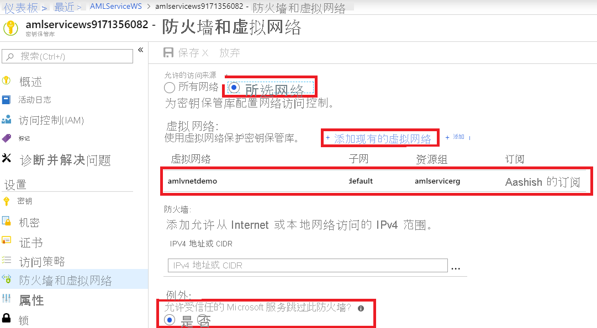
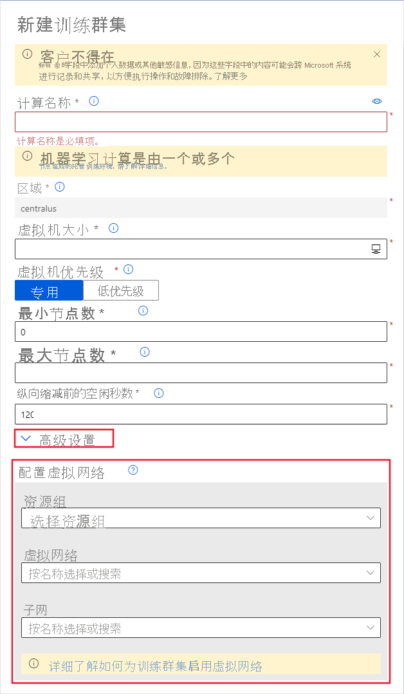

# <a name="secure-azure-ml-experimentation-and-inference-jobs-within-an-azure-virtual-network"></a>在 Azure 虚拟网络中保护 Azure ML 试验和推理作业
[!INCLUDE [applies-to-skus](../../includes/aml-applies-to-basic-enterprise-sku.md)]

在本文中，你将了解如何在 Azure 虚拟网络（vnet）中的 Azure 机器学习中保护试验/培训作业和推理/评分作业。

**虚拟网络**充当安全边界，将 Azure 资源与公共 internet 隔离开来。 你也可以将 Azure 虚拟网络加入本地网络。 通过加入网络，可以安全地训练模型并访问已部署的模型以进行推断。

Azure 机器学习依赖于其他 Azure 服务计算资源。 计算资源（或[计算目标](concept-compute-target.md)）用于定型和部署模型。 可以在虚拟网络中创建目标。 例如，你可以使用 Microsoft Data Science Virtual Machine 训练模型，然后将模型部署到 Azure Kubernetes 服务（AKS）。 有关虚拟网络的详细信息，请参阅[Azure 虚拟网络概述](https://docs.microsoft.com/azure/virtual-network/virtual-networks-overview)。

本文还提供了有关*高级安全设置*的详细信息，以及基本或实验用例所不需要的信息。 本文的某些部分提供各种方案的配置信息。 您无需按顺序或完整地完成说明。

> [!TIP]
> 除非特别指出，使用存储帐户或虚拟网络中的计算目标等资源将适用于机器学习管道和非管道工作流（如脚本运行）。

> [!WARNING]
> Microsoft 不支持将 Azure 机器学习设计器或自动化机器学习（通过 studio）用于虚拟网络内的资源。

## <a name="prerequisites"></a>必备组件

+ Azure 机器学习[工作区](how-to-manage-workspace.md)。

+ [Azure 虚拟网络服务](https://docs.microsoft.com/azure/virtual-network/virtual-networks-overview)和[IP 网络](https://docs.microsoft.com/azure/virtual-network/virtual-network-ip-addresses-overview-arm)的常规工作知识。

+ 用于计算资源的预先存在的虚拟网络和子网。

## <a name="use-a-storage-account-for-your-workspace"></a>使用工作区的存储帐户

若要在虚拟网络中使用工作区的 Azure 存储帐户，请使用以下步骤：

1. 在虚拟网络后创建计算资源（例如机器学习计算实例或群集），或将计算资源附加到工作区（例如，HDInsight 群集、虚拟机或 Azure Kubernetes Service 群集）。 计算资源可用于试验或模型部署。

   有关详细信息，请参阅本文中的[使用机器学习计算](#amlcompute)、[使用虚拟机或 HDInsight 群集](#vmorhdi)和[使用 Azure Kubernetes Service](#aksvnet)部分。

1. 在 Azure 门户中，请前往附加到工作区的存储。

   [](./media/how-to-enable-virtual-network/workspace-storage.png#lightbox)

1. 在 " **Azure 存储空间**" 页上，选择 "__防火墙和虚拟网络__"。

   

1. 在 "__防火墙和虚拟网络__" 页上，执行以下操作：
    - 选择“所选网络”。
    - 在 "__虚拟网络__" 下，选择 "__添加现有虚拟网络__" 链接。 此操作将添加计算所在的虚拟网络（请参阅步骤1）。

        > [!IMPORTANT]
        > 存储帐户必须与用于定型或推理的计算实例或群集位于同一虚拟网络中。

    - 选中 "__允许受信任的 Microsoft 服务访问此存储帐户__" 复选框。

    > [!IMPORTANT]
    > 使用 Azure 机器学习 SDK 时，你的开发环境必须能够连接到 Azure 存储帐户。 当存储帐户位于虚拟网络内部时，防火墙必须允许从开发环境的 IP 地址进行访问。
    >
    > 若要启用对存储帐户的访问，请在*开发客户端的 web 浏览器中*访问存储帐户的__防火墙和虚拟网络__。 然后，使用 "__添加客户端 IP 地址__" 复选框将客户端的 ip 地址添加到__地址范围__。 你还可以使用 "__地址范围__" 字段手动输入开发环境的 IP 地址。 添加客户端的 IP 地址后，可以使用 SDK 访问存储帐户。

   [](./media/how-to-enable-virtual-network/storage-firewalls-and-virtual-networks-page.png#lightbox)

> [!IMPORTANT]
> 你可以在虚拟网络中为 Azure 机器学习或_非默认存储帐户_放置_默认存储帐户_。
>
> 创建工作区时，会自动预配默认存储帐户。
>
> 对于非默认存储帐户， [`Workspace.create()` 函数](https://docs.microsoft.com/python/api/azureml-core/azureml.core.workspace(class)?view=azure-ml-py#create-name--auth-none--subscription-id-none--resource-group-none--location-none--create-resource-group-true--sku--basic---friendly-name-none--storage-account-none--key-vault-none--app-insights-none--container-registry-none--default-cpu-compute-target-none--default-gpu-compute-target-none--exist-ok-false--show-output-true-)中的 `storage_account` 参数允许你按 AZURE 资源 ID 指定自定义存储帐户。

## <a name="use-azure-data-lake-storage-gen-2"></a>使用 Azure Data Lake Storage 第2代

Azure Data Lake Storage 第2代是一组功能，用于在 Azure Blob 存储基础上构建大数据分析。 它可用于存储用于为模型定型 Azure 机器学习的数据。 

若要在 Azure 机器学习工作区的虚拟网络中使用 Data Lake Storage 第2代，请使用以下步骤：

1. 创建 Azure Data Lake Storage 第2代帐户。 有关详细信息，请参阅[创建 Azure Data Lake Storage Gen2 的存储帐户](../storage/blobs/data-lake-storage-quickstart-create-account.md)。

1. 使用上一节中的步骤2-4，为[你的工作区使用存储帐户](#use-a-storage-account-for-your-workspace)，将该帐户放在虚拟网络中。

在虚拟网络中将 Azure 机器学习与 Data Lake Storage Gen 2 一起使用时，请使用以下指南：

* 如果使用__SDK 创建数据集__，并且运行代码的系统__不在虚拟网络中__，请使用 `validate=False` 参数。 此参数跳过验证，如果系统与存储帐户不在同一虚拟网络中，则会失败。 有关详细信息，请参阅[from_files （）](https://docs.microsoft.com/python/api/azureml-core/azureml.data.dataset_factory.filedatasetfactory?view=azure-ml-py#from-files-path--validate-true-)方法。

* 使用 Azure 机器学习计算实例或计算群集来使用数据集来训练模型时，该数据集必须与存储帐户位于同一虚拟网络中。

## <a name="use-a-key-vault-instance-with-your-workspace"></a>将密钥保管库实例与工作区配合使用

Azure 机器学习使用与工作区关联的密钥保管库实例来存储以下凭据：
* 关联的存储帐户连接字符串
* 密码到 Azure 容器存储库实例
* 数据存储的连接字符串

若要在虚拟网络后使用 Azure Key Vault Azure 机器学习试验功能，请执行以下步骤：

1. 中转到与工作区关联的密钥保管库。

   [](./media/how-to-enable-virtual-network/workspace-key-vault.png#lightbox)

1. 在 " **Key Vault** " 页上的左窗格中，选择 "__防火墙和虚拟网络__"。

   

1. 在 "__防火墙和虚拟网络__" 页上，执行以下操作：
    - 在“允许的访问来源”下，选择“所选网络”。
    - 在 "__虚拟网络__" 下，选择 "__添加现有虚拟网络__" 以添加试验计算所在的虚拟网络。
    - 在 "__允许受信任的 Microsoft 服务跳过此防火墙__" 下，选择 __"是"__ 。

   [](./media/how-to-enable-virtual-network/key-vault-firewalls-and-virtual-networks-page.png#lightbox)

<a id="amlcompute"></a>

## <a name="compute-instance"></a>使用机器学习计算

> [!NOTE]
> 计算实例（预览版）当前仅适用于区域为“美国中北部”或“英国南部”的工作区，对其他区域的支持即将推出。
> 使用其中一个区域创建可添加到虚拟网络的计算实例。

若要在虚拟网络中使用 Azure 机器学习的计算实例或计算群集，必须满足以下网络要求：

> [!div class="checklist"]
> * 虚拟网络必须位于与 Azure 机器学习工作区相同的订阅和区域中。
> * 为计算实例或群集指定的子网必须具有足够的未分配 IP 地址，才能容纳目标 Vm 的数量。 如果子网没有足够的未分配 IP 地址，则会部分分配计算群集。
> * 查看虚拟网络的订阅或资源组的安全策略或锁定是否限制了管理虚拟网络的权限。 如果打算通过限制流量来保护虚拟网络，请为计算服务留出一些打开的端口。 有关详细信息，请参阅[所需的端口](#mlcports)部分。
> * 如果要在一个虚拟网络中放置多个计算实例或群集，则可能需要为一个或多个资源请求增加配额。
> * 如果工作区的 Azure 存储帐户还在虚拟网络中受保护，则它们必须与 Azure 机器学习计算实例或群集位于同一虚拟网络中。 如果要在同一个虚拟网络中创建计算实例，则需要从虚拟网络分离存储帐户，在虚拟网络中创建计算实例，然后将存储帐户附加到虚拟网络中。

机器学习的计算实例或群集会自动分配包含虚拟网络的资源组中的其他网络资源。 对于每个计算实例或群集，服务分配以下资源：

* 一个网络安全组
* 一个公共 IP 地址
* 一个负载均衡器

这些资源受订阅的[资源配额](https://docs.microsoft.com/azure/azure-resource-manager/management/azure-subscription-service-limits)限制。


### <a id="mlcports"></a>所需的端口

机器学习计算目前使用 Azure Batch 服务在指定的虚拟网络中预配 VM。 子网必须允许来自 Batch 服务的入站通信。 此通信用于计划在机器学习计算节点上运行，并与 Azure 存储和其他资源通信。 Batch 服务在附加到 Vm 的网络接口（Nic）级别添加网络安全组（Nsg）。 这些 NSG 自动配置允许以下流量的入站和出站规则：

- 来自__BatchNodeManagement__的__服务标记__的端口29876和29877上的入站 TCP 流量。

    

- 可有可无端口22上的入站 TCP 流量，允许远程访问。 仅当要在公共 IP 上使用 SSH 进行连接时，才使用此端口。

- 任何端口上通往虚拟网络的出站流量。

- 任何端口上通往 Internet 的出站流量。

- 对于__AzureMachineLearning__的__服务标记__，端口44224上的计算实例入站 TCP 流量。

在 Batch 配置的 NSG 中修改或添加入站或出站规则时，请务必小心。 如果 NSG 阻止与计算节点通信，则计算服务会将计算节点的状态设置为 "不可用"。

不需要在子网级别指定 Nsg，因为 Azure Batch 服务配置其自己的 Nsg。 但是，如果指定的子网具有关联的 Nsg 或防火墙，请按前面所述配置入站和出站安全规则。

下图显示了 Azure 门户中的 NSG 规则配置：

[](./media/how-to-enable-virtual-network/amlcompute-virtual-network-inbound.png#lightbox)


### <a id="limiting-outbound-from-vnet"></a>限制来自虚拟网络的出站连接

如果你不想使用默认的出站规则，并且想要限制虚拟网络的出站访问权限，请执行以下步骤：

- 使用 NSG 规则拒绝出站 internet 连接。

- 限制出站流量到以下项：
   - Azure 存储，使用存储的__服务标记__ __Region_Name__ （例如 EastUS）
   - Azure 容器注册表（通过使用__Region_Name AzureContainerRegistry__的__服务标记__）（例如，AzureContainerRegistry. EastUS）
   - Azure 机器学习，使用__AzureMachineLearning__的__服务标记__
   - 对于计算实例，Azure Cloud，使用__AzureResourceManager__ __服务标记__

下图显示了 Azure 门户中的 NSG 规则配置：

[](./media/how-to-enable-virtual-network/limited-outbound-nsg-exp.png#lightbox)

> [!NOTE]
> 如果你计划使用 Microsoft 提供的默认 Docker 映像并启用用户托管依赖项，则还必须使用__Region_Name MicrosoftContainerRegistry__的__服务标记__（例如，MicrosoftContainerRegistry. EastUS）。
>
> 当你的代码与以下代码片段类似于定型脚本的一部分时，需要此配置：
>
> __.Runconfig 培训__
> ```python
> # create a new runconfig object
> run_config = RunConfiguration()
> 
> # configure Docker 
> run_config.environment.docker.enabled = True
> # For GPU, use DEFAULT_GPU_IMAGE
> run_config.environment.docker.base_image = DEFAULT_CPU_IMAGE 
> run_config.environment.python.user_managed_dependencies = True
> ```
>
> 估计器 training__
> ```python
> est = Estimator(source_directory='.', 
>                 script_params=script_params, 
>                 compute_target='local', 
>                 entry_script='dummy_train.py', 
>                 user_managed=True)
> run = exp.submit(est)
> ```

### <a name="user-defined-routes-for-forced-tunneling"></a>用户定义的用于强制隧道的路由

如果在机器学习计算中使用强制隧道，请将[用户定义的路由（udr）](https://docs.microsoft.com/azure/virtual-network/virtual-networks-udr-overview)添加到包含计算资源的子网。

* 为每个 IP 地址建立 UDR，这些 IP 地址由存在资源的区域中的 Azure Batch 服务使用。 这些 Udr 允许批处理服务与计算节点通信，以便进行任务计划。 若要获取 Batch 服务的 IP 地址列表，请使用以下方法之一：

    * 下载[AZURE IP 范围和服务标记](https://www.microsoft.com/download/details.aspx?id=56519)，并在文件中搜索 `BatchNodeManagement.<region>`，其中 `<region>` 是你的 Azure 区域。

    * 使用[Azure CLI](https://docs.microsoft.com/cli/azure/install-azure-cli?view=azure-cli-latest)下载信息。 下面的示例将下载 IP 地址信息并筛选出美国东部2区域的信息：

        ```azurecli-interactive
        az network list-service-tags -l "East US 2" --query "values[?starts_with(id, 'Batch')] | [?properties.region=='eastus2']"
        ```

* 到 Azure 存储的出站流量不得被本地网络设备阻止。 具体而言，Url `<account>.table.core.windows.net`、`<account>.queue.core.windows.net`和 `<account>.blob.core.windows.net`形式。

添加 Udr 时，请为每个相关的批 IP 地址前缀定义路由，并将 "__下一跃点类型__" 设置为 " __Internet__"。 下图显示了 Azure 门户中的此 UDR 的示例：


有关详细信息，请参阅[在虚拟网络中创建 Azure Batch 池](../batch/batch-virtual-network.md#user-defined-routes-for-forced-tunneling)。

### <a name="create-a-compute-cluster-in-a-virtual-network"></a>在虚拟网络中创建计算群集

若要创建机器学习计算群集，请使用以下步骤：

1. 在[Azure 门户](https://portal.azure.com)中，选择 Azure 机器学习工作区。

1. 在__应用程序__部分，选择 "__计算__"，然后选择 "__添加计算__"。

1. 若要将此计算资源配置为使用虚拟网络，请执行以下操作：

    a.在“解决方案资源管理器”中，右键单击项目文件夹下的“引用”文件夹，然后单击“添加引用”。 对于 "__网络配置__"，选择 "__高级__"。

    b.保留“数据库类型”设置，即设置为“共享”。 在 "__资源组__" 下拉列表中，选择包含虚拟网络的资源组。

    c. 在 "__虚拟网络__" 下拉列表中，选择包含子网的虚拟网络。

    d.单击“下一步”。 在 "__子网__" 下拉列表中，选择要使用的子网。

   

也可以使用 Azure 机器学习 SDK 创建机器学习计算群集。 以下代码在名为 `mynetwork` 的虚拟网络的 `default` 子网中创建新的机器学习计算群集：

```python
from azureml.core.compute import ComputeTarget, AmlCompute
from azureml.core.compute_target import ComputeTargetException

# The Azure virtual network name, subnet, and resource group
vnet_name = 'mynetwork'
subnet_name = 'default'
vnet_resourcegroup_name = 'mygroup'

# Choose a name for your CPU cluster
cpu_cluster_name = "cpucluster"

# Verify that cluster does not exist already
try:
    cpu_cluster = ComputeTarget(workspace=ws, name=cpu_cluster_name)
    print("Found existing cpucluster")
except ComputeTargetException:
    print("Creating new cpucluster")

    # Specify the configuration for the new cluster
    compute_config = AmlCompute.provisioning_configuration(vm_size="STANDARD_D2_V2",
                                                           min_nodes=0,
                                                           max_nodes=4,
                                                           vnet_resourcegroup_name=vnet_resourcegroup_name,
                                                           vnet_name=vnet_name,
                                                           subnet_name=subnet_name)

    # Create the cluster with the specified name and configuration
    cpu_cluster = ComputeTarget.create(ws, cpu_cluster_name, compute_config)

    # Wait for the cluster to be completed, show the output log
    cpu_cluster.wait_for_completion(show_output=True)
```

创建过程完成后，在试验中使用群集来训练模型。 有关详细信息，请参阅[选择并使用用于训练的计算目标](how-to-set-up-training-targets.md)。

## <a name="use-azure-databricks"></a>使用 Azure Databricks

若要在虚拟网络中使用工作区 Azure Databricks，必须满足以下要求：

> [!div class="checklist"]
> * 虚拟网络必须位于与 Azure 机器学习工作区相同的订阅和区域中。
> * 如果工作区的 Azure 存储帐户还在虚拟网络中受保护，则它们必须与 Azure Databricks 群集位于同一虚拟网络中。
> * 除了 Azure Databricks 使用的__databricks 专用__子网和__databricks__子网，还需要为虚拟网络创建__默认__子网。

有关将 Azure Databricks 用于虚拟网络的特定信息，请参阅[在 Azure 虚拟网络中部署 Azure Databricks](https://docs.azuredatabricks.net/administration-guide/cloud-configurations/azure/vnet-inject.html)。

<a id="vmorhdi"></a>

## <a name="use-a-virtual-machine-or-hdinsight-cluster"></a>使用虚拟机或 HDInsight 群集

> [!IMPORTANT]
> Azure 机器学习仅支持运行 Ubuntu 的虚拟机。

若要在工作区中使用虚拟网络中的虚拟机或 Azure HDInsight 群集，请执行以下步骤：

1. 使用 Azure 门户或 Azure CLI 创建 VM 或 HDInsight 群集，并将群集放置在 Azure 虚拟网络中。 有关详细信息，请参阅以下文章：
    * [为 Linux VM 创建和管理 Azure 虚拟网络](https://docs.microsoft.com/azure/virtual-machines/linux/tutorial-virtual-network)

    * [使用 Azure 虚拟网络扩展 HDInsight](https://docs.microsoft.com/azure/hdinsight/hdinsight-extend-hadoop-virtual-network)

1. 若要允许 Azure 机器学习与 VM 或群集上的 SSH 端口通信，请为网络安全组配置源条目。 SSH 端口通常是端口 22。 若要允许来自此源的流量，请执行以下操作：

    * 在 "__源__" 下拉列表中，选择 "__服务标记__"。

    * 在 "__源服务标记__" 下拉列表中，选择 " __AzureMachineLearning__"。

    * 在 "__源端口范围__" 下拉列表中，选择 " __*__ "。

    * 在 "__目标__" 下拉列表中，选择 "__任意__"。

    * 在 "__目标端口范围__" 下拉列表中，选择 " __22__"。

    * 在 "__协议__" 下，选择 "__任意__"。

    * 在 "__操作__" 下，选择 "__允许__"。

   

    保留网络安全组的默认出站规则。 有关详细信息，请参阅[安全组](https://docs.microsoft.com/azure/virtual-network/security-overview#default-security-rules)中的“默认安全规则”。

    如果你不想使用默认的出站规则，并且想要限制对虚拟网络的出站访问权限，请参阅[限制虚拟网络的出站连接](#limiting-outbound-from-vnet)部分。

1. 将 VM 或 HDInsight 群集附加到 Azure 机器学习工作区。 有关详细信息，请参阅[设置模型训练的计算目标](how-to-set-up-training-targets.md)。

<a id="aksvnet"></a>

## <a name="use-azure-kubernetes-service-aks"></a>使用 Azure Kubernetes 服务 (AKS)

若要将虚拟网络中的 AKS 添加到工作区，请执行以下步骤：

> [!IMPORTANT]
> 开始以下过程之前，请遵循在[Azure Kubernetes Service （AKS）中配置高级网络](https://docs.microsoft.com/azure/aks/configure-advanced-networking#prerequisites)"操作方法" 中的先决条件，并规划群集的 IP 寻址。
>
> AKS 实例和 Azure 虚拟网络必须位于同一区域。 如果在虚拟网络中保护工作区使用的 Azure 存储帐户，则这些帐户必须与 AKS 实例位于同一虚拟网络中。

1. 在[Azure 门户](https://portal.azure.com)中，确保控制虚拟网络的 NSG 具有一个入站规则，该规则是使用__AzureMachineLearning__作为**源**为 Azure 机器学习启用的。

    [Azure 机器学习添加计算窗格 ](./media/how-to-enable-virtual-network/aks-vnet-inbound-nsg-aml.png#lightbox)

1. 选择 Azure 机器学习工作区。

1. 在__应用程序__部分，选择 "__计算__"，然后选择 "__添加计算__"。

1. 若要将此计算资源配置为使用虚拟网络，请执行以下操作：

    - 对于 "__网络配置__"，选择 "__高级__"。

    - 在 "__资源组__" 下拉列表中，选择包含虚拟网络的资源组。

    - 在 "__虚拟网络__" 下拉列表中，选择包含子网的虚拟网络。

    - 在 "__子网__" 下拉列表中，选择子网。

    - 在 " __Kubernetes 服务地址范围__" 框中，输入 Kubernetes 服务地址范围。 此地址范围使用无类域间路由（CIDR）表示法 IP 范围来定义可用于群集的 IP 地址。 它不得与任何子网 IP 范围（例如 10.0.0.0/16）重叠。

    - 在 " __KUBERNETES dns 服务 ip 地址__" 框中，输入 Kubernetes DNS 服务 ip 地址。 此 IP 地址将分配给 Kubernetes DNS 服务。 它必须位于 Kubernetes service address 范围内（例如，10.0.0.10）。

    - 在 " __docker 桥地址__" 框中，输入 docker 桥地址。 此 IP 地址将分配给 Docker 网桥。 它不得位于任何子网 IP 范围或 Kubernetes 服务地址范围内（例如，172.17.0.1/16）。

   

1. 确保控制虚拟网络的 NSG 组已为评分终结点启用了入站安全规则，以便可以从虚拟网络外部调用它。
   > [!IMPORTANT]
   > 保留 NSG 的默认出站规则。 有关详细信息，请参阅[安全组](https://docs.microsoft.com/azure/virtual-network/security-overview#default-security-rules)中的“默认安全规则”。

   [](./media/how-to-enable-virtual-network/aks-vnet-inbound-nsg-scoring.png#lightbox)

你还可以使用 Azure 机器学习 SDK 将 Azure Kubernetes 服务添加到虚拟网络中。 如果虚拟网络中已有 AKS 群集，请将其附加到工作区，如[如何部署到 AKS](how-to-deploy-and-where.md)中所述。 以下代码在名为 `mynetwork`的虚拟网络的 `default` 子网中创建新的 AKS 实例：

```python
from azureml.core.compute import ComputeTarget, AksCompute

# Create the compute configuration and set virtual network information
config = AksCompute.provisioning_configuration(location="eastus2")
config.vnet_resourcegroup_name = "mygroup"
config.vnet_name = "mynetwork"
config.subnet_name = "default"
config.service_cidr = "10.0.0.0/16"
config.dns_service_ip = "10.0.0.10"
config.docker_bridge_cidr = "172.17.0.1/16"

# Create the compute target
aks_target = ComputeTarget.create(workspace=ws,
                                  name="myaks",
                                  provisioning_configuration=config)
```

创建过程完成后，可以在虚拟网络后面的 AKS 群集上运行推理或模型评分。 有关详细信息，请参阅[如何部署 AKS](how-to-deploy-and-where.md)。

### <a name="use-private-ips-with-azure-kubernetes-service"></a>将专用 Ip 用于 Azure Kubernetes 服务

默认情况下，会将公共 IP 地址分配给 AKS 部署。 在虚拟网络中使用 AKS 时，可以改为使用专用 IP 地址。 只能从虚拟网络或加入网络内部访问专用 IP 地址。

通过将 AKS 配置为使用_内部负载均衡器_来启用专用 IP 地址。 

> [!IMPORTANT]
> 创建 Azure Kubernetes Service 群集时，无法启用专用 IP。 必须将其启用为对现有群集的更新。

以下代码段演示了如何**创建新的 AKS 群集**，然后将其更新为使用专用 IP/内部负载均衡器：

```python
import azureml.core
from azureml.core.compute.aks import AksUpdateConfiguration
from azureml.core.compute import AksCompute, ComputeTarget

# Verify that cluster does not exist already
try:
    aks_target = AksCompute(workspace=ws, name=aks_cluster_name)
    print("Found existing aks cluster")

except:
    print("Creating new aks cluster")

    # Create AKS configuration
    prov_config = AksCompute.provisioning_configuration(location = "eastus2")
    # Set info for existing virtual network to create the cluster in
    prov_config.vnet_resourcegroup_name = "myvnetresourcegroup"
    prov_config.vnet_name = "myvnetname"
    prov_config.service_cidr = "10.0.0.0/16"
    prov_config.dns_service_ip = "10.0.0.10"
    prov_config.subnet_name = "default"
    prov_config.docker_bridge_cidr = "172.17.0.1/16"

    # Create compute target
    aks_target = ComputeTarget.create(workspace = ws, name = “myaks”, provisioning_configuration = prov_config)
    # Wait for the operation to complete
    aks_target.wait_for_completion(show_output = True)
    
    # Update AKS configuration to use an internal load balancer
    update_config = AksUpdateConfiguration(None, "InternalLoadBalancer", "default")
    aks_target.update(update_config)
    # Wait for the operation to complete
    aks_target.wait_for_completion(show_output = True)
```

__Azure CLI__

```azurecli-interactive
az rest --method put --uri https://management.azure.com"/subscriptions/<subscription-id>/resourcegroups/<resource-group>/providers/Microsoft.ContainerService/managedClusters/<aks-resource-id>?api-version=2018-11-19 --body @body.json
```

命令引用的 `body.json` 文件的内容类似于以下 JSON 文档：

```json
{ 
    "location": “<region>”, 
    "properties": { 
        "resourceId": "/subscriptions/<subscription-id>/resourcegroups/<resource-group>/providers/Microsoft.ContainerService/managedClusters/<aks-resource-id>", 
        "computeType": "AKS", 
        "provisioningState": "Succeeded", 
        "properties": { 
            "loadBalancerType": "InternalLoadBalancer", 
            "agentCount": <agent-count>, 
            "agentVmSize": "vm-size", 
            "clusterFqdn": "<cluster-fqdn>" 
        } 
    } 
} 
```

> [!NOTE]
> 目前，在现有群集上执行__附加__操作时，不能配置负载均衡器。 必须首先附加群集，然后执行更新操作来更改负载均衡器。

有关在 AKS 中使用内部负载均衡器的详细信息，请参阅[将内部负载均衡器用于 Azure Kubernetes 服务](/azure/aks/internal-lb)。

## <a name="use-azure-firewall"></a>使用 Azure 防火墙

使用 Azure 防火墙时，必须将网络规则配置为允许与以下地址之间的流量：

- `*.batchai.core.windows.net`
- `ml.azure.com`
- `*.azureml.ms`
- `*.experiments.azureml.net`
- `*.modelmanagement.azureml.net`
- `mlworkspace.azure.ai`
- `*.aether.ms`

添加规则时，将__协议__设置为 "任意"，将 "端口" 设置为 "`*`"。

有关配置网络规则的详细信息，请参阅[部署和配置 Azure 防火墙](/azure/firewall/tutorial-firewall-deploy-portal#configure-a-network-rule)。

## <a name="next-steps"></a>后续步骤

* [设置训练环境](how-to-set-up-training-targets.md)
* [模型部署位置](how-to-deploy-and-where.md)
* [使用 SSL 安全地部署模型](how-to-secure-web-service.md)
