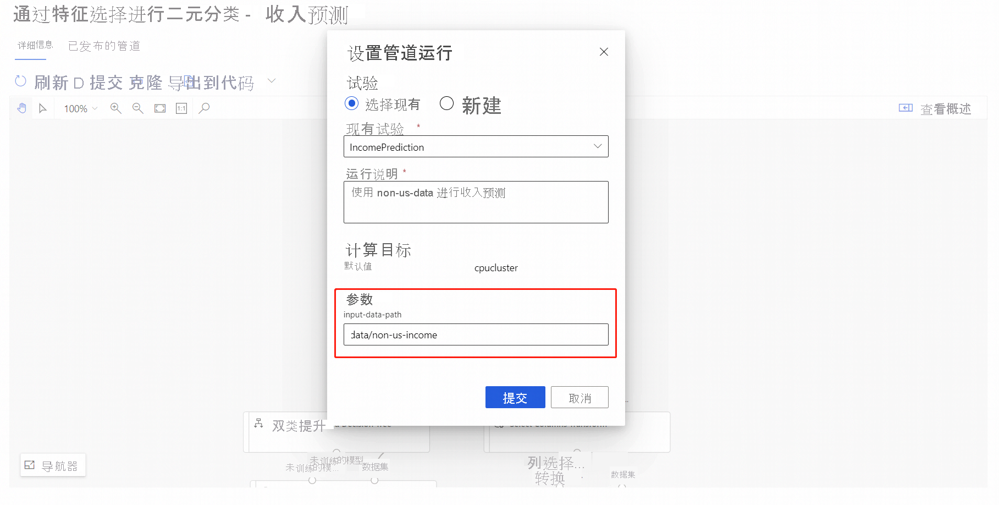

# Azure 机器学习设计器的重新训练模型（预览版）
[!INCLUDE [applies-to-skus](../../includes/aml-applies-to-enterprise-sku.md)]

在本操作方法指南中，你将了解如何使用 Azure 机器学习设计器重新训练机器学习模型。 了解如何使用已发布管道自动执行机器学习工作流以进行重新训练。

本文介绍如何执行以下操作：

> [!div class="checklist"]
> * 训练机器学习模型。
> * 创建管道参数。
> * 发布定型管道。
> * 重新训练模型。

## 必备条件

* Azure 订阅。 如果没有 Azure 订阅，请创建一个[免费帐户](https://aka.ms/AMLFree)。

* 具有企业 SKU 的 Azure 机器学习工作区。

本操作说明假定你具有在设计器中生成管道的基本知识。 有关设计器的引导式简介，请完成[教程](tutorial-designer-automobile-price-train-score.md)。 

### 示例管道

本文中使用的管道是在[示例3收入预测](how-to-designer-sample-classification-predict-income.md)中找到的版本的更改版本。 它使用[导入数据](algorithm-module-reference/import-data.md)模块，而不是示例数据集来演示如何使用自己的数据训练模型。

## 训练机器学习模型

若要重新训练模型，需要初始模型。 本部分介绍如何使用设计器训练模型并访问已保存的模型。

1. 选择 "**导入数据**" 模块。
1. 在 "属性" 窗格中，指定数据源。

    

    在此示例中，数据存储在[Azure](how-to-access-data.md)数据存储中。 如果还没有数据存储，现在可以通过选择 "**新建数据存储**" 创建一个数据存储。

1. 指定数据的路径。 还可以选择 "**浏览路径**" 以直观地浏览数据存储。 

1. 选择画布顶部的 "**运行**"。
    
    > [!NOTE]
    > 如果已为此管道草稿设置了默认计算，则管道将自动运行。 否则，你可以按照 "设置" 窗格中显示的提示进行操作。

### 定位定型模型

设计器将所有管道输出（包括训练的模型）保存到默认存储帐户。 您还可以直接在设计器中访问定型模型：

1. 等待管道完成运行。

1. 选择**训练模型**模块。

1. 在 "设置" 窗格中，选择 "**输出 + 日志**"。

1. 单击 "**查看输出**" 图标，然后按照弹出窗口中的说明查找训练的模型。

## 创建管道参数

添加管道参数，以在运行时动态设置变量。 对于此管道，为定型数据路径添加参数，以便您可以在新数据集上重新训练模型。

1. 选择 "**导入数据**" 模块。
1. 在 "设置" 窗格中，选择 "**路径**" 字段上方的省略号。
1. 选择 "**添加到管道参数**"。
1. 提供参数名称和默认值。

    > [!NOTE]
    > 可以通过选择管道草稿标题旁边的 "设置"**齿轮图标**来检查和编辑管道参数。 

## 发布定型管道

在发布管道时，它将创建管道终结点。 管道终结点可让你重复使用和管理管道以实现可重复性和自动化。 在此示例中，你已设置了管道以进行重新训练。

1. 在设计器画布上选择 "**发布**"。
1. 选择或创建一个新的管道终结点。

    > [!NOTE]
    > 可以将多个管道发布到单个终结点。 终结点中的每个管道都提供一个版本号，你可以在调用管道终结点时指定该版本号。

1. 选择“发布”。

## 重新训练模型

现在，你已有了一个已发布的训练管道，可以使用它来通过新数据重新训练模型。 可以从门户或以编程方式从管道终结点提交运行。

### 用设计器提交运行

使用以下步骤从设计器提交管道终结点运行：

1. 中转到 "**终结点**" 页。

1. 选择 "**管道终结点**" 选项卡。

1. 选择管道终结点。

1. 选择 "**已发布管道**" 选项卡。

1. 选择要运行的管道。

1. 选择“提交”。

1. 在 "设置" 对话框中，可以指定新的输入数据路径值，该值指向新的数据集。

### 提交运行代码

可以在 "概述" 面板中找到已发布管道的 REST 终结点。 通过调用终结点，你可以重新训练已发布的管道。

若要进行 REST 调用，你将需要 OAuth 2.0 持有者类型身份验证标头。 请参阅以下[教程部分](tutorial-pipeline-batch-scoring-classification.md#publish-and-run-from-a-rest-endpoint)，以详细了解如何设置工作区的身份验证并进行参数化 REST 调用。

## 后续步骤

按照设计器[教程](tutorial-designer-automobile-price-train-score.md)训练和部署回归模型。
