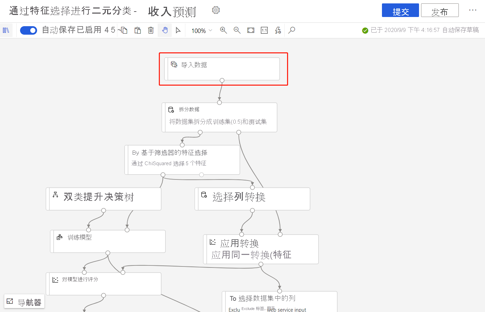

# 使用 Azure 机器学习设计器重新训练模型（预览版）
[!INCLUDE [applies-to-skus](../../includes/aml-applies-to-enterprise-sku.md)]

在本操作操作者文章中，您将了解如何使用 Azure 机器学习设计器重新训练机器学习模型。 您将使用已发布的管道来自动执行工作流并设置参数，以根据新数据训练模型。 

在本文中，学习如何：

> [!div class="checklist"]
> * 训练机器学习模型。
> * 创建管道参数。
> * 发布训练管道。
> * 使用新参数重新训练模型。

## 先决条件

* 使用企业 SKU 的 Azure 机器学习工作区。
* 设计器可访问的数据集。 可以是下列选项之一：
   * Azure 机器学习注册数据集
    
     **-或-**
   * 存储在 Azure 机器学习数据存储中的数据文件。
   
有关使用设计器访问数据的信息，请参阅[如何将数据导入设计器](how-to-designer-import-data.md)。

本文还假定您具备在设计器中构建管道的基本知识。 有关指导性介绍，请完成[教程](tutorial-designer-automobile-price-train-score.md)。 

### 示例管道

本文中使用的管道是[示例 3：收入预测](samples-designer.md#classification-samples)的更改版本。 管道使用[导入数据](algorithm-module-reference/import-data.md)模块而不是示例数据集来演示如何使用您自己的数据训练模型。

## 创建管道参数

创建管道参数以在运行时动态设置变量。 在此示例中，您将训练数据路径从固定值更改为参数，以便可以根据不同数据重新训练模型。

1. 选择“导入数据”**** 模块。

    > [!NOTE]
    > 本示例使用导入数据模块访问已注册数据存储中的数据。 但是，如果使用替代数据访问模式，可以执行类似的步骤。

1. 在画布右侧的模块详细信息窗格中，选择数据源。

1. 输入数据的路径。 您还可以选择 **"浏览路径"** 来浏览文件树。 

1. 鼠标悬停**路径**字段，然后选择显示的**路径**字段上方的椭圆。

    

1. 选择 **"添加到管道"参数**。

1. 提供参数名称和默认值。

   > [!NOTE]
   > 您可以通过选择管道拔模标题旁边的 **"设置**齿轮"图标来检查和编辑管道参数。 

1. 选择“保存”。 

1. 提交管道运行。

## 查找经过培训的模型

设计器将所有管道输出（包括经过训练的模型）保存到默认工作区存储帐户。 您还可以直接在设计器中访问经过训练的模型：

1. 等待管道完成运行。
1. 选择**训练模型**模块。
1. 在"模块详细信息"窗格中，在画布右侧选择 **"输出 + 日志**"。
1. 您可以在**其他输出**中查找模型以及运行日志。
1. 或者，选择 **"查看输出**"图标。 在此处，您可以按照对话框中的说明直接导航到数据存储。 

## 发布训练管道

将管道发布到管道终结点，以便将来轻松重用管道。 管道终结点将创建一个 REST 终结点来调用将来的管道。 在此示例中，管道终结点允许您重用管道以重新训练不同数据的模型。

1. 选择设计器画布上方的“发布”****。
1. 选择或创建管道终结点。

   > [!NOTE]
   > 可将多个管道发布到一个终结点。 给定终结点中的每个管道都会获得一个版本号，您可以在调用管道终结点时指定该版本号。

1. 选择“发布”  。

## 重新训练模型

现在，您已经发布了培训管道，您可以使用它重新训练模型的新数据。 可以从工作室工作区或以编程方式提交从管道终结点的运行。

### 使用设计器提交运行

使用以下步骤提交从设计器运行的参数化管道终结点：

1. 转到工作室工作区中的 **"终结点"** 页面。
1. 选择 **"管道终结点**"选项卡。然后，选择管道终结点。
1. 选择 **"已发布管道"** 选项卡。然后，选择要运行的管道版本。
1. 选择“提交”。 
1. 在"设置"对话框中，可以指定运行的参数值。 在此示例中，更新数据路径以使用非美国数据集训练模型。

### 使用代码提交运行

您可以在概述面板中找到已发布管道的 REST 终结点。 通过调用终结点，可以重新训练已发布的管道。

要进行 REST 调用，您需要一个 OAuth 2.0 承载式身份验证标头。 有关将身份验证设置为工作区和进行参数化 REST 调用的信息，请参阅构建[Azure 机器学习管道以进行批处理评分](tutorial-pipeline-batch-scoring-classification.md#publish-and-run-from-a-rest-endpoint)。

## 后续步骤

在本文中，您学习了如何使用设计器创建参数化训练管道终结点。

有关如何部署模型进行预测的完整演练，请参阅[设计器教程](tutorial-designer-automobile-price-train-score.md)以训练和部署回归模型。
