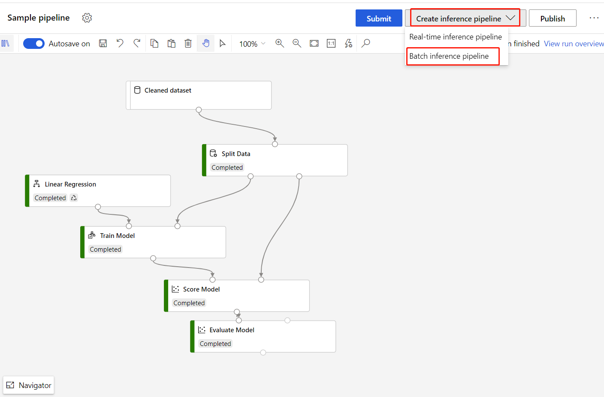
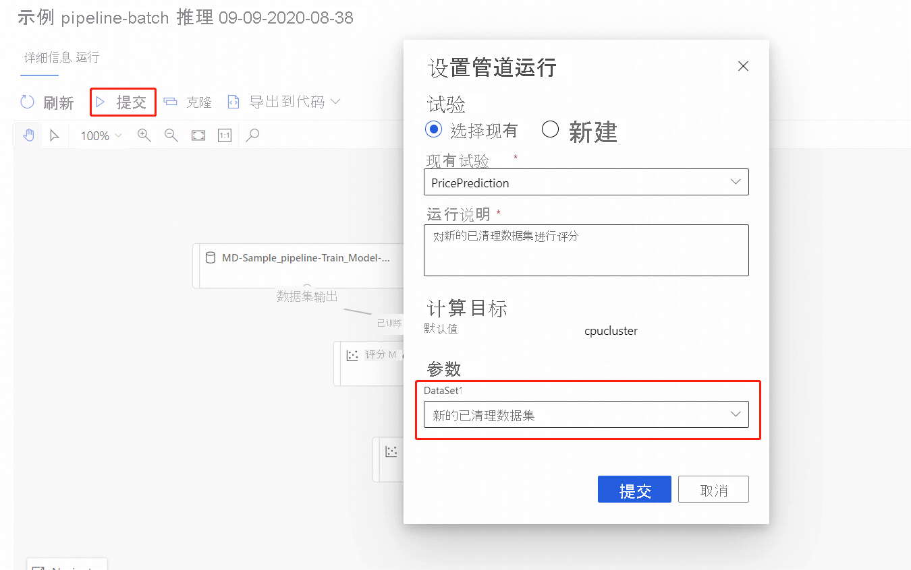

# 使用 Azure 机器学习设计器运行批量预测

本文介绍如何使用设计器创建批量预测管道。 借助批量预测，可以使用可从任何 HTTP 库触发的 Web 服务按需对大型数据集持续评分。

在本操作指南中，你将了解如何执行以下任务：

> [!div class="checklist"]
> * 创建并发布批量推理管道
> * 使用管道终结点
> * 管理终结点版本

要了解如何使用 SDK 设置批量评分服务，请参阅随附的[操作指南](./tutorial-pipeline-batch-scoring-classification.md)。

## 先决条件

本操作指南假设你已有一个训练管道。 有关设计器的引导式简介，请完成[设计器教程的第一部分](tutorial-designer-automobile-price-train-score.md)。 

[!INCLUDE [machine-learning-missing-ui](../../includes/machine-learning-missing-ui.md)]

## 创建批量推理管道

必须至少运行一次训练管道，才能创建推理管道。

1. 转到工作区中的“设计器”选项卡。

1. 选择训练管道，将使用它训练要用来进行预测的模型。

1. “提交”管道。

    

训练管道已运行，现在可以创建批量推理管道了。

1. 在“提交”旁边，选择新的下拉菜单“创建推理管道”。

1. 选择“批量推理管道”。

    
    
结果为默认批量推理管道。 

### 添加管道参数

要创建对新数据的预测，可以手动连接此管道草稿视图中的不同数据集，也可以创建数据集的参数。 通过参数可以在运行时更改批量推理过程的行为。

在本节中，你将创建一个数据集参数，以便指定要进行预测的不同目标数据集。

1. 选择数据集模块。

1. 画布右侧将显示一个窗格。 在窗格底部，选择“设置为管道参数”。
   
    输入参数名称或接受默认值。

    > [!div class="mx-imgBorder"]
    > 

## 发布批量推理管道

现已准备好部署推理管道。 下面的操作将部署管道，使其可供其他人使用。

1. 选择“发布”按钮。

1. 在出现的对话框中，展开“PipelineEndpoint”的下拉菜单，然后选择“新建 PipelineEndpoint”。

1. 提供终结点名称和可选说明。

    在对话框底部附近，可以看到使用训练期间所用的数据集 ID 默认值配置的参数。

1. 选择“发布”。

## 使用终结点

现在，你已有一个带数据集参数的已发布管道。 管道将使用在训练管道中创建的训练模型，对作为参数提供的数据集进行评分。

### 提交管道运行 

在本节中，你将设置手动管道运行，并修改管道参数，以便对新数据评分。 

1. 部署完成后，转到“终结点”部分。

1. 选择“管道终结点”。

1. 选择你创建的终结点的名称。

1. 选择“已发布管道”。

    此屏幕显示此终结点下的所有已发布管道。

1. 选择已发布的管道。

    “管道详细信息”页显示管道的详细运行历史记录和连接字符串信息。 
    
1. 选择“提交”创建管道的手动运行。

    
    
1. 更改参数以使用不同的数据集。
    
1. 选择“提交”运行管道。

### 使用 REST 终结点

可以在“终结点”部分中找到有关如何使用管道终结点和已发布管道的信息。

在“运行概述”面板中可以找到管道终结点的 REST 终结点。 通过调用终结点，将使用其默认的已发布管道。

另外，还可以在“已发布管道”页中使用已发布的管道。 选择一个已发布的管道，然后就可以在图右侧的“已发布管道概览”面板中找到该管道的 REST 终结点。 

若要进行 REST 调用，需要 OAuth 2.0 持有者类型身份验证标头。 请参阅以下[教程部分](tutorial-pipeline-batch-scoring-classification.md#publish-and-run-from-a-rest-endpoint)，以详细了解如何设置工作区的身份验证并进行参数化 REST 调用。

## 版本控制终结点

设计器将版本分配给你发布到终结点的每个后续管道。 可以在 REST 调用中指定要作为参数执行的管道版本。 如果不指定版本号，设计器将使用默认管道。

在发布管道时，可以选择将其设为该终结点的新默认管道。

另外，还可以在终结点的“已发布管道”选项卡中设置新的默认管道。

## 后续步骤

按照设计器[教程](tutorial-designer-automobile-price-train-score.md)训练和部署回归模型。
''