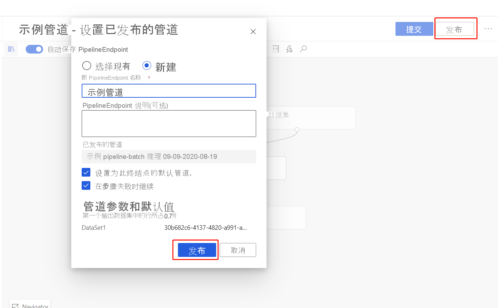

# 使用 Azure 机器学习设计器运行批量预测（预览版）
[!INCLUDE [applies-to-skus](../../includes/aml-applies-to-enterprise-sku.md)]

在本文中，您将了解如何使用设计器创建批处理预测管道。 批处理预测允许您使用可以从任何 HTTP 库触发的 Web 服务持续按需对大型数据集进行评分。

在此操作操作中，您将学习执行以下任务：

> [!div class="checklist"]
> * 创建和发布批处理推理管道
> * 使用管道终结点
> * 管理终结点版本

要了解如何使用 SDK 设置批处理评分服务，请参阅随附的["如何"](how-to-run-batch-predictions.md)

## 先决条件

此如何假定您已经具有培训管道。 有关设计师的导览介绍，请完成[设计器教程的第一部分](tutorial-designer-automobile-price-train-score.md)。 

## 创建批量推理管道

您的训练管道必须至少运行一次才能创建推断管道。

1. 转到工作区中的 **"设计器"** 选项卡。

1. 选择训练要用于预测模型的训练管道。

1. **提交**管道。

    

现在训练管道已经运行，您可以创建批处理推理管道。

1. 在 **"提交"** 旁边，选择新的下拉列表**创建推理管道**。

1. 选择**批处理推理管道**。

    
    
结果为默认批量推理管道。 

### 添加管道参数

要创建新数据的预测，可以在此管道草稿视图中手动连接其他数据集，也可以为数据集创建参数。 参数允许您更改运行时批处理推断过程的行为。

在本节中，您将创建一个数据集参数来指定要进行预测的不同数据集。

1. 选择数据集模块。

1. 画布右侧将显示一个窗格。 在窗格的底部，选择 **"设置为管道参数**"。
   
    输入参数的名称，或接受默认值。

## 发布批处理推断管道

现在，您已准备好部署推断管道。 这将部署管道，并使它可供其他人使用。

1. 选择“发布”按钮****。

1. 在显示的对话框中，展开**管道终结点**的下拉列表，然后选择 **"新建管道终结点**"。

1. 提供终结点名称和可选说明。

    在对话框底部附近，您可以看到使用定型期间使用的数据集 ID 的默认值配置的参数。

1. 选择“发布”。

## 使用终结点

现在，您有一个已发布的管道，具有数据集参数。 管道将使用在训练管道中创建的定型模型来对作为参数提供的数据集进行评分。

### 提交管道运行 

在本节中，您将设置手动管道运行并更改管道参数以为新数据评分。 

1. 部署完成后，转到 **"终结点"** 部分。

1. 选择**管道终结点**。

1. 选择您创建的终结点的名称。

1. 选择**已发布的管道**。

    此屏幕显示在此终结点下发布的所有已发布的管道。

1. 选择您发布的管道。

    管道详细信息页显示管道的详细运行历史记录和连接字符串信息。 
    
1. 选择 **"提交**"以创建管道的手动运行。

    
    
1. 更改参数以使用其他数据集。
    
1. 选择 **"提交**"以运行管道。

### 使用 REST 终结点

您可以在 **"终结点"** 部分中查找有关如何使用管道终结点和已发布的管道的信息。

您可以在运行概述面板中找到管道终结点的 REST 终结点。 通过调用终结点，您将使用其默认发布的管道。

您还可以在 **"已发布"管道**页中使用已发布的管道。 选择已发布的管道并查找其 REST 终结点。 

要进行 REST 调用，您需要一个 OAuth 2.0 承载式身份验证标头。 请参阅以下[教程部分](tutorial-pipeline-batch-scoring-classification.md#publish-and-run-from-a-rest-endpoint)，以详细了解如何设置工作区的身份验证并进行参数化 REST 调用。

## 版本控制终结点

设计器将一个版本分配给发布到终结点的每个后续管道。 您可以在 REST 调用中指定要作为参数执行的管道版本。 如果不指定版本号，设计器将使用默认管道。

发布管道时，可以选择使其成为该终结点的新默认管道。

您还可以在终结点的 **"已发布管道"** 选项卡中设置新的默认管道。

## 后续步骤

按照设计器[教程](tutorial-designer-automobile-price-train-score.md)训练和部署回归模型。
''