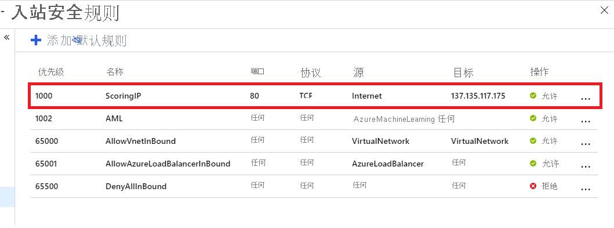

# <a name="secure-an-azure-machine-learning-inferencing-environment-with-virtual-networks"></a>使用虚拟网络保护 Azure 机器学习推理环境

本文介绍如何在 Azure 机器学习中使用虚拟网络保护推理环境。

本文是5部分系列中的第四部分，指导你完成保护 Azure 机器学习工作流的工作。 强烈建议您通读第 [一部分： VNet 概述](how-to-network-security-overview.md) 以首先了解总体体系结构。 

请参阅本系列中的其他文章：

[1. VNet 概述](how-to-network-security-overview.md)  >  [保护工作区](how-to-secure-workspace-vnet.md)  >  [3。保护定型环境](how-to-secure-training-vnet.md)  >  **4。保护推断环境**  >  [5。启用 studio 功能](how-to-enable-studio-virtual-network.md)

本文介绍如何在虚拟网络中保护以下推理资源：
> [!div class="checklist"]
> - 默认 Azure Kubernetes 服务 (AKS) 群集
> - 专用 AKS 群集
> - 具有专用链接的 AKS 群集
> - Azure 容器实例 (ACI)


## <a name="prerequisites"></a>先决条件

+ 阅读 [网络安全概述](how-to-network-security-overview.md) 一文，了解常见的虚拟网络方案和总体虚拟网络体系结构。

+ 用于计算资源的现有虚拟网络和子网。

+ 若要将资源部署到虚拟网络或子网，你的用户帐户必须对 azure RBAC)  (azure 基于角色的访问控制具有以下操作的权限：

    - “Microsoft.Network/virtualNetworks/join/action”（在虚拟网络资源上）。
    - “Microsoft.Network/virtualNetworks/subnet/join/action”（在子网资源上）。

    有关 Azure RBAC with 网络的详细信息，请参阅 [联网内置角色](/azure/role-based-access-control/built-in-roles#networking)

<a id="aksvnet"></a>

## <a name="azure-kubernetes-service"></a>Azure Kubernetes 服务

若要在虚拟网络中使用 AKS 群集，必须满足以下网络要求：

> [!div class="checklist"]
> * 遵循[在 Azure Kubernetes 服务 (AKS) 中配置高级网络](../aks/configure-azure-cni.md#prerequisites)中的先决条件。
> * AKS 实例和虚拟网络必须位于同一区域。 如果在虚拟网络中保护工作区使用的 Azure 存储帐户，这些帐户还必须与 AKS 实例位于同一虚拟网络中。


若要将虚拟网络中的 AKS 添加到工作区，请执行以下步骤：

1. 登录 [Azure 机器学习工作室](https://ml.azure.com/)，然后选择你的订阅和工作区。

1. 选择左侧的“计算”。

1. 在中心内选择“推理群集”，然后选择“+”。

1. 在“新建推理群集”对话框中，选择“网络配置”下的“高级”。

1. 若要将此计算资源配置为使用虚拟网络，请执行以下操作：

    1. 在“资源组”下拉列表中，选择包含虚拟网络的资源组。
    1. 在“虚拟网络”下拉列表中，选择包含子网的虚拟网络。
    1. 在“子网”下拉列表中选择子网。
    1. 在“Kubernetes 服务地址范围”中，输入 Kubernetes 服务地址范围。 此地址范围使用无类域间路由 (CIDR) 表示法表示的 IP 范围来定义群集可用的 IP 地址。 此范围不得与任何子网 IP 范围重叠（例如 10.0.0.0/16）。
    1. 在“Kubernetes DNS 服务 IP 地址”框中，输入 Kubernetes DNS 服务 IP 地址。 此 IP 地址将分配给 Kubernetes DNS 服务。 此 IP 地址必须在 Kubernetes 服务地址范围内（例如 10.0.0.10）。
    1. 在“Docker 网桥地址”框中，输入 Docker 网桥地址。 此 IP 地址将分配给 Docker 网桥。 此 IP 地址不得在任何子网 IP 范围或 Kubernetes 服务地址范围内（例如 172.17.0.1/16）。

   

1. 将模型作为 web 服务部署到 AKS 时，将创建一个计分终结点来处理推断请求。 如果要从虚拟网络外部调用，请确保控制虚拟网络的 NSG 组为评分终结点的 IP 地址启用了入站安全规则。

    若要查找评分终结点的 IP 地址，请查看已部署服务的评分 URI。 有关查看计分 URI 的详细信息，请参阅 [使用部署为 web 服务的模型](how-to-consume-web-service.md#connection-information)。

   > [!IMPORTANT]
   > 保留 NSG 的默认出站规则。 有关详细信息，请参阅[安全组](https://docs.microsoft.com/azure/virtual-network/security-overview#default-security-rules)中的“默认安全规则”。

   [](./media/how-to-enable-virtual-network/aks-vnet-inbound-nsg-scoring.png#lightbox)

    > [!IMPORTANT]
    > 用于计分终结点的图像中显示的 IP 地址将不同于你的部署。 尽管所有部署都将同一 IP 共享到一个 AKS 群集，但每个 AKS 群集都有不同的 IP 地址。

也可以使用 Azure 机器学习 SDK 在虚拟网络中添加 Azure Kubernetes 服务。 如果虚拟网络中已有一个 AKS 群集，请根据[如何部署到 AKS](how-to-deploy-and-where.md) 中所述，将此群集附加到工作区。 以下代码在名为 `mynetwork` 的虚拟网络的 `default` 子网中创建新的 AKS 实例：

```python
from azureml.core.compute import ComputeTarget, AksCompute

# Create the compute configuration and set virtual network information
config = AksCompute.provisioning_configuration(location="eastus2")
config.vnet_resourcegroup_name = "mygroup"
config.vnet_name = "mynetwork"
config.subnet_name = "default"
config.service_cidr = "10.0.0.0/16"
config.dns_service_ip = "10.0.0.10"
config.docker_bridge_cidr = "172.17.0.1/16"

# Create the compute target
aks_target = ComputeTarget.create(workspace=ws,
                                  name="myaks",
                                  provisioning_configuration=config)
```

创建过程完成后，可在虚拟网络后面的 AKS 群集上运行推理或模型评分。 有关详细信息，请参阅[如何部署 AKS](how-to-deploy-and-where.md)。

## <a name="secure-vnet-traffic"></a>保护 VNet 流量

有两种方法可以将往返于 AKS 群集的流量隔离到虚拟网络：

* __私有 AKS 群集__ ：此方法使用 Azure 专用链接来保护与群集的通信，以便进行部署/管理操作。
* __内部 AKS 负载均衡器__ ：此方法将部署到 AKS 的终结点配置为在虚拟网络中使用专用 IP。

> [!WARNING]
> 内部负载均衡器不适用于使用 kubenet 的 AKS 群集。 如果要同时使用内部负载均衡器和专用 AKS 群集，请使用 Azure Container 网络接口 (CNI) 配置专用 AKS 群集。 有关详细信息，请参阅 [在 Azure Kubernetes Service 中配置 AZURE CNI 网络](../aks/configure-azure-cni.md)。

### <a name="private-aks-cluster"></a>专用 AKS 群集

默认情况下，AKS 群集具有一个带有公共 IP 地址的控制平面（或 API 服务器）。 可以通过创建专用 AKS 群集，将 AKS 配置为使用专用控制平面。 有关详细信息，请参阅[创建专用 Azure Kubernetes 服务群集](../aks/private-clusters.md)。

创建专用 AKS 群集之后，[将群集连接到虚拟网络](how-to-create-attach-kubernetes.md)以便用于 Azure 机器学习。

> [!IMPORTANT]
> 在将启用了专用链接的 AKS 群集用于 Azure 机器学习之前，必须建立一个支持事件案例，否则无法启用此功能。 有关详细信息，请参阅[管理和增加配额](how-to-manage-quotas.md#private-endpoint-and-private-dns-quota-increases)。

### <a name="internal-aks-load-balancer"></a>内部 AKS 负载均衡器

默认情况下，AKS 部署使用[公共负载均衡器](../aks/load-balancer-standard.md)。 在本部分中，你会了解如何将 AKS 配置为使用内部负载均衡器。 内部（或专用）负载平衡器用于仅在前端允许专用 IP 的情况。 内部负载均衡器用于对虚拟网络内部的流量进行负载均衡

可以通过将 AKS 配置为使用内部负载均衡器来启用专用负载均衡器。 

#### <a name="network-contributor-role"></a>网络参与者角色

> [!IMPORTANT]
> 如果通过提供之前创建的虚拟网络来创建或附加 AKS 群集，则必须向 AKS 群集的服务主体 (SP) 或托管标识授予对包含虚拟网络的资源组的 _网络参与者_ 角色。 必须在尝试将内部负载均衡器更改为专用 IP 之前完成此操作。
>
> 若要将标识添加为网络参与者，请执行以下步骤：

1. 若要查找 AKS 的服务主体或托管标识 ID，请使用以下 Azure CLI 命令。 将 `<aks-cluster-name>` 替换为群集的名称。 将 `<resource-group-name>` 替换为包含 AKS 群集的资源组的名称：

    ```azurecli-interactive
    az aks show -n <aks-cluster-name> --resource-group <resource-group-name> --query servicePrincipalProfile.clientId
    ``` 

    如果此命令返回的值为 `msi`，请使用以下命令来识别托管标识的主体 ID：

    ```azurecli-interactive
    az aks show -n <aks-cluster-name> --resource-group <resource-group-name> --query identity.principalId
    ```

1. 若要查找包含虚拟网络的资源组的 ID，请使用以下命令。 将 `<resource-group-name>` 替换为包含虚拟网络的资源组的名称：

    ```azurecli-interactive
    az group show -n <resource-group-name> --query id
    ```

1. 若要将服务主体或托管标识添加为网络参与者，请使用以下命令。 使用为服务主体或托管标识返回的 ID 替换 `<SP-or-managed-identity>`。 使用为包含虚拟网络的资源组返回的 ID 替换 `<resource-group-id>`：

    ```azurecli-interactive
    az role assignment create --assignee <SP-or-managed-identity> --role 'Network Contributor' --scope <resource-group-id>
    ```
若要详细了解如何结合使用内部负载均衡器与 AKS，请参阅[结合使用内部负载均衡器与 Azure Kubernetes 服务](/azure/aks/internal-lb)。

#### <a name="enable-private-load-balancer"></a>启用专用负载均衡器

> [!IMPORTANT]
> 在 Azure 机器学习工作室中创建 Azure Kubernetes 服务群集时，无法启用专用 IP。 使用 Python SDK 或 Azure CLI 扩展进行机器学习时，可以创建一个具有内部负载均衡器的 AKS 群集。

以下示例演示如何使用 SDK 和 CLI __创建具有专用 IP/内部负载均衡器的新 AKS 群集__ ：

# <a name="python"></a>[Python](#tab/python)

```python
import azureml.core
from azureml.core.compute import AksCompute, ComputeTarget

# Verify that cluster does not exist already
try:
    aks_target = AksCompute(workspace=ws, name=aks_cluster_name)
    print("Found existing aks cluster")

except:
    print("Creating new aks cluster")

    # Subnet to use for AKS
    subnet_name = "default"
    # Create AKS configuration
    prov_config=AksCompute.provisioning_configuration(load_balancer_type="InternalLoadBalancer")
    # Set info for existing virtual network to create the cluster in
    prov_config.vnet_resourcegroup_name = "myvnetresourcegroup"
    prov_config.vnet_name = "myvnetname"
    prov_config.service_cidr = "10.0.0.0/16"
    prov_config.dns_service_ip = "10.0.0.10"
    prov_config.subnet_name = subnet_name
    prov_config.docker_bridge_cidr = "172.17.0.1/16"

    # Create compute target
    aks_target = ComputeTarget.create(workspace = ws, name = "myaks", provisioning_configuration = prov_config)
    # Wait for the operation to complete
    aks_target.wait_for_completion(show_output = True)
```

# <a name="azure-cli"></a>[Azure CLI](#tab/azure-cli)

```azurecli
az ml computetarget create aks -n myaks --load-balancer-type InternalLoadBalancer
```

有关详细信息，请参阅 [az ml computetarget create aks](https://docs.microsoft.com/cli/azure/ext/azure-cli-ml/ml/computetarget/create?view=azure-cli-latest&preserve-view=true#ext-azure-cli-ml-az-ml-computetarget-create-aks) 参考文档。

---

将现有群集附加到工作区时，必须等到附加操作完成后才能配置负载均衡器。 有关附加群集的信息，请参阅[附加现有的 AKS 群集](how-to-create-attach-kubernetes.md)。

附加现有群集后，可以更新群集以使用内部负载均衡器/专用 IP：

```python
import azureml.core
from azureml.core.compute.aks import AksUpdateConfiguration
from azureml.core.compute import AksCompute

# ws = workspace object. Creation not shown in this snippet
aks_target = AksCompute(ws,"myaks")

# Change to the name of the subnet that contains AKS
subnet_name = "default"
# Update AKS configuration to use an internal load balancer
update_config = AksUpdateConfiguration(None, "InternalLoadBalancer", subnet_name)
aks_target.update(update_config)
# Wait for the operation to complete
aks_target.wait_for_completion(show_output = True)
```

## <a name="enable-azure-container-instances-aci"></a>启用 Azure 容器实例 (ACI)

Azure 容器实例在部署模型时动态创建。 你必须为部署使用的子网启用子网委派，Azure 机器学习才能在虚拟网络中创建 ACI。

> [!WARNING]
> 在虚拟网络中使用 Azure 容器实例时，虚拟网络必须与 Azure 机器学习工作区位于同一资源组中。
>
> 在虚拟网络中使用 Azure 容器实例时，你的工作区的 Azure 容器注册表 (ACR) 不能也在该虚拟网络中。

若要将虚拟网络中的 ACI 用于工作区，请按照以下步骤操作：

1. 若要在虚拟网络上启用子网委派，请参阅[添加或删除子网委派](../virtual-network/manage-subnet-delegation.md)一文中的信息。 可以在创建虚拟网络时启用委派，也可以将它添加到现有网络。

    > [!IMPORTANT]
    > 启用委派时，使用 `Microsoft.ContainerInstance/containerGroups` 作为“将子网委派给服务”值。

2. 使用 [AciWebservice.deploy_configuration()](https://docs.microsoft.com/python/api/azureml-core/azureml.core.webservice.aci.aciwebservice?view=azure-ml-py&preserve-view=true#deploy-configuration-cpu-cores-none--memory-gb-none--tags-none--properties-none--description-none--location-none--auth-enabled-none--ssl-enabled-none--enable-app-insights-none--ssl-cert-pem-file-none--ssl-key-pem-file-none--ssl-cname-none--dns-name-label-none--primary-key-none--secondary-key-none--collect-model-data-none--cmk-vault-base-url-none--cmk-key-name-none--cmk-key-version-none--vnet-name-none--subnet-name-none-&preserve-view=true) 部署模型（使用 `vnet_name` 和 `subnet_name` 参数）。 将这些参数设置为启用了委派的虚拟网络名称和子网。


## <a name="next-steps"></a>后续步骤

本文是由四部分构成的虚拟网络系列文章中的第三部分。 若要了解如何保护虚拟网络，请参阅其余文章：

* [第1部分：虚拟网络概述](how-to-network-security-overview.md)
* [第 2 部分：保护工作区资源](how-to-secure-workspace-vnet.md)
* [第 3 部分：保护训练环境](how-to-secure-training-vnet.md)
* [第 5 部分：启用工作室功能](how-to-enable-studio-virtual-network.md)
