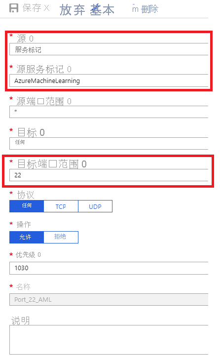

# <a name="secure-an-azure-machine-learning-training-environment-with-virtual-networks"></a>使用虚拟网络保护 Azure 机器学习定型环境
[!INCLUDE [applies-to-skus](../../includes/aml-applies-to-basic-enterprise-sku.md)]

本文介绍如何使用 Azure 机器学习中的虚拟网络保护培训环境。

本文是5部分系列中的第三部分，指导你完成保护 Azure 机器学习工作流的工作。 强烈建议您通读第 [一部分： VNet 概述](how-to-network-security-overview.md) 以首先了解总体体系结构。 

请参阅本系列中的其他文章：

[1. VNet 概述](how-to-network-security-overview.md)  >  [保护工作区](how-to-secure-workspace-vnet.md)  >  **3。保护定型环境**  >  [4。保护推断环境](how-to-secure-inferencing-vnet.md)   >  [5。启用 studio 功能](how-to-enable-studio-virtual-network.md)

本文介绍如何在虚拟网络中保护以下训练计算资源：
> [!div class="checklist"]
> - Azure 机器学习计算群集
> - Azure 机器学习计算实例
> - Azure Databricks
> - 虚拟机
> - HDInsight 群集

## <a name="prerequisites"></a>先决条件

+ 阅读 [网络安全概述](how-to-network-security-overview.md) 一文，了解常见的虚拟网络方案和总体虚拟网络体系结构。

+ 要用于计算资源的现有虚拟网络和子网。

+ 若要将资源部署到虚拟网络或子网中，你的用户帐户必须在 Azure 基于角色的访问控制 (RBAC) 中具有以下操作的权限：

    - “Microsoft.Network/virtualNetworks/join/action”（在虚拟网络资源上）。
    - “Microsoft.Network/virtualNetworks/subnet/join/action”（在子网资源上）。

    若要详细了解如何将 RBAC 与网络配合使用，请参阅[网络内置角色](/azure/role-based-access-control/built-in-roles#networking)


## <a name="compute-clusters--instances"></a><a name="compute-instance"></a>计算群集和实例 

若要在虚拟网络中使用[托管 Azure 机器学习计算目标](concept-compute-target.md#azure-machine-learning-compute-managed)或 [Azure 机器学习计算实例](concept-compute-instance.md)，必须满足以下网络要求：

> [!div class="checklist"]
> * 虚拟网络必须与 Azure 机器学习工作区位于同一订阅和区域中。
> * 为计算实例或群集指定的子网必须具有足够的未分配 IP 地址，以容纳目标 VM 数目。 如果该子网没有足够的未分配 IP 地址，则只会为计算群集分配一部分资源。
> * 检查对虚拟网络的订阅或资源组实施的安全策略或锁定是否限制了管理虚拟网络所需的权限。 如果你打算通过限制流量来保护虚拟网络，请为计算服务保持打开某些端口。 有关详细信息，请参阅[所需的端口](#mlcports)部分。
> * 若要将多个计算实例或群集放入一个虚拟网络，可能需要请求提高一个或多个资源的配额。
> * 如果工作区的一个或多个 Azure 存储帐户也在虚拟网络中受保护，它们必须与 Azure 机器学习计算实例或群集位于同一虚拟网络中。 
> * 为了让计算实例 Jupyter 功能可以正常运行，请确保没有禁用 Web 套接字通信。

> [!TIP]
> 机器学习计算实例或群集自动在包含虚拟网络的资源组中分配更多网络资源。 对于每个计算实例或群集，此服务分配以下资源：
> 
> * 一个网络安全组
> * 一个公共 IP 地址
> * 一个负载均衡器
> 
> 对于群集，每当群集纵向缩减为 0 个节点时，这些资源都会被删除（并重新创建）；但对于实例，这些资源会一直保留到实例完全删除（停止并不会删除资源）。 
> 这些资源受订阅的[资源配额](https://docs.microsoft.com/azure/azure-resource-manager/management/azure-subscription-service-limits)限制。


### <a name="required-ports"></a><a id="mlcports"></a> 所需端口

如果你计划通过限制进出公共 Internet 的网络流量来保护虚拟网络，则必须允许来自 Azure Batch 服务的入站通信。

Batch 服务在附加到 VM 的网络接口 (NIC) 级别添加网络安全组 (NSG)。 这些 NSG 自动配置允许以下流量的入站和出站规则：

- 端口 29876 和 29877 上的来自 __BatchNodeManagement__ 服务标记的入站 TCP 流量。

    

- （可选）端口 22 上允许远程访问的入站 TCP 流量。 仅当要在公共 IP 上使用 SSH 进行连接时，才使用此端口。

- 任何端口上通往虚拟网络的出站流量。

- 任何端口上通往 Internet 的出站流量。

- 对于端口 44224 上的来自 __AzureMachineLearning__ 服务标记的计算实例入站 TCP 流量。

> [!IMPORTANT]
> 在 Batch 配置的 NSG 中修改或添加入站或出站规则时，请务必小心。 如果 NSG 阻止与计算节点通信，则计算服务会将计算节点的状态设置为不可用。
>
> 不需要在子网级别指定 NSG，因为 Azure Batch 会配置自身的 NSG。 但是，如果包含 Azure 机器学习计算的子网具有关联的 NSG 或防火墙，则还必须允许前面列出的流量。

下图显示了 Azure 门户中的 NSG 规则配置：

:::image type="content" source="./media/how-to-enable-virtual-network/amlcompute-virtual-network-inbound.png" alt-text="用于机器学习计算的入站 NSG 规则" border="true":::


### <a name="limit-outbound-connectivity-from-the-virtual-network"></a><a id="limiting-outbound-from-vnet"></a> 限制来自虚拟网络的出站连接

如果你不想要使用默认的出站规则，同时想要限制虚拟网络的出站访问，请执行以下步骤：

- 使用 NSG 规则来拒绝出站 Internet 连接。

- 对于__计算实例__或__计算群集__，请将出站流量限制为以下各项：
   - Azure 存储 - 使用__服务标记__ __Storage.RegionName__。 其中 `{RegionName}` 是 Azure 区域的名称。
   - Azure 容器注册表 - 使用__服务标记__ __AzureContainerRegistry.RegionName__。 其中 `{RegionName}` 是 Azure 区域的名称。
   - Azure 机器学习，通过使用服务标记 AzureMachineLearning
   - Azure 资源管理器，通过使用服务标记 AzureResourceManager
   - Azure Active Directory - 使用__服务标记__ __AzureActiveDirectory__

下图展示了 Azure 门户中的 NSG 规则配置：

[](./media/how-to-enable-virtual-network/limited-outbound-nsg-exp.png#lightbox)

> [!NOTE]
> 如果你计划使用 Microsoft 提供的默认 Docker 映像并启用用户管理的依赖项，则还必须使用以下服务标记：
>
> * __MicrosoftContainerRegistry__
> * __AzureFrontDoor.FirstParty__
>
> 当你的训练脚本中有类似于以下代码片段的代码时，需要此配置：
>
> __RunConfig 训练__
> ```python
> # create a new runconfig object
> run_config = RunConfiguration()
> 
> # configure Docker 
> run_config.environment.docker.enabled = True
> # For GPU, use DEFAULT_GPU_IMAGE
> run_config.environment.docker.base_image = DEFAULT_CPU_IMAGE 
> run_config.environment.python.user_managed_dependencies = True
> ```
>
> __Estimator 训练__
> ```python
> est = Estimator(source_directory='.',
>                 script_params=script_params,
>                 compute_target='local',
>                 entry_script='dummy_train.py',
>                 user_managed=True)
> run = exp.submit(est)
> ```

### <a name="forced-tunneling"></a>强制隧道

若要将[强制隧道](/azure/vpn-gateway/vpn-gateway-forced-tunneling-rm)与机器学习计算配合使用，必须允许从包含计算资源的子网与公共 Internet 进行通信。 此通信用于计划和访问 Azure 存储的任务。

可以通过两种方式来实现此目的：

* 使用[虚拟网络 NAT](../virtual-network/nat-overview.md)。 NAT 网关为虚拟网络中的一个或多个子网提供出站 Internet 连接。 有关信息，请参阅[设计使用 NAT 网关资源的虚拟网络](../virtual-network/nat-gateway-resource.md)。

* 将[用户定义的路由 (UDR)](https://docs.microsoft.com/azure/virtual-network/virtual-networks-udr-overview) 添加到包含计算资源的子网。 为资源所在区域中的 Azure Batch 服务使用的每个 IP 地址建立一个 UDR。 借助这些 UDR，Batch 服务可以与计算节点进行通信，以便进行任务计划编制。 还要添加资源所在的 Azure 机器学习服务 IP 地址，因为这是访问计算实例所必需的。 若要获取 Batch 服务和 Azure 机器学习服务的 IP 地址列表，请使用以下方法之一：

    * 下载 [Azure IP 范围和服务标记](https://www.microsoft.com/download/details.aspx?id=56519)，并在文件中搜索 `BatchNodeManagement.<region>` 和 `AzureMachineLearning.<region>`（其中 `<region>` 是你的 Azure 区域）。

    * 使用 [Azure CLI](https://docs.microsoft.com/cli/azure/install-azure-cli?view=azure-cli-latest) 来下载信息。 下面的示例下载 IP 地址信息，并筛选掉美国东部 2 区域的信息：

        ```azurecli-interactive
        az network list-service-tags -l "East US 2" --query "values[?starts_with(id, 'Batch')] | [?properties.region=='eastus2']"
        az network list-service-tags -l "East US 2" --query "values[?starts_with(id, 'AzureMachineLearning')] | [?properties.region=='eastus2']"
        ```

        > [!TIP]
        > 如果你使用的是美国-弗吉尼亚州、美国东部地区或中国东部-2 区域，则这些命令不会返回任何 IP 地址。 而是使用以下链接之一下载 IP 地址列表：
        >
        > * [Azure 政府版的 azure IP 范围和服务标记](https://www.microsoft.com/download/details.aspx?id=57063)
        > * [适用于 Azure 中国的 azure IP 范围和服务标记](https://www.microsoft.com//download/details.aspx?id=57062)
    
    添加 UDR 时，请为每个相关的 Batch IP 地址前缀定义路由，并将“下一跃点类型”设置为“Internet”。  下图显示了 Azure 门户中此 UDR 的示例：

    

    除了定义的任何 UDR，还必须通过本地网络设备允许流向 Azure 存储的出站流量。 具体而言，此流量的 URL 采用以下格式：`<account>.table.core.windows.net`、`<account>.queue.core.windows.net` 和 `<account>.blob.core.windows.net`。 

    有关详细信息，请参阅[在虚拟网络中创建 Azure Batch 池](../batch/batch-virtual-network.md#user-defined-routes-for-forced-tunneling)。


### <a name="create-a-compute-cluster-in-a-virtual-network"></a>在虚拟网络中创建计算群集

若要创建机器学习计算群集，请按照以下步骤操作：

1. 登录 [Azure 机器学习工作室](https://ml.azure.com/)，然后选择你的订阅和工作区。

1. 选择左侧的“计算”。

1. 在中心内选择“训练群集”，然后选择“+”。

1. 在“新建训练群集”对话框中，展开“高级设置”部分。

1. 若要将此计算资源配置为使用虚拟网络，请在“配置虚拟网络”部分中执行以下操作：

    1. 在“资源组”下拉列表中，选择包含虚拟网络的资源组。
    1. 在“虚拟网络”下拉列表中，选择包含子网的虚拟网络。
    1. 在“子网”下拉列表中，选择要使用的子网。

   

也可以使用 Azure 机器学习 SDK 创建机器学习计算群集。 以下代码在名为 `mynetwork` 的虚拟网络的 `default` 子网中创建新的机器学习计算群集：

```python
from azureml.core.compute import ComputeTarget, AmlCompute
from azureml.core.compute_target import ComputeTargetException

# The Azure virtual network name, subnet, and resource group
vnet_name = 'mynetwork'
subnet_name = 'default'
vnet_resourcegroup_name = 'mygroup'

# Choose a name for your CPU cluster
cpu_cluster_name = "cpucluster"

# Verify that cluster does not exist already
try:
    cpu_cluster = ComputeTarget(workspace=ws, name=cpu_cluster_name)
    print("Found existing cpucluster")
except ComputeTargetException:
    print("Creating new cpucluster")

    # Specify the configuration for the new cluster
    compute_config = AmlCompute.provisioning_configuration(vm_size="STANDARD_D2_V2",
                                                           min_nodes=0,
                                                           max_nodes=4,
                                                           vnet_resourcegroup_name=vnet_resourcegroup_name,
                                                           vnet_name=vnet_name,
                                                           subnet_name=subnet_name)

    # Create the cluster with the specified name and configuration
    cpu_cluster = ComputeTarget.create(ws, cpu_cluster_name, compute_config)

    # Wait for the cluster to be completed, show the output log
    cpu_cluster.wait_for_completion(show_output=True)
```

创建过程完成后，请在试验中使用该群集训练模型。 有关详细信息，请参阅[选择并使用用于训练的计算目标](how-to-set-up-training-targets.md)。

[!INCLUDE [low-pri-note](../../includes/machine-learning-low-pri-vm.md)]

### <a name="access-data-in-a-compute-instance-notebook"></a>访问计算实例笔记本中的数据

如果要在 Azure 计算实例上使用笔记本，则必须确保笔记本在与数据相同的虚拟网络和子网后的计算资源上运行。 

在创建过程中，你必须在“高级设置” > “配置虚拟网络”下将你的计算实例配置为位于同一虚拟网络中。 。 无法将现有计算实例添加到虚拟网络中。

## <a name="azure-databricks"></a>Azure Databricks

若要将虚拟网络中的 Azure Databricks 用于工作区，必须满足以下要求：

> [!div class="checklist"]
> * 该虚拟网络必须与 Azure 机器学习工作区位于同一订阅和区域。
> * 如果工作区的 Azure 存储帐户也在虚拟网络中受保护，则它们必须与 Azure Databricks 群集位于同一虚拟网络中。
> * 除了 Azure Databricks 使用的 __databricks-private__ 和 __databricks-public__ 子网以外，还需要为虚拟网络创建 __default__ 子网。

若要详细了解如何结合使用 Azure Databricks 和虚拟网络，请参阅[在 Azure 虚拟网络中部署 Azure Databricks](https://docs.azuredatabricks.net/administration-guide/cloud-configurations/azure/vnet-inject.html)。

<a id="vmorhdi"></a>

## <a name="virtual-machine-or-hdinsight-cluster"></a>虚拟机或 HDInsight 群集

> [!IMPORTANT]
> Azure 机器学习只支持运行 Ubuntu 的虚拟机。

本部分介绍如何在工作区中使用虚拟网络中的虚拟机或 Azure HDInsight 群集。

### <a name="create-the-vm-or-hdinsight-cluster"></a>创建 VM 或 HDInsight 群集

使用 Azure 门户或 Azure CLI 创建 VM 或 HDInsight 群集，然后将群集置于 Azure 虚拟网络中。 有关详细信息，请参阅以下文章：
* [为 Linux VM 创建和管理 Azure 虚拟网络](https://docs.microsoft.com/azure/virtual-machines/linux/tutorial-virtual-network)

* [使用 Azure 虚拟网络扩展 HDInsight](https://docs.microsoft.com/azure/hdinsight/hdinsight-extend-hadoop-virtual-network)

### <a name="configure-network-ports"></a>配置网络端口 

允许 Azure 机器学习与 VM 或群集上的 SSH 端口通信，为网络安全组配置源条目。 SSH 端口通常是端口 22。 若要允许来自此源的流量，请执行以下操作：

1. 在“源”下拉列表中，选择“服务标记”。

1. 在“源服务标记”下拉列表中，选择“AzureMachineLearning”。 

    

1. 在“源端口范围”下拉列表中，选择 __*__ 。

1. 在“目标”下拉列表中，选择“任何”。 

1. 在“目标端口范围”下拉列表中，选择“22”。 

1. 在“协议”下，选择“任何”。 

1. 在“操作”下，选择“允许”。 

保留网络安全组的默认出站规则。 有关详细信息，请参阅[安全组](https://docs.microsoft.com/azure/virtual-network/security-overview#default-security-rules)中的“默认安全规则”。

如果你不想要使用默认出站规则，同时想要限制虚拟网络的出站访问，请参阅[限制来自虚拟网络的出站连接](#limiting-outbound-from-vnet)部分。

### <a name="attach-the-vm-or-hdinsight-cluster"></a>附加 VM 或 HDInsight 群集

将 VM 或 HDInsight 群集附加到 Azure 机器学习工作区。 有关详细信息，请参阅[设置模型训练的计算目标](how-to-set-up-training-targets.md)。

## <a name="next-steps"></a>后续步骤

本文是由四部分构成的虚拟网络系列中的第三部分。 若要了解如何保护虚拟网络，请参阅其余文章：

* [第1部分：虚拟网络概述](how-to-network-security-overview.md)
* [第2部分：保护工作区资源](how-to-secure-workspace-vnet.md)
* [第4部分：保护推断环境](how-to-secure-inferencing-vnet.md)
* [第5部分：启用 studio 功能](how-to-enable-studio-virtual-network.md)