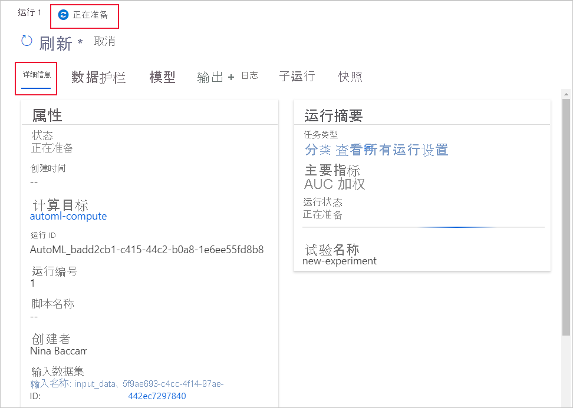

# 使用 Azure 机器学习创建、查看和部署自动化机器学习模型
[!INCLUDE [applies-to-skus](../../includes/aml-applies-to-enterprise-sku.md)]

本文介绍如何在不编写任何代码的情况下，在 Azure 机器学习工作室界面中创建、探索和部署自动化机器学习模型。 自动化机器学习是一个为你选择要用于特定数据的最佳机器学习算法的过程。 通过此过程可以快速生成机器学习模型。 [详细了解自动化机器学习](concept-automated-ml.md)。
 
对于端到端示例，请试用[使用 Azure 机器学习的自动化 ML 界面创建分类模型教程](tutorial-first-experiment-automated-ml.md)。 

要获得 Python 基于代码的体验，请使用 Azure 机器学习 SDK [配置自动化机器学习试验](how-to-configure-auto-train.md)。

## 先决条件

* Azure 订阅。 如果没有 Azure 订阅，请在开始操作前先创建一个免费帐户。 立即试用[免费版或付费版 Azure 机器学习](https://aka.ms/AMLFree)。

* **企业版**类型的 Azure 机器学习工作区。 请参阅[创建 Azure 机器学习工作区](how-to-manage-workspace.md)。  若要将现有的工作区升级到企业版，请参阅[升级到企业版](how-to-manage-workspace.md#upgrade)。

## 入门

1. 登录到 https://ml.azure.com 处的 Azure 机器学习。 

1. 选择订阅和工作区。 

1. 导航到左侧窗格。 在“创作”部分下，选择“自动化 ML”**** ****。

 如果这是第一个进行试验，将会看到空列表和文档链接。 

否则，将看到最近进行的自动化机器学习试验列表，包括使用 SDK 创建的试验。 

## 创建并运行试验

1. 选择“+ 新建自动化 ML 运行”**** 并填充窗体。

1. 选择存储容器中的数据集，或创建新数据集。 可以基于本地文件、Web URL、数据存储或 Azure 开放数据集创建数据集。 

    >[!Important]
    > 训练数据的要求：
    >* 数据必须为表格格式。
    >* 要预测的值（目标列）必须在数据中存在。

    1. 若要基于本地计算机上的文件创建新数据集，请选择“浏览”，然后选择该文件。**** 

    1. 为数据集指定唯一名称，并提供可选说明。 

    1. 选择“下一步”****，以打开“数据存储和文件选择”**** 窗体。 在此窗体上，你需选择要将数据集上传到何处：将数据集上传到在工作区中自动创建的默认存储容器，或选择要用于试验的存储容器。 

    1. 查看“设置和预览”窗体中内容的准确性****。 该窗体是基于文件类型智能填充的。 

        字段| 说明
        ----|----
        文件格式| 定义文件中存储的数据的布局和类型。
        分隔符| 一个或多个字符，用于指定纯文本或其他数据流中不同的独立区域之间的边界。
        编码| 指定字符架构表中用于读取数据集的位。
        列标题| 指示如何处理数据集的标头（如果有）。
        跳过行 | 指示要跳过数据集中的多少行（如果有）。
    
        选择“**下一步**”。

    1. “架构”窗体是基于“设置和预览”窗体中所做的选择智能填充的。**** **** 在此处，请配置每个列的数据类型，检查列名称，并选择“不包含”哪些列进行试验。**** 
            
        选择“下一步”。****

    1. “确认详细信息”窗体上总结了先前在“基本信息”和“设置和预览”窗体中填充的信息**** **** ****。 你还可以使用已启用分析的计算来为数据集创建数据配置文件。 详细了解[数据分析](#profile)。

        选择“**下一步**”。
1. 新建的数据集出现后，请将其选中。 还可以查看数据集和样本统计信息的预览。 

1. 在“配置运行”窗体中，输入唯一的试验名称。****

1. 选择目标列；这是要对其进行预测的列。

1. 为数据分析和训练作业选择计算。 下拉列表中提供了现有计算的列表。 若要创建新的计算，请按照步骤 7 中的说明操作。

1. 选择“创建新计算”，以便为此试验配置计算上下文。****

    字段|说明
    ---|---
    计算名称| 输入用于标识计算上下文的唯一名称。
    虚拟机大小| 指定计算资源的虚拟机大小。
    最小/最大节点数（在“高级设置”中）| 若要分析数据，必须指定一个或多个节点。 输入计算的最大节点数。 对于 AML 计算，默认值为 6 个节点。
    
    选择“创建” ****。 创建新计算可能需要花费几分钟时间。

    >[!NOTE]
    > 计算名称将会指示选择/创建的计算是否已启用分析。** （有关更多详细信息，请参阅[数据分析](#profile)部分）。

    选择“**下一步**”。

1. 在“任务类型和设置”窗体中选择任务类型：分类、回归或预测。**** 有关详细信息，请参阅[支持的任务类型](concept-automated-ml.md#when-to-use-automl-classify-regression--forecast)。

    1. 对于分类，还可以启用用于文本特征化的深度学习。

    1. 对于预测：
        1. 选择时间列：此列包含要使用的时间数据。

        1. 选择预测边际：指示模型可以预测未来的多少个时间单位（分钟/小时/天/周/月/年）。 模型需要预测的未来时间越久远，其准确度越低。 [详细了解预测和预测范围](how-to-auto-train-forecast.md)。

1. （可选）查看附加配置设置：可用来更好地控制训练作业的其他设置。 否则，将会根据试验选择和数据应用默认设置。 

    其他配置|说明
    ------|------
    主要指标| 用于对模型进行评分的主要指标。 [详细了解模型指标](how-to-configure-auto-train.md#explore-model-metrics)。
    自动特征化| 选择此项可以启用或禁用自动化机器学习执行的特征化。 自动特征化包括自动化数据清理、准备和转换，以生成合成特征。 不支持时序预测任务类型。 [详细了解特征化](how-to-configure-auto-features.md#featurization)。 
    解释最佳模型 | 此项用于允许或禁止显示建议最佳模型的解释
    阻止的算法| 选择要从训练作业中排除的算法。
    退出条件| 如果满足其中的任一条件，则会停止训练作业。   *训练作业时间(小时)* ：允许训练作业运行多长时间。   *指标评分阈值*：所有管道的最低指标评分。 这可以确保在你具有一个要实现的已定义目标指标时，无需花费不必要的时间来完成训练作业。
    验证| 选择要在训练作业中使用的交叉验证选项之一。 [详细了解交叉验证](how-to-configure-cross-validation-data-splits.md#prerequisites)。
    并发| *最大并发迭代数*：要在训练作业中测试的最大管道（迭代）数。 作业运行的迭代数不会超过指定的数目。

1. （可选）查看特征化设置：如果选择在“其他配置设置”窗体中启用“自动特征化”，则会应用默认的特征化技术**** ****。 在“查看特征化设置”中，可以更改这些默认设置并相应地进行自定义****。 了解如何[自定义特征化](#customize-featurization)。 

    

## 数据分析和摘要统计信息

可以获取整个数据集的各种摘要统计信息，以验证该数据集是否随时可在机器学习中使用。 对于非数字列，仅包括最小值、最大值和误差计数等基本统计信息。 对于数字列，还可以查看其统计时刻和估算的分位数。 具体而言，我们的数据配置文件包括：

>[!NOTE]
> 对于具有不相关类型的特征，将显示空白条目。

统计|说明
------|------
功能| 正在汇总的列的名称。
配置文件| 基于推理的类型显示的内联可视化效果。 例如，字符串、布尔值和日期包含值计数，而小数（数字）则包含近似的直方图。 这样，就可以快速了解数据的分布。
类型分布| 列中类型的内联值计数。 Null 是其自身的类型，因此，此可视化效果可用于检测反常值或缺失值。
类型|列的推理类型。 可能的值包括：字符串、布尔值、日期和小数。
Min| 列的最小值。 对于其类型不采用固有顺序（例如布尔值）的特征，将显示空白条目。
Max| 列的最大值。 
计数| 列中缺失和未缺失条目的总数。
非缺失计数| 列中未缺失的条目数。 空字符串和误差被视为值，因此它们不会计入“未缺少计数”。
分位数| 每个分位数中的近似值，用于提供数据分布的概观。
平均值| 列的算术中间值或平均值。
标准偏差| 此列数据的离散量或差异量的度量。
Variance| 此列数据与其平均值之间的分散程度度量。 
倾斜| 此列数据与正态分布之间的差异程度度量。
峰度| 此列数据与正态分布相比的落后程度度量。

## 自定义特征化

在“特征化”窗体中，可以启用/禁用自动特征化，并为试验自定义自动特征化设置****。 若要打开此窗体，请参阅[创建并运行试验](#create-and-run-experiment)部分中的步骤 10。 

下表汇总了工作室中目前可用的自定义。 

列| 自定义
---|---
已含 | 指定训练时要包含的列。
特征类型| 更改选定列的值类型。
插补值| 选择数据中用于插补缺失值的值。

## 运行试验并查看结果

选择“完成”来运行试验。**** 试验准备过程最长可能需要 10 分钟。 训练作业可能需要额外的 2-3 分钟，使每个管道完成运行。

### 查看试验详细信息

“运行详细信息”屏幕中会打开“详细信息”选项卡。**** **** 此屏幕显示试验运行的摘要，在顶部的运行编号旁会显示状态栏。 

“模型”选项卡包含按指标评分排序的已创建模型列表。**** 默认情况下，列表中首先显示评分最高的模型（评分根据所选指标给出）。 在训练作业尝试了更多的模型后，这些模型将添加到列表中。 使用此功能可以快速比较到目前为止生成的模型的指标。

### 查看训练运行详细信息

在任何已完成的模型中向下钻取，以查看训练运行详细信息，例如，“模型详细信息”选项卡上的运行指标，或“可视化效果”选项卡上的性能。**** ****[详细了解图表](how-to-understand-automated-ml.md)。

## 部署模型

获得最佳模型后，可将其部署为 Web 服务以根据新数据进行预测。

自动化 ML 可帮助你在不编写任何代码的情况下部署模型：

1. 可以使用多个部署选项。 

    + 选项 1：若要部署最佳模型（根据你定义的指标条件），请从“详细信息”选项卡中选择“部署最佳模型”按钮。**** ****

    + 选项 2：若要从此试验部署特定的模型迭代，请在模型中向下钻取以打开其“模型详细信息”选项卡，然后选择“部署模型”。**** ****

1. 填充“部署模型”窗格。****

    字段| Value
    ----|----
    名称| 输入部署的唯一名称。
    说明| 输入说明，以更清楚地指出此部署的用途。
    计算类型| 选择要部署的终结点类型：Azure Kubernetes 服务 (AKS) 或 Azure 容器实例 (ACI)** **。
    计算名称| 仅适用于 AKS**：选择要部署到的 AKS 群集的名称。
    启用身份验证 | 选择此项将允许基于令牌或基于密钥的身份验证。
    使用自定义部署资产| 若要上传自己的评分脚本和环境文件，请启用此功能。 [详细了解评分脚本](how-to-deploy-and-where.md#script)。

    >[!Important]
    > 文件名不能超过 32 个字符，并且必须以字母数字开头和结尾。 开头和结尾之间可以包含短划线、下划线、句点和字母数字。 不允许空格。

    “高级”菜单提供默认部署功能，例如[数据收集](how-to-enable-app-insights.md)和资源利用率设置。** 若要替代这些默认设置，请在此菜单中替代。

1. 选择“部署”。**** 完成部署可能需要大约 20 分钟。
    部署开始后，会显示“模型详细信息”选项卡****。 请在“属性”窗格的“部署状态”部分下查看部署进度**** ****。 

现在，你已获得一个正常运行的、可以生成预测结果的 Web 服务！ 可以通过 [Power BI 内置的 Azure 机器学习支持](how-to-consume-web-service.md#consume-the-service-from-power-bi)查询该服务，以测试预测。

## 后续步骤

* [了解如何使用 Web 服务](https://docs.microsoft.com/azure/machine-learning/how-to-consume-web-service)。
* [了解自动化机器学习结果](how-to-understand-automated-ml.md)。
* [详细了解自动化机器学习](concept-automated-ml.md)和 Azure 机器学习。
