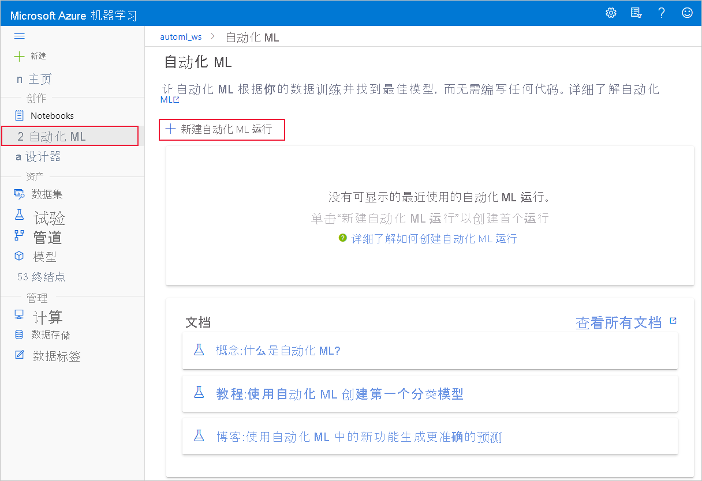

# <a name="create-review-and-deploy-automated-machine-learning-models-with-azure-machine-learning"></a>通过 Azure 机器学习创建、查看和部署自动化机器学习模型
[!INCLUDE [applies-to-skus](../../includes/aml-applies-to-enterprise-sku.md)]

本文介绍如何创建、浏览和部署自动化机器学习模型，而无需在 Azure 机器学习工作室界面中编写任何代码。 自动化机器学习是为特定数据选择要使用的最佳机器学习算法的过程。 通过此过程，你能够快速生成机器学习模型。 [详细了解自动化机器学习](concept-automated-ml.md)。
 
有关端到端示例，请查看[使用 Azure 机器学习的自动化 ML 接口创建分类模型的教程](tutorial-first-experiment-automated-ml.md)。 

如需基于 Python 代码的体验，请使用 Azure 机器学习 SDK [配置自动化机器学习试验](how-to-configure-auto-train.md)。

## <a name="prerequisites"></a>先决条件

* Azure 订阅。 如果没有 Azure 订阅，请在开始操作前先创建一个免费帐户。 立即试用[免费版或付费版 Azure 机器学习](https://aka.ms/AMLFree)。

* 使用 Enterprise Edition 类型的 Azure 机器学习工作区。 请参阅[创建 Azure 机器学习工作区](how-to-manage-workspace.md)。  若要将现有工作区升级到 Enterprise Edition，请参阅[升级到 Enterprise Edition](how-to-manage-workspace.md#upgrade)。

## <a name="get-started"></a>入门

1. 登录到 https://ml.azure.com 处的 Azure 机器学习。 

1. 选择订阅和工作区。 

1. 导航到左窗格。 在“创作”部分，选择“自动化 ML” 。

[](media/how-to-use-automated-ml-for-ml-models/nav-pane-expanded.png)

 如果这是你首次执行任何试验，会看到一个空列表和多个指向文档的链接。 

如果不是，会看到最近的自动化机器学习试验的列表，包括使用 SDK 创建的那些试验。 

## <a name="create-and-run-experiment"></a>创建并运行试验

1. 选择“+ 新建自动化 ML 运行”并填充窗体。

1. 选择存储容器中的数据集，或创建新数据集。 可以从本地文件、Web URL、数据存储或 Azure 开放数据集创建数据集。 

    >[!Important]
    > 数据训练要求：
    >* 数据必须为表格格式。
    >* 数据中必须存在于要预测的值（目标列）。

    1. 若要从本地计算机上的某个文件创建新数据集，请选择“浏览”，然后选择该文件。 

    1. 为数据集指定唯一名称，并提供可选说明。 

    1. 选择“下一步”，打开“数据存储和文件选择窗体” 。 在此窗体上，可以选择要上传数据集的位置；选择使用工作区自动创建的默认存储容器，或选择要用于试验的存储容器。 

    1. 查看“设置和预览”窗体中内容的准确性。 此窗体将根据文件类型进行智能填充。 

        字段| 说明
        ----|----
        文件格式| 定义文件中存储的数据的布局和类型。
        分隔符| 一个或多个字符，用于指定纯文本或其他数据流中不同的独立区域之间的边界。
        编码| 指定字符架构表中用于读取数据集的位。
        列标题| 指示如何处理数据集的标头（如果有）。
        跳过行 | 指示要跳过数据集中的多少行（如果有）。
    
        选择“**下一页**”。

    1. 根据“设置和预览”窗体中的选择，智能地填充“架构”窗体 。 在此处配置每个列的数据类型，查看列名称，并选择试验中“不包括”的列。 
            
        选择“下一步”。

    1. “确认详细信息”窗体上总结了先前在“基本信息”和“设置和预览”窗体中填充的信息  。 此外，还可以选择使用支持分析功能的计算为数据集创建数据配置文件。 详细了解[数据分析](#profile)。

        选择“**下一页**”。
1. 新创建的数据集显示后，将其选中。 还可以查看数据集和示例统计信息的预览。 

1. 在“配置运行”窗体上，输入唯一的试验名称。

1. 选择目标列；即要对其进行预测的列。

1. 针对数据分析和训练作业选择一个计算。 下拉列表中提供了现有计算的列表。 若要创建新计算，请按照步骤 7 中的说明进行操作。

1. 选择“创建新计算”，为此试验配置计算上下文。

    字段|说明
    ---|---
    计算名称| 输入用于标识计算上下文的唯一名称。
    虚拟机大小| 指定计算资源的虚拟机大小。
    最小/最大节点数（在“高级设置”中）| 若要分析数据，必须指定一个或多个节点。 输入用于计算的最大节点数。 对于一个 AML 计算，默认值为 6 个节点。
    
    选择“创建”。 创建新计算可能需要几分钟时间。

    >[!NOTE]
    > 计算名称将指示所选择/创建的计算是否启用了分析功能。 （有关详细信息，请参阅[数据分析](#profile)部分）。

    选择“**下一页**”。

1. 在“任务类型和设置”窗体上，选择任务类型、分类、回归或预测。 有关详细信息，请参阅[如何定义任务类型](how-to-define-task-type.md)。

    1. 对于分类，还可以启用用于文本特征工程的深度学习功能。

    1. 对于预测：
        1. 选择时间列：此列包含要使用的时间数据。

        1. 选择预测范围：指示模型能够预测未来多长时间的情况（以分钟/小时/天/周/月/年为单位）。 模型需要预测的未来越远，其准确性越低。 [详细了解预测和预测范围](how-to-auto-train-forecast.md)。

1. （可选）查看附加配置设置：可用于更好地控制训练作业的附加设置。 否则，将会根据试验选择和数据应用默认设置。 

    其他配置|说明
    ------|------
    主要指标| 用于对模型进行评分的主要指标。 [详细了解模型指标](how-to-configure-auto-train.md#explore-model-metrics)。
    自动特征化| 选择启用或禁用由自动化机器学习执行的预处理。 预处理包括自动化数据清理、准备和转换，以生成合成特征。 不支持时序预测任务类型。 [详细了解预处理](#featurization)。 
    解释最佳模型 | 选择启用或禁用，确定是否显示建议的最佳模型的可解释性
    阻止的算法| 选择要从训练作业中排除的算法。
    退出条件| 如果满足以下任意条件，训练作业就会停止。 <br> 训练作业时间(小时)：允许训练作业运行的时间。 <br> 指标分数阈值：所有管道的最小指标分数。 这可确保如果需要达到某个定义的目标指标，不会花费过多时间来完成训练作业。
    验证| 选择要在训练作业中使用的一个交叉验证选项。 [详细了解交叉验证](how-to-configure-auto-train.md)。
    并发| 最大并发迭代数：训练作业中要测试的最大管道数（迭代）。 作业运行的次数将不会超过指定的迭代次数。

1. （可选）查看特征工程设置：如果选择在“附加配置设置”窗体中启用“自动化特征工程”，则可以在此窗体中指定要执行这些特征工程的列，并选择要用于插补缺失值的统计值 。

<a name="profile"></a>

## <a name="data-profiling--summary-stats"></a>数据分析与摘要统计信息

可以在数据集中获取各种摘要统计信息，用于验证数据集是否 ML 就绪。 对于非数值列，它们仅包含最小值、最大值和错误计数等基本统计信息。 对于数值列，还可以查看它们的统计矩和估计分位数。 具体而言，我们的数据配置文件包括：

>[!NOTE]
> 对于关类型不相的特征，将显示空白条目。

统计信息|说明
------|------
Feature| 正在汇总的列的名称。
配置文件| 基于推断的类型的内联可视化效果。 例如，字符串、布尔值和日期具有值计数，而小数（数字）则具有近似的直方图。 这样可以快速了解数据的分布情况。
类型分布| 列中类型的内联值计数。 Null 是其自己的类型，因此这个可视化效果可用于检测奇数值或缺失值。
类型|列的推断类型。 可能的值包括：字符串、布尔值、日期和小数。
Min| 列的最小值。 对于没有固有顺序（例如布尔值）的特征类型，将显示空白条目。
Max| 列的最大值。 
Count| 列中缺失和非缺失条目的总数。
非缺失计数| 列中的非缺失条目数。 空字符串和错误被视为值，因此它们将计入“非缺失计数”。
分位数| 每个分位数的近似值可大致反映出数据的分布。
平均值| 列的算术平均值或平均值。
标准偏差| 度量此列数据的离差量或变化量。
Variance| 度量此列的数据超出其平均值的差值。 
倾斜| 度量此列的数据与正态分布的差异。
峰度| 度量此列的数据与正态分布相比的长尾程度。

<a name="featurization"></a>

## <a name="advanced-featurization-options"></a>高级特征工程选项

自动化机器学习自动提供预处理和数据护栏，以帮助识别和管理数据的潜在问题，例如[过度拟合和不均衡数据](concept-manage-ml-pitfalls.md#prevent-over-fitting)。 

### <a name="preprocessing"></a>预处理

> [!NOTE]
> 如果计划将自动化 ML 创建的模型导出到 [ONNX 模型](concept-onnx.md)，则仅支持使用 * 指示的特征工程选项（采用 ONNX 格式）。 [详细了解如何将模型转换为 ONNX](concept-automated-ml.md#use-with-onnx)。 

|预处理步骤&nbsp;| 说明 |
| ------------- | ------------- |
|删除高基数或者无差异的特征* |从训练集和验证集删除这些内容，包括缺少所有值的特征、在所有行中使用相同值的特征，或者包含极高基数（例如哈希、ID 或 GUID）的特征。|
|插补缺失值* |对于数值特征，将在列中插补平均值。<br/><br/>对于分类特征，将插补最常用值。|
|生成其他特征* |对于日期时间特征：年、月、日、星期、年日期、季、年周、小时、分钟、秒。<br/><br/>对于文本特征：基于一元语法、二元语法和三字符语法的术语频率。|
|转换和编码*|唯一值很少的数值特征将转换为分类特征。<br/><br/>对于低基数分类，执行独热编码；对于高基数分类，执行独热哈希编码。|
|字嵌入|文本特征化器使用预训练的模型将文本标记的矢量转换为句子矢量。 将文档中每个词的嵌入矢量聚合在一起，以生成文档特征矢量。|
|目标编码|对于分类特征，将回归问题的每个类别与平均目标值映射到分类问题的每个类的类概率。 应用基于频率的权重和 k 折交叉验证，以减少映射的过度拟合和稀疏数据类别导致的干扰。|
|文本目标编码|对于文本输入，将使用带有词包的堆叠线性模型来生成每个类的概率。|
|证据权值 (WoE)|计算 WoE，作为分类列与目标列之间相关性的度量。 它的计算方式为类内与类外概率之比的对数。 此步骤会为每个类输出一个数值特征列，并且无需显式插补缺失值和处理离群值。|
|群集距离|在所有数值列上训练 K 平均值聚类分析模型。  输出 k 个新特征，每个群集一个新的数值特征，其中包含每个样本与每个群集质心的距离。|

### <a name="data-guardrails"></a>数据护栏

启用了“自动化特征工程”时或将“验证”设置为“自动”时，将应用数据护栏。数据护栏有助于识别数据的潜在问题（例如缺失值、类不均衡），并帮助采取纠正措施来改进结果。 

用户可以在自动化 ML 运行的“数据护栏”选项卡中查看工作室中的数据护栏，也可以通过在使用 Python SDK 提交实验时设置 ```show_output=True``` 来进行查看。 

#### <a name="data-guardrail-states"></a>数据护栏状态

数据护栏将显示以下三种状态之一：“通过”、“完成”或“收到警报”  。

状态| 说明
----|----
Passed| 未检测到任何数据问题，无需用户执行任何操作。 
完成| 已对数据应用更改。 我们鼓励用户查看自动化 ML 所采取的纠正措施，以确保所做的更改与预期的结果一致。 
收到警报| 检测到无法纠正的数据问题。 我们鼓励用户修正和解决该问题。 

>[!NOTE]
> 以前版本的自动化 ML 试验会显示第四种状态：“已修复”。 较新的试验不会显示此状态，并且显示“已修复”状态的所有护栏现在都将显示“完成” 。   

下表描述了当前支持的数据护栏，以及用户在提交试验时可能会显示的相关状态。

护栏|状态|触发条件&nbsp;&nbsp;
---|---|---
插补缺失特征值 |通过 <br><br><br> 完成| 在训练数据中未检测到缺失特征值。 详细了解[如何插补缺失值。](https://docs.microsoft.com/azure/machine-learning/how-to-use-automated-ml-for-ml-models#advanced-featurization-options) <br><br> 在训练数据中检测到缺失特征值并进行插补。
高基数特征处理 |通过 <br><br><br> 完成| 已分析输入，但未检测到任何高基数特征。 详细了解[高基数特征检测。](https://docs.microsoft.com/azure/machine-learning/how-to-use-automated-ml-for-ml-models#advanced-featurization-options) <br><br> 在输入中检测到了高基数特征，并进行了处理。
验证拆分处理 |完成| 将验证配置设置为“自动”，并且训练数据包含的行少于 20,000 行**。 <br> 已通过交叉验证来验证经过训练的模型的每个迭代。 详细了解[验证数据。](https://docs.microsoft.com/azure/machine-learning/how-to-configure-auto-train#train-and-validation-data) <br><br> 将验证配置设置为“自动”，并且训练数据包含的行多于 20,000 行**。 <br> 输入数据已被拆分成训练数据集和验证数据集，以用于验证模型。
类均衡检测 |通过 <br><br><br><br> 收到警报 | 输入已经过分析，训练数据中的所有类都是均衡的。 如果某个数据集中每个类都有良好的表示形式（按样本的数量和比率进行度量），则将该数据集视为均衡。 <br><br><br> 在输入中检测到了不均衡类。 若要修复模型偏差，请修复均衡问题。 详细了解[不均衡数据。](https://docs.microsoft.com/azure/machine-learning/concept-manage-ml-pitfalls#identify-models-with-imbalanced-data)
内存问题检测 |通过 <br><br><br><br> 完成 |<br> 已分析选定的{范围值、延隔值和滚动窗口值}，但未检测到潜在的内存不足问题。 详细了解时序[预测配置。](https://docs.microsoft.com/azure/machine-learning/how-to-auto-train-forecast#configure-and-run-experiment) <br><br><br>已分析选定的{范围值、延隔值和滚动窗口值}，可能会导致试验内存耗尽。 延隔或滚动窗口配置已关闭。
频率检测 |通过 <br><br><br><br> 完成 |<br> 已分析时序，所有数据点都与检测到的频率保持一致。 <br> <br> 已分析时序，检测到了与已检测到的频率不一致的数据点。 这些数据点已从数据集中删除。 详细了解[时序预测的数据准备。](https://docs.microsoft.com/azure/machine-learning/how-to-auto-train-forecast#preparing-data)

## <a name="run-experiment-and-view-results"></a>运行试验和查看结果

选择“完成”以运行试验。 试验准备过程可能需要长达 10 分钟的时间。 训练作业可能需要额外的 2 - 3 分钟才能完成每个管道的运行。

### <a name="view-experiment-details"></a>查看试验详细信息

“运行详细信息”屏幕会打开，显示“详细信息”选项卡 。此屏幕显示了试验运行的摘要，包括顶部运行编号旁边的状态栏。 

“模型”选项卡包含按指标分数排序创建的模型列表。 默认情况下，列表中首先显示评分最高的模型（评分根据所选指标给出）。 随着训练作业尝试更多模型，它们会添加到列表中。 使用此项可以快速比较目前为止生成的模型的指标。

[](media/how-to-use-automated-ml-for-ml-models/run-details-expanded.png#lightbox)

### <a name="view-training-run-details"></a>查看训练运行详细信息

向下钻取任何已完成的模型，以查看训练运行详细信息，例如“模型详细信息”选项卡上的运行指标或“可视化效果”选项卡上的性能图表 。[详细了解图表](how-to-understand-automated-ml.md)。

[](media/how-to-use-automated-ml-for-ml-models/iteration-details-expanded.png)

## <a name="deploy-your-model"></a>部署模型

获得最佳模型后，就可以将其部署为 Web 服务，以便对新数据进行预测。

自动化 ML 可帮助部署模型而无需编写任何代码：

1. 有两个部署选项。 

    + 选项 1：若要部署最佳模型（根据所定义的指标标准），请在“详细信息”选项卡上选择“部署最佳模型”按钮 。

    + 选项 2：若要从此试验部署特定模型迭代，请向下钻取该模型，打开其“模型详细信息”选项卡，然后选择“部署模型” 。

1. 填充“部署模型”窗格。

    字段| 值
    ----|----
    名称| 输入部署的唯一名称。
    说明| 输入说明以更好地识别此部署的用途。
    计算类型| 选择要部署的终结点的类型：Azure Kubernetes 服务 (AKS) 或 Azure 容器实例 (ACI) 。
    计算名称| 仅适用于 AKS：选择要部署到的 AKS 群集的名称。
    启用身份验证 | 选择此项可允许进行基于令牌或基于密钥的身份验证。
    使用自定义部署资产| 如果想上传自己的评分脚本和环境文件，请启用此功能。 [详细了解评分脚本](how-to-deploy-and-where.md#script)。

    >[!Important]
    > 文件名必须小于 32 个字符，并且必须以字母数字开头和结尾。 开头与结尾之间可包括短划线、下划线、点和字母数字。 不允许包含空格。

    “高级”菜单提供默认部署功能，例如[数据收集](how-to-enable-app-insights.md)和资源利用率设置。 如果希望覆盖这些默认设置，请在此菜单中执行此操作。

1. 选择“部署”。 部署可能需要大约 20 分钟才能完成。

现在，你已获得一个正常运行的、可以生成预测结果的 Web 服务！ 可以通过从 [Power BI 的内置 Azure 机器学习支持](how-to-consume-web-service.md#consume-the-service-from-power-bi)来查询服务来测试预测。

## <a name="next-steps"></a>后续步骤

* [了解如何使用 Web 服务](https://docs.microsoft.com/azure/machine-learning/how-to-consume-web-service)。
* [了解自动化机器学习结果](how-to-understand-automated-ml.md)。
* [详细了解自动化机器学习](concept-automated-ml.md)和 Azure 机器学习。
