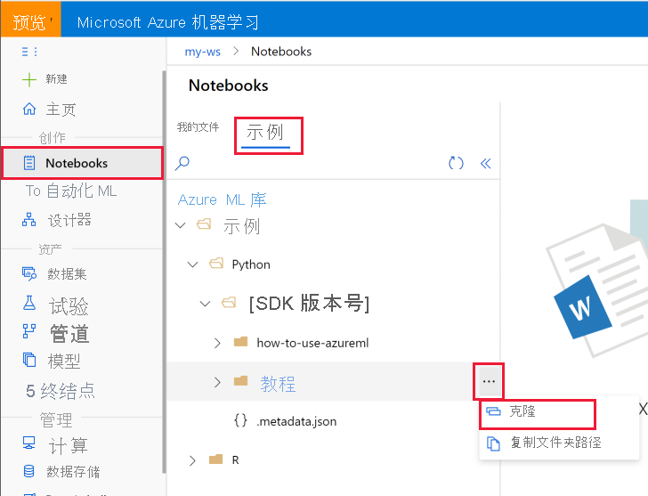
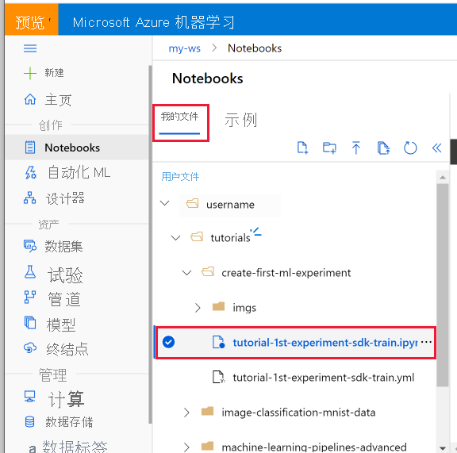

# 教程：开始使用 Python SDK 创建第一个 ML 试验
[!INCLUDE [applies-to-skus](../../includes/aml-applies-to-basic-enterprise-sku.md)]

在本教程中，你将完成端到端的步骤，以开始使用 Jupyter Notebook 中运行的 Azure 机器学习 Python SDK。 本教程是**由两个部分组成的系列教程的第一部分**，介绍如何设置和配置 Python 环境，以及如何创建工作区来管理试验模型和机器学习模型。 [第二部分](tutorial-1st-experiment-sdk-train.md)是在本文的基础上编写的，介绍如何训练多个机器学习模型，以及如何使用 Azure 机器学习工作室和 SDK 来管理模型  。

本教程介绍以下操作：

> [!div class="checklist"]
> * 创建要在下一篇教程中使用的 [Azure 机器学习工作区](concept-workspace.md)。
> * 将教程笔记本克隆到工作区中的文件夹。
> * 创建一个基于云的计算实例，其中已安装并预配置了 Azure 机器学习 Python SDK。

如果没有 Azure 订阅，请在开始之前创建一个免费帐户。 立即试用[免费版或付费版 Azure 机器学习](https://aka.ms/AMLFree)。

## 创建工作区

Azure 机器学习工作区是云中的基础资源，用于试验、训练和部署机器学习模型。 它将 Azure 订阅和资源组关联到服务中一个易于使用的对象。 

通过 Azure 门户创建工作区，该门户是用于管理 Azure 资源的基于 Web 的控制台。 

[!INCLUDE [aml-create-portal](../../includes/aml-create-in-portal.md)]

>[!IMPORTANT] 
> 记下你的工作区和订阅   。 你将需要这些项才能确保在正确的位置创建试验。 

## 在工作区中运行笔记本

本教程使用工作区中的云笔记本服务器来实现免安装的预配置体验。 如果你希望控制环境、包和依赖项，请使用[自己的环境](how-to-configure-environment.md#local)。

按照此视频的说明或使用以下详细步骤从工作区克隆和运行教程。 

> [!VIDEO https://www.microsoft.com/en-us/videoplayer/embed/RE4mTUr]

### 克隆笔记本文件夹

在 Azure 机器学习工作室中完成以下试验设置和运行步骤，该工作室是包含用于为所有技能级别的数据科学实践者执行数据科学方案的机器学习工具的合并界面。

1. 登录到 [Azure 机器学习工作室](https://ml.azure.com/)。

1. 选择创建的订阅和工作区。

1. 选择左侧的“笔记本”  。

1. 打开“Samples”文件夹  。

1. 打开“Python”文件夹  。

1. 打开包含版本号的文件夹。  此数字表示 Python SDK 的当前版本。

1. 选择 **tutorials** 文件夹右侧的“...”，然后选择“克隆”。  

    

1. 将显示文件夹列表，其中显示了访问工作区的每个用户。  选择要将“tutorials”文件夹克隆到其中的文件夹  。

### <a name="open">打开克隆的笔记本

1. 在“用户文件”下打开你的文件夹，然后打开克隆的“tutorials”文件夹。  

    

    > [!IMPORTANT]
    > 可以查看 **samples** 文件夹中的笔记本，但无法从此文件夹运行笔记本。  若要运行笔记本，请确保在“用户文件”部分打开笔记本的克隆版本。 
    
1. 选择 **tutorials/create-first-ml-experiment** 文件夹中的 **tutorial-1st-experiment-sdk-train.ipynb** 文件。

1. 在顶部栏上，选择用来运行笔记本的计算实例。 这些 VM 中已预先配置了[运行 Azure 机器学习所需的一切设置](concept-compute-instance.md#contents)。 可以选择任何工作区用户创建的 VM。 

1. 如果未找到任何 VM，请选择“+ 添加”来创建计算实例 VM  。 

    1. 创建 VM 时请提供其名称。  该名称必须包含 2 到 16 个字符。 有效字符为字母、数字和 - 字符。该名称必须在整个 Azure 订阅中唯一。

    1.  从提供的选项中选择虚拟机大小。

    1. 然后选择“创建”  。 设置 VM 可能需要大约 5 分钟时间。

1. VM 可用后，它将显示在顶部工具栏中。  现在，可以使用工具栏中的“全部运行”，或者在笔记本的代码单元中按 **Shift+Enter**，来运行笔记本。 

如果你有自定义小组件或喜欢使用 Jupyter/JupyterLab，请在最右侧选择“Jupyter”下拉菜单，然后选择“Jupyter”或“JupyterLab”    。 系统将打开新的浏览器窗口。

## 后续步骤

在本教程中，你已完成以下任务：

* 创建了 Azure 机器学习工作区。
* 在工作区中创建并配置了云笔记本服务器。

在本教程的**第二部分**中，你将运行 `tutorial-1st-experiment-sdk-train.ipynb` 中的代码来训练机器学习模型。 

> [!div class="nextstepaction"]
> [教程：训练第一个模型](tutorial-1st-experiment-sdk-train.md)

> [!IMPORTANT]
> 如果你不打算按照本教程的第 2 部分或任何其他教程进行操作，则应该在不使用云笔记本服务器 VM 时[停止它](tutorial-1st-experiment-sdk-train.md#clean-up-resources)，以降低成本。

