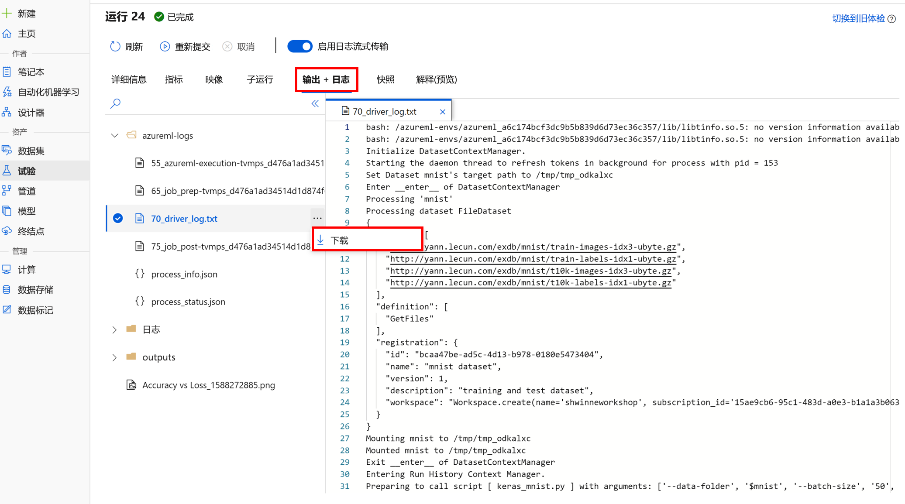

# <a name="tutorial-train-your-first-ml-model"></a>教程：训练第一个 ML 模型

[!INCLUDE [applies-to-skus](../../includes/aml-applies-to-basic-enterprise-sku.md)]

本教程是由两个部分构成的系列教程的第二部分  。 在上一篇教程中，你[创建了一个工作区并选择了一个开发环境](tutorial-1st-experiment-sdk-setup.md)。 本教程介绍 Azure 机器学习中的基础设计模式，并基于糖尿病数据集训练一个简单的 scikit-learn 模型。 完成本教程后，你将获得 SDK 的实践知识，继而可以开发更复杂的试验和工作流。

本教程将介绍以下任务：

> [!div class="checklist"]
> * 连接工作区并创建试验
> * 加载数据并训练 scikit-learn 模型
> * 在门户中查看训练结果
> * 检索最佳模型

## <a name="prerequisites"></a>先决条件

唯一的先决条件是运行本教程的第一部分：[设置环境和工作区](tutorial-1st-experiment-sdk-setup.md)。

在本教程的这一部分中，你将运行在第一部分末尾打开的示例 Jupyter 笔记本 tutorials/create-first-ml-experiment/tutorial-1st-experiment-sdk-train.ipynb  中的代码。 本文将介绍此 Notebook 中的相同代码。

## <a name="open-the-notebook"></a>打开笔记本

1. 登录到 [Azure 机器学习工作室](https://ml.azure.com/)。

1. 打开[第一部分](tutorial-1st-experiment-sdk-setup.md#open)中所示的文件夹中的 **tutorial-1st-experiment-sdk-train.ipynb**。


> [!Warning]
> 在 Jupyter 界面中**不**创建*新的*笔记本！ 笔记本 tutorials/create-first-ml-experiment/tutorial-1st-experiment-sdk-train.ipynb  包含本教程**所需的所有代码和数据**。

## <a name="connect-workspace-and-create-experiment"></a>连接工作区并创建试验

> [!Important]
> 本文的其余部分包含的内容与在笔记本中看到的内容相同。  
>
> 如果要在运行代码时继续阅读，请立即切换到 Jupyter 笔记本。 
> 若要在笔记本中运行单个代码单元，请单击代码单元，然后按 **Shift+Enter**。 或者，通过从顶部工具栏中选择“全部运行”  来运行整个笔记本。

导入 `Workspace` 类，并使用函数 `from_config().` 从文件 `config.json` 中加载订阅信息。默认情况下，这会查找当前目录中的 JSON 文件，但你也可以使用 `from_config(path="your/file/path")` 指定一个路径参数以指向该文件。 在云笔记本服务器中，该文件自动位于根目录中。

如果以下代码要求进行额外的身份验证，只需在浏览器中粘贴链接，然后输入身份验证令牌即可。

```python
from azureml.core import Workspace
ws = Workspace.from_config()
```

现在，请在工作区中创建一个试验。 试验是代表一系列试运行（各个模型运行）的另一个基础云资源。 本教程使用试验来创建运行并在 Azure 机器学习工作室中跟踪模型训练。 参数包含工作区引用，以及试验的字符串名称。


```python
from azureml.core import Experiment
experiment = Experiment(workspace=ws, name="diabetes-experiment")
```

## <a name="load-data-and-prepare-for-training"></a>加载数据并准备训练

对于本教程，使用糖尿病数据集，其中使用年龄、性别和 BMI 等特征来预测糖尿病的发展阶段。 从 [Azure 开放数据集](https://azure.microsoft.com/services/open-datasets/)类加载数据，并使用 `train_test_split()` 将其拆分为训练集和测试集。 此函数将隔离数据，以便在训练后为模型提供不可见的数据进行测试。


```python
from azureml.opendatasets import Diabetes
from sklearn.model_selection import train_test_split

x_df = Diabetes.get_tabular_dataset().to_pandas_dataframe().dropna()
y_df = x_df.pop("Y")

X_train, X_test, y_train, y_test = train_test_split(x_df, y_df, test_size=0.2, random_state=66)
```

## <a name="train-a-model"></a>训练模型

进行小规模的训练时，在本地就能轻松训练一个简单的 scikit-learn 学习模型；但是，在训练包含数十个不同特征组合方式和超参数设置的多个迭代时，很容易就会失去已训练的模型及其训练方式的跟踪。 以下设计模式演示如何利用 SDK 轻松跟踪云中的训练。

生成一个脚本，用于通过不同的超参数 alpha 值训练循环中的岭回归模型。


```python
from sklearn.linear_model import Ridge
from sklearn.metrics import mean_squared_error
from sklearn.externals import joblib
import math

alphas = [0.1, 0.2, 0.3, 0.4, 0.5, 0.6, 0.7, 0.8, 0.9, 1.0]

for alpha in alphas:
    run = experiment.start_logging()
    run.log("alpha_value", alpha)

    model = Ridge(alpha=alpha)
    model.fit(X=X_train, y=y_train)
    y_pred = model.predict(X=X_test)
    rmse = math.sqrt(mean_squared_error(y_true=y_test, y_pred=y_pred))
    run.log("rmse", rmse)

    model_name = "model_alpha_" + str(alpha) + ".pkl"
    filename = "outputs/" + model_name

    joblib.dump(value=model, filename=filename)
    run.upload_file(name=model_name, path_or_stream=filename)
    run.complete()
```

以上代码完成以下操作：

1. 对于 `alphas` 数组中的每个 alpha 超参数值，在试验中创建一个新的运行。 记录 alpha 值以区分不同的运行。
1. 在每个运行中，实例化、训练一个岭回归模型并使用它来运行预测。 计算实际值与预测值的均方根误差，然后将结果记录到该运行。 此时，该运行中已附加 alpha 值和 rmse 准确度的元数据。
1. 接下来，序列化每个运行的模型并将其上传到运行。 这样，你便可以从门户中的运行下载模型文件。
1. 每次迭代结束时，通过调用 `run.complete()` 完成运行。

完成训练后，调用 `experiment` 变量提取门户中的试验的链接。

```python
experiment
```

<table style="width:100%"><tr><th>名称</th><th>工作区</th><th>报告页</th><th>文档页</th></tr><tr><td>diabetes-experiment</td><td>your-workspace-name</td><td>Azure 门户的链接</td><td>文档链接</td></tr></table>

## <a name="view-training-results-in-portal"></a>在门户中查看训练结果

单击“链接到 Azure 门户”  将你带到主试验页。 在此处可以查看试验中的每个运行。 所有自定义记录的值（在本例中为 `alpha_value` 和 `rmse`）将成为每个运行的字段，并且可在试验页顶部的图表和磁贴中使用。 若要将记录的指标添加到图表或磁贴，请将鼠标悬停在该图表或磁贴上，单击编辑按钮，然后找到自定义记录的指标。

对包含数百甚至数千个独立运行的模型进行大规模训练时，在此页中可以轻松查看训练的每个模型，具体而言，可以查看模型的训练方式，以及独特的指标在不同时间的变化。


单击 `RUN NUMBER` 列中的运行编号链接会转到每个运行的页面。 默认选项卡“详细信息”显示有关每个运行的详细信息。  导航到“输出”选项卡可以看到在每次训练迭代期间上传到运行的模型的 `.pkl` 文件。  在此处可以下载模型文件，而无需手动重新训练。



## <a name="get-the-best-model"></a>获取最佳模型

除了能够从门户中的试验下载模型文件以外，还能以编程方式下载这些文件。 以下代码循环访问试验中的每个运行，并访问记录的运行指标和运行详细信息（包含 run_id）。 这会跟踪最佳运行，在本例中，该运行是均方根误差最低的运行。

```python
minimum_rmse_runid = None
minimum_rmse = None

for run in experiment.get_runs():
    run_metrics = run.get_metrics()
    run_details = run.get_details()
    # each logged metric becomes a key in this returned dict
    run_rmse = run_metrics["rmse"]
    run_id = run_details["runId"]

    if minimum_rmse is None:
        minimum_rmse = run_rmse
        minimum_rmse_runid = run_id
    else:
        if run_rmse < minimum_rmse:
            minimum_rmse = run_rmse
            minimum_rmse_runid = run_id

print("Best run_id: " + minimum_rmse_runid)
print("Best run_id rmse: " + str(minimum_rmse))
```

    Best run_id: 864f5ce7-6729-405d-b457-83250da99c80
    Best run_id rmse: 57.234760283951765

使用 `Run` 构造函数以及试验对象，通过最佳运行 ID 提取单个运行。 然后调用 `get_file_names()` 以查看可从此运行下载的所有文件。 在本例中，你在训练期间只为每个运行上传了一个文件。

```python
from azureml.core import Run
best_run = Run(experiment=experiment, run_id=minimum_rmse_runid)
print(best_run.get_file_names())
```

    ['model_alpha_0.1.pkl']

对运行对象调用 `download()`，并指定要下载的模型文件名。 默认情况下，此函数会将文件下载到当前目录。

```python
best_run.download_file(name="model_alpha_0.1.pkl")
```

## <a name="clean-up-resources"></a>清理资源

如果打算运行其他 Azure 机器学习教程，请不要完成本部分。

### <a name="stop-the-compute-instance"></a>停止计算实例

[!INCLUDE [aml-stop-server](../../includes/aml-stop-server.md)]

### <a name="delete-everything"></a>删除所有内容

[!INCLUDE [aml-delete-resource-group](../../includes/aml-delete-resource-group.md)]

还可保留资源组，但请删除单个工作区。 显示工作区属性，然后选择“删除”  。

## <a name="next-steps"></a>后续步骤

在本教程中，你已执行以下任务：

> [!div class="checklist"]
> * 已连接工作区并创建试验
> * 已加载数据并训练 scikit-learn 模型
> * 已在门户中查看训练结果并已检索模型

使用 Azure 机器学习来[部署模型](tutorial-deploy-models-with-aml.md)。
了解如何开发[自动化机器学习](tutorial-auto-train-models.md)试验。
