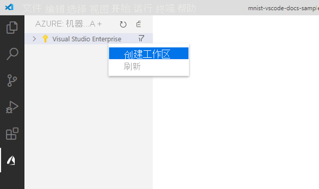
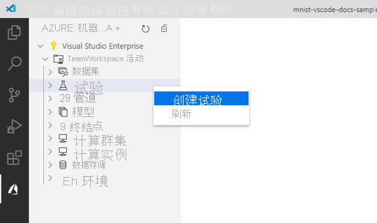
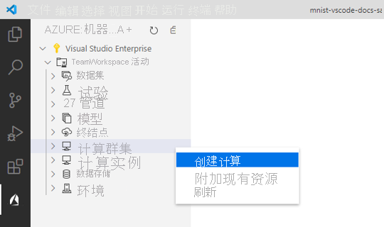
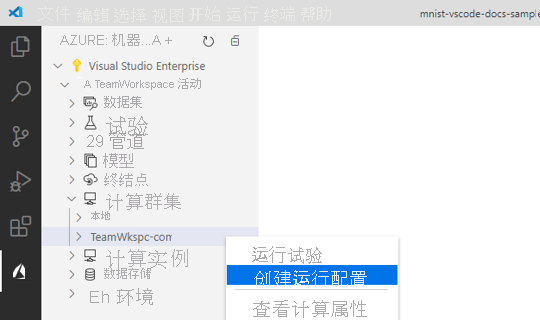
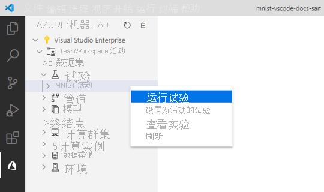
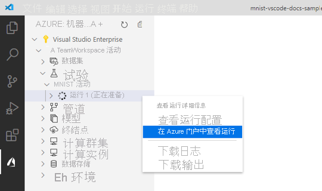
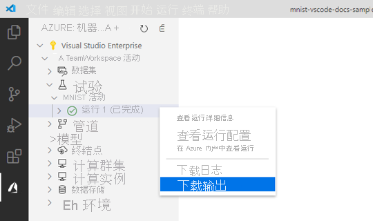

# <a name="train-and-deploy-an-image-classification-tensorflow-model-using-the-azure-machine-learning-visual-studio-code-extension"></a>使用 Azure 机器学习 Visual Studio Code 扩展训练和部署图像分类 TensorFlow 模型

了解如何使用 TensorFlow 和 Azure 机器学习 Visual Studio Code 扩展来训练和部署图像分类模型，以便识别手写数字。

本教程将介绍以下任务：

> [!div class="checklist"]
> * 了解代码
> * 创建工作区
> * 创建试验
> * 配置计算机目标
> * 运行配置文件
> * 训练模型
> * 注册模型
> * 部署模型

## <a name="prerequisites"></a>先决条件

- Azure 订阅。 如果没有订阅，注册之后即可试用 [Azure 机器学习免费版或付费版](https://aka.ms/AMLFree)。
- 安装 [Visual Studio Code](https://code.visualstudio.com/docs/setup/setup-overview)，一种轻量型跨平台代码编辑器。
- Azure 机器学习工作室 Visual Studio Code 扩展。 有关安装说明，请参阅 [Azure 机器学习 Visual Studio Code 扩展安装教程](./tutorial-setup-vscode-extension.md)

## <a name="understand-the-code"></a>了解代码

本教程的代码使用 TensorFlow 来训练可以对手写数字 0-9 进行分类的图像分类机器学习模型。 它通过创建一个神经网络来实现此目的。该神经网络将“28 像素 x 28 像素”图像的像素值作为输入，输出一个包含 10 个概率的列表，一个概率对应于要分类的一个数字。 下面是数据的外观示例。  


在计算机上的任何位置下载并解压缩 [VS Code Tools for AI 存储库](https://github.com/microsoft/vscode-tools-for-ai/archive/master.zip)，获取本教程的代码。

## <a name="create-a-workspace"></a>创建工作区

若要在 Azure 机器学习中生成应用程序，第一件必须做的事是创建工作区。 工作区包含用于训练模型的资源以及已训练的模型本身。 有关详细信息，请参阅[什么是工作区](./concept-workspace.md)。 

1. 在 Visual Studio Code 活动栏上选择 **Azure** 图标，打开“Azure 机器学习”视图。
1. 右键单击你的 Azure 订阅，然后选择“创建工作区”。  
    
    > [!div class="mx-imgBorder"]
    > 

1. 默认情况下，会生成包含创建日期和时间的名称。 在文本输入框中将名称更改为“TeamWorkspace”，然后按 **Enter**。
1. 选择“新建资源组”  。 
1. 将资源组命名为“TeamWorkspace-rg”，然后按 **Enter**。 
1. 为工作区选择一个位置。 建议你在选择位置时，确保该位置最靠近你计划部署模型的位置。 例如，“美国西部 2”。
1. 当系统提示选择工作区的类型时，请选择“基本”，创建一个基本工作区。  有关不同工作区产品/服务的详细信息，请参阅 [Azure 机器学习概述](./overview-what-is-azure-ml.md#sku)。

此时，系统会向 Azure 发出请求，以便在你的帐户中创建新的工作区。 几分钟后，新工作区会显示在订阅节点中。 

## <a name="create-an-experiment"></a>创建试验

可以在工作区中创建一个或多个试验，以跟踪和分析各个模型训练运行。 可在 Azure 云中或本地计算机上完成运行。

1. 在 Visual Studio Code 活动栏上选择 **Azure** 图标。 此时会显示“Azure 机器学习”视图。
1. 展开订阅节点。
1. 展开 **TeamWorkspace** 节点。 
1. 右键单击“试验”  节点。
1. 从上下文菜单中选择“创建试验”  。

    > [!div class="mx-imgBorder"]
    > 

1. 将试验命名为“MNIST”，然后按 **Enter** 以创建新试验。 

与工作区一样，请求将发送到 Azure，以使用提供的配置创建试验。 几分钟后，新试验会出现在工作区的“试验”  节点中。 

## <a name="configure-compute-targets"></a>配置计算目标

计算目标是计算资源或环境，在其中运行脚本和部署已训练的模型。 有关详细信息，请参阅 Azure [机器学习计算目标文档](./concept-compute-target.md)。

若要创建计算目标，请执行以下操作：

1. 在 Visual Studio Code 活动栏上选择 **Azure** 图标。 此时会显示“Azure 机器学习”视图。 
1. 展开订阅节点。 
1. 展开 **TeamWorkspace** 节点。 
1. 在工作区节点下，右键单击“计算”  节点，再选择“创建计算”  。 

    > [!div class="mx-imgBorder"]
    > 

1. 选择“Azure 机器学习计算(AmlCompute)”。  Azure 机器学习计算是一个托管的计算基础结构，可让用户轻松创建能够与工作区中的其他用户一起使用的单节点或多节点计算。
1. 选择 VM 大小。 从选项列表中选择“Standard_F2s_v2”  。 VM 的大小会影响训练模型所需的时间。 有关 VM 大小的详细信息，请参阅 [Azure 中的 Linux 虚拟机大小](https://docs.microsoft.com/azure/virtual-machines/linux/sizes)。
1. 将计算命名为“TeamWkspc-com”，然后按 **Enter** 来创建计算。

几分钟后，新计算目标会出现在工作区的“计算”  节点中。

## <a name="create-a-run-configuration"></a>创建运行配置

将训练运行提交给计算目标时，还提交运行训练作业所需的配置。 例如，包含训练代码的脚本以及运行它所需的 Python 依赖项。

若要创建运行配置，请执行以下操作：

1. 在 Visual Studio Code 活动栏上选择 **Azure** 图标。 此时会显示“Azure 机器学习”视图。 
1. 展开订阅节点。 
1. 展开 **TeamWorkspace** 节点。 
1. 在工作区节点下，右键单击“TeamWkspc-com”  计算节点，然后选择“创建运行配置”  。

    > [!div class="mx-imgBorder"]
    > 

1. 将运行配置命名为“MNIST-rc”，然后按 **Enter** 来创建运行配置。
1. 然后，选择“TensorFlow 单节点训练”  作为训练作业类型。
1. 按 **Enter** 浏览要在计算上运行的脚本文件。 在此示例中，用于训练模型的脚本是 `vscode-tools-for-ai/mnist-vscode-docs-sample` 目录内的 `train.py` 文件。
1. 在输入框中输入以下命令，指定所需的包。
    
    ```text
    pip: azureml-defaults; conda: python=3.6.2, tensorflow=1.15.0
    ```
    
    此时会在 VS Code 中显示名为 `MNIST-rc.runconfig` 的文件，其中包含如下所示的内容：

    ```json
    {
        "script": "train.py",
        "framework": "Python",
        "communicator": "None",
        "target": "TeamWkspc-com",
        "environment": {
            "python": {
                "userManagedDependencies": false,
                "condaDependencies": {
                    "dependencies": [
                        "python=3.6.2",
                        "tensorflow=1.15.0",
                        {
                            "pip": [
                                "azureml-defaults"
                            ]
                        }
                    ]
                }
            },
            "docker": {
                "baseImage": "mcr.microsoft.com/azureml/base:0.2.4",
                "enabled": true,
                "baseImageRegistry": {
                    "address": null,
                    "username": null,
                    "password": null
                }
            }
        },
        "nodeCount": 1,
        "history": {
            "outputCollection": true,
            "snapshotProject": false,
            "directoriesToWatch": [
                "logs"
            ]
        }
    }
    ```

1. 如果对配置满意，请选择“视图”>“命令面板”，将命令面板打开。 
1. 在命令面板中输入以下命令，保存运行配置文件。

    ```text
    Azure ML: Save and Continue
    ```

`MNIST-rc` 运行配置将添加到 *TeamWkspc-com* 计算节点下。

## <a name="train-the-model"></a>定型模型

在训练过程中创建 TensorFlow 模型的方式是这样的：针对要分类的每个相应的数字处理在该模型中嵌入的训练数据和学习模式。 

若要运行 Azure 机器学习试验，请执行以下操作：

1. 在 Visual Studio Code 活动栏上选择 **Azure** 图标。 此时会显示“Azure 机器学习”视图。 
1. 展开订阅节点。 
1. 展开“TeamWorkspace”>“试验”节点。  
1. 右键单击“MNIST”试验。 
1. 选择“运行试验”  。

    > [!div class="mx-imgBorder"]
    > 

1. 从计算目标选项列表中，选择“TeamWkspc-com”  计算目标。
1. 然后，选择“MNIST-rc”  运行配置。
1. 此时系统会向 Azure 发送请求，以便在工作区中所选的计算目标上运行试验。 此过程需要几分钟。 运行训练作业的时间长度受多种因素（如计算类型和训练数据大小）的影响。 若要跟踪试验进度，请右键单击当前的运行节点，然后选择“在 Azure 门户中查看运行”。 
1. 出现请求打开外部网站的对话框时，请选择“打开”。 

    > [!div class="mx-imgBorder"]
    > 

训练完模型后，运行节点旁边的状态标签会更新为“已完成”。

## <a name="register-the-model"></a>注册模型

训练完模型后，即可在工作区中注册它。 

若要注册模型，请执行以下操作：

1. 在 Visual Studio Code 活动栏上选择 **Azure** 图标。 此时会显示“Azure 机器学习”视图。
1. 展开订阅节点。 
1. 展开“TeamWorkspace”>“试验”>“MNIST”节点。 
1. 获取训练模型时生成的模型输出。 右键单击“运行 1”运行节点，然后选择“下载输出”。   

    > [!div class="mx-imgBorder"]
    > 

1. 选择要将下载的输出保存到其中的目录。 默认情况下，输出放置在 Visual Studio Code 当前打开的目录中。
1. 右键单击“模型”节点  ，然后选择“注册模型”  。

    > [!div class="mx-imgBorder"]
    > 

1. 将模型命名为“MNIST-TensorFlow-model”，然后按 **Enter**。
1. TensorFlow 模型由多个文件组成。 从选项列表中选择“模型文件夹”作为模型路径格式。  
1. 选择 `azureml_outputs/Run_1/outputs/outputs/model` 目录。

    包含模型配置的文件会显示在 Visual Studio Code 中，其内容如下所示：

    ```json
    {
        "modelName": "MNIST-TensorFlow-model",
        "tags": {
            "": ""
        },
        "modelPath": "c:\\Dev\\vscode-tools-for-ai\\mnist-vscode-docs-sample\\azureml_outputs\\Run_1\\outputs\\outputs\\model",
        "description": ""
    }
    ```

1. 对配置满意以后，即可将其保存，方法是：打开命令面板并输入以下命令：

    ```text
    Azure ML: Save and Continue
    ```

几分钟后，模型会显示在“模型”  节点下。

## <a name="deploy-the-model"></a>部署模型

在 Visual Studio Code 中，可以将模型作为 Web 服务部署到以下位置：

+ Azure 容器实例 (ACI)。
+ Azure Kubernetes 服务 (AKS)。

不需事先创建 ACI 容器来进行测试，因为可以根据需要创建 ACI 容器。 但是，需提前配置 AKS 群集。 有关部署选项的详细信息，请参阅[使用 Azure 机器学习来部署模型](how-to-deploy-and-where.md)。

若要将 Web 服务部署为 ACI，请执行以下操作：

1. 在 Visual Studio Code 活动栏上选择 **Azure** 图标。 此时会显示“Azure 机器学习”视图。
1. 展开订阅节点。 
1. 展开“TeamWorkspace”>“模型”节点。  
1. 右键单击“MNIST-TensorFlow-model”，选择“从已注册的模型部署服务”。  

    > [!div class="mx-imgBorder"]
    > 

1. 选择“Azure 容器实例”。 
1. 将服务命名为“mnist-tensorflow-svc”，然后按 **Enter**。
1. 选择要在容器中运行的脚本，方法是：在输入框中按 **Enter**，通过浏览方式查找 `mnist-vscode-docs-sample` 目录中的 `score.py` 文件。
1. 提供运行脚本所需的依赖项，方法是：在输入框中按 **Enter**，通过浏览方式查找 `mnist-vscode-docs-sample` 目录中的 `env.yml` 文件。

    包含模型配置的文件会显示在 Visual Studio Code 中，其内容如下所示：

    ```json
    {
        "name": "mnist-tensorflow-svc",
        "imageConfig": {
            "runtime": "python",
            "executionScript": "score.py",
            "dockerFile": null,
            "condaFile": "env.yml",
            "dependencies": [],
            "schemaFile": null,
            "enableGpu": false,
            "description": ""
        },
        "deploymentConfig": {
            "cpu_cores": 1,
            "memory_gb": 10,
            "tags": {
                "": ""
            },
            "description": ""
        },
        "deploymentType": "ACI",
        "modelIds": [
            "MNIST-TensorFlow-model:1"
        ]
    }
    ```
1. 对配置满意以后，即可将其保存，方法是：打开命令面板并输入以下命令：

    ```text
    Azure ML: Save and Continue
    ```

此时系统会向 Azure 发送请求，以便部署 Web 服务。 此过程需要几分钟。 部署完成后，新服务会显示在“终结点”  节点下。

## <a name="next-steps"></a>后续步骤

* 若要详细了解如何在 Visual Studio Code 外部使用 Azure 机器学习进行训练，请参阅[教程：使用 Azure 机器学习训练模型](tutorial-train-models-with-aml.md)。
* 若要详细了解如何在本地编辑、运行和调试代码，请参阅 [Python hello-world 教程](https://code.visualstudio.com/docs/Python/Python-tutorial)。

