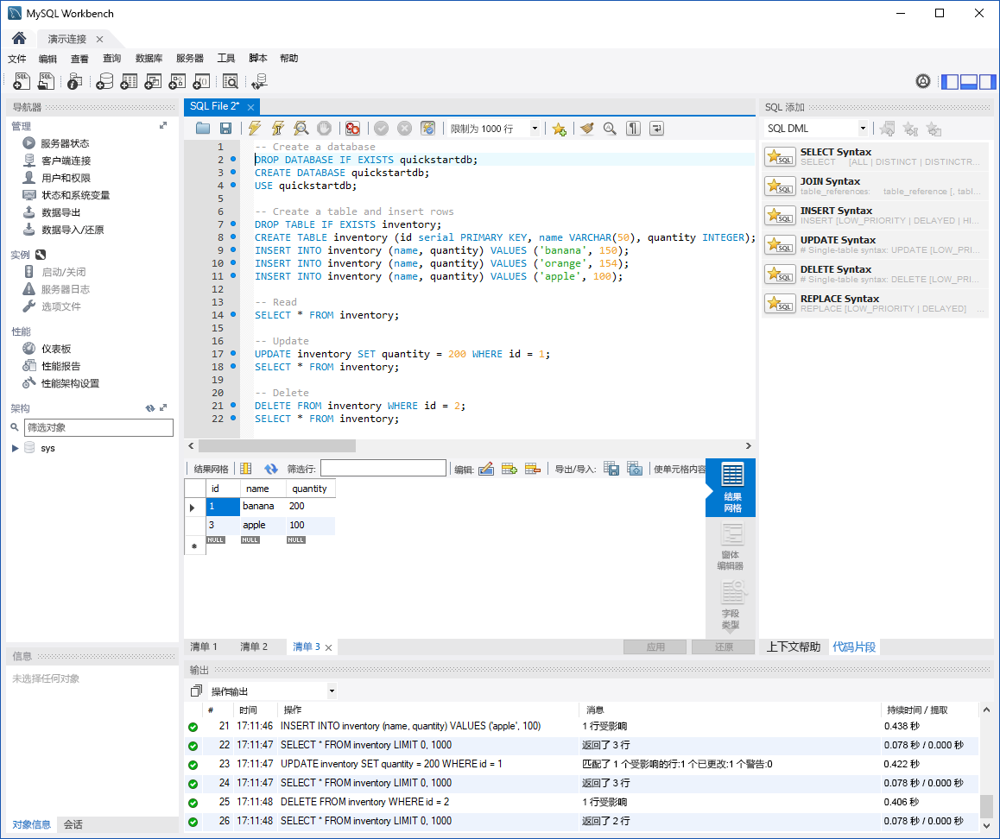

# <a name="quickstart-azure-database-for-mariadb-use-mysql-workbench-to-connect-and-query-data"></a>快速入门：Azure Database for MariaDB：使用 MySQL Workbench 连接和查询数据

本快速入门演示如何使用 MySQL Workbench 连接到 Azure Database for MariaDB 实例。 

## <a name="prerequisites"></a>先决条件

此快速入门使用以下任意指南中创建的资源作为起点：

- [使用 Azure 门户创建 Azure Database for MariaDB 服务器](./quickstart-create-mariadb-server-database-using-azure-portal.md)
- [使用 Azure CLI 创建 Azure Database for MariaDB 服务器](./quickstart-create-mariadb-server-database-using-azure-cli.md)

## <a name="install-mysql-workbench"></a>安装 MySQL Workbench

[下载 MySQL Workbench](https://dev.mysql.com/downloads/workbench/) 并将其安装在计算机上。

## <a name="get-connection-information"></a>获取连接信息

获取连接到 Azure Database for MariaDB 实例所需的连接信息。 需要完全限定的服务器名称和登录凭据。

1. 登录到 [Azure 门户](https://portal.azure.com/)。

2. 在 Azure 门户的左侧菜单中，选择“所有资源”。 搜索所创建的服务器（例如 **mydemoserver**）。

3. 选择服务器名称。

4. 在服务器的“概览”页中记下“服务器名称”和“服务器管理员登录名”的值。   如果忘记了密码，也可在此页上重置密码。

   

## <a name="connect-to-the-server-by-using-mysql-workbench"></a>使用 MySQL Workbench 连接服务器

若要使用 MySQL Workbench 连接到 Azure Database for MariaDB 服务器，请执行以下操作：

1. 打开计算机上的 MySQL Workbench。 

2. 在“设置新连接”对话框的“参数”选项卡上，输入以下信息：

   | 设置 | 建议的值 | 字段说明 |
   |---|---|---|
   |   连接名称 | **演示连接** | 指定此连接的标签。 |
   | 连接方法 | **标准 (TCP/IP)** | 标准 (TCP/IP) 就足够了。 |
   | 主机名 | 服务器名称 | 指定在创建 Azure Database for MariaDB 实例时使用的服务器名称值。 示例服务器为 **mydemoserver.mariadb.database.azure.com**。 请使用完全限定的域名 (\*.mariadb.database.azure.com)，如示例中所示。 如果不记得服务器名称，请完成上一部分的步骤，以便获取连接信息。  |
   | 端口 | **3306** | 在连接到 Azure Database for MariaDB 时，始终使用端口 3306。 |
   | 用户名 |  服务器管理员登录名 | 输入在创建 Azure Database for MariaDB 实例时使用的服务器管理员登录用户名。 示例用户名是 myadmin\@mydemoserver。 如果不记得服务器管理员登录名，请完成上一部分的步骤，以便获取连接信息。 格式为 username\@servername。
   | 密码 | 你的密码  | 若要保存密码，请选择“在保管库中存储”。 |

   

3. 若要检查所有参数是否已正确配置，请选择“测试连接”。 

4. 选择“确定”以保存连接。 

5. 在“MySQL 连接”下，选择与服务器相对应的磁贴。 等待连接建立。

   将打开一个新的 SQL 选项卡，该选项卡包含一个可在其中键入查询的空白编辑器。
    
   > [!NOTE]
   > 默认情况下，SSL 连接安全性是必需的，并且在 Azure Database for MariaDB 服务器上强制执行。 虽然通常不需要对 SSL 证书进行额外的配置，MySQL Workbench 即可连接到服务器，但建议将 SSL CA 证书与 MySQL Workbench 绑定。 如需禁用 SSL，请在 Azure 门户的服务器概览页的菜单中选择“连接安全性”。 对于“强制实施 SSL 连接”，请选择“禁用”。 

## <a name="create-table-and-insert-read-update-and-delete-data"></a>创建表，然后插入、读取、更新和删除数据

1. 将以下示例 SQL 代码复制并粘贴到空白 SQL 选项卡所在的页中，以阐释一些示例数据。

    此代码将创建名为 **quickstartdb** 的空数据库， 然后创建名为**清单**的示例表。 代码会插入一些行，然后读取这些行。 它通过更新语句更改数据，然后再次读取这些行。 最后，代码删除一个行，然后再次读取这些行。
    
    ```sql
    -- Create a database
    -- DROP DATABASE IF EXISTS quickstartdb;
    CREATE DATABASE quickstartdb;
    USE quickstartdb;
    
    -- Create a table and insert rows
    DROP TABLE IF EXISTS inventory;
    CREATE TABLE inventory (id serial PRIMARY KEY, name VARCHAR(50), quantity INTEGER);
    INSERT INTO inventory (name, quantity) VALUES ('banana', 150);
    INSERT INTO inventory (name, quantity) VALUES ('orange', 154);
    INSERT INTO inventory (name, quantity) VALUES ('apple', 100);
    
    -- Read
    SELECT * FROM inventory;
    
    -- Update
    UPDATE inventory SET quantity = 200 WHERE id = 1;
    SELECT * FROM inventory;
    
    -- Delete
    DELETE FROM inventory WHERE id = 2;
    SELECT * FROM inventory;
    ```

    此屏幕快照显示 MySQL Workbench 中的一个 SQL 代码示例以及运行该示例代码后的输出：
    
    

2. 若要运行示例 SQL 代码，请在“SQL 文件”选项卡的工具栏中选择闪电图标。
3. 注意页面中间“结果网格”部分中的三个选项卡式结果。 
4. 注意页面底部的“输出”列表。 显示有每个命令的状态。 

在本快速入门中，现已使用 MySQL Workbench 连接到 Azure Database for MariaDB，并已使用 SQL 语言查询数据。

<!--
## Next steps
> [!div class="nextstepaction"]
> [Migrate your database using Export and Import](./concepts-migrate-import-export.md)
-->
