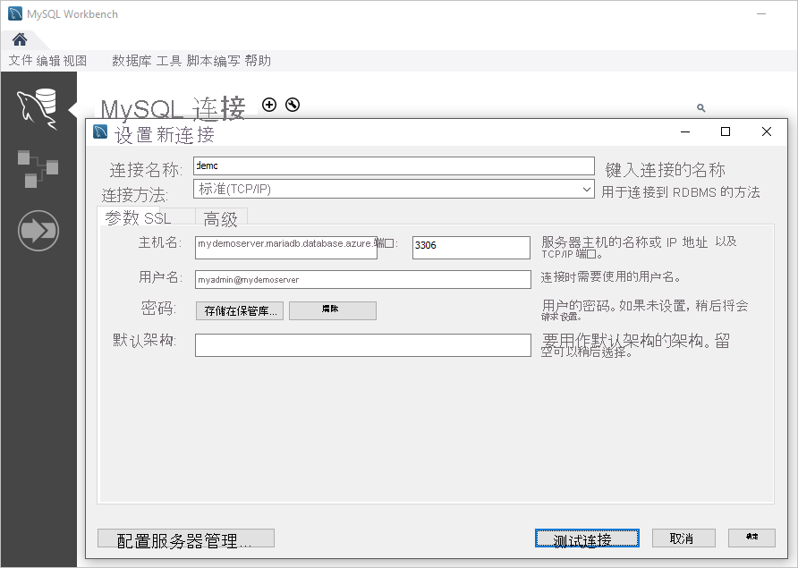

# <a name="quickstart-create-an-azure-database-for-mariadb-server-using-powershell"></a>快速入门：使用 PowerShell 创建 Azure Database for MariaDB 服务器

本快速入门介绍如何使用 PowerShell 在 Azure 资源组中创建 Azure Database for MariaDB 服务器。 可以使用 PowerShell 以交互方式或者通过脚本创建和管理 Azure 资源。

## <a name="prerequisites"></a>先决条件

如果没有 Azure 订阅，请在开始之前创建一个[免费](https://azure.microsoft.com/free/)帐户。

如果选择在本地使用 PowerShell，则本文要求安装 Az PowerShell 模块，并使用 [Connect-AzAccount](https://docs.microsoft.com/powershell/module/az.accounts/connect-azaccount) cmdlet 连接到 Azure 帐户。 有关安装 Az PowerShell 模块的详细信息，请参阅[安装 Azure PowerShell](https://docs.microsoft.com/powershell/azure/install-az-ps)。

> [!IMPORTANT]
> 尽管 Az.MariaDb PowerShell 模块为预览版，但必须使用以下命令从 Az PowerShell 模块单独安装它：`Install-Module -Name Az.MariaDb -AllowPrerelease`。
> Az.MariaDb PowerShell 模块正式版推出后，它会包含在将来的 Az PowerShell 模块发行版中，并在 Azure Cloud Shell 中原生提供。

如果这是你第一次使用 Azure Database for MariaDB 服务，必须注册 Microsoft.DBforMariaDB 资源提供程序。

```azurepowershell-interactive
Register-AzResourceProvider -ProviderNamespace Microsoft.DBforMariaDB
```

[!INCLUDE [cloud-shell-try-it](../../includes/cloud-shell-try-it.md)]

如果有多个 Azure 订阅，请选择应当计费的资源所在的相应订阅。 使用 [Set-AzContext](https://docs.microsoft.com/powershell/module/az.accounts/set-azcontext) cmdlet 选择特定的订阅 ID。

```azurepowershell-interactive
Set-AzContext -SubscriptionId 00000000-0000-0000-0000-000000000000
```

## <a name="create-a-resource-group"></a>创建资源组

使用 [New-AzResourceGroup](https://docs.microsoft.com/powershell/module/az.resources/new-azresourcegroup) cmdlet 创建 [Azure 资源组](https://docs.microsoft.com/azure/azure-resource-manager/resource-group-overview)。 资源组是在其中以组的形式部署和管理 Azure 资源的逻辑容器。

以下示例在“美国西部”区域中创建名为“myresourcegroup” 的资源组。

```azurepowershell-interactive
New-AzResourceGroup -Name myresourcegroup -Location westus
```

## <a name="create-an-azure-database-for-mariadb-server"></a>创建 Azure Database for MariaDB 服务器

使用 `New-AzMariaDbServer` cmdlet 创建 Azure Database for MariaDB 服务器。 一个服务器可以管理多个数据库。 通常，每个项目或每个用户使用一个单独的数据库。

下表列出了 `New-AzMariaDbServer` cmdlet 的常用参数和示例值。

|        **设置**         | **示例值** |                                                                                                                                                             **说明**                                                                                                                                                              |
| -------------------------- | ---------------- | ---------------------------------------------------------------------------------------------------------------------------------------------------------------------------------------------------------------------------------------------------------------------------------------------------------------------------------------- |
| 名称                       | mydemoserver     | 选择用于标识 Azure Database for MariaDB 服务器的在 Azure 中全局唯一的名称。 该服务器名称只能包含字母、数字和连字符 (-)。 在创建过程中，指定的任何大写字符将自动转换为小写。 必须包含 3 到 63 个字符。 |
| ResourceGroupName          | myresourcegroup  | 提供 Azure 资源组的名称。                                                                                                                                                                                                                                                                                            |
| SKU                        | GP_Gen5_2        | SKU 的名称。 请遵循简写约定：pricing-tier\_compute-generation\_vCores。 有关 SKU 参数的详细信息，请参阅此表格后面的信息。                                                                                                                                           |
| BackupRetentionDay         | 7                | 备份保留时间。 单位为天。 范围为 7-35。                                                                                                                                                                                                                                                                       |
| GeoRedundantBackup         | 已启用          | 是否应为此服务器启用异地冗余备份。 不能为基本定价层级中的服务器启用此值，并且在创建服务器后无法更改此值。 允许的值：“Enabled”、“Disabled”。                                                                                                      |
| 位置                   | westus           | 服务器的 Azure 区域。                                                                                                                                                                                                                                                                                                         |
| SslEnforcement             | 已启用          | 是否应该为此服务器启用 SSL。 允许的值：“Enabled”、“Disabled”。                                                                                                                                                                                                                                                 |
| StorageInMb                | 51200            | 服务器的存储容量（以 MB 为单位）。 有效的 StorageInMb 最小为 5120 MB，以 1024 MB 为增量递增。 有关存储大小限制的详细信息，请参阅 [Azure Database for MariaDB 定价层](./concepts-pricing-tiers.md)。                                                                               |
| 版本                    | 5.7              | MariaDB 主版本。                                                                                                                                                                                                                                                                                                                 |
| AdministratorUserName      | myadmin          | 管理员的登录用户名。 不能是 **azure_superuser**、**admin**、**administrator**、**root**、**guest** 或 **public**。                                                                                                                                                                                            |
| AdministratorLoginPassword | `<securestring>` | 管理员用户的密码，采用安全字符串格式。 该密码必须包含 8 到 128 个字符。 密码必须包含以下三个类别的字符：英文大写字母、英文小写字母、数字和非字母数字字符。                                       |

Sku 参数值遵循 pricing-tier\_compute-generation\_vCores 约定，如以下示例所示 。

- `-Sku B_Gen5_1` 映射到基本、第 5 代和 1 个 vCore。 此选项是可用的最小 SKU。
- `-Sku GP_Gen5_32` 映射到常规用途、第 5 层和 32 个 vCore。
- `-Sku MO_Gen5_2` 映射到内存优化、第 5 层和 2 个 vCore。

有关各区域和层级的有效 SKU 值的信息，请参阅 [Azure Database for MariaDB 定价层](./concepts-pricing-tiers.md)。

以下示例使用服务器管理员登录名 myadmin 在“美国西部”区域中的“myresourcegroup”资源组内创建名为“mydemoserver”的 MariaDB 服务器   。 此服务器是常规用途定价层中的第 5 代服务器，其中启用了 2 个 vCore 和异地冗余备份。 记下示例的第一行中使用的密码，因为这是 MariaDB 服务器管理员帐户的密码。

> [!TIP]
> 服务器名称映射到 DNS 名称，必须在 Azure 中全局唯一。

```azurepowershell-interactive
$Password = Read-Host -Prompt 'Please enter your password' -AsSecureString
New-AzMariaDbServer -Name mydemoserver -ResourceGroupName myresourcegroup -Sku GP_Gen5_2 -GeoRedundantBackup Enabled -Location westus -AdministratorUsername myadmin -AdministratorLoginPassword $Password
```

如果轻量级计算和 I/O 足以满足工作负荷要求，请考虑使用基本定价层级。

> [!IMPORTANT]
> 在基本定价层中创建的服务器以后无法扩展到常规用途或内存优化层级，并且无法异地复制。

## <a name="configure-a-firewall-rule"></a>配置防火墙规则

使用 `New-AzMariaDbFirewallRule` cmdlet 创建 Azure Database for MariaDB 服务器级防火墙规则。 服务器级防火墙规则允许外部应用程序（如 `mysql` 命令行工具或 MariaDB Workbench）穿过 Azure Database for MariaDB 服务防火墙连接到服务器。

以下示例创建名为 AllowMyIP 的防火墙规则，该规则允许从特定的 IP 地址 (192.168.0.1) 进行连接。 替换与要从中进行连接的位置相对应的 IP 地址或 IP 地址范围。

```azurepowershell-interactive
New-AzMariaDbFirewallRule -Name AllowMyIP -ResourceGroupName myresourcegroup -ServerName mydemoserver -StartIPAddress 192.168.0.1 -EndIPAddress 192.168.0.1
```

> [!NOTE]
> 连接到 Azure Database for MariaDB 时，经端口 3306 进行通信。 如果尝试从企业网络内部进行连接，则可能不允许经端口 3306 的出站流量。 在这种情况下，仅当 IT 部门打开了端口 3306 时，才能连接到服务器。

## <a name="configure-ssl-settings"></a>配置 SSL 设置

默认情况下，在服务器和客户端应用程序之间强制实施 SSL 连接。 此默认设置通过对 Internet 上的数据流进行加密，确保“传输中”数据的安全性。 就本快速入门来说，请禁用服务器的 SSL 连接。 有关详细信息，请参阅[配置应用程序中的 SSL 连接性以安全连接到 Azure Database for MariaDB](./howto-configure-ssl.md)。

> [!WARNING]
> 建议不要对生产服务器禁用 SSL。

以下示例在 Azure Database for MariaDB 服务器上禁用 SSL。

```azurepowershell-interactive
Update-AzMariaDbServer -Name mydemoserver -ResourceGroupName myresourcegroup -SslEnforcement Disabled
```

## <a name="get-the-connection-information"></a>获取连接信息

若要连接到服务器，需要提供主机信息和访问凭据。 使用以下示例来确定连接信息。 记下 FullyQualifiedDomainName 和 AdministratorLogin 的值。

```azurepowershell-interactive
Get-AzMariaDbServer -Name mydemoserver -ResourceGroupName myresourcegroup |
  Select-Object -Property FullyQualifiedDomainName, AdministratorLogin
```

```Output
FullyQualifiedDomainName                    AdministratorLogin
------------------------                    ------------------
mydemoserver.mariadb.database.azure.com       myadmin
```

## <a name="connect-to-the-server-using-the-mysql-command-line-tool"></a>使用 mysql 命令行工具连接到服务器

使用 `mysql` 命令行工具连接到服务器。 若要下载并安装该命令行工具，请参阅 [MySQL 社区下载](https://dev.mysql.com/downloads/shell/)。 还可以通过在本文的代码示例中选择“试用”按钮，在 Azure Cloud Shell 中访问预装版本的 `mysql` 命令行工具。 访问 Azure Cloud Shell 的其他方式包括：在 Azure 门户右上角的工具栏上选择“>_”按钮，或访问 [shell.azure.com](https://shell.azure.com/)。

1. 使用 `mysql` 命令行工具连接到服务器。

   ```azurepowershell-interactive
   mysql -h <servername>.mariadb.database.azure.com -u myadmin@<servername> -p
   ```

1. 查看服务器状态。

   ```sql
   mysql> status
   ```

   ```Output
   C:\Users\>mysql -h mydemoserver.mariadb.database.azure.com -u myadmin@mydemoserver -p
   Enter password: *************
   Welcome to the MySQL monitor.  Commands end with ; or \g.
   Your MySQL connection id is 64793
   Server version: 5.6.42.0 MariaDB Server

   Copyright (c) 2000, 2020, Oracle and/or its affiliates. All rights reserved.

   Oracle is a registered trademark of Oracle Corporation and/or its
   affiliates. Other names may be trademarks of their respective
   owners.

   Type 'help;' or '\h' for help. Type '\c' to clear the current input statement.

   mysql> status
   --------------
   /usr/bin/mysql  Ver 14.14 Distrib 5.7.29, for Linux (x86_64) using  EditLine wrapper

   Connection id:          64793
   Current database:
   Current user:           myadmin@myipaddress
   SSL:                    Cipher in use is ECDHE-RSA-AES256-GCM-SHA384
   Current pager:          stdout
   Using outfile:          ''
   Using delimiter:        ;
   Server version:         5.6.42.0 MariaDB Server
   Protocol version:       10
   Connection:             mydemoserver.mariadb.database.azure.com via TCP/IP
   Server characterset:    latin1
   Db     characterset:    latin1
   Client characterset:    utf8
   Conn.  characterset:    utf8
   TCP port:               3306
   Uptime:                 17 min 4 sec

   Threads: 19  Questions: 482  Slow queries: 0  Opens: 50  Flush tables: 3  Open tables: 12  Queries per second avg: 0.470
   --------------

   mysql>
   ```

有关其他命令，请参阅 [MySQL 5.7 参考手册 - 第 4.5.1 章](https://dev.mysql.com/doc/refman/5.7/en/mysql.html)。

## <a name="connect-to-the-server-using-mariadb-workbench"></a>使用 MariaDB Workbench 连接服务器

1. 启动客户端计算机上的 MySQL Workbench 应用程序。 若要下载并安装 MySQL Workbench，请参阅[下载 MySQL Workbench](https://dev.mysql.com/downloads/workbench/)。

1. 在“设置新连接”对话框的“参数”选项卡上，输入以下信息：

   

    |    **设置**    |            建议的值            |                      **说明**                       |
    | ----------------- | ----------------------------------------- | ---------------------------------------------------------- |
    | 连接名称   | 我的连接                             | 指定此连接的标签                        |
    | 连接方法 | 标准 (TCP/IP)                         | 使用 TCP/IP 协议连接到 Azure Database for MariaDB |
    | 主机名          | `mydemoserver.mariadb.database.azure.com` | 你在前面记下的服务器名称。                           |
    | 端口              | 3306                                      | MariaDB 的默认端口                                 |
    | 用户名          | myadmin@mydemoserver                      | 你在前面记下的服务器管理员登录名                |
    | 密码          | *************                             | 使用前面配置的管理员帐户密码      |

1. 若要测试是否正确配置了参数，请单击“测试连接”按钮。

1. 选择用于连接到服务器的连接。

## <a name="clean-up-resources"></a>清理资源

如果其他快速入门或教程不需要使用本快速入门中创建的资源，可以运行以下示例将其删除。

> [!CAUTION]
> 以下示例删除指定的资源组及其包含的所有资源。
> 如果指定的资源组中存在本快速入门范围外的资源，这些资源也会被删除。

```azurepowershell-interactive
Remove-AzResourceGroup -Name myresourcegroup
```

若要仅删除本快速入门中创建的服务器而不删除资源组，请使用 `Remove-AzMariaDbServer` cmdlet。

```azurepowershell-interactive
Remove-AzMariaDbServer -Name mydemoserver -ResourceGroupName myresourcegroup
```

## <a name="next-steps"></a>后续步骤

> [!div class="nextstepaction"]
> [使用 PowerShell 设计 Azure Database for MariaDB](tutorial-design-database-using-powershell.md)
