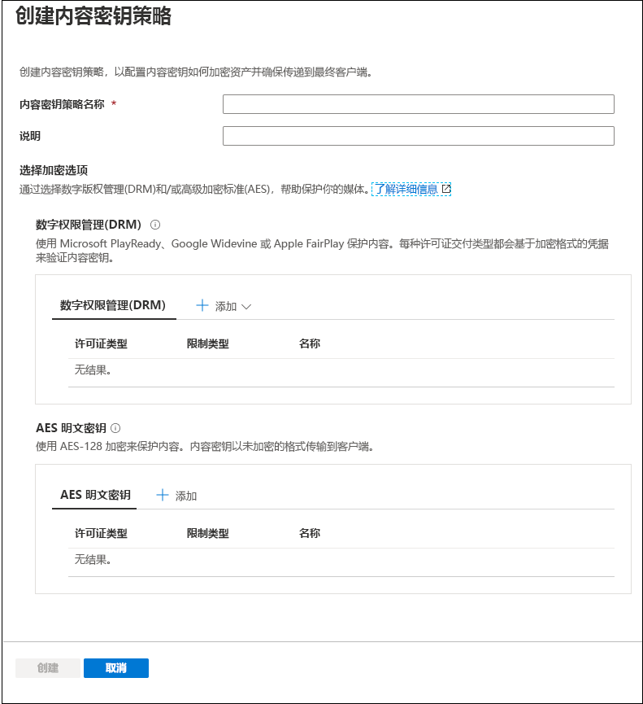
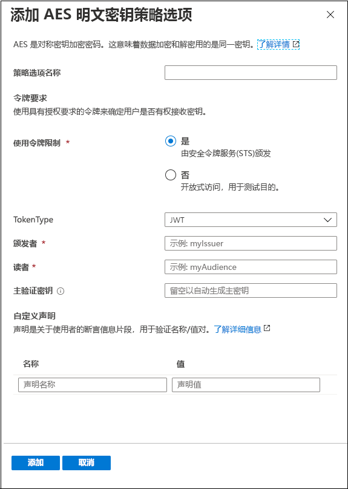
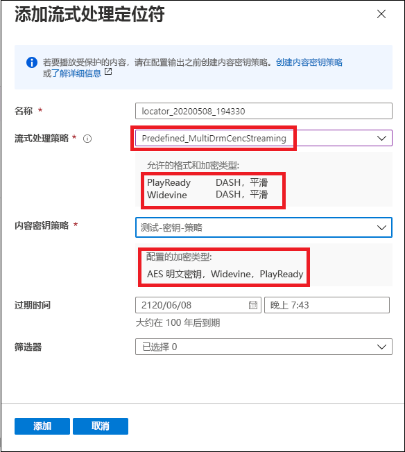

# 快速入门：使用门户加密内容

使用 Azure 媒体服务在媒体从计算机离开一直到存储、处理和传送的整个过程中帮助保护其安全。 借助媒体服务，可以传送使用高级加密标准 (AES-128) 或三个主要数字版权管理 (DRM) 系统（Microsoft PlayReady、Google Widevine 和 Apple FairPlay）中任意一个动态加密的实时和请求内容。 媒体服务还提供了用于向已授权客户端传送 AES 密钥和 DRM（PlayReady、Widevine 和 FairPlay）许可证的服务。 
 
若要在流上指定加密选项（如果有），请使用流式处理策略并将其与流式处理定位符相关联。 可创建内容密钥策略来配置将内容密钥（提供对资产的安全访问）传送给最终客户端的方式 。 需要在内容密钥策略上设置要求（限制），必须满足这些要求才能将具有指定配置的密钥传送给客户端。 

> [!NOTE]
> 清除流式处理或下载时无需使用内容密钥策略。

播放器请求流时，媒体服务将通过 AES 明文密钥或 DRM 加密使用指定的密钥来动态加密内容。 为了解密流，播放器将从媒体服务密钥传送服务或者指定的密钥传送服务请求密钥。 为了确定是否已授权用户获取密钥，服务将评估你为密钥指定的内容密钥策略。

本快速入门介绍如何创建内容密钥策略，你可在此策略中指定在对资产进行流式处理时应对资产采用哪些加密。 此快速入门还介绍了如何在资产上设置配置加密。

### 建议的读前准备

* [动态加密和密钥传送](content-protection-overview.md)
* [流式处理定位符](streaming-locators-concept.md)
* [流式处理策略](streaming-policy-concept.md)
* [内容密钥策略](content-key-policy-concept.md)

## 先决条件

按照[管理 Azure 门户中的资产](manage-assets-quickstart.md)中所述，上传和处理内容

## 创建内容密钥策略

创建内容密钥策略来配置将内容密钥（提供对资产的安全访问）传送给最终客户端的方式 。

1. 登录到 [Azure 门户](https://portal.azure.com/)。
1. 找到并单击你的媒体服务帐户。
1. 选择“内容密钥策略(新)”。
1. 在窗口顶部按“+添加内容密钥策略”。 

此时将显示“创建内容密钥策略”窗口。 在此窗口中，选择加密选项。 通过选择数字版权管理 (DRM) 和/或高级加密标准 (AES)，选择保护你的媒体。  

无论你选择的是 DRM 选项之一还是 AES-128 明文密钥选项，都将建议你指定配置限制的方式。 可选择具有开放或令牌限制。 有关详细说明，请参阅[控制内容访问](content-protection-overview.md#controlling-content-access)。

### 添加 DRM 内容密钥

可选择使用 Microsoft PlayReady 和/或 Google Widevine 或 Apple FairPlay 保护内容。 每种许可证交付类型都会基于加密格式的凭据来验证内容密钥。

#### 许可证模板

要详细了解许可证模板，请参阅：

* [Google Widevine 许可证模板](widevine-license-template-overview.md)

    > [!NOTE]
    > 可创建不含任何值的空许可证模板，只是“{}”。 然后，使用默认值创建许可证模板。 默认值适用于大多数情况。
* [Apple FairPlay 许可要求和配置](fairplay-license-overview.md)
* [PlayReady 许可证模板](playready-license-template-overview.md)

### 添加 AES 明文密钥

还可将 AES-128 明文密钥加密添加到内容中。 内容密钥以未加密的格式传输到客户端。

## 为资产创建流式处理定位符

1. 找到并单击你的媒体服务帐户。
1. 选择“资产(新)”。
1. 从资产列表中选择要加密的资产。  
1. 在所选资产的“流式处理定位符”部分，按“+添加流式处理定位符” 。 
1. 选择适用于配置的内容密钥策略的流式处理策略 。

    [流式处理策略](streaming-policy-concept.md)主题详细介绍了哪些流式处理策略与哪些内容密钥策略匹配。
1. 选择适当的流式处理策略后，可从下拉列表中选择内容密钥策略。
1. 按“添加”，将流式处理定位符添加到资产。

    该操作将发布资产并生成流式处理 URL。

## 清理资源

如果想学习其他快速入门，请保留创建的资源。 否则，请转到 Azure 门户，浏览到资源组，选择运行本快速入门所用的资源组，并删除所有资源。

## 后续步骤

[管理资产](manage-assets-quickstart.md)
