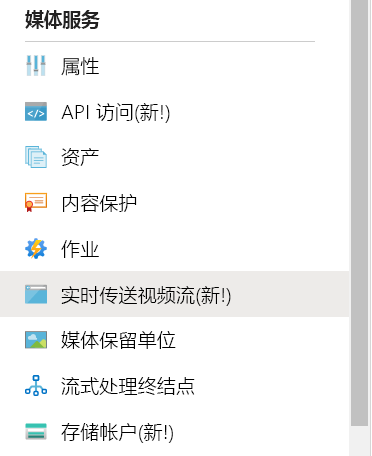
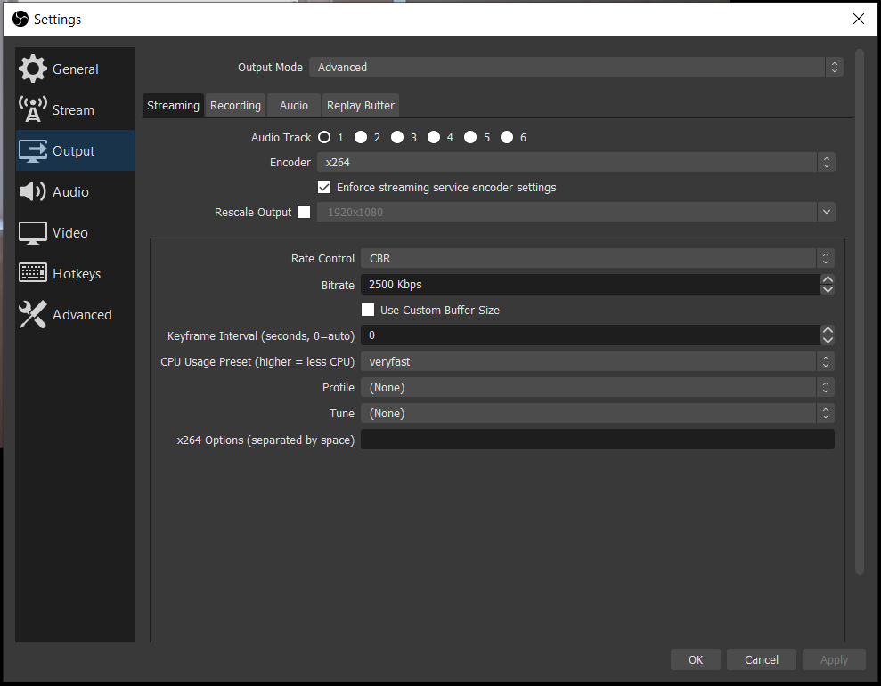
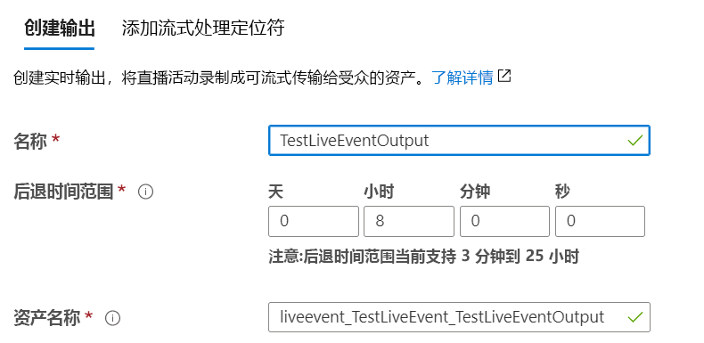
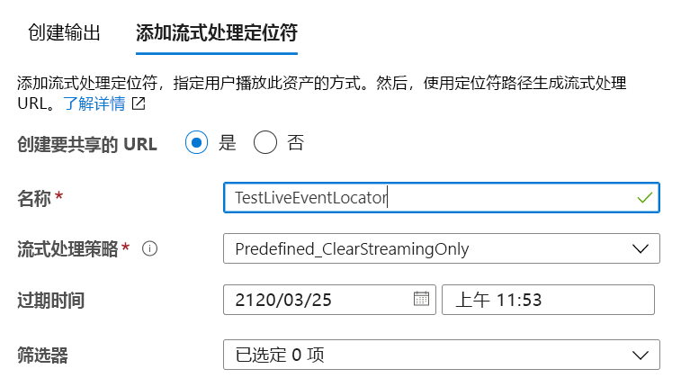

# 使用 OBS 创建 Azure 媒体服务实时传送流

本快速入门帮助你使用 Azure 门户和 Open Broadcasting Studio (OBS) 创建 Azure 媒体服务实时传送流。 本文假设你有一个 Azure 订阅，并已创建媒体服务帐户。

本快速入门将介绍以下方面的内容：

- 使用 OBS 设置本地编码器。
- 设置实时传送流。
- 设置实时传送流输出。
- 运行默认的流式处理终结点。
- 使用 Azure Media Player 观看实时传送流和按需输出。

## 先决条件

如果没有 Azure 订阅，请在开始之前创建一个[免费帐户](https://azure.microsoft.com/free/)。

## 登录到 Azure 门户

打开 Web 浏览器，转到 [Microsoft Azure 门户](https://portal.azure.com/)。 输入登录到门户所需的凭据。 默认视图是服务仪表板。

## 使用 OBS 设置本地编码器

1. 在 [Open Broadcaster Software 网站](https://obsproject.com/)上下载适用于你的操作系统的 OBS，然后进行安装。
1. 启动应用程序，使其保持打开状态。

## 运行默认的流式处理终结点

1. 在媒体服务列表中选择“流式处理终结点”。

   
1. 如果默认流式处理终结点的状态为“已停止”，请选择它。 此步骤会将你转到该终结点的页面。
1. 选择“开始”。

   

## 设置 Azure 媒体服务实时传送流

1. 在门户中转到 Azure 媒体服务帐户，然后从“媒体服务”列表中选择“实时传送视频流”。 

   
1. 选择“添加实时事件”创建新的实时传送视频流事件。

   
1. 在“实时事件名称”框中，输入新事件的名称，例如 TestLiveEvent。

   
1. 在“说明”框中输入事件的可选说明。
1. 选择“直通 – 无云编码”选项。

   
1. 选择“RTMP”选项。
1. 确保选择了与“启动实时事件”对应的“无”选项，以免在该实时事件准备就绪之前产生费用。  （启动实时事件后，即会开始计费。）

   
1. 选择“查看 + 创建”按钮检查设置。
1. 选择“创建”按钮以创建实时事件。 随后你会返回到实时事件列表。
1. 选择刚刚创建的实时事件的链接。 可以观察到你的事件已停止。
1. 在浏览器中将此页保持打开状态。 稍后我们将返回到该文件。

## 使用 OBS Studio 设置实时传送流

OBS 启动时有一个默认场景，但未选择任何输入。

   

### 添加视频源

1. 在“源”面板中，单击**添加**图标，选择新的源设备。 此时会打开“源”菜单。

1. 从源设备菜单中选择“视频捕获设备”。 此时会打开“创建/选择源”菜单。

   

1. 选择“添加现有”单选按钮，然后单击“确定”。  此时会打开“视频设备的属性”菜单。

   

1. 从“设备”下拉列表中，选择要用于广播的视频输入。 暂时保留其余设置，单击“确定”。 输入源会添加到“源”面板中，视频输入视图会显示在“预览”区域中。

   

### 添加音频源

1. 在“源”面板中，单击**添加**图标，选择新的源设备。 此时会打开“源设备”菜单。

1. 从源设备菜单中选择“音频输入捕获”。 此时会打开“创建/选择源”菜单。

   

1. 选择“添加现有”单选按钮，然后单击“确定”。  此时会打开“音频输入捕获的属性”菜单。

   

1. 从“设备”下拉列表中，选择要用于广播的音频捕获设备。 暂时保留其余设置，单击“确定”。 音频捕获设备将添加到音频混合器面板中。

   

### 在 OBS 中设置流式处理

在接下来的过程中，你将在浏览器中返回到 Azure 媒体服务来复制输入 URL，以便将其输入到输出设置中：

1. 在门户的“Azure 媒体服务”页上，选择“启动”以启动实时传送流事件。 （现在开始计费。）

   
1. 将“RTMP”开关设置为“RTMPS”。
1. 在“输入 URL”中，将 URL 复制到剪贴板。

   

1. 切换到 OBS 应用程序。

1. 在“控制”面板中，单击“设置”按钮。  此时会打开“设置”选项。

   

1. 从“设置”菜单中选择“流”。 

1. 从“服务”下拉列表中，选择“全部显示”，然后选择“自定义...” 。

1. 在“服务器”字段中，粘贴已复制到剪贴板的 RTMPS URL。

1. 在“流键”字段中输入一些内容。  此字段的内容是什么并不重要，但需要有一个值。

    

1. 从“设置”菜单中选择“输出”。 

1. 在“关键帧间隔”字段中输入“2”。 这会将片断长度设置为 2 秒。 若要降低实时传递的延迟，请使用 1 秒作为值。

1. 可选：如果你使用的计算机处理能力较弱，请将“CPU 使用情况预设”设置为“veryfast”。 如果网络条件不理想，则可选择将 kbps 设置为较低的值。

   

1. 保留其余设置不变，然后单击“确定”。

### 启动流式处理

1. 在“控制”面板中，单击“启动流式处理”。 

    

2. 在浏览器中切换到 Azure 媒体服务实时事件屏幕，单击“重载播放器”链接。 现在应该可以在“预览播放器”中看到你的流。

## 设置输出

此部分将设置输出，并使你可以保存实时流的录制内容。  

> [!NOTE]
> 若要流式传输此输出，流式处理终结点必须正在运行。 请参阅后面的[运行默认的流式处理终结点](#run-the-default-streaming-endpoint)部分。

1. 选择“输出”视频查看器下面的“创建输出”链接。 
1. 如果需要，请将“名称”框中的输出名称编辑为用户更容易理解的内容，便于今后查找。

   
1. 暂时不要理会其余所有框。
1. 选择“下一步”添加流定位器。
1. 如果需要，请将定位器的名称更改为用户更容易理解的内容。

   
1. 暂时不要理会此屏幕上的其他任何设置。
1. 选择“创建”。

## 使用 Azure Media Player 播放输出的广播

1. 复制“输出”视频播放器下面的流 URL。
1. 在 Web 浏览器中，打开 [Azure Media Player 演示](https://ampdemo.azureedge.net/azuremediaplayer.html)。
1. 将流 URL 粘贴到 Azure Media Player 的“URL”框中。
1. 选择“更新播放器”按钮。
1. 选择视频中的“播放”图标查看实时传送流。

## 停止广播

如果你认为已流式传输了足够的内容，请停止广播。

1. 在门户中选择“停止”。

1. 在 OBS 的“控制”面板中，选择“停止流式处理”按钮。  此步骤会在 OBS 中停止广播。

## 使用 Azure Media Player 播放按需输出

现在，只要流式处理终结点正在运行，创建的输出就可供按需流式处理。

1. 转到媒体服务列表并选择“资产”。
1. 找到前面创建的事件输出，然后选择指向该资产的链接。 此时会打开资产输出页。
1. 复制该资产的视频播放器下的流 URL。
1. 在浏览器中返回到 Azure Media Player，将流 URL 粘贴到“URL”框中。
1. 选择“更新播放器”。
1. 选择视频中的“播放”图标以观看按需资产。

## 清理资源

> [!IMPORTANT]
> 请停止服务！ 完成本快速入门中的步骤后，请务必停止实时事件和流式处理终结点，否则系统会按它们的运行时间计收费用。 若要停止实时事件，请参阅[停止广播](#stop-the-broadcast)过程的步骤 2 和 3。

若要停止流式处理终结点，请执行以下操作：

1. 从媒体服务列表中选择“流式处理终结点”。
2. 选择前面启动的默认流式处理终结点。 此步骤会打开该终结点的页面。
3. 选择“停止”。

> [!TIP]
> 如果你不想要保留来自此事件的资产，请务必将其删除，以免产生存储费用。

## 后续步骤

> [!div class="nextstepaction"]
> [媒体服务中的实时事件和实时输出](./live-events-outputs-concept.md)
