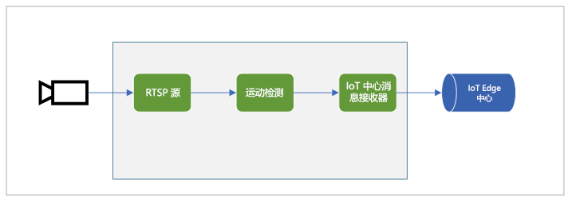

# <a name="quickstart-detect-motion-and-emit-events"></a>快速入门：检测运动并发出事件

本快速入门将引导你完成开始使用 IoT Edge 上的实时视频分析的步骤。 它将 Azure VM 用作 IoT Edge 设备和模拟的实时视频流。 完成设置步骤后，你将能通过媒体图运行模拟实时视频流，该媒体图可检测和报告该流中的任何运动。 下图显示了该媒体图的图形表示形式。

 

本文基于用 C# 编写的[示例代码](https://github.com/Azure-Samples/live-video-analytics-iot-edge-csharp)。

## <a name="prerequisites"></a>先决条件

* 具有活动订阅的 Azure 帐户。 如果没有帐户，可[免费创建一个帐户](https://azure.microsoft.com/free/?WT.mc_id=A261C142F)。
* 包含以下扩展的 [Visual Studio Code](https://code.visualstudio.com/)：
    * [Azure IoT Tools](https://marketplace.visualstudio.com/items?itemName=vsciot-vscode.azure-iot-tools)
    * [C#](https://marketplace.visualstudio.com/items?itemName=ms-dotnettools.csharp)
* [.NET Core 3.1 SDK](https://dotnet.microsoft.com/download/dotnet-core/3.1)。 

> [!TIP]
> 安装 Azure IoT Tools 扩展时，系统可能会提示你安装 Docker。 可以忽略该提示。

## <a name="set-up-azure-resources"></a>设置 Azure 资源

本教程需要以下 Azure 资源：

* IoT 中心
* 存储帐户
* Azure 媒体服务帐户
* Azure 中的 Linux VM，已安装 [IoT Edge 运行时](https://docs.microsoft.com/azure/iot-edge/how-to-install-iot-edge-linux)

在本快速入门中，我们建议你使用[实时视频分析资源设置脚本](https://github.com/Azure/live-video-analytics/tree/master/edge/setup)在 Azure 订阅中部署所需资源。 为此，请执行下列步骤：

1. 打开 [Azure Cloud Shell](https://shell.azure.com)。
1. 如果你是第一次使用 Cloud Shell，系统将提示你选择一个订阅以创建存储帐户和 Microsoft Azure 文件存储共享。 选择“创建存储”，创建用于存储 Cloud Shell 会话信息的存储帐户。 此存储帐户不同于脚本将要创建的与 Azure 媒体服务帐户配合使用的帐户。
1. 在 Cloud Shell 窗口左侧的下拉菜单中，选择“Bash”作为环境。

    

1. 运行以下命令。

    ```
    bash -c "$(curl -sL https://aka.ms/lva-edge/setup-resources-for-samples)"
    ```

    如果脚本成功完成，你应该可在订阅中看到所有所需资源。

1. 脚本完成后，选择大括号即可公开文件夹结构。 你可在 ~/clouddrive/lva-sample 目录中看到几个文件。 与本快速入门相关的文件如下：

     * ~/clouddrive/lva-sample/edge-deployment/.env - 此文件包含 Visual Studio Code 用来将模块部署到边缘设备的属性。
     * ~/clouddrive/lva-sample/appsetting.json - Visual Studio Code 使用此文件来运行示例代码。
     
在下一节的 Visual Studio Code 中设置开发环境时，你需要这些文件。 现在需要将它们复制到本地文件中。

 

## <a name="set-up-your-development-environment"></a>设置开发环境

1. 从此位置克隆存储库： https://github.com/Azure-Samples/live-video-analytics-iot-edge-csharp 。
1. 在 Visual Studio Code 中，打开下载的存储库所在的文件夹。
1. 在 Visual Studio Code 中，转到 src/cloud-to-device-console-app 文件夹。 在该文件中，创建一个文件并将其命名为 appsettings.json。 该文件将包含运行程序所需的设置。
1. 复制之前在本快速入门中生成的 ~/clouddrive/lva-sample/appsettings.json 文件中的内容。

    文本应类似于以下输出。

    ```
    {  
        "IoThubConnectionString" : "HostName=xxx.azure-devices.net;SharedAccessKeyName=iothubowner;SharedAccessKey=XXX",  
        "deviceId" : "lva-sample-device",  
        "moduleId" : "lvaEdge"  
    }
    ```
1. 转到 src/edge 文件夹并创建一个名为 .env 的文件 。
1. 复制 /clouddrive/lva-sample/edge-deployment/.env 文件的内容。 文本应类似于以下代码。

    ```
    SUBSCRIPTION_ID="<Subscription ID>"  
    RESOURCE_GROUP="<Resource Group>"  
    AMS_ACCOUNT="<AMS Account ID>"  
    IOTHUB_CONNECTION_STRING="HostName=xxx.azure-devices.net;SharedAccessKeyName=iothubowner;SharedAccessKey=xxx"  
    AAD_TENANT_ID="<AAD Tenant ID>"  
    AAD_SERVICE_PRINCIPAL_ID="<AAD SERVICE_PRINCIPAL ID>"  
    AAD_SERVICE_PRINCIPAL_SECRET="<AAD SERVICE_PRINCIPAL ID>"  
    INPUT_VIDEO_FOLDER_ON_DEVICE="/home/lvaadmin/samples/input"  
    OUTPUT_VIDEO_FOLDER_ON_DEVICE="/home/lvaadmin/samples/input"
    APPDATA_FOLDER_ON_DEVICE="/var/local/mediaservices"
    CONTAINER_REGISTRY_USERNAME_myacr="<your container registry username>"  
    CONTAINER_REGISTRY_PASSWORD_myacr="<your container registry username>"      
    ```

## <a name="examine-the-sample-files"></a>检查示例文件

1. 在 Visual Studio Code 中，转到 src/edge。 你将看到 .env 文件以及一些部署模板文件。

    部署模板是指边缘设备的部署清单，其中使用变量指定某些属性。 该 .env 文件包含这些变量的值。
1. 转到 src/cloud-to-device-console-app 文件夹。 你可在此处看到 appsettings.json 文件和一些其他文件：

    * c2d-console-app.csproj - Visual Studio Code 的项目文件。
    * operations.json - 希望程序运行的操作的列表。
    * Program.cs - 示例程序代码。 此代码：
    
      * 加载应用设置。
      * 在 IoT Edge 模块上调用实时视频分析公开的直接方法。 可以通过调用模块的[直接方法](direct-methods.md)来使用该模块分析实时视频流。
      * 暂停以检查“终端”窗口中程序的输出，并检查“输出”窗口中模块生成的事件 。
      * 调用直接方法以清理资源。   

## <a name="generate-and-deploy-the-deployment-manifest"></a>生成并部署部署清单

部署清单定义要部署到边缘设备的模块。 它还定义了这些模块的配置设置。 

请按照以下步骤从模板文件生成清单，然后将其部署到边缘设备。

1. 打开 Visual Studio Code。
1. 在“AZURE IOT 中心”窗格旁，选择“更多操作”图标以设置 IoT 中心连接字符串 。 可以从 src/cloud-to-device-console-app/appsettings.json 文件复制该字符串。 

    

1. 右键单击“src/edge/deployment.template.json”并选择“生成 IoT Edge 部署清单”。

    

    此操作应在 src/edge/config 文件夹中创建一个名为“deployment.amd64.json”的清单文件 。
1. 右键单击“src/edge/config/deployment.amd64.json”，选择“为单个设备创建部署”，然后选择边缘设备的名称 。

    

1. 如果系统提示你选择 IoT 中心设备，请从下拉菜单中选择“lva-sample-device”。
1. 大约 30 秒后，在该窗口的左下角刷新 Azure IoT 中心。 边缘设备现在显示以下已部署的模块：

    * IoT Edge 上的实时视频分析（模块名称为 `lvaEdge`）
    * 实时流式处理协议 (RTSP) 模拟器（模块名称为 `rtspsim`）

RTSP 模拟器模块使用视频文件模拟实时视频流，该文件已在运行[实时视频分析资源设置脚本](https://github.com/Azure/live-video-analytics/tree/master/edge/setup)时复制到边缘设备。 

在此阶段，模块已部署，但没有媒体图处于活动状态。

## <a name="prepare-to-monitor-events"></a>准备监视事件

你将在 IoT Edge 模块上使用实时视频分析来检测传入的实时视频流中的运动并将事件发送到 IoT 中心。 若要查看这些事件，请执行以下步骤：

1. 在 Visual Studio Code 中打开“资源管理器”窗格，然后在左下角查找“Azure IoT 中心”。
1. 展开“设备”节点。
1. 右键单击“lva-sample-device”，然后选择“开始监视内置事件终结点” 。

    

## <a name="run-the-sample-program"></a>运行示例程序

若要运行该示例代码，请按照以下步骤执行：

1. 在 Visual Studio Code 中，转到 src/cloud-to-device-console-app/operations.json。
1. 在 GraphTopologySet 节点上，确保你看到以下值：

    `"topologyUrl" : "https://raw.githubusercontent.com/Azure/live-video-analytics/master/MediaGraph/topologies/motion-detection/topology.json"`
1. 在节点 GraphInstanceSet 和 GraphTopologyDelete 节点上，确保 `topologyName` 的值与图形拓扑中 `name` 属性的值匹配 ：

    `"topologyName" : "MotionDetection"`
    
1. 通过选择 F5 键启动调试会话。 “终端”窗口将显示一些消息。
1. operations.json 文件首先调用 `GraphTopologyList` 和 `GraphInstanceList`。 如果在完成先前的快速入门后清理了资源，则该过程将返回空列表，然后暂停。 若要继续，请选择 Enter 键。

    ```
    --------------------------------------------------------------------------
    Executing operation GraphTopologyList
    -----------------------  Request: GraphTopologyList  --------------------------------------------------
    {
        "@apiVersion": "1.0"
    }
    ---------------  Response: GraphTopologyList - Status: 200  ---------------
    {
        "value": []
    }
    --------------------------------------------------------------------------
    Executing operation WaitForInput
    Press Enter to continue
    ```

    “终端”窗口将显示下一组直接方法调用：
     
     * 对 `GraphTopologySet` 的调用，该调用使用前面的 `topologyUrl`
     * 对 `GraphInstanceSet` 的调用，该调用使用以下正文：
     
         ```
         {
           "@apiVersion": "1.0",
           "name": "Sample-Graph",
           "properties": {
             "topologyName": "MotionDetection",
             "description": "Sample graph description",
             "parameters": [
               {
                 "name": "rtspUrl",
                 "value": "rtsp://rtspsim:554/media/camera-300s.mkv"
               },
               {
                 "name": "rtspUserName",
                 "value": "testuser"
               },
               {
                 "name": "rtspPassword",
                 "value": "testpassword"
               }
             ]
           }
         }
         ```
     
     * 对 `GraphInstanceActivate` 的调用，用于启动图形实例和视频流
     * 对 `GraphInstanceList` 的第二次调用，显示图形实例处于运行状态
1. “终端”窗口中的输出会在出现 `Press Enter to continue` 时暂停。 暂时不要选择 Enter。 向上滚动，查看调用的直接方法的 JSON 响应有效负载。
1. 切换到 Visual Studio Code 中的“输出”窗口。 可看到 IoT Edge 模块上的实时视频分析正发送到 IoT 中心的消息。 本快速入门中的以下部分将讨论这些消息。
1. 媒体图将继续运行并打印结果。 RTSP 模拟器不断循环源视频。 若要停止媒体图，请返回“终端”窗口，并选择 Enter。 

    接下来会执行一系列调用，以清理资源：
     * 调用 `GraphInstanceDeactivate` 停用图形实例。
     * 调用 `GraphInstanceDelete` 删除该实例。
     * 调用 `GraphTopologyDelete` 删除拓扑。
     * 对 `GraphTopologyList` 的最后一次调用显示该列表为空。

## <a name="interpret-results"></a>解释结果

运行媒体图时，来自运动检测器处理器节点的结果将通过 IoT 中心接收器节点发送到 IoT 中心。 Visual Studio Code 的“输出”窗口中显示的消息包含 `body` 部分和 `applicationProperties` 部分。 有关详细信息，请参阅[创建和读取 IoT 中心消息](https://docs.microsoft.com/azure/iot-hub/iot-hub-devguide-messages-construct)。

在下面的消息中，实时视频分析模块定义了应用程序属性和正文内容。

### <a name="mediasessionestablished-event"></a>MediaSessionEstablished 事件

对媒体图进行实例化后，RTSP 源节点尝试连接到在 rtspsim-live555 容器上运行的 RTSP 服务器。 如果连接成功，则打印以下事件。

```
[IoTHubMonitor] [9:42:18 AM] Message received from [lvaedgesample/lvaEdge]:  
{  
"body": {
"sdp": "SDP:\nv=0\r\no=- 1586450538111534 1 IN IP4 xxx.xxx.xxx.xxx\r\ns=Matroska video+audio+(optional)subtitles, streamed by the LIVE555 Media Server\r\ni=media/camera-300s.mkv\r\nt=0 0\r\na=tool:LIVE555 Streaming Media v2020.03.06\r\na=type:broadcast\r\na=control:*\r\na=range:npt=0-300.000\r\na=x-qt-text-nam:Matroska video+audio+(optional)subtitles, streamed by the LIVE555 Media Server\r\na=x-qt-text-inf:media/camera-300s.mkv\r\nm=video 0 RTP/AVP 96\r\nc=IN IP4 0.0.0.0\r\nb=AS:500\r\na=rtpmap:96 H264/90000\r\na=fmtp:96 packetization-mode=1;profile-level-id=4D0029;sprop-parameter-sets={SPS}\r\na=control:track1\r\n"  
},  
"applicationProperties": {  
    "dataVersion": "1.0",  
    "topic": "/subscriptions/{subscriptionID}/resourceGroups/{name}/providers/microsoft.media/mediaservices/hubname",  
    "subject": "/graphInstances/GRAPHINSTANCENAMEHERE/sources/rtspSource",  
    "eventType": "Microsoft.Media.MediaGraph.Diagnostics.MediaSessionEstablished",  
    "eventTime": "2020-04-09T16:42:18.1280000Z"  
    }  
}
```

在以上脚本中： 
* 消息为诊断事件 `MediaSessionEstablished`。 它指示 RTSP 源节点（使用者）与 RTSP 模拟器连接，并已开始接收（模拟的）实时馈送。
* `applicationProperties` 中的 `subject` 引用生成消息的图形拓扑中的节点。 在本例中，该消息来自 RTSP 源节点。
* `applicationProperties` 中的 `eventType` 指示此事件是诊断事件。
* `eventTime` 值指示事件发生的时间。
* `body` 部分包含有关诊断事件的数据。 在本例中，数据包含[会话描述协议 (SDP)](https://en.wikipedia.org/wiki/Session_Description_Protocol) 详细信息。


### <a name="motiondetection-event"></a>MotionDetection 事件

当检测到运动时，IoT Edge 模块上的实时视频分析将发送推理事件。 将 `type` 设置为 `motion`，指示它是运动检测处理器的结果。 `eventTime` 值告知运动发生的时间 (UTC)。 

以下是此消息的示例：

```
  {  
  "body": {  
    "timestamp": 142843967343090,
    "inferences": [  
      {  
        "type": "motion",  
        "motion": {  
          "box": {  
            "l": 0.573222,  
            "t": 0.492537,  
            "w": 0.141667,  
            "h": 0.074074  
          }  
        }  
      }  
    ]  
  },  
  "applicationProperties": {  
    "topic": "/subscriptions/{subscriptionID}/resourceGroups/{name}/providers/microsoft.media/mediaservices/hubname",  
    "subject": "/graphInstances/GRAPHINSTANCENAME/processors/md",  
    "eventType": "Microsoft.Media.Graph.Analytics.Inference",  
    "eventTime": "2020-04-17T20:26:32.7010000Z",
    "dataVersion": "1.0"  
  }  
}  
```

在本示例中： 

* `applicationProperties` 中的 `subject` 引用生成消息的媒体图中的节点。 在本例中，该消息来自运动检测处理器节点。
* `applicationProperties` 中的 `eventType` 指示此事件是分析事件。
* `eventTime` 值为事件发生的时间。
* `body` 值包含有关分析事件的数据。 在本例中，该事件是推理事件，因此正文包含 `timestamp` 和 `inferences` 数据。
* `inferences` 数据指示 `type` 为 `motion`。 它包含有关该 `motion` 事件的其他数据。
* `box` 部分包含移动对象周围的边界框的坐标。 值按视频的宽度和高度（以像素为单位）进行规范化。 例如，宽度为 1920，高度为 1080。

    ```
    l - distance from left of image
    t - distance from top of image
    w - width of bounding box
    h - height of bounding box
    ```
    
## <a name="clean-up-resources"></a>清理资源

如果想学习其他快速入门，则请保留所创建的资源。 否则，请在 Azure 门户中，转到资源组，选择运行本快速入门所用的资源组，然后删除所有资源。

## <a name="next-steps"></a>后续步骤

运行其他快速入门，如检测实时视频源中的对象。        
