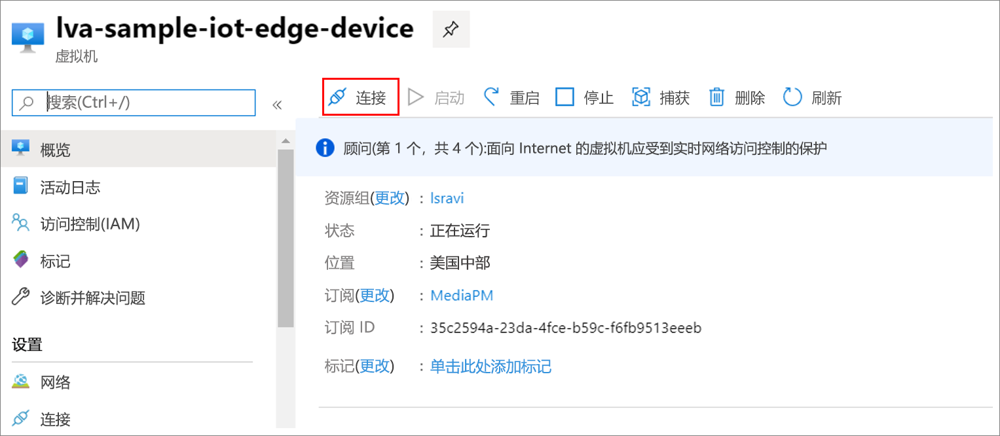

# <a name="quickstart-detect-motion-record-video-on-edge-devices"></a>快速入门：检测运动，将视频录制到边缘设备
 
本快速入门演示了如何使用 IoT Edge 上的实时视频分析来分析（模拟）IP 相机的实时视频源，检测是否存在任何运动，如果存在，则将 MP4 视频剪辑录制到边缘设备上的本地文件系统中。 它将 Azure VM 用作 IoT Edge 设备和模拟的实时视频流。 本文基于用 C# 编写的示例代码。

本文以[此](detect-motion-emit-events-quickstart.md)快速入门为基础。 

## <a name="prerequisites"></a>先决条件

* 具有活动订阅的 Azure 帐户。 [免费创建帐户](https://azure.microsoft.com/free/?WT.mc_id=A261C142F)。
* 计算机上的 [Visual Studio Code](https://code.visualstudio.com/) 具有以下扩展：
    * [Azure IoT Tools](https://marketplace.visualstudio.com/items?itemName=vsciot-vscode.azure-iot-tools)
    * [C#](https://marketplace.visualstudio.com/items?itemName=ms-dotnettools.csharp)
* 系统上安装了 [.NET Core 3.1 SDK](https://dotnet.microsoft.com/download/dotnet-core/3.1)
* 如果之前未完成[此](detect-motion-emit-events-quickstart.md)快速入门，请完成以下步骤：
     * [设置 Azure 资源](detect-motion-emit-events-quickstart.md#set-up-azure-resources)
     * [设置开发环境](detect-motion-emit-events-quickstart.md#set-up-your-development-environment)
     * [生成并部署 IoT Edge 部署清单](detect-motion-emit-events-quickstart.md#generate-and-deploy-the-iot-edge-deployment-manifest)
     * [准备监视事件](detect-motion-emit-events-quickstart.md#prepare-for-monitoring-events)

> [!TIP]
> 在安装 Azure IoT Tools 时，系统可能会提示你安装 Docker。 可以忽略此提示。

## <a name="review-the-sample-video"></a>观看示例视频
作为上述 Azure 资源设置步骤的一部分，一个停车场（短）视频将被复制到 Azure 中用作 IoT Edge 设备的 Linux VM 上。 本教程将使用此视频文件模拟实时流。

可以使用 [VLC Player](https://www.videolan.org/vlc/) 等应用程序，启动它，按 Control+N，然后将[此](https://lvamedia.blob.core.windows.net/public/lots_015.mkv)链接粘贴到停车场视频中并开始播放。 大约在 5 秒的时候，一辆白色汽车在停车场间移动。

完成以下步骤时，会使用 IoT Edge 上的实时视频分析功能检测汽车的运动，并从大约第 5 秒的标记处开始录制视频剪辑。

## <a name="overview"></a>概述


上图显示本快速入门中信号的流动方式。 Edge 模块（[此处](https://github.com/Azure/live-video-analytics/tree/master/utilities/rtspsim-live555)进行了详细介绍）模拟托管 RTSP 服务器的 IP 摄像机。 [RTSP 源](media-graph-concept.md#rtsp-source)节点从该服务器拉取视频源，并将视频帧发送到[运动检测处理器](media-graph-concept.md#motion-detection-processor)节点。 RTSP 源会将同一视频帧发送到[信号入口处理器](media-graph-concept.md#signal-gate-processor)节点，该节点在被事件触发前会保持关闭状态。

如果运动检测处理器确定视频中存在运动，它会将事件发送到信号入口处理器节点，并触发该节点。 门会打开，并将这一状态保持到配置的时间结束为止，并将视频帧发送到[文件接收器](media-graph-concept.md#file-sink)节点。 该接收器节点以 MP4 文件形式将视频录制到边缘设备上本地文件系统中的配置的位置。

在本快速入门中，请执行以下操作：

1. 创建和部署媒体图
1. 解释结果
1. 清理资源

## <a name="examine-and-edit-the-sample-files"></a>检查和编辑示例文件
作为先决条件的一部分，需要将示例代码下载到一个文件夹中。 启动 Visual Studio Code，然后打开文件夹。

1. 在 Visual Studio Code 中，浏览到“src/edge”。 你将看到创建的 .env 文件以及一些部署模板文件
    * 部署模板是指具有某些占位符值的边缘设备的部署清单。 该 .env 文件具有这些变量的值。
1. 接下来，浏览到“src/cloud-to-device-console-app”文件夹。 在这里，你将看到创建的 appsettings.json 文件以及其他一些文件：
    * c2d-console-app.csproj - 它是 Visual Studio Code 的项目文件
    * operations.json - 此文件将列出希望程序运行的不同操作
    * Program.cs - 它是执行以下操作的示例程序代码：

        * 加载应用设置
        * 在 IoT Edge 模块上调用实时视频分析公开的直接方法。 可以通过调用模块的[直接方法](direct-methods.md)来使用该模块分析实时视频流 
        * 暂停以检查 TERMINAL 窗口中程序的输出以及 OUTPUT 窗口中模块生成的事件
        * 调用直接方法以清理资源   

1. 对 operations.json 文件进行以下编辑
    * 将链接更改为图拓扑：`"topologyUrl" : "https://raw.githubusercontent.com/Azure/live-video-analytics/master/MediaGraph/topologies/evr-motion-files/topology.json"`
    * 在 GraphInstanceSet 下，编辑图拓扑的名称，使其与上面链接中的值 `"topologyName" : "EVRToFilesOnMotionDetection"` 匹配
    * 同时编辑 RTSP URL，使其指向所需的视频文件 `"value": "rtsp://rtspsim:554/media/lots_015.mkv"`
    * 在 GraphTopologyDelete 下，编辑名称 `"name": "EVRToFilesOnMotionDetection"`

## <a name="review---check-status-of-the-modules"></a>查看 - 检查模块状态
在执行[生成和部署 IoT Edge 部署清单](detect-motion-emit-events-quickstart.md#generate-and-deploy-the-iot-edge-deployment-manifest)步骤时，在 Visual Studio Code 中，如果展开 AZURE IOT HUB（在左下部分）下的“lva-sample-device”节点，应会看到已部署以下模块

    1. 实时视频分析模块，名为“lvaEdge”
    1. 名为“rtspsim”的模块，可模拟 RTSP 服务器，充当实时视频源的源

        


## <a name="review---prepare-for-monitoring-events"></a>查看 - 准备监视事件
检查是否已完成[准备监视事件](detect-motion-emit-events-quickstart.md#prepare-for-monitoring-events)中的步骤


## <a name="run-the-sample-program"></a>运行示例程序

1. 启动调试会话（点击 F5）。 在 TERMINAL 窗口中，你将开始看到一些输出的消息。
1. operations.json 首先调用直接方法 GraphTopologyList 和 GraphInstanceList。 如果在学完先前的快速入门后清理了资源，这将返回空列表，然后暂停以便按 Enter
```
--------------------------------------------------------------------------
Executing operation GraphTopologyList
-----------------------  Request: GraphTopologyList  --------------------------------------------------
{
  "@apiVersion": "1.0"
}
---------------  Response: GraphTopologyList - Status: 200  ---------------
{
  "value": []
}
--------------------------------------------------------------------------
Executing operation WaitForInput
Press Enter to continue
```
1. 在 TERMINAL 窗口中按“Enter”键后，会执行下一组直接方法调用
     * 使用上述 topologyUrl 调用 GraphTopologySet
     * 使用以下正文调用 GraphInstanceSet
     ```
     {
       "@apiVersion": "1.0",
       "name": "Sample-Graph",
       "properties": {
         "topologyName": "EVRToFilesOnMotionDetection",
         "description": "Sample graph description",
         "parameters": [
           {
             "name": "rtspUrl",
             "value": "rtsp://rtspsim:554/media/lots_015.mkv"
           },
           {
             "name": "rtspUserName",
             "value": "testuser"
           },
           {
             "name": "rtspPassword",
             "value": "testpassword"
           }
         ]
       }
     }
     ```
     * 调用 GraphInstanceActivate 以启动图形实例，并启动视频流
     * 第二次调用 GraphInstanceList 以显示图形实例确实处于运行状态
1. TERMINAL 窗口中的输出将在出现“按 Enter 继续”提示时暂停。 此时请勿点击“Enter”。 可以向上滚动，查看调用的直接方法的 JSON 响应有效负载
1. 如果现在切换到 Visual Studio Code 中的“输出”窗口，则会看到 IoT Edge 上的实时视频分析模块发送到 IoT 中心的消息。
     * 以下各部分将介绍这些消息
1. 媒体图将继续运行，并打印结果，而 RTSP 模拟器将继续循环播放源视频。 为了停止媒体图，请返回到 TERMINAL 窗口并按“Enter”。 接下来会执行一系列调用，以清理资源：
     * 调用 GraphInstanceDeactivate 以停用图形实例
     * 调用 GraphInstanceDelete 以删除实例
     * 调用 GraphTopologyDelete 以删除拓扑
     * 最后调用 GraphTopologyList 以显示列表现在为空

## <a name="interpret-results"></a>解释结果 
运行媒体图时，来自运动检测器处理器节点的结果将通过 IoT 中心接收器节点发送到 IoT 中心。 Visual Studio Code 的 OUTPUT 窗口中显示的消息包含“body”部分和“applicationProperties”部分。 若要理解这些部分的内容，请阅读[本文](https://docs.microsoft.com/azure/iot-hub/iot-hub-devguide-messages-construct)。

在下面的消息中，实时视频分析模块定义了应用程序属性和正文内容。

## <a name="mediasession-established-event"></a>MediaSession 建立的事件

实例化媒体图后，RTSP 源节点尝试连接到在 rtspsim-live555 容器上运行的 RTSP 服务器。 如果成功，它将输出此事件：

```
[IoTHubMonitor] [05:37:21 AM] Message received from [lva-sample-device/lvaEdge]:
{  
"body": {
"sdp": "SDP:\nv=0\r\no=- 1586450538111534 1 IN IP4 xxx.xxx.xxx.xxx\r\ns=Matroska video+audio+(optional)subtitles, streamed by the LIVE555 Media Server\r\ni=media/camera-300s.mkv\r\nt=0 0\r\na=tool:LIVE555 Streaming Media v2020.03.06\r\na=type:broadcast\r\na=control:*\r\na=range:npt=0-300.000\r\na=x-qt-text-nam:Matroska video+audio+(optional)subtitles, streamed by the LIVE555 Media Server\r\na=x-qt-text-inf:media/camera-300s.mkv\r\nm=video 0 RTP/AVP 96\r\nc=IN IP4 0.0.0.0\r\nb=AS:500\r\na=rtpmap:96 H264/90000\r\na=fmtp:96 packetization-mode=1;profile-level-id=4D0029;sprop-parameter-sets={SPS}\r\na=control:track1\r\n"  
},  
"applicationProperties": {  
    "dataVersion": "1.0",  
    "topic": "/subscriptions/{subscriptionID}/resourceGroups/{name}/providers/microsoft.media/mediaservices/hubname",  
    "subject": "/graphInstances/Sample-Graph-1/sources/rtspSource",  
    "eventType": "Microsoft.Media.MediaGraph.Diagnostics.MediaSessionEstablished",  
    "eventTime": "2020-05-21T05:37:21.398Z",
    }  
}
```

* 该消息是一个诊断事件 (MediaSessionEstablished)，指示 RTSP 源节点 (subject) 能够与 RTSP 模拟器建立连接，并开始接收（模拟的）实时源。
* ApplicationProperties 中的“subject”引用生成消息的图形拓扑中的节点。 在本例中，该消息来自 RTSP 源节点。
* applicationProperties 中的“eventType”指示这是诊断事件。
* “eventTime”指示事件发生的时间。
* “body”包含有关诊断事件的数据，在本例中是 [SDP](https://en.wikipedia.org/wiki/Session_Description_Protocol) 的详细信息。


## <a name="recording-started-event"></a>记录已启动事件

如[此处](#overview)所述，检测到运动时，将激活信号入口处理器节点，媒体图中的文件接收器节点将开始写入 MP4 文件。 文件接收器节点发送操作事件。 将类型设置为“运动”，指示它是运动检测处理器的结果，eventTime 则指示运动发生的时间 (UTC)。 下面是一个示例：

```
[IoTHubMonitor] [05:37:27 AM] Message received from [lva-sample-device/lvaEdge]:
{
  "body": {
    "outputType": "filePath",
    "outputLocation": "/var/media/sampleFilesFromEVR-filesinkOutput-20200521T053726Z.mp4"
  },
  "applicationProperties": {
    "topic": "/subscriptions/{subscriptionID}/resourceGroups/{name}/providers/microsoft.media/mediaservices/hubname",  
    "subject": "/graphInstances/Sample-Graph-1/sinks/fileSink",
    "eventType": "Microsoft.Media.Graph.Operational.RecordingStarted",
    "eventTime": "2020-05-21T05:37:27.713Z",
    "dataVersion": "1.0"
  }
}
```

* applicationProperties 中的“subject”引用生成消息的媒体图中的节点。 在本例中，该消息来自文件接收器节点。
* applicationProperties 中的“eventType”指示这是操作事件。
* “eventTime”指示事件发生的时间。 请注意 MediaSessionEstablished 和视频开始播放后的第 5-6 秒。 这对应于[汽车开始行驶](#review-the-sample-video)到停车场时的第 5-6 秒
* “body”包含有关操作事件的数据，在本例中为“outputType”和“outputLocation”数据。
* “outputType”表示此信息与文件路径有关
* “outputLocation”提供了边缘模块中的 MP4 文件的位置

## <a name="recording-stopped-and-available-events"></a>记录已停止事件和可用事件

如果在[图形拓扑](https://github.com/Azure/live-video-analytics/blob/master/MediaGraph/topologies/evr-motion-files/topology.json)中检查信号入口处理器节点的属性，你会看到激活时间已设置为 5 秒。 因此，大约在收到 RecordingStarted 事件后的第 5 秒钟，会收到
* RecordingStopped 事件，指示已停止记录
* RecordingAvailable 事件，指示现在可查看 MP4 文件

这两个事件的发出时间通常彼此相隔数秒。

### <a name="playing-back-the-mp4-clip"></a>播放 MP4 剪辑

1. MP4 文件会写入边缘设备上的目录，该目录是你在 .env 文件中使用密钥 OUTPUT_VIDEO_FOLDER_ON_DEVICE 配置的。 如果将其保留为默认值，则结果应位于 /home/lvaadmin/samples/output/
1. 转到资源组，找到 VM，然后使用 Bastion 进行连接

    
 
    
1. 登录（使用在[此](detect-motion-emit-events-quickstart.md#set-up-azure-resources)步骤中生成的凭据）后，在命令提示符中，转到相关目录（默认：/home/lvaadmin/samples/output），应会在其中看到 MP4 文件。 可以[对文件使用 scp](https://docs.microsoft.com/azure/virtual-machines/linux/copy-files-to-linux-vm-using-scp)，将其传递到本地计算机，然后使用 [VLC 播放器](https://www.videolan.org/vlc/)或其他任何 MP4 播放器进行播放。

    

## <a name="clean-up-resources"></a>清理资源

如果想学习其他快速入门，请保留创建的资源。 否则，请转到 Azure 门户，浏览到资源组，选择运行本快速入门所用的资源组，并删除所有资源。

## <a name="next-steps"></a>后续步骤

* 阅读[对自己的模型运行实时视频分析](use-your-model-quickstart.md)快速入门，其中介绍了如何在实时视频源中应用 AI。
* 查看高级用户面临的其他挑战：

    * 使用支持 RTSP 的 [IP 相机](https://en.wikipedia.org/wiki/IP_camera)，而不是使用 RTSP 模拟器。 可以在 [ONVIF 一致性](https://en.wikipedia.org/wiki/IP_camera)产品页上查找符合配置文件 G、S 或 T 的设备来搜索支持 RTSP 的 IP 照相机。
    * 使用 AMD64 或 X64 Linux 设备（与使用 Azure Linux VM 相比）。 此设备必须与 IP 相机位于同一网络中。 可以按照[在 Linux 上安装 Azure IoT Edge 运行时](https://docs.microsoft.com/azure/iot-edge/how-to-install-iot-edge-linux)中的说明进行操作，然后按照[将首个 IoT Edge 模块部署到虚拟 Linux 设备](https://docs.microsoft.com/azure/iot-edge/quickstart-linux)快速入门中的说明进行操作，将设备注册到 Azure IoT 中心。
