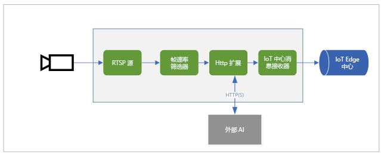

# <a name="quickstart-analyze-live-video-by-using-your-own-model"></a>快速入门：使用自己的模型分析实时视频

本快速入门介绍了如何在 IoT Edge 上使用实时视频分析来分析来自（模拟）IP 相机中的实时视频源。 你将了解如何应用计算机视觉模型来检测对象。 实时视频源中的一部分帧被发送到推理服务。 结果将发送到 IoT Edge 中心。 

此快速入门将 Azure VM 用作 IoT Edge 设备，并使用模拟的实时视频流。 它基于用 C# 编写的示例代码，并以[检测运动并发出事件](detect-motion-emit-events-quickstart.md)快速入门为基础。 

## <a name="prerequisites"></a>先决条件

* 包含活动订阅的 Azure 帐户。 如果没有帐户，可[免费创建一个帐户](https://azure.microsoft.com/free/?WT.mc_id=A261C142F)。
* 包含以下扩展的 [Visual Studio Code](https://code.visualstudio.com/)：
    * [Azure IoT Tools](https://marketplace.visualstudio.com/items?itemName=vsciot-vscode.azure-iot-tools)
    * [C#](https://marketplace.visualstudio.com/items?itemName=ms-dotnettools.csharp)
* [.NET Core 3.1 SDK](https://dotnet.microsoft.com/download/dotnet-core/3.1)。
* 如果未完成[检测运动并发出事件](detect-motion-emit-events-quickstart.md)快速入门，请确保[设置 Azure 资源](detect-motion-emit-events-quickstart.md#set-up-azure-resources)。

> [!TIP]
> 在安装 Azure IoT Tools 时，系统可能会提示安装 Docker。 可以忽略该提示。

## <a name="review-the-sample-video"></a>观看示例视频
设置 Azure 资源时，一个高速公路车流量短视频被复制到 Azure 中用作 IoT Edge 设备的 Linux VM 上。 此快速入门使用视频文件来模拟实时流。

打开一个应用程序，例如 [VLC 媒体播放器](https://www.videolan.org/vlc/)。 选择 `Ctrl+N`，然后粘贴指向[高速公路交叉口示例视频](https://lvamedia.blob.core.windows.net/public/camera-300s.mkv)的链接以开始播放。 可以看到许多车辆在高速公路上行驶的镜头。

在本快速入门中，你在 IoT Edge 上使用实时视频分析来检测车辆和人员等对象。 将关联的推理事件发布到 IoT Edge 中心。

## <a name="overview"></a>概述



此图显示本快速入门中信号的流动方式。 [Edge 模块](https://github.com/Azure/live-video-analytics/tree/master/utilities/rtspsim-live555)模拟托管实时流式处理协议 (RTSP) 服务器的 IP 相机。 [RTSP 源](media-graph-concept.md#rtsp-source)节点从该服务器拉取视频源，并将视频帧发送到[帧速率筛选器处理器](media-graph-concept.md#frame-rate-filter-processor)节点。 该处理器会限制到达 [HTTP 扩展处理器](media-graph-concept.md#http-extension-processor)节点的视频流的帧速率。 

HTTP 扩展节点扮演代理的角色。 它将视频帧转换为指定的图像类型。 然后，它将图像通过 REST 转发到另一个 Edge 模块，该模块在 HTTP 终结点后运行一个 AI 模型。 在此示例中，使用 [YOLOv3](https://github.com/Azure/live-video-analytics/tree/master/utilities/video-analysis/yolov3-onnx) 模型构建该 Edge 模块，该模型能够检测多种类型的对象。 HTTP 扩展处理器节点收集检测结果并将事件发布到 [IoT 中心接收器](media-graph-concept.md#iot-hub-message-sink)节点。 然后该节点将这些事件发送到 [IoT Edge 中心](../../iot-edge/iot-edge-glossary.md#iot-edge-hub)。

在本快速入门中，请执行以下操作：

1. 创建并部署媒体图。
1. 解释结果。
1. 清理资源。


## <a name="create-and-deploy-the-media-graph"></a>创建和部署媒体图
    
### <a name="examine-and-edit-the-sample-files"></a>检查和编辑示例文件

作为先决条件的一部分，请将示例代码下载到一个文件夹中。 按照以下步骤检查并编辑示例文件。

1. 在 Visual Studio Code 中，转到 src/edge。 你可看到 .env 文件以及一些部署模板文件。

    部署模板是指边缘设备的部署清单。 它包含一些占位符值。 该 .env 文件包含这些变量的值。

1. 转到 src/cloud-to-device-console-app 文件夹。 你可在此处看到 appsettings.json 文件和一些其他文件：

    * c2d-console-app.csproj - Visual Studio Code 的项目文件。
    * operations.json - 希望程序运行的操作的列表。
    * Program.cs - 示例程序代码。 此代码：

        * 加载应用设置。
        * 调用 IoT Edge 模块上的实时视频分析公开的直接方法。 可以通过调用模块的[直接方法](direct-methods.md)来使用该模块分析实时视频流。
        * 暂停以检查“终端”窗口中程序的输出，并检查“输出”窗口中模块生成的事件 。
        * 调用直接方法以清理资源。


1. 编辑 operations.json 文件：
    * 将链接更改为图拓扑：

        `"topologyUrl" : "https://raw.githubusercontent.com/Azure/live-video-analytics/master/MediaGraph/topologies/httpExtension/topology.json"`

    * 在 `GraphInstanceSet` 下，编辑图拓扑的名称，使其与上一个链接中的值匹配：

      `"topologyName" : "InferencingWithHttpExtension"`

    * 在 `GraphTopologyDelete` 下，编辑名称：

      `"name": "InferencingWithHttpExtension"`

### <a name="generate-and-deploy-the-iot-edge-deployment-manifest"></a>生成并部署 IoT Edge 部署清单

1. 右键单击“src/edge/ deployment.yolov3.template.json”文件，然后选择“生成 IoT Edge 部署清单”。

      

    随即将在 src/edge/config 文件夹中创建一个清单文件 deployment.yolov3.amd64.json 。

1. 如果已完成[检测运动并发出事件](detect-motion-emit-events-quickstart.md)快速入门，则跳过此步骤。 

    否则，请在左下角“AZURE IOT 中心”窗格附近选择“更多操作”图标，然后选择“设置 IoT 中心连接字符串”  。 可以从 appsettings.json 文件中复制字符串。 或者，为确保在 Visual Studio Code 中配置了正确的 IoT 中心，请使用[选择 IoT 中心命令](https://github.com/Microsoft/vscode-azure-iot-toolkit/wiki/Select-IoT-Hub)。
    
    

1. 右键单击“src/edge/config/ deployment.yolov3.amd64.json”，并选择“为单个设备创建部署”。 

    

1. 如果系统提示你选择 IoT 中心设备，请选择“lva-sample-device”。
1. 大约 30 秒后，在该窗口的左下角刷新 Azure IoT 中心。 边缘设备现在显示以下已部署的模块：

    * 实时视频分析模块，名为 `lvaEdge`
    * `rtspsim` 模块，可模拟 RTSP 服务器，充当实时视频源的源
    > [!NOTE]
    > 如果使用的是自己的边缘设备，而不是设置脚本预配的边缘设备，请转到你的边缘设备并使用管理员权限运行以下命令，以拉取并存储该快速入门所使用的示例视频文件：  

    ```
    mkdir /home/lvaadmin/samples
    mkdir /home/lvaadmin/samples/input    
    curl https://lvamedia.blob.core.windows.net/public/camera-300s.mkv > /home/lvaadmin/samples/input/camera-300s.mkv  
    chown -R lvaadmin /home/lvaadmin/samples/  
    ```
    * `yolov3` 模块，是 YoloV3 对象检测模型，该模型将计算机视觉应用于图像并返回对象类型的多个类
 
      

### <a name="prepare-to-monitor-events"></a>准备监视事件

右键单击实时视频分析设备，并选择“开始监视内置事件终结点”。 需要执行此步骤，以在 Visual Studio Code 的“输出”窗口中监视 IoT 中心事件。 

 

### <a name="run-the-sample-program"></a>运行示例程序

1. 若要启动调试会话，请选择 F5 键。 你可在“终端”窗口中看到打印的消息。
1. operations.json 代码首先调用直接方法 `GraphTopologyList` 和 `GraphInstanceList`。 如果你在完成先前的快速入门后清理了资源，则该过程将返回空列表，然后暂停。 若要继续，请选择 Enter 键。

   ```
   --------------------------------------------------------------------------
   Executing operation GraphTopologyList
   -----------------------  Request: GraphTopologyList  --------------------------------------------------
   {
   "@apiVersion": "1.0"
   }
   ---------------  Response: GraphTopologyList - Status: 200  ---------------
   {
   "value": []
   }
   --------------------------------------------------------------------------
   Executing operation WaitForInput
   Press Enter to continue
   ```

    “终端”窗口将显示下一组直接方法调用：

     * 对 `GraphTopologySet` 的调用，该调用使用前面的 `topologyUrl`
     * 对 `GraphInstanceSet` 的调用，该调用使用以下正文：

         ```
         {
           "@apiVersion": "1.0",
           "name": "Sample-Graph-1",
           "properties": {
             "topologyName": "InferencingWithHttpExtension",
             "description": "Sample graph description",
             "parameters": [
               {
                 "name": "rtspUrl",
                 "value": "rtsp://rtspsim:554/media/camera-300s.mkv"
               },
               {
                 "name": "rtspUserName",
                 "value": "testuser"
               },
               {
                 "name": "rtspPassword",
                 "value": "testpassword"
               }
             ]
           }
         }
         ```

     * 对 `GraphInstanceActivate` 的调用，用于启动图形实例和视频流
     * 对 `GraphInstanceList` 的第二次调用，显示图形实例处于运行状态
1. “终端”窗口中的输出会在出现 `Press Enter to continue` 提示时暂停。 暂时不要选择 Enter。 向上滚动，查看调用的直接方法的 JSON 响应有效负载。
1. 切换到 Visual Studio Code 中的“输出”窗口。 可看到 IoT Edge 模块上的实时视频分析正发送到 IoT 中心的消息。 本快速入门中的以下部分将讨论这些消息。
1. 媒体图将继续运行并打印结果。 RTSP 模拟器不断循环源视频。 若要停止媒体图，请返回“终端”窗口，并选择 Enter。 

    接下来会执行一系列调用，以清理资源：
      * 调用 `GraphInstanceDeactivate` 停用图形实例。
      * 调用 `GraphInstanceDelete` 删除该实例。
      * 调用 `GraphTopologyDelete` 删除拓扑。
      * 对 `GraphTopologyList` 的最后一次调用显示该列表为空。

## <a name="interpret-results"></a>解释结果

运行媒体图时，来自 HTTP 扩展处理器节点的结果将通过 IoT 中心接收器节点传递到 IoT 中心。 在“输出”窗口中看到的消息包含 `body` 和 `applicationProperties` 部分。 有关详细信息，请参阅[创建和读取 IoT 中心消息](../../iot-hub/iot-hub-devguide-messages-construct.md)。

在下面的消息中，实时视频分析模块定义了应用程序属性和正文内容。 

### <a name="mediasessionestablished-event"></a>MediaSessionEstablished 事件

对媒体图进行实例化后，RTSP 源节点尝试连接到在 rtspsim-live555 容器上运行的 RTSP 服务器。 如果连接成功，则打印以下事件。 事件类型为 `Microsoft.Media.MediaGraph.Diagnostics.MediaSessionEstablished`。

```
[IoTHubMonitor] [9:42:18 AM] Message received from [lvaedgesample/lvaEdge]:
{
  "body": {
    "sdp": "SDP:\nv=0\r\no=- 1586450538111534 1 IN IP4 nnn.nn.0.6\r\ns=Matroska video+audio+(optional)subtitles, streamed by the LIVE555 Media Server\r\ni=media/camera-300s.mkv\r\nt=0 0\r\na=tool:LIVE555 Streaming Media v2020.03.06\r\na=type:broadcast\r\na=control:*\r\na=range:npt=0-300.000\r\na=x-qt-text-nam:Matroska video+audio+(optional)subtitles, streamed by the LIVE555 Media Server\r\na=x-qt-text-inf:media/camera-300s.mkv\r\nm=video 0 RTP/AVP 96\r\nc=IN IP4 0.0.0.0\r\nb=AS:500\r\na=rtpmap:96 H264/90000\r\na=fmtp:96 packetization-mode=1;profile-level-id=4D0029;sprop-parameter-sets=Z00AKeKQCgC3YC3AQEBpB4kRUA==,aO48gA==\r\na=control:track1\r\n"
  },
  "applicationProperties": {
    "dataVersion": "1.0",
    "topic": "/subscriptions/{subscriptionID}/resourceGroups/{name}/providers/microsoft.media/mediaservices/hubname",
    "subject": "/graphInstances/GRAPHINSTANCENAMEHERE/sources/rtspSource",
    "eventType": "Microsoft.Media.MediaGraph.Diagnostics.MediaSessionEstablished",
    "eventTime": "2020-04-09T16:42:18.1280000Z"
  }
}
```

在此消息中，请注意以下详细信息：

* 消息为诊断事件。 `MediaSessionEstablished` 指示 RTSP 源节点（使用者）与 RTSP 模拟器连接，并已开始接收（模拟的）实时馈送。
* `applicationProperties` 中的 `subject` 指示消息是从媒体图中的 RTSP 源节点生成的。
* `applicationProperties` 中的 `eventType` 指示此事件是诊断事件。
* `eventTime` 指示事件发生的时间。
* `body` 包含有关诊断事件的数据。 在本例中，数据包含[会话描述协议 (SDP)](https://en.wikipedia.org/wiki/Session_Description_Protocol) 详细信息。

### <a name="inference-event"></a>推理事件

HTTP 扩展处理器节点从 yolov3 模块接收推理结果。 然后它通过 IoT 中心接收器节点将结果作为推理事件发出。 

在这些事件中，类型设置为 `entity`，用于指示它是实体，如汽车或卡车等。 `eventTime` 值为检测到对象时的 UTC 时间。 

在以下示例中，在同一视频帧检测到两辆汽车，置信度各不相同。

```
[IoTHubMonitor] [11:37:17 PM] Message received from [lva-sample-device/lvaEdge]:
{
  "body": {
    "inferences": [
      {
        "entity": {
          "box": {
            "h": 0.0344108157687717,
            "l": 0.5756940841674805,
            "t": 0.5929375966389974,
            "w": 0.04484643936157227
          },
          "tag": {
            "confidence": 0.8714089393615723,
            "value": "car"
          }
        },
        "type": "entity"
      },
      {
        "entity": {
          "box": {
            "h": 0.03960910373263889,
            "l": 0.2750667095184326,
            "t": 0.6102327558729383,
            "w": 0.031027007102966308
          },
          "tag": {
            "confidence": 0.7042660713195801,
            "value": "car"
          }
        },
        "type": "entity"
      }
    ]
  },
  "applicationProperties": {
    "topic": "/subscriptions/{subscriptionID}/resourceGroups/{name}/providers/microsoft.media/mediaservices/hubname",
    "subject": "/graphInstances/GRAPHINSTANCENAMEHERE/processors/inferenceClient",
    "eventType": "Microsoft.Media.Graph.Analytics.Inference",
    "eventTime": "2020-04-23T06:37:16.097Z"
  }
}
```

在消息中，请注意以下详细信息：

* `applicationProperties` 中的 `subject` 引用生成消息的图形拓扑中的节点。 
* `applicationProperties` 中的 `eventType` 指示此事件是分析事件。
* `eventTime` 值为事件发生的时间。
* `body` 部分包含有关分析事件的数据。 在本例中，该事件是推理事件，因此正文包含 `inferences` 数据。
* `inferences` 部分指示 `type` 为 `entity`。 本部分包含有关实体的其他数据。

## <a name="clean-up-resources"></a>清理资源

如果计划学习其他快速入门，请保留创建的资源。 否则，请转到 Azure 门户，再转到资源组，选择运行本快速入门所用的资源组，并删除所有资源。

## <a name="next-steps"></a>后续步骤

* 试用[安全版本的 YoloV3 模型](https://github.com/Azure/live-video-analytics/blob/master/utilities/video-analysis/tls-yolov3-onnx/readme.md)并将其部署到 IoT Edge 设备。 

查看高级用户面临的其他挑战：

* 使用支持 RTSP 的 [IP 相机](https://en.wikipedia.org/wiki/IP_camera)，而不是使用 RTSP 模拟器。 可以在 [ONVIF 符合标准的产品](https://www.onvif.org/conformant-products/)页面上搜索支持 RTSP 的 IP 摄像机。 查找符合配置文件 G、S 或 T 的设备。
* 使用 AMD64 或 X64 Linux 设备，而不是 Azure Linux VM。 此设备必须与 IP 相机位于同一网络中。 可以按照[在 Linux 上安装 Azure IoT Edge 运行时](../../iot-edge/how-to-install-iot-edge-linux.md)中的说明进行操作。 然后按照[将首个 IoT Edge 模块部署到虚拟 Linux 设备](../../iot-edge/quickstart-linux.md)中的说明，将设备注册到 Azure IoT 中心。
