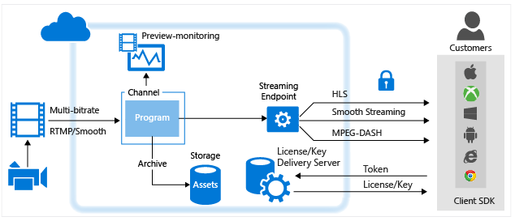

# 使用 Azure 媒体服务实时传送视频流概述

> [!NOTE]
> 自 2018 年 5 月 12 日起，实时频道将不再支持 RTP/MPEG-2 传输流引入协议。 请从 RTP/MPEG-2 迁移到 RTMP 或分段 MP4（平滑流式处理）引入协议。

## 概述

使用 Azure 媒体服务传递实时流式处理事件时，通常涉及以下组件：

* 一个用于广播事件的相机。
* 一个将信号从相机转换为发送至实时流式处理服务的流的实时视频编码器。

    （可选）多个实时同步编码器。 对于某些需要高可用性与优质体验的重要实时事件，建议使用带时间同步功能的主动-主动冗余编码器，以实现无缝故障转移，且不会丢失数据。
* 实时流式处理服务允许执行以下操作：

  * 使用多种实时流式处理协议（例如 RTMP 或平滑流式处理）引入实时内容
  * （可选）将流编码为自适应比特率流
  * 预览实时流
  * 记录和存储引入的内容，以便稍后进行流式处理（视频点播）
  * 直接通过常用流式处理协议（例如 MPEG DASH、Smooth、HLS）将内容传递给客户，或传递到内容分发网络 (CDN) 以供进一步分发。

**Microsoft Azure 媒体服务** (AMS) 提供了引入、编码、预览、存储和实时传送视频流内容的功能。

在将内容传送给客户时，目标就是：将优质视频传递到处于不同网络条件下的各种设备。 为此，可使用实时编码器将流编码为多比特率（自适应比特率）视频流。  为满足不同设备的流式处理要求，使用媒体服务 [动态打包](media-services-dynamic-packaging-overview.md) 将流动态地重新打包为不同的协议。 媒体服务支持以下自适应比特率流式处理技术的传送：HTTP Live Streaming (HLS)、平滑流式处理、MPEG DASH。

在 Azure 媒体服务中，“频道”、“程序”和“流式处理终结点”处理所有实时传送视频流功能，包括引入、格式化、DVR、安全性、可伸缩性和冗余。

**频道** 表示用于处理实时流内容的管道。 频道可以通过以下方式接收实时输入流：

* 本地实时编码器将多比特率 **RTMP** 或**平滑流式处理**（零碎的 MP4）发送到经配置可以进行**直通**传送的频道。 **直通**传送是指引入的流会直接通过**频道**，而不会经过任何进一步的处理。 可以使用以下输出多比特率平滑流的实时编码器：MediaExcel、Ateme、Imagine Communications、Envivio、Cisco 和 Elemental。 以下实时编码器输出 RTMP：Adobe Flash Media Live Encoder (FMLE)、Telestream Wirecast、Haivision、Teradek 和 Tricaster 转码器。  实时编码器也可将单比特率流发送到并未启用实时编码的频道，并不建议这样做。 收到请求时，媒体服务会将该流传递给客户。

  > [!NOTE]
  > 当需要长时间处理多个事件，并且已经在本地编码器上进行了投入时，则可使用直通这种最经济的方法来实时传送视频流。 请参阅 [定价](https://azure.microsoft.com/pricing/details/media-services/) 详细信息。
  > 
  > 
* 本地实时编码器采用以下格式之一将单比特率流发送至能够使用媒体服务执行实时编码的频道：RTMP 或平滑流式处理（分片 MP4）。 已知下列具有 RTMP 输出的实时编码器可使用此类型的通道：Telestream Wirecast、FMLE。 然后，频道将对传入的单比特率流执行实时编码，使之转换为多比特率（自适应）视频流。 收到请求时，媒体服务会将该流传递给客户。

从媒体服务2.10 发行版开始，在创建频道时，可以指定你想要频道接收输入流的方式，以及是否想要频道对流执行实时编码。 可以使用两个选项：

* **无**（直通） - 如果打算使用输出多比特率流（直通流）的本地实时编码器，请指定此值。 在这种情况下，传入流将传递到输出，而不会进行任何编码。 这是 2.10 发行版以前的频道行为。  
* **标准** - 如果计划使用媒体服务将单比特率实时流编码为多比特率流，请选择此值。 若要针对不频繁发生的事件快速地向上缩放，此方法可以节省资金。 请注意，实时编码会影响计费，应该记住，将实时编码通道保持为“正在运行”状态会产生费用。  建议在实时流式处理事件完成之后立即停止正在运行的通道，以避免产生额外的小时费用。

## 通道类型的比较

可以通过下表来了解媒体服务中支持的两种通道类型的比较情况

| Feature | 直通通道 | 标准通道 |
| --- | --- | --- |
| 单比特率输入在云中被编码为多比特率 |否 |是 |
| 最大分辨率，层数 |1080p，8 层，60+fps |720p，6 层，30 fps |
| 输入协议 |RTMP、平滑流 |RTMP、平滑流 |
| 价格 |请参阅[定价页](https://azure.microsoft.com/pricing/details/media-services/)并单击“实时视频”选项卡 |请参阅[定价页](https://azure.microsoft.com/pricing/details/media-services/) |
| 最长运行时间 |全天候运行 |8 小时 |
| 支持插入静态图像 |否 |是 |
| 支持发出广告指示 |否 |是 |
| 直通 CEA 608/708 字幕 |是 |是 |
| 支持非一致性输入 GOP |是 |否 - 输入必须是固定的 2 秒 GOP |
| 支持可变帧率输入 |是 |否 - 输入必须是固定的帧速率。 轻微的帧率变化是容许的，例如在高速运动情况下出现的轻微帧率变化。 但是，编码器不能掉到 10 帧/秒的帧率。 |
| 输入源丢失时，会自动关闭通道 |否 |12 小时后，如果没有运行的程序 |

## 使用从本地编码器（直通）接收多比特率实时流的频道

下图显示的是**直通**工作流中涉及的 AMS 平台的主要组成部分。

有关详细信息，请参阅 [使用从本地编码器接收多比特率实时流的频道](media-services-live-streaming-with-onprem-encoders.md)。

## 使用能够通过 Azure 媒体服务执行实时编码的频道

下图显示的是实时流式处理工作流中所涉及的 AMS 平台的主要组成部分，该工作流中的频道能够通过媒体服务执行实时编码。

有关详细信息，请参阅 [使用能够通过 Azure 媒体服务执行实时编码的频道](media-services-manage-live-encoder-enabled-channels.md)。

## 频道及其相关组件的说明

### 通道

在媒体服务中，[频道](https://docs.microsoft.com/rest/api/media/operations/channel)负责处理实时传送视频流内容。 通道提供输入终结点（引入 URL），然后要将该终结点提供给实时转码器。 通道从实时转码器接收实时输入流，并通过一个或多个 StreamingEndpoints 使其可用于流式处理。 通道还提供可用于预览的预览终结点（预览 URL），并在进一步处理和传递流之前对流进行验证。

可以在创建通道时获取引入 URL 和预览 URL。 若要获取这些 URL，通道不一定要处于已启动状态。 准备好开始将数据从实时转码器推送到通道时，通道必须已启动。 实时转码器开始引入数据后，可以预览流。

每个媒体服务帐户均可包含多个通道、多个节目以及多个 StreamingEndpoint。 根据带宽和安全性需求，StreamingEndpoint 服务可专用于一个或多个通道。 任何 StreamingEndpoint 都可以从任何通道拉取。

创建通道时，可以使用以下格式之一指定允许的 IP 地址：具有 4 个数字、CIDR 地址范围的 IpV4 地址。

### 节目
[节目](https://docs.microsoft.com/rest/api/media/operations/program)用于控制实时流中片段的发布和存储。 通道管理节目。 频道和节目的关系非常类似于传统媒体，频道具有恒定的内容流，而节目的范围限定为该频道上的一些定时事件。
可以通过设置 **ArchiveWindowLength** 属性，指定希望保留多少小时的节目录制内容。 此值的设置范围是最短 5 分钟，最长 25 小时。

ArchiveWindowLength 还决定了客户端能够从当前实时位置按时间向后搜索的最长时间。 超出指定时间长度后，节目也能够运行，但落在时间窗口长度后面的内容将全部被丢弃。 此属性的这个值还决定了客户端清单能够增加多长时间。

每个节目都与某个资产关联。 若要发布节目，必须为关联的资产创建定位符。 创建此定位符后，可以生成提供给客户端的流 URL。

一个通道最多支持三个并发运行的节目，因此可以为同一传入流创建多个存档。 这样，便可以根据需要发布和存档事件的不同部分。 例如，业务要求是存档 6 小时的节目，但只广播过去 10 分钟的内容。 为了实现此目的，需要创建两个同时运行的节目。 一个节目设置为存档 6 小时的事件但不发布该节目。 另一个节目设置为存档 10 分钟的事件，并且要发布该节目。

## 计费影响
一旦通过 API 将通道的状态转换为“正在运行”，就会开始计费。  

下表显示了频道状态如何映射到 API 和 Azure 门户中的计费状态。 请注意，API 与门户 UX 之间的状态略有不同。 通过 API 将通道置于“正在运行”状态，或者在 Azure 门户中将它设置为“就绪”或“正在流式处理”状态后，就会开始计费。

若要阻止频道进一步计费，则必须通过 API 或 Azure 门户停止频道。
在使用完通道时，需要亲自停止通道。 不停止通道会导致持续计费。

> [!NOTE]
> 使用“标准”通道时，AMS 会自动关闭输入源丢失 12 小时后仍处于“正在运行”状态但没有程序运行的任何通道。 但是，频道处于“正在运行”状态的时间段内，仍会进行计费。
>
>

### 频道状态及其如何映射到计费模式
频道的当前状态。 可能的值包括：

* **已停止**。 这是通道在创建后的初始状态（除非在门户中选择了自动启动）。此状态下不会发生计费。 在此状态下，可以更新频道属性，但不允许进行流式传输。
* **正在启动**。 频道正在启动。 此状态下不会发生计费。 在此状态下，不允许进行更新或流式传输。 如果发生错误，则频道会返回到“已停止”状态。
* **正在运行**。 频道能够处理实时流。 现在会计收使用费。 必须停止通道以防止进一步计费。
* **正在停止**。 频道正在停止。 此暂时性状态下不会发生计费。 在此状态下，不允许进行更新或流式传输。
* **正在删除**。 频道正被删除。 此暂时性状态下不会发生计费。 在此状态下，不允许进行更新或流式传输。

下表显示频道状态如何映射到计费模式。

| 频道状态 | 门户 UI 指示器 | 是否计费？ |
| --- | --- | --- |
| 正在启动 |正在启动 |否（暂时状态） |
| 正在运行 |准备就绪（没有正在运行的节目） 或 流式处理（至少有一个正在运行的节目） |是 |
| 正在停止 |正在停止 |否（暂时状态） |
| 已停止 |已停止 |否 |

## 媒体服务学习路径
[!INCLUDE [media-services-learning-paths-include](../../../includes/media-services-learning-paths-include.md)]

## 提供反馈
[!INCLUDE [media-services-user-voice-include](../../../includes/media-services-user-voice-include.md)]

## 相关主题
[Azure 媒体服务零碎的 MP4 实时引入规范](media-services-fmp4-live-ingest-overview.md)

[使用能够通过 Azure 媒体服务执行实时编码的频道](media-services-manage-live-encoder-enabled-channels.md)

[使用从本地编码器接收多比特率实时流的频道](media-services-live-streaming-with-onprem-encoders.md)

[配额和限制](media-services-quotas-and-limitations.md)。  

[媒体服务概念](media-services-concepts.md)
