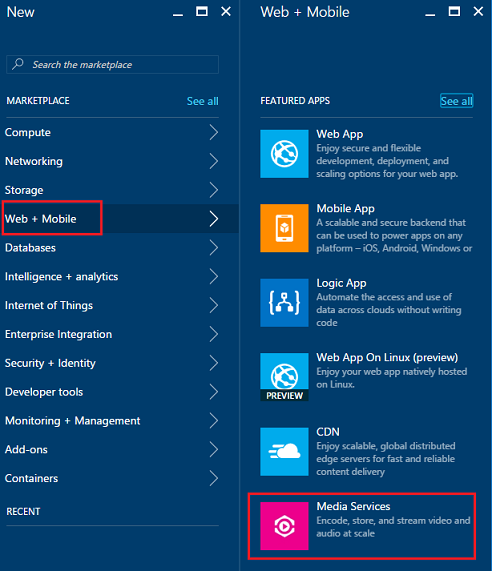

# 使用 Azure 门户创建媒体服务帐户

使用 Azure 门户，可以快速创建 Azure 媒体服务 (AMS) 帐户。 可以使用自己的帐户访问媒体服务，这些服务使你能够在 Azure 中存储、加密、编码、管理和流式传输媒体内容。 创建媒体服务帐户时，还可以创建关联的存储帐户（或使用现有帐户）。 如果删除媒体服务帐户，相关存储帐户中的 Blob 不会被删除。

可以将“常规用途 v1”或“常规用途 v2”作为主存储帐户。 目前，Azure 门户仅允许选择 v1，但在使用 API 或 Powershell 创建帐户时，可以添加 v2。 有关存储类型的详细信息，请参阅[关于 Azure 存储帐户](https://docs.microsoft.com/azure/storage/common/storage-create-storage-account)。

媒体服务帐户和所有关联的存储帐户必须位于同一 Azure 订阅中。 强烈建议在媒体服务帐户所在的位置使用存储帐户，避免额外的延迟和数据出口成本。

本文展示了如何使用 Azure 门户创建媒体服务帐户。

> [!NOTE]
> 若要了解 Azure 媒体服务功能在不同区域的可用性，请参阅 [AMS 功能的跨数据中心可用性](scenarios-and-availability.md#availability)。

## 先决条件

要完成本教程，需要一个 Azure 帐户。 有关详细信息，请参阅 [Azure 免费试用](https://azure.microsoft.com/pricing/free-trial/)。 

## 创建 AMS 帐户

本部分中的步骤介绍如何创建 AMS 帐户。

1. 登录到 [Azure 门户](https://portal.azure.com/)。
2. 单击“+新建” > “Web + 移动” > “媒体服务”。
   
    
3. 在“创建媒体服务帐户”中输入所需的值。
   
    
   
   1. 在“帐户名”中，输入新的 AMS 帐户的名称。 媒体服务帐户名称由小写字母或数字构成（不含空格），长度为 3 到 24 个字符。
   2. 在“订阅”中，在有权访问的不同 Azure 订阅中进行选择。
   3. 在“资源组”中，选择新的或现有的资源。  资源组是共享生命周期、权限和策略的资源的集合。 在[此处](../../azure-resource-manager/resource-group-overview.md#resource-groups)了解更多信息。
   4. 在“位置”中，选择用于存储媒体服务帐户的媒体和元数据记录的地理区域。 此区域用于处理和流式播放媒体。 下拉列表中仅显示可用的媒体服务区域。 
   5. 在“存储帐户”中，选择一个存储帐户以便提供媒体服务帐户中媒体内容的 Blob 存储。 可选择媒体服务帐户所在的地理区域内的现有存储帐户，也可创建存储帐户。 将在同一区域内创建一个新的存储帐户。 适用于存储帐户名的规则对媒体服务帐户同样适用。
      
       单击[此处](../../storage/common/storage-introduction.md)了解有关存储的详细信息。
   6. 选择“固定到仪表板”以查看帐户部署进度。
4. 单击窗体底部的“创建”。
   
    成功创建帐户后，会打开概述页。 在流式处理终结点表中，帐户包含一个处于“已停止”状态的默认流式处理终结点。 

    >[!NOTE]
    >创建 AMS 帐户后，会将一个处于“已停止”状态的**默认**流式处理终结点添加到帐户。 若要开始流式传输内容并利用动态打包和动态加密，要从中流式传输内容的流式处理终结点必须处于“正在运行”状态。 
   
## 管理 AMS 帐户的步骤

若要管理 AMS 帐户（例如，以编程方式连接到 AMS API、上传视频、编码资产、配置内容保护、监视作业进度），请在门户左侧选择“设置”。 从“设置”导航到某个可用的边栏选项卡（例如：“API 访问权限”、“资产”、“作业”、“内容保护”）。

## 后续步骤

现在可以将文件上传到 AMS 帐户。 有关详细信息，请参阅 [上传文件](media-services-portal-upload-files.md)。

如果计划以编程方式访问 AMS API，请参阅[通过 Azure AD 身份验证访问 Azure 媒体服务 API](media-services-use-aad-auth-to-access-ams-api.md)。

## 媒体服务学习路径
[!INCLUDE [media-services-learning-paths-include](../../../includes/media-services-learning-paths-include.md)]

## 提供反馈
[!INCLUDE [media-services-user-voice-include](../../../includes/media-services-user-voice-include.md)]

