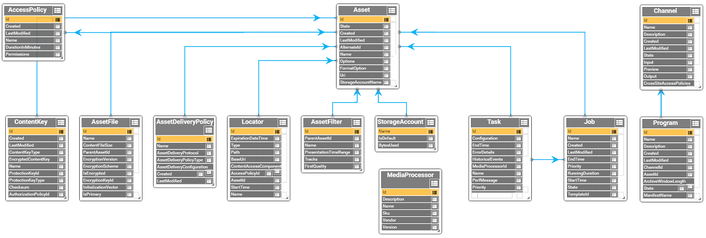
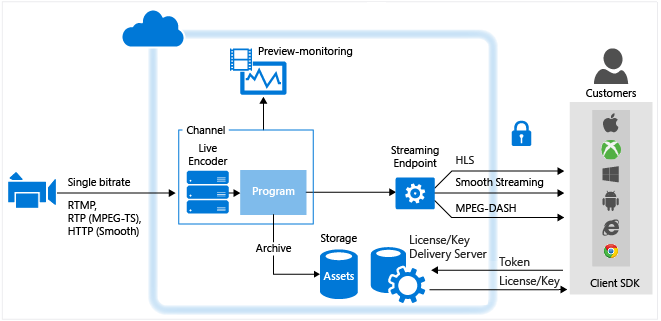

# 媒体服务功能的跨数据中心方案和可用性

> [!NOTE]
> 不会向媒体服务 v2 添加任何新特性或新功能。  查看最新版本：[媒体服务 v3](../latest/index.yml)。 另请参阅[从 v2 到 v3 的迁移指南](../latest/migrate-from-v2-to-v3.md)

可以使用 Microsoft Azure 媒体服务 (AMS) 安全地上传、存储、编码和打包视频或音频内容，以便通过点播和实时流形式传送到各种客户端（例如，电视、电脑和移动设备）。

AMS 在世界各地的多个数据中心运行。 这些数据中心分组到地理区域，让用户可灵活选择构建应用程序的位置。 可查看[区域及其位置的列表](https://azure.microsoft.com/regions/)。 

本主题展示了以[实时](#live_scenarios)方式或点播方式交付内容的常见方案。 本主题还详细说明了媒体功能和服务的跨数据中心可用性。

## 概述

### 先决条件

若要开始使用 Azure 媒体服务，应该具备以下条件：

* 一个 Azure 帐户。 如果没有帐户，只需花费几分钟就能创建一个免费试用帐户。 有关详细信息，请参阅 [Azure 免费试用](https://azure.microsoft.com)。
* Azure 媒体服务帐户。 有关详细信息，请参阅[创建帐户](media-services-portal-create-account.md)。
* 要从中流式传输内容的流式处理终结点必须处于“正在运行”状态。 

    创建 AMS 帐户后，系统会将一个处于“已停止”状态的**默认**流式处理终结点添加到帐户。  若要开始流式传输内容并利用动态打包和动态加密，流式处理终结点必须处于“正在运行”状态。 

### 针对 AMS OData 模型进行开发时的常用对象

针对媒体服务 OData 模型进行开发时，以下图像会显示某些最常用的对象。

单击图像查看其完整大小。  

可在 [此处](https://media.windows.net/API/$metadata?api-version=2.15)查看完整模型。  

## 保护存储中的内容并以明文（非加密）形式交付流式处理媒体

1. 将优质媒体文件上传到资产中。

    建议向资产应用存储加密选项，以便在内容上传期间和内容在存储中处于静态时，为其提供保护。
2. 编码为一组自适应比特率 MP4 文件。

    建议向输出资产应用存储加密选项，以便保护静态内容。
3. 配置资产传送策略（由动态打包使用）。

    如果资产已经过存储加密，则**必须**配置资产传送策略。
4. 通过创建 OnDemand 定位符发布资产。
5. 流式传输已发布的内容。

若要了解此功能在数据中心的可用性，请参阅[可用性](#availability)部分。

## 在存储中保护内容，并以动态方式交付加密的流媒体

1. 将优质媒体文件上传到资产中。 向资产应用存储加密选项。
2. 编码为一组自适应比特率 MP4 文件。 向输出资产应用存储加密选项。
3. 为播放期间想要动态加密的资产创建加密内容密钥。
4. 配置内容密钥授权策略。
5. 配置资产传送策略（由动态打包和动态加密使用）。
6. 通过创建 OnDemand 定位符发布资产。
7. 流式传输已发布的内容。

若要了解此功能在数据中心的可用性，请参阅[可用性](#availability)部分。

## 使用媒体分析从视频中汲取可操作的见解

媒体分析是语音和视觉组件的集合，便于组织和企业从视频文件中汲取可操作的见解。 有关详细信息，请参阅 [Azure 媒体服务分析概述](media-services-analytics-overview.md)。

1. 将优质媒体文件上传到资产中。
2. 使用[媒体分析概述](media-services-analytics-overview.md)部分介绍的媒体分析服务之一来处理视频。
3. 媒体分析媒体处理器会生成 MP4 文件或 JSON 文件。 如果媒体处理器生成了 MP4 文件，可采用渐进方式下载该文件。 如果媒体处理器生成了 JSON 文件，可以从 Azure Blob 存储下载该文件。

若要了解此功能在数据中心的可用性，请参阅[可用性](#availability)部分。

## 提供渐进式下载

1. 将优质媒体文件上传到资产中。
2. 编码为单个 MP4 文件。
3. 通过创建 OnDemand 或 SAS 定位符来发布资产。

    如果使用 SAS 定位符，将从 Azure Blob 存储中下载内容。 在这种情况下，不需要让流式处理终结点处于已启动状态。
4. 渐进式下载内容。

## 传送实时传送视频流事件 

1. 使用多种实时传送视频流协议（例如 RTMP 或平滑流式处理）引入实时内容。
2. （可选）将流编码为自适应比特率流。
3. 预览实时流。
4. 通过常用流式处理协议（例如 MPEG DASH、Smooth、HLS）将内容直接传送给客户，或传送到内容分发网络 (CDN) 进行进一步分发。

    -或-

    记录和存储引入的内容，以便稍后进行流式处理（视频点播）。

执行实时传送视频流时，可以选择以下路由之一：

### 使用从本地编码器（直通）接收多比特率实时流的频道

下图显示的是直通工作流中涉及的 AMS 平台的主要组成部分  。

有关详细信息，请参阅[使用从本地编码器接收多比特率实时流的频道](media-services-live-streaming-with-onprem-encoders.md)。

### 使用能够通过 Azure 媒体服务执行实时编码的频道

下图显示的是实时流式处理工作流中涉及的 AMS 平台的主要组成部分，该工作流中的频道能够通过媒体服务执行实时编码。

有关详细信息，请参阅[使用能够通过 Azure 媒体服务执行实时编码的频道](media-services-manage-live-encoder-enabled-channels.md)。

若要了解此功能在数据中心的可用性，请参阅[可用性](#availability)部分。

## 使用内容

Azure 媒体服务提供所需的工具，以便创建适用于大多数平台的丰富、动态的客户端播放器应用程序，这些平台包括：iOS 设备、Android 设备、Windows、Windows Phone、Xbox 和机顶盒。 

## 启用 Azure CDN

媒体服务支持与 Azure CDN 集成。 有关如何启用 Azure CDN 的信息，请参阅 [如何在媒体服务帐户中管理流式处理终结点](media-services-portal-manage-streaming-endpoints.md)。

## 缩放媒体服务帐户

AMS 客户可以缩放其 AMS 帐户中的流式处理终结点、媒体处理和存储。

* 媒体服务客户可以选择“标准”  或“高级”  流式处理终结点。 “标准”流式处理终结点适用于大多数流式处理工作负荷。  它拥有与“高级”流式处理终结点相同的功能，且可以自动缩放出站带宽。  

    “高级”  流式处理终结点适用于高级工作负荷，可提供专用且可缩放的带宽容量。 默认情况下，使用“高级”  流式处理终结点的客户会获得一个流式处理单位 (SU)。 可通过添加 SU 来缩放流式处理终结点。 每个 SU 为应用程序提供额外的带宽容量。 若要详细了解如何缩放“高级”  流式处理终结点，请参阅[缩放流式处理终结点](media-services-portal-scale-streaming-endpoints.md)主题。

* 媒体服务帐户与预留单位类型关联，后者决定了编码处理任务的处理速度。 可以在以下预留单位类型中进行选择：**S1**、**S2** 或 **S3**。 例如，与 **S1** 预留单位类型相比，使用 **S2** 预留单位类型时，同一编码作业运行速度更快。

    除了指定预留单位类型，还可以指定为帐户预配预留单位  (RU)。 预配的 RU 数决定了给定帐户中可并发处理的媒体任务数。

    >[!NOTE]
    >RU 可用于并行化所有媒体处理，包括使用 Azure Media Indexer 为作业编制索引。 但是，与编码不同，索引作业使用更快的预留单位并不能更快地完成处理。

    有关详细信息，请参阅[缩放媒体处理](media-services-portal-scale-media-processing.md)。
* 也可以通过向媒体服务帐户添加存储帐户来缩放该帐户。 每个存储帐户大小限制为 500 TB。 要在默认限制之外扩展存储，可选择将多个存储帐户附加到单个媒体服务帐户。 有关详细信息，请参阅[管理存储帐户](./media-services-managing-multiple-storage-accounts.md)。

## 媒体服务功能的跨数据中心可用性

本部分详细说明媒体服务功能的跨数据中心可用性。

### AMS 帐户

#### 可用性

使用 [Azure 产品（按区域）](https://azure.microsoft.com/global-infrastructure/services/?products=media-services&regions=all)，确定媒体服务是否在特定数据中心内可用。

### 流式处理终结点 

媒体服务客户可以选择“标准”  或“高级”  流式处理终结点。 有关详细信息，请参阅[缩放](#scaling)部分。

#### 可用性

|名称|状态|数据中心
|---|---|---|
|标准|GA|全部|
|高级|GA|全部|

### 实时编码

#### 可用性

在以下区域之外的所有数据中心可用：德国、巴西南部、印度西部、印度南部和印度中部。 

### 编码媒体处理器

AMS 提供两个按需编码器：  Media Encoder Standard 和  Media Encoder Premium Workflow。 有关详细信息，请参阅 [Azure 点播媒体编码器的概述和比较](media-services-encode-asset.md)。 

#### 可用性

|媒体处理器名称|状态|数据中心
|---|---|---|
|Media Encoder Standard|GA|全部|
|媒体编码器高级工作流|GA|除中国以外|

### 分析媒体处理器

媒体分析是语音和视觉组件的集合，便于组织和企业从视频文件中汲取可以实施的见解。 有关详细信息，请参阅 [Azure 媒体服务分析概述](media-services-analytics-overview.md)。

> [!NOTE]
> 一些分析媒体处理器将停用。 有关停用日期，请参阅此[旧组件](legacy-components.md)主题。

#### 可用性

|媒体处理器名称|状态|数据中心
|---|---|---|
|Azure 媒体面部检测器|预览|全部|
|Azure Media Indexer|GA|全部|
|Azure 媒体动作检测器|预览|全部|
|Azure 媒体 OCR|预览|全部|
|Azure 媒体编修器|GA|全部|
|Azure 媒体视频缩略图|预览|All|

### 保护

使用 Microsoft Azure 媒体服务，可以在媒体从离开计算机到存储、处理和传送的整个过程中确保其安全。 有关详细信息，请参阅[保护 AMS 内容](media-services-content-protection-overview.md)。

#### 可用性

|Encryption|状态|数据中心|
|---|---|---| 
|存储|GA|全部|
|AES-128 密钥|GA|全部|
|Fairplay|GA|全部|
|PlayReady|GA|全部|
|Widevine|GA|德国、美国联邦政府和中国除外。

### 预留单位 (RU)

设置的预留单位数决定了给定帐户中可并发处理的媒体任务数。 

有关详细信息，请参阅[缩放](#scaling)部分。

#### 可用性

在所有数据中心可用。

### 预留单位 (RU) 类型

媒体服务帐户与预留单位类型关联，后者决定了处理媒体处理任务的速度。 可以在以下预留单位类型中进行选择：S1、S2 或 S3。

有关详细信息，请参阅[缩放](#scaling)部分。

#### 可用性

|RU 类型名称|状态|数据中心
|---|---|---|
|S1|GA|全部|
|S2|GA|巴西南部和印度西部除外|
|S3|GA|印度西部除外|

## 附加说明

* Widevine 是 Google Inc. 提供的一项服务，并受 Google Inc. 服务条款和隐私策略的约束。

## 后续步骤

查看媒体服务学习路径。

[!INCLUDE [media-services-learning-paths-include](../../../includes/media-services-learning-paths-include.md)]

## 提供反馈
[!INCLUDE [media-services-user-voice-include](../../../includes/media-services-user-voice-include.md)]
