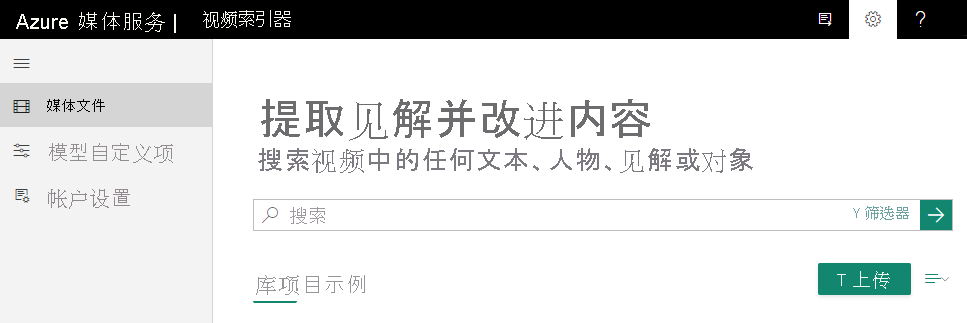

# <a name="upload-and-index-your-videos"></a>上传视频和编制视频索引  

使用视频索引器 API 上传视频时，有以下上传选项： 

* 从 URL 上传视频（首选），
* 作为请求正文中的字节数组发送视频文件。
* 通过提供[资产 ID](https://docs.microsoft.com/azure/media-services/latest/assets-concept) （仅在付费帐户中支持）来使用现有的 Azure 媒体服务资产。

视频上传完毕后，视频索引器（可选）会对视频进行编码（如文章中所述）。 创建视频索引器帐户时，可以选择免费试用帐户（提供特定分钟数的免费索引时间）或付费选项（不受配额的限制）。 使用免费试用版时，视频索引器为网站用户提供最多 600 分钟的免费索引，为 API 用户提供最多 2400 分钟的免费索引。 使用付费选项时，可以[创建连接到 Azure 订阅和 Azure 媒体服务帐户的视频索引器帐户](connect-to-azure.md)。 需要为编制索引的分钟数付费，此外还需要支付媒体帐户相关的费用。 

本文介绍如何通过以下选项上传和索引视频：

* [视频索引器网站](#website) 
* [视频索引器 Api](#apis)

## <a name="uploading-considerations-and-limitations"></a>上传注意事项和限制
 
- 视频的名称长度不得超过 80 个字符。
- 基于 URL 上传视频时（首选），终结点必须通过 TLS 1.2 （或更高版本）进行保护。
- 带有 URL 选项的上传大小限制为30GB。
- 请求 URL 长度限制为6144个字符，其中查询字符串 URL 长度限制为4096个字符。
- 具有字节数组选项的上传大小限制为2GB。
- 字节数组选项在30分钟后超时。
- 参数中提供的 URL `videoURL` 需要进行编码。
- 为媒体服务资产编制索引与从 URL 进行索引的限制相同。
- 对于单个文件，视频索引器的最大持续时间限制为4小时。
- URL 需要可访问（例如，公共 URL）。 

    如果它是专用 URL，则需要在请求中提供访问令牌。
- URL 必须指向有效的媒体文件，而不是指向网页的链接，例如指向页面的链接 `www.youtube.com` 。
- 在付费帐户中，最多可以上传50个电影，每分钟最多上载5个电影。

> [!Tip]
> 建议使用 .NET framework 版本 4.6.2. 或更高版本，因为较旧的 .NET framework 不会默认为 TLS 1.2。
>
> 如果必须使用较旧的 .NET framework，请在进行 REST API 调用之前在代码中添加一行：  <br/> System.Net.ServicePointManager.SecurityProtocol = SecurityProtocolType.Tls | SecurityProtocolType.Tls11 | SecurityProtocolType.Tls12;

## <a name="supported-file-formats-for-video-indexer"></a>视频索引器支持的文件格式

有关可用于视频索引器的文件格式列表，请参阅[输入容器/文件格式](../latest/media-encoder-standard-formats.md#input-containerfile-formats)一文。

## <a name="upload-and-index-a-video-using-the-video-indexer-website"></a><a id="website"/>使用视频索引器网站上传视频并为其编制索引

> [!NOTE]
> 视频的名称长度不得超过 80 个字符。

1. 登录到[视频索引器](https://www.videoindexer.ai/)网站。
2. 若要上传视频，请按“上传”按钮或链接。****

    

    视频上传以后，视频索引器就会开始对视频进行索引编制和分析。

     

    当视频索引器分析完以后，你会获得一个通知，其中包含视频链接以及对视频中找到的内容的简短说明。 例如：人物、主题、OCR。

## <a name="upload-and-index-with-api"></a><a id="apis"/>用 API 上传和索引

使用上[传视频](https://api-portal.videoindexer.ai/docs/services/operations/operations/Upload-video?)API，根据 URL 上传和索引视频。 下面的代码示例包含注释掉的代码，该代码演示如何上传字节数组。 

### <a name="configurations-and-params"></a>配置和参数

本部分介绍某些可选参数以及何时需设置它们。

#### <a name="externalid"></a>externalID 

此参数用于指定与视频关联的 ID。 此 ID 可以应用到外部“视频内容管理”(VCM) 系统集成。 位于视频索引器门户中的视频可以使用指定的外部 ID 进行搜索。

#### <a name="callbackurl"></a>callbackUrl

一个 URL，用于通知客户（使用 POST 请求）以下事件：

- 索引状态更改： 
    - 属性:    
    
        |“属性”|说明|
        |---|---|
        |id|视频 ID|
        |state|视频状态|  
    - 示例： https： \/ /test.com/notifyme?projectName=MyProject&id = 1234abcd&状态 = 已处理
- 在视频中标识的人：
  - 属性
    
      |名称|说明|
      |---|---|
      |id| 视频 ID|
      |faceId|出现在视频索引中的人脸 ID|
      |knownPersonId|在人脸模型中唯一的个人 ID|
      |personName|人名|
        
    - 示例： https： \/ /test.com/notifyme?projectName=MyProject&id = 1234abcd&faceid = 12&knownPersonId = CCA84350-89B7-4262-861C-3CAC796542A5&personName = Inigo_Montoya 

##### <a name="notes"></a>说明

- 视频索引器返回在原始 URL 中提供的任何现有参数。
- 提供的 URL 必须进行编码。

#### <a name="indexingpreset"></a>indexingPreset

如果原始的或外部的记录包含背景噪音，请使用此参数。 此参数用于配置索引编制过程。 你可以指定以下值：

- `AudioOnly` - 仅使用音频（忽略视频）编制见解的索引和提取见解
- `VideoOnly`-仅使用视频编制索引并提取见解（忽略音频）
- `Default` - 使用音频和视频编制见解的索引和提取见解
- `DefaultWithNoiseReduction` - 通过音频和视频编制见解的索引和提取见解，同时对音频流应用降噪算法

> [!NOTE]
> 视频索引器最多包含两个音频轨道。 如果文件中有更多的音频曲目，它们将被视为一个轨迹。<br/>
如果要单独为曲目编制索引，则需要提取相关音频文件并将其作为索引 `AudioOnly` 。

价格取决于所选索引编制选项。  

#### <a name="priority"></a>priority

视频由视频索引器根据优先级进行索引。 使用 **priority** 参数指定索引优先级。 以下值有效：**Low**（低）、**Normal**（正常，默认值）、**High**（高）。

仅付费帐户支持 **Priority** 参数。

#### <a name="streamingpreset"></a>streamingPreset

视频上传以后，视频索引器会选择性地对视频进行编码。 接下来会对视频进行索引编制和分析。 当视频索引器分析完以后，你会获得一个包含视频 ID 的通知。  

使用[上传视频](https://api-portal.videoindexer.ai/docs/services/operations/operations/Upload-video?)或[重新索引视频](https://api-portal.videoindexer.ai/docs/services/operations/operations/Re-index-video?) API 时，一个可选的参数是 `streamingPreset`。 如果将 `streamingPreset` 设置为 `Default`、`SingleBitrate` 或 `AdaptiveBitrate`，则会触发编码过程。 索引编制和编码作业完成以后，视频就会发布，这样你就也可以流式传输视频。 要从其流式传输视频的流式处理终结点必须处于“正在运行”状态。****

为了运行索引编制和编码作业，[连接到视频索引器帐户的 Azure 媒体服务帐户](connect-to-azure.md)需要预留单位。 有关详细信息，请参阅[缩放媒体处理](https://docs.microsoft.com/azure/media-services/previous/media-services-scale-media-processing-overview)。 由于这些是计算密集型作业，因此强烈建议使用 S3 单位类型。 RU 数定义可以并行运行的最大作业数。 基线建议是 10 个 S3 RU。 

如果只需对视频进行索引，但不需对其进行编码，请将 `streamingPreset` 设置为 `NoStreaming`。

#### <a name="videourl"></a>videoUrl

要编制索引的视频/音频文件的 URL。 该 URL 必须指向媒体文件（不支持 HTML 页面）。 该文件可以通过作为 URI 的一部分提供的访问令牌进行保护，并且为该文件提供服务的终结点必须使用 TLS 1.2 或更高版本进行保护。 需要对 URL 进行编码。 

如果未指定 `videoUrl`，则视频索引器希望你将文件作为多部分/表单正文内容传递。

### <a name="code-sample"></a>代码示例

以下 C# 代码片段演示了如何将所有的视频索引器 API 结合使用。

#### <a name="instructions-for-running-this-code-sample"></a>有关运行此代码示例的说明

将此代码复制到开发平台后，需要提供两个参数： API 管理身份验证密钥和视频 URL。

* API 密钥– API 密钥是你的个人 API 管理订阅密钥，将允许你获取访问令牌，以便对视频索引器帐户执行操作。 

    若要获取 API 密钥，请完成以下流程：

    * 导航到 https://api-portal.videoindexer.ai/
    * 登录
    * 中转到**产品**  ->  **授权**  ->  **授权订阅**
    * 复制**主密钥**
* 视频 URL-要编制索引的视频/音频文件的 URL。 该 URL 必须指向媒体文件（不支持 HTML 页面）。 该文件可以通过作为 URI 的一部分提供的访问令牌进行保护，并且为该文件提供服务的终结点必须使用 TLS 1.2 或更高版本进行保护。 需要对 URL 进行编码。

成功运行代码示例的结果将包括一个见解小组件 URL 和一个播放机小组件 URL，该 URL 允许你分别检查见解和视频上传。 


```csharp
public async Task Sample()
{
    var apiUrl = "https://api.videoindexer.ai";
    var apiKey = "..."; // replace with API key taken from https://aka.ms/viapi

    System.Net.ServicePointManager.SecurityProtocol =
        System.Net.ServicePointManager.SecurityProtocol | System.Net.SecurityProtocolType.Tls12;

    // create the http client
    var handler = new HttpClientHandler();
    handler.AllowAutoRedirect = false;
    var client = new HttpClient(handler);
    client.DefaultRequestHeaders.Add("Ocp-Apim-Subscription-Key", apiKey);

    // obtain account information and access token
    string queryParams = CreateQueryString(
        new Dictionary<string, string>()
        {
            {"generateAccessTokens", "true"},
            {"allowEdit", "true"},
        });
    HttpResponseMessage result = await client.GetAsync($"{apiUrl}/auth/trial/Accounts?{queryParams}");
    var json = await result.Content.ReadAsStringAsync();
    var accounts = JsonConvert.DeserializeObject<AccountContractSlim[]>(json);
    
    // take the relevant account, here we simply take the first, 
    // you can also get the account via accounts.First(account => account.Id == <GUID>);
    var accountInfo = accounts.First();

    // we will use the access token from here on, no need for the apim key
    client.DefaultRequestHeaders.Remove("Ocp-Apim-Subscription-Key");

    // upload a video
    var content = new MultipartFormDataContent();
    Console.WriteLine("Uploading...");
    // get the video from URL
    var videoUrl = "VIDEO_URL"; // replace with the video URL

    // as an alternative to specifying video URL, you can upload a file.
    // remove the videoUrl parameter from the query params below and add the following lines:
    //FileStream video =File.OpenRead(Globals.VIDEOFILE_PATH);
    //byte[] buffer =new byte[video.Length];
    //video.Read(buffer, 0, buffer.Length);
    //content.Add(new ByteArrayContent(buffer));

    queryParams = CreateQueryString(
        new Dictionary<string, string>()
        {
            {"accessToken", accountInfo.AccessToken},
            {"name", "video_name"},
            {"description", "video_description"},
            {"privacy", "private"},
            {"partition", "partition"},
            {"videoUrl", videoUrl},
        });
    var uploadRequestResult = await client.PostAsync($"{apiUrl}/{accountInfo.Location}/Accounts/{accountInfo.Id}/Videos?{queryParams}", content);
    var uploadResult = await uploadRequestResult.Content.ReadAsStringAsync();

    // get the video ID from the upload result
    string videoId = JsonConvert.DeserializeObject<dynamic>(uploadResult)["id"];
    Console.WriteLine("Uploaded");
    Console.WriteLine("Video ID:");
    Console.WriteLine(videoId);

    // wait for the video index to finish
    while (true)
    {
        await Task.Delay(10000);

        queryParams = CreateQueryString(
            new Dictionary<string, string>()
            {
                {"accessToken", accountInfo.AccessToken},
                {"language", "English"},
            });

        var videoGetIndexRequestResult = await client.GetAsync($"{apiUrl}/{accountInfo.Location}/Accounts/{accountInfo.Id}/Videos/{videoId}/Index?{queryParams}");
        var videoGetIndexResult = await videoGetIndexRequestResult.Content.ReadAsStringAsync();

        string processingState = JsonConvert.DeserializeObject<dynamic>(videoGetIndexResult)["state"];

        Console.WriteLine("");
        Console.WriteLine("State:");
        Console.WriteLine(processingState);

        // job is finished
        if (processingState != "Uploaded" && processingState != "Processing")
        {
            Console.WriteLine("");
            Console.WriteLine("Full JSON:");
            Console.WriteLine(videoGetIndexResult);
            break;
        }
    }

    // search for the video
    queryParams = CreateQueryString(
        new Dictionary<string, string>()
        {
            {"accessToken", accountInfo.AccessToken},
            {"id", videoId},
        });

    var searchRequestResult = await client.GetAsync($"{apiUrl}/{accountInfo.Location}/Accounts/{accountInfo.Id}/Videos/Search?{queryParams}");
    var searchResult = await searchRequestResult.Content.ReadAsStringAsync();
    Console.WriteLine("");
    Console.WriteLine("Search:");
    Console.WriteLine(searchResult);

    // Generate video access token (used for get widget calls)
    client.DefaultRequestHeaders.Add("Ocp-Apim-Subscription-Key", apiKey);
    var videoTokenRequestResult = await client.GetAsync($"{apiUrl}/auth/{accountInfo.Location}/Accounts/{accountInfo.Id}/Videos/{videoId}/AccessToken?allowEdit=true");
    var videoAccessToken = (await videoTokenRequestResult.Content.ReadAsStringAsync()).Replace("\"", "");
    client.DefaultRequestHeaders.Remove("Ocp-Apim-Subscription-Key");

    // get insights widget url
    queryParams = CreateQueryString(
        new Dictionary<string, string>()
        {
            {"accessToken", videoAccessToken},
            {"widgetType", "Keywords"},
            {"allowEdit", "true"},
        });
    var insightsWidgetRequestResult = await client.GetAsync($"{apiUrl}/{accountInfo.Location}/Accounts/{accountInfo.Id}/Videos/{videoId}/InsightsWidget?{queryParams}");
    var insightsWidgetLink = insightsWidgetRequestResult.Headers.Location;
    Console.WriteLine("Insights Widget url:");
    Console.WriteLine(insightsWidgetLink);

    // get player widget url
    queryParams = CreateQueryString(
        new Dictionary<string, string>()
        {
            {"accessToken", videoAccessToken},
        });
    var playerWidgetRequestResult = await client.GetAsync($"{apiUrl}/{accountInfo.Location}/Accounts/{accountInfo.Id}/Videos/{videoId}/PlayerWidget?{queryParams}");
    var playerWidgetLink = playerWidgetRequestResult.Headers.Location;
     Console.WriteLine("");
     Console.WriteLine("Player Widget url:");
     Console.WriteLine(playerWidgetLink);
     Console.WriteLine("\nPress Enter to exit...");
     String line = Console.ReadLine();
     if (line == "enter")
     {
         System.Environment.Exit(0);
     }

}

private string CreateQueryString(IDictionary<string, string> parameters)
{
    var queryParameters = HttpUtility.ParseQueryString(string.Empty);
    foreach (var parameter in parameters)
    {
        queryParameters[parameter.Key] = parameter.Value;
    }

    return queryParameters.ToString();
}

public class AccountContractSlim
{
    public Guid Id { get; set; }
    public string Name { get; set; }
    public string Location { get; set; }
    public string AccountType { get; set; }
    public string Url { get; set; }
    public string AccessToken { get; set; }
}
```

### <a name="common-errors"></a>常见错误

上传操作可能会返回下表中列出的状态代码。

|状态代码|ErrorType（在响应正文中）|描述|
|---|---|---|
|409|VIDEO_INDEXING_IN_PROGRESS|相同的视频已在给定帐户的处理进度中。|
|400|VIDEO_ALREADY_FAILED|不到 2 小时前，相同的视频已在给定帐户中处理失败。 API 客户端应至少等待 2 小时才能重新上传视频。|
|429||每分钟允许5次上载的试用帐户。 每分钟允许上传50个付费帐户。|

## <a name="next-steps"></a>后续步骤

[检查 API 生成的 Azure 视频索引器输出](video-indexer-output-json-v2.md)
