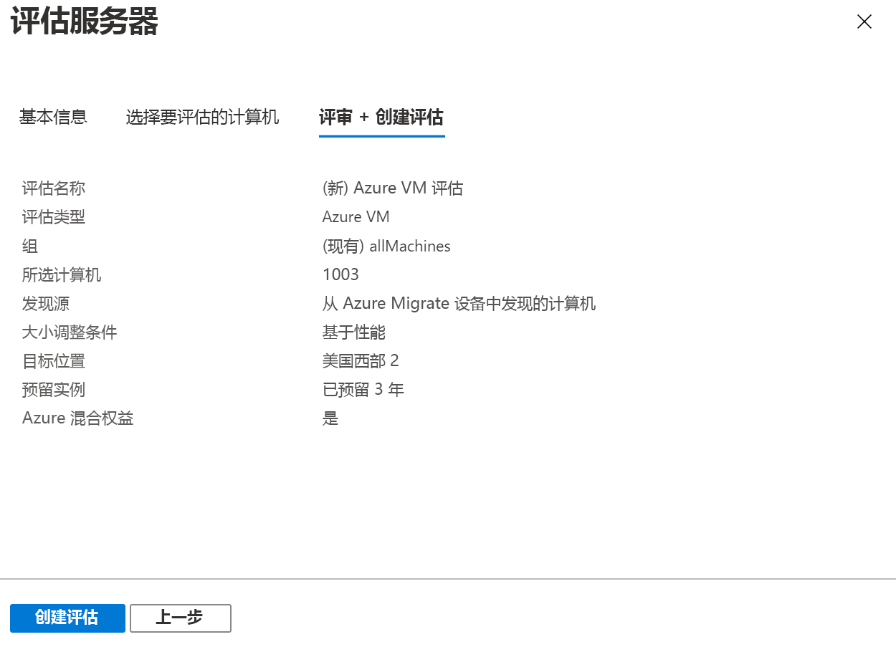

# <a name="assess-vmware-vms-with-azure-migrate-server-assessment"></a>使用“Azure Migrate:服务器评估”评估 VMware VM

本文介绍如何使用“Azure Migrate:服务器评估”工具评估本地 VMware VM。

[Azure Migrate](migrate-services-overview.md) 在一个中心位置提供多种工具，帮助你发现、评估应用、基础结构和工作负荷并将其迁移到 Microsoft Azure。 该中心包含 Azure Migrate 工具，以及第三方独立软件供应商 (ISV) 的产品/服务。


本教程是演示如何评估 VMware VM 以及将其迁移到 Azure 的教程系列中的第二篇文章。 本教程介绍如何执行下列操作：
> [!div class="checklist"]
> * 设置一个 Azure Migrate 项目。
> * 设置本地运行的 Azure Migrate 设备用于评估 VM。
> * 开始连续发现本地 VM。 设备会将已发现的 VM 的配置和性能数据发送到 Azure。
> * 分组已发现的 VM 并评估 VM 组。
> * 查看评估。


> [!NOTE]
> 教程中演示了方案的最简单部署路径，使你能够快速设置概念证明。 教程尽可能使用默认选项，不会演示所有可能的设置和路径。 有关详细说明，请查看操作指南文章。

如果没有 Azure 订阅，请在开始之前创建一个[免费帐户](https://azure.microsoft.com/pricing/free-trial/)。


## <a name="prerequisites"></a>先决条件

- [完成](tutorial-prepare-vmware.md)本教程系列中的第一篇教程。 否则，本教程中的说明不适用。
- 下面是在第一篇教程中应已完成的操作：
    - 为 Azure Migrate [设置 Azure 权限](tutorial-prepare-vmware.md#prepare-azure)。
    - [准备 VMware](tutorial-prepare-vmware.md#prepare-for-vmware-vm-assessment) 以进行评估。 应验证 VMware 设置；你应该有权使用 .OVA 模板创建 VMware VM。 此外，应该设置一个帐户用于发现 VM。 所需的端口应该可用；你应该知道用于访问 Azure 的 URL。


## <a name="set-up-an-azure-migrate-project"></a>设置 Azure Migrate 项目

按如下所述设置新的 Azure Migrate 项目。

1. 在 Azure 门户中选择“所有服务”，然后搜索 **Azure Migrate**。 
2. 在“服务”下选择“Azure Migrate”。  
3. 在“概述”中的“发现、评估和迁移服务器”下，单击“评估和迁移服务器”。   

    

4. 在“开始”中，单击“添加工具”。  
5. 在“迁移项目”中选择你的 Azure 订阅，并创建一个资源组（如果没有）。      
6. 在“项目详细信息”中，指定项目名称以及要在其中创建项目的地理位置。  支持“亚洲”、“欧洲”、“英国”和“美国”。

    - 项目地理位置仅用于存储从本地 VM 中收集的元数据。
    - 运行迁移时，可以选择任一目标区域。

    


7. 单击“下一步”。 
8. 在“选择评估工具”中，选择“Azure Migrate:   服务器评估” > “下一步”。 

    

9. 在“选择迁移工具”中，选择“暂时跳过添加迁移工具” > “下一步”。   
10. 在“检查 + 添加工具”中检查设置，然后单击“添加工具”。  
11. 等待几分钟，让 Azure Migrate 项目部署完成。 随后将转到项目页。 如果未看到该项目，可以从 Azure Migrate 仪表板中的“服务器”访问它。 


## <a name="set-up-the-appliance-vm"></a>设置设备 VM

“Azure Migrate:服务器评估”运行一个轻型 VMware VM 设备。

- 此设备执行 VM 发现，并将 VM 元数据和性能数据发送到 Azure Migrate 服务器评估。
- 若要设置该设备，请执行以下操作：
    - 下载 OVA 模板文件，并将其导入 vCenter Server。
    - 创建设备，并检查它是否可以连接到 Azure Migrate 服务器评估。
    - 完成设备的首次配置，并将其注册到 Azure Migrate 项目。
- 可为单个 Azure Migrate 项目设置多个设备。 在所有设备上，最多支持发现 35,000 个 VM。 在每个设备上，最多可以发现 10,000 个服务器。

### <a name="download-the-ova-template"></a>下载 OVA 模板

1. 在“迁移目标” > “服务器” > “Azure Migrate:    服务器评估”中，单击“发现”。 
2. 在“发现计算机” > “计算机是否已虚拟化?”中，单击“是，使用 VMWare vSphere 虚拟机监控程序”。   
3. 单击“下载”以下载 .OVA 模板文件。 

    


### <a name="verify-security"></a>验证安全性

在部署 .OVA 文件之前请检查其安全性。

1. 在下载文件的计算机上，打开管理员命令窗口。
2. 运行以下命令以生成 OVA 的哈希：
    - ```C:\>CertUtil -HashFile <file_location> [Hashing Algorithm]```
    - 用法示例：```C:\>CertUtil -HashFile C:\AzureMigrate\AzureMigrate.ova SHA256```
3. 对于版本 2.19.07.30，生成的哈希应与这些值匹配。 

  **算法** | **哈希值**
  --- | ---
  MD5 | 27230f3b012187860281b912ee661709
  SHA256 | c0a5b5998b7f38ac6e57ea9a808ecc4295795e18f9ca99c367585068883f06e7


### <a name="create-the-appliance-vm"></a>创建设备 VM

导入下载的文件，然后创建 VM。

1. 在 vSphere 客户端控制台中，单击“文件”   > “部署 OVF 模板”  。

    

2. 在“部署 OVF 模板向导”>“源”  中，指定 OVA 文件的位置。
3. 在“名称”和“位置”中，为 VM 指定一个易记名称。   选择要在其中托管 VM 的库存对象。
5. 在“主机/群集”中，指定要在其上运行 VM 的主机或群集。 
6. 在“存储”中，指定 VM 的存储目标。 
7. 在“磁盘格式”  中，指定磁盘类型和大小。
8. 在“网络映射”中，指定 VM 要连接到的网络。  该网络需要与 Internet 建立连接，这样才能向 Azure Migrate 服务器评估发送元数据。
9. 检查并确认设置，然后单击“完成”  。


### <a name="verify-appliance-access-to-azure"></a>验证设备的 Azure 访问权限

确保设备 VM 可以连接到 [Azure URL](migrate-support-matrix-vmware.md#assessment-url-access-requirements)。


### <a name="configure-the-appliance"></a>配置设备

使用以下步骤设置设备。

1. 在 vSphere 客户端控制台中，右键单击“VM”>“打开控制台”  。
2. 提供设备的语言、时区和密码。
3. 在可连接到该 VM 的任一计算机上打开浏览器，然后打开设备 Web 应用的 URL：**https://*设备名称或 IP 地址*:44368**。

   或者，可以在设备桌面上单击应用快捷方式打开该应用。
4. 在 Web 应用 >“设置必备组件”中执行以下操作： 
    - **许可证**：接受许可条款，并阅读第三方信息。
    - **连接**：应用将检查 VM 是否可访问 Internet。 如果 VM 使用代理：
        - 单击“代理设置”，并以 http://ProxyIPAddress 或 http://ProxyFQDN 格式指定代理地址和侦听端口。 
        - 如果代理需要身份验证，请指定凭据。
        - 仅支持 HTTP 代理。
    - **时间同步**：设备上的时间应与 Internet 时间同步，这样才能正常运行发现。
    - **安装更新**：设备可确保安装最新的更新。
    - **安装 VDDK**：设备将检查是否已安装 VMWare vSphere 虚拟磁盘开发工具包 (VDDK)。
        - “Azure Migrate:服务器迁移”在迁移到 Azure 期间使用 VDDK 复制计算机。
        - 从 VMware 下载 VDDK 6.7，并将下载的 zip 内容解压缩到设备上的指定位置。

### <a name="register-the-appliance-with-azure-migrate"></a>将设备注册到 Azure Migrate

1. 单击“登录”。  如果未显示该按钮，请确保已在浏览器中禁用弹出窗口阻止程序。
2. 在新的标签页中，使用 Azure 凭据登录。
    - 使用用户名和密码登录。
    - 不支持使用 PIN 登录。
3. 成功登录后，返回到 Web 应用。
2. 选择在其中创建了 Azure Migrate 项目的订阅，然后选择项目。
3. 指定设备的名称。 该名称应是字母数字，长度为 14 个或更少的字符。
4. 单击“注册”  。


## <a name="start-continuous-discovery"></a>启动持续发现

现在，请从设备连接到 vCenter Server，然后启动 VM 发现。

1. 在“指定 vCenter Server 详细信息”中，指定 vCenter Server 的名称 (FQDN) 或 IP 地址。  可以保留默认端口，或指定 vCenter Server 侦听的自定义端口。
2. 在“用户名”和“密码”中，指定设备用来发现 vCenter Server 上的 VM 的只读帐户凭据。   请确保该帐户拥有[所需的发现权限](migrate-support-matrix-vmware.md#assessment-vcenter-server-permissions)。 可以通过相应地限制对 vCenter 帐户的访问，来限定发现范围；在[此处](tutorial-assess-vmware.md#scoping-discovery)详细了解如何限定发现范围。
3. 单击“验证连接”，确保设备可以连接到 vCenter Server。 
4. 建立连接后，单击“保存并启动发现”。 

随即会启动发现。 大约 15 分钟后，已发现的 VM 的元数据将显示在门户中。

### <a name="scoping-discovery"></a>限定发现范围

可以通过限制访问用于发现的 vCenter 帐户，来限定发现范围。 可将范围设置为 vCenter Server 数据中心、群集、群集文件夹、主机、主机文件夹或单个 VM。 

> [!NOTE]
> 目前，如果在 vCenter VM 文件夹级别授予 vCenter 帐户的访问权限，则服务器评估无法发现 VM。 若要按 VM 文件夹限定发现范围，确保在 VM 级别为 vCenter 帐户分配只读访问权限即可实现此目的。  下面提供了有关如何执行此操作的说明：
>
> 1. 针对 VM 文件夹中你要将发现范围限定到的所有 VM 分配只读权限。 
> 2. 对托管 VM 的所有父对象授予只读访问权限。 需要包括层次结构中的所有父对象（主机、主机文件夹、群集、群集文件夹）直到数据中心。 不需要将权限传播到所有子对象。
> 3. 选择数据中心作为收集范围可以使用凭据进行发现。  RBAC 设置确保相应的 vCenter 用户仅有权访问特定于租户的 VM。
>
> 请注意，支持主机文件夹和群集文件夹。

### <a name="verify-vms-in-the-portal"></a>在门户中验证 VM

发现完成后，可以验证 VM 是否出现在 Azure 门户中。

1. 打开 Azure Migrate 仪表板。
2. 在“Azure Migrate - 服务器” > “Azure Migrate:   服务器评估”页中，单击显示了**已发现服务器**计数的图标。

## <a name="set-up-an-assessment"></a>设置评估

使用“Azure Migrate: 服务器评估”可以运行两种类型的评估。

**评估** | **详细信息** | **数据**
--- | --- | ---
**基于性能** | 基于收集的性能数据的评估 | **建议的 VM 大小**：基于 CPU 和内存利用率数据。<br/><br/> **建议的磁盘类型(标准或高级托管磁盘)** ：基于本地磁盘的 IOPS 和吞吐量。
**本地** | 基于本地大小的评估。 | **建议的 VM 大小**：基于本地 VM 大小<br/><br> **建议的磁盘类型**：基于为评估选择的存储类型设置。


### <a name="run-an-assessment"></a>运行评估

按如下述运行评估：

1. 查看有关创建评估的[最佳做法](best-practices-assessment.md)。
2. 在“服务器”选项卡上的“Azure Migrate:   服务器评估”磁贴中，单击“评估”。 

    

2. 在“评估服务器”中，指定评估的名称。 
3. 单击“全部查看”查看评估属性  。

    

3. 在“选择或创建组”中，选择“新建”并指定组名称。   组将要评估的一个或多个 VM 集合到一起。
4. 在“将计算机添加到组”中，选择要添加到该组的 VM。 
5. 单击“创建评估”以创建该组，并运行评估。 

    

6. 创建评估后，在“服务器” > “Azure Migrate:   服务器评估” > “评估”中查看它。 
7. 单击“导出评估”，将评估下载为 Excel 文件。 


## <a name="review-an-assessment"></a>查看评估

评估描述：

- **Azure 迁移就绪性**：VM 是否适合迁移到 Azure。
- **每月成本估算**：在 Azure 中运行 VM 的估算每月计算和存储成本。
- **每月存储成本估算**：迁移后的磁盘存储估算成本。

### <a name="view-an-assessment"></a>查看评估

1. 在“迁移目标” >  “服务器”中，单击“Azure Migrate:     服务器评估”中的“评估”。
2. 在“评估”中，单击某项评估将其打开。 

    

### <a name="review-azure-readiness"></a>查看 Azure 迁移就绪性

1. 在“Azure 迁移就绪性”中，验证 VM 是否已准备好迁移到 Azure。 
2. 查看 VM 状态：
    - **已做好 Azure 迁移准备**：对于评估中的 VM，Azure Migrate 将建议 VM 大小并显示估算成本。
    - **准备就绪但存在以下状况**：显示问题和建议的补救措施。
    - **尚未做好 Azure 迁移准备**：显示问题和建议的补救措施。
    - **就绪性未知**：当数据可用性问题导致 Azure Migrate 无法评估就绪性时使用。

2. 单击某种“Azure 迁移就绪性”状态。  可以查看 VM 就绪性详细信息，并深入查看 VM 详细信息，包括计算、存储和网络设置。


### <a name="review-cost-details"></a>查看成本详细信息

此视图显示在 Azure 中运行 VM 的估算计算和存储成本。

1. 查看每月计算和存储成本。 将聚合评估的组中所有 VM 的成本。

    - 估算成本是根据计算机的大小建议及其磁盘和属性给出的。
    - 将显示估算的每月计算和存储成本。
    - 估算成本适用于作为 IaaS VM 运行的本地 VM。 Azure Migrate 服务器评估不考虑 PaaS 或 SaaS 成本。

2. 可以查看每月存储估算成本。 此视图显示评估的组的聚合存储成本，按不同类型的存储磁盘划分。
3. 可以深入查看特定 VM 的详细信息。


### <a name="review-confidence-rating"></a>查看置信度分级

运行基于性能的评估时，会将一个置信度分级分配到评估。


- 将授予从 1 星（最低）到 5 星（最高）的分级。
- 置信度分级可帮助你判断评估所提供的大小建议的可靠性。
- 置信度分级基于计算评估所需的数据点的可用性。

评估的置信度分级如下。

**数据点可用性** | **置信度分级**
--- | ---
0%-20% | 1 星
21%-40% | 2 星
41%-60% | 3 星
61%-80% | 4 星
81%-100% | 5 星

[详细了解](best-practices-assessment.md#best-practices-for-confidence-ratings)有关置信度分级的最佳做法。


## <a name="next-steps"></a>后续步骤

本教程介绍以下操作：

> [!div class="checklist"]
> * 已设置一个 Azure Migrate 设备
> * 已创建并查看评估

请继续学习本教程系列的第三篇教程，了解如何使用 Azure Migrate 服务器迁移将 VMware VM 迁移到 Azure。

> [!div class="nextstepaction"]
> [迁移 VMware VM](./tutorial-migrate-vmware.md)
