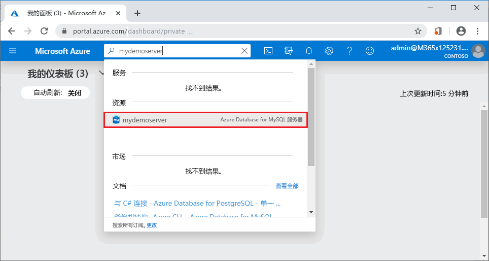

# <a name="azure-database-for-mysql-use-python-to-connect-and-query-data"></a>Azure Database for MySQL：使用 Python 进行连接并查询数据
本快速入门演示了如何使用 [Python](https://python.org) 连接到 Azure Database for MySQL。 该语言可以通过 Mac OS、Ubuntu Linux 和 Windows 平台，使用 SQL 语句在数据库中查询、插入、更新和删除数据。 本主题假设你熟悉如何使用 Python 进行开发，但不太熟悉 Azure Database for MySQL 的用法。

## <a name="prerequisites"></a>先决条件
此快速入门使用以下任意指南中创建的资源作为起点：
- [使用 Azure 门户创建用于 MySQL 服务器的 Azure 数据库](./quickstart-create-mysql-server-database-using-azure-portal.md)
- [使用 Azure CLI 创建用于 MySQL 服务器的 Azure 数据库](./quickstart-create-mysql-server-database-using-azure-cli.md)

## <a name="install-python-and-the-mysql-connector"></a>安装 Python 和 MySQL 连接器
在自己的计算机上安装 [Python](https://www.python.org/downloads/) 和[用于 Python 的 MySQL 连接器](https://dev.mysql.com/downloads/connector/python/)。 根据自己的平台执行相应部分中的步骤：

### <a name="windows"></a>Windows
1. 下载并安装 [python.org](https://www.python.org/downloads/windows/) 提供的 Python 2.7。 
2. 通过启动命令提示符来检查 Python 安装。 使用大写 V 开关运行 `C:\python27\python.exe -V` 命令，查看版本号。
3. 根据 Python 版本安装 [mysql.com](https://dev.mysql.com/downloads/connector/python/) 提供的用于 MySQL 的 Python 连接器。

### <a name="linux-ubuntu"></a>Linux (Ubuntu)
1. 在 Linux (Ubuntu) 中，通常会在默认安装过程中安装 Python。
2. 通过启动 Bash Shell 来检查 Python 安装。 使用大写 V 开关运行 `python -V` 命令，查看版本号。
3. 通过运行 `pip show pip -V` 命令来查看版本号，检查 PIP 安装。 
4. PIP 可能包括在某些版本的 Python 中。 如果 PIP 未安装，可以通过运行 `sudo apt-get install python-pip` 命令来安装 [PIP] (https://pip.pypa.io/en/stable/installing/) 包。
5. 通过运行 `pip install -U pip` 命令将 PIP 更新到最新版本。
6. 使用以下 PIP 命令，安装用于 Python 的 MySQL 连接器及其依赖项：

   ```bash
   sudo pip install mysql-connector-python-rf
   ```
 
### <a name="macos"></a>MacOS
1. 在 Mac OS 中，通常会在默认 OS 安装过程中安装 Python。
2. 通过启动 Bash Shell 来检查 Python 安装。 使用大写 V 开关运行 `python -V` 命令，查看版本号。
3. 通过运行 `pip show pip -V` 命令来查看版本号，检查 PIP 安装。
4. PIP 可能包括在某些版本的 Python 中。 如果未安装 PIP，则可安装 [PIP](https://pip.pypa.io/en/stable/installing/) 包。
5. 通过运行 `pip install -U pip` 命令将 PIP 更新到最新版本。
6. 使用以下 PIP 命令，安装用于 Python 的 MySQL 连接器及其依赖项：

   ```bash
   pip install mysql-connector-python-rf
   ```

## <a name="get-connection-information"></a>获取连接信息
获取连接到 Azure Database for MySQL 所需的连接信息。 需要完全限定的服务器名称和登录凭据。

1. 登录到 [Azure 门户](https://portal.azure.com/)。
2. 在 Azure 门户的左侧菜单中，单击“所有资源”，然后搜索已创建的服务器（例如 mydemoserver）。
3. 单击服务器名称。
4. 从服务器的“概览”面板中记下“服务器名称”和“服务器管理员登录名”。 如果忘记了密码，也可通过此面板来重置密码。
 
   

## <a name="run-python-code"></a>运行 Python 代码
- 将代码粘贴到文本文件中，然后将该文件使用 .py 文件扩展名保存到项目文件夹中（例如 C:\pythonmysql\createtable.py 或 /home/username/pythonmysql/createtable.py）。
- 若要运行此代码，请启动命令提示符或 Bash shell。 将目录更改为项目文件夹 `cd pythonmysql`。 然后键入后跟文件名的 python 命令 `python createtable.py`，以便运行应用程序。 在 Windows OS 中，如果找不到 python.exe，可能需要提供可执行文件的完整路径，或者将 Python 路径添加到 path 环境变量中。 `C:\python27\python.exe createtable.py`

## <a name="connect-create-table-and-insert-data"></a>进行连接，创建表，然后插入数据
通过以下代码连接到服务器，创建一个表，然后使用 INSERT SQL 语句加载数据。 

在代码中，mysql.connector 库已导入。 [connect()](https://dev.mysql.com/doc/connector-python/en/connector-python-api-mysql-connector-connect.html) 函数用于通过配置集合中的[连接参数](https://dev.mysql.com/doc/connector-python/en/connector-python-connectargs.html)连接到 Azure Database for MySQL。 该代码对连接使用游标，并通过 [cursor.execute()](https://dev.mysql.com/doc/connector-python/en/connector-python-api-mysqlcursor-execute.html) 方法对 MySQL 数据库执行 SQL 查询。 

将 `host`、`user`、`password`、`database` 参数替换为你在创建服务器和数据库时指定的值。

```Python
import mysql.connector
from mysql.connector import errorcode

# Obtain connection string information from the portal
config = {
  'host':'mydemoserver.mysql.database.azure.com',
  'user':'myadmin@mydemoserver',
  'password':'yourpassword',
  'database':'quickstartdb'
}

# Construct connection string
try:
   conn = mysql.connector.connect(**config)
   print("Connection established")
except mysql.connector.Error as err:
  if err.errno == errorcode.ER_ACCESS_DENIED_ERROR:
    print("Something is wrong with the user name or password")
  elif err.errno == errorcode.ER_BAD_DB_ERROR:
    print("Database does not exist")
  else:
    print(err)
else:
  cursor = conn.cursor()

  # Drop previous table of same name if one exists
  cursor.execute("DROP TABLE IF EXISTS inventory;")
  print("Finished dropping table (if existed).")

  # Create table
  cursor.execute("CREATE TABLE inventory (id serial PRIMARY KEY, name VARCHAR(50), quantity INTEGER);")
  print("Finished creating table.")

  # Insert some data into table
  cursor.execute("INSERT INTO inventory (name, quantity) VALUES (%s, %s);", ("banana", 150))
  print("Inserted",cursor.rowcount,"row(s) of data.")
  cursor.execute("INSERT INTO inventory (name, quantity) VALUES (%s, %s);", ("orange", 154))
  print("Inserted",cursor.rowcount,"row(s) of data.")
  cursor.execute("INSERT INTO inventory (name, quantity) VALUES (%s, %s);", ("apple", 100))
  print("Inserted",cursor.rowcount,"row(s) of data.")

  # Cleanup
  conn.commit()
  cursor.close()
  conn.close()
  print("Done.")
```

## <a name="read-data"></a>读取数据
使用以下代码进行连接，并使用 SELECT SQL 语句读取数据。 

在代码中，mysql.connector 库已导入。 [connect()](https://dev.mysql.com/doc/connector-python/en/connector-python-api-mysql-connector-connect.html) 函数用于通过配置集合中的[连接参数](https://dev.mysql.com/doc/connector-python/en/connector-python-connectargs.html)连接到 Azure Database for MySQL。 该代码对连接使用游标，并通过 [cursor.execute()](https://dev.mysql.com/doc/connector-python/en/connector-python-api-mysqlcursor-execute.html) 方法对 MySQL 数据库执行 SQL 语句。 数据行使用 [fetchall()](https://dev.mysql.com/doc/connector-python/en/connector-python-api-mysqlcursor-fetchall.html) 方法读取。 结果集保留在集合行中，for 迭代器用于针对行进行循环。

将 `host`、`user`、`password`、`database` 参数替换为你在创建服务器和数据库时指定的值。

```Python
import mysql.connector
from mysql.connector import errorcode

# Obtain connection string information from the portal
config = {
  'host':'mydemoserver.mysql.database.azure.com',
  'user':'myadmin@mydemoserver',
  'password':'yourpassword',
  'database':'quickstartdb'
}

# Construct connection string
try:
   conn = mysql.connector.connect(**config)
   print("Connection established")
except mysql.connector.Error as err:
  if err.errno == errorcode.ER_ACCESS_DENIED_ERROR:
    print("Something is wrong with the user name or password")
  elif err.errno == errorcode.ER_BAD_DB_ERROR:
    print("Database does not exist")
  else:
    print(err)
else:
  cursor = conn.cursor()

  # Read data
  cursor.execute("SELECT * FROM inventory;")
  rows = cursor.fetchall()
  print("Read",cursor.rowcount,"row(s) of data.")

  # Print all rows
  for row in rows:
    print("Data row = (%s, %s, %s)" %(str(row[0]), str(row[1]), str(row[2])))

  # Cleanup
  conn.commit()
  cursor.close()
  conn.close()
  print("Done.")
```

## <a name="update-data"></a>更新数据
使用以下代码进行连接，并使用 UPDATE SQL 语句更新数据。 

在代码中，mysql.connector 库已导入。  [connect()](https://dev.mysql.com/doc/connector-python/en/connector-python-api-mysql-connector-connect.html) 函数用于通过配置集合中的[连接参数](https://dev.mysql.com/doc/connector-python/en/connector-python-connectargs.html)连接到 Azure Database for MySQL。 该代码对连接使用游标，并通过 [cursor.execute()](https://dev.mysql.com/doc/connector-python/en/connector-python-api-mysqlcursor-execute.html) 方法对 MySQL 数据库执行 SQL 语句。 

将 `host`、`user`、`password`、`database` 参数替换为你在创建服务器和数据库时指定的值。

```Python
import mysql.connector
from mysql.connector import errorcode

# Obtain connection string information from the portal
config = {
  'host':'mydemoserver.mysql.database.azure.com',
  'user':'myadmin@mydemoserver',
  'password':'yourpassword',
  'database':'quickstartdb'
}

# Construct connection string
try:
   conn = mysql.connector.connect(**config)
   print("Connection established")
except mysql.connector.Error as err:
  if err.errno == errorcode.ER_ACCESS_DENIED_ERROR:
    print("Something is wrong with the user name or password")
  elif err.errno == errorcode.ER_BAD_DB_ERROR:
    print("Database does not exist")
  else:
    print(err)
else:
  cursor = conn.cursor()

  # Update a data row in the table
  cursor.execute("UPDATE inventory SET quantity = %s WHERE name = %s;", (200, "banana"))
  print("Updated",cursor.rowcount,"row(s) of data.")

  # Cleanup
  conn.commit()
  cursor.close()
  conn.close()
  print("Done.")
```

## <a name="delete-data"></a>删除数据
使用以下代码进行连接，并使用 **DELETE** SQL 语句删除数据。 

在代码中，mysql.connector 库已导入。  [connect()](https://dev.mysql.com/doc/connector-python/en/connector-python-api-mysql-connector-connect.html) 函数用于通过配置集合中的[连接参数](https://dev.mysql.com/doc/connector-python/en/connector-python-connectargs.html)连接到 Azure Database for MySQL。 该代码对连接使用游标，并通过 [cursor.execute()](https://dev.mysql.com/doc/connector-python/en/connector-python-api-mysqlcursor-execute.html) 方法对 MySQL 数据库执行 SQL 查询。 

将 `host`、`user`、`password`、`database` 参数替换为你在创建服务器和数据库时指定的值。

```Python
import mysql.connector
from mysql.connector import errorcode

# Obtain connection string information from the portal
config = {
  'host':'mydemoserver.mysql.database.azure.com',
  'user':'myadmin@mydemoserver',
  'password':'yourpassword',
  'database':'quickstartdb'
}

# Construct connection string
try:
   conn = mysql.connector.connect(**config)
   print("Connection established.")
except mysql.connector.Error as err:
  if err.errno == errorcode.ER_ACCESS_DENIED_ERROR:
    print("Something is wrong with the user name or password.")
  elif err.errno == errorcode.ER_BAD_DB_ERROR:
    print("Database does not exist.")
  else:
    print(err)
else:
  cursor = conn.cursor()

  # Delete a data row in the table
  cursor.execute("DELETE FROM inventory WHERE name=%(param1)s;", {'param1':"orange"})
  print("Deleted",cursor.rowcount,"row(s) of data.")

  # Cleanup
  conn.commit()
  cursor.close()
  conn.close()
  print("Done.")
```

## <a name="next-steps"></a>后续步骤
> [!div class="nextstepaction"]
> [使用导出和导入功能迁移数据库](./concepts-migrate-import-export.md)
