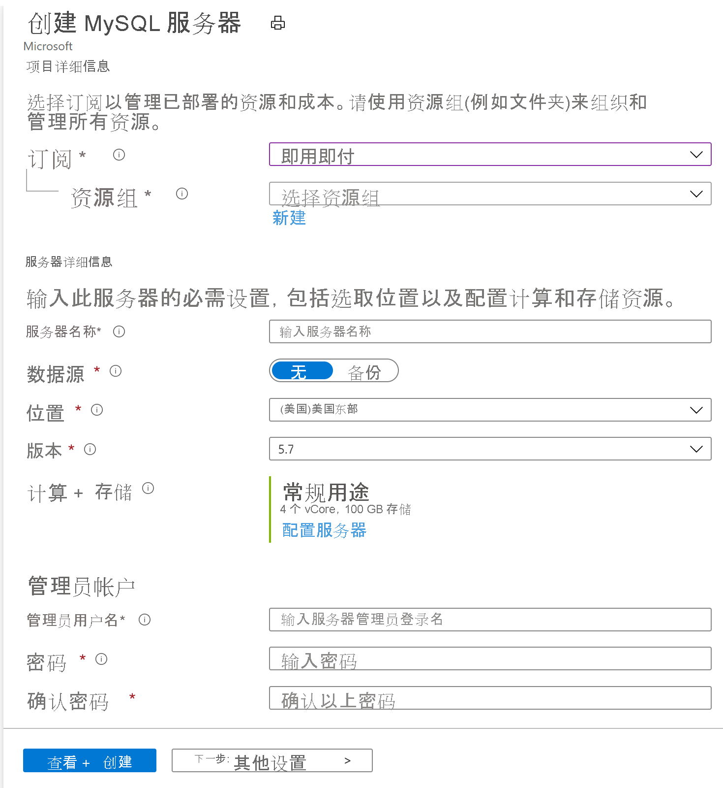

# <a name="quickstart-create-an-azure-database-for-mysql-server-in-the-azure-portal"></a>快速入门：在 Azure 门户中创建 Azure Database for MySQL 服务器

Azure Database for MySQL 是一种托管服务，可用于在云中运行、管理和缩放高可用性的 MySQL 数据库。 此快速入门介绍如何使用 Azure 门户在大约五分钟内创建 Azure Database for MySQL 服务器。  

如果还没有 Azure 订阅，可以在开始前创建一个[免费 Azure 帐户](https://azure.microsoft.com/free/)。

## <a name="sign-in-to-the-azure-portal"></a>登录到 Azure 门户
打开 Web 浏览器，然后访问 [Azure 门户](https://portal.azure.com/)。 输入登录到门户所需的凭据。 默认视图是服务仪表板。

## <a name="create-an-azure-database-for-mysql-server"></a>创建 Azure Database for MySQL 服务器
创建 Azure Database for MySQL 服务器时，请使用定义好的一组[计算和存储资源](./concepts-compute-unit-and-storage.md)。 请在 [Azure 资源组](../azure-resource-manager/management/overview.md)中创建该服务器。

按照以下步骤创建 Azure Database for MySQL 服务器：

1. 在门户左上角选择“创建资源”  (+)。

2. 选择“数据库”   >   “Azure Database for MySQL”。 还可以在搜索框中输入“MySQL”  以查找该服务。

  
>[!div class="mx-imgBorder"]
> 

3. 使用以下信息填写“新服务器详细信息”窗体：
    
>[!div class="mx-imgBorder"]
> 

**设置** | **建议的值** | **字段说明** 
---|---|---
订阅 | 订阅 | 选择要用于服务器的 Azure 订阅。 如果有多个订阅，请选择要计费的资源所在的订阅。
资源组 | myresourcegroup | 提供新的或现有的资源组名称。 可以使用资源组来组织属于单个项目的依赖项。
服务器名称 | 唯一的服务器名称 | 输入用于标识 Azure Database for MySQL 服务器的唯一名称。 例如，“mysqldbserver”。服务器名称只能包含小写字母、数字和连字符 (-) 字符。 必须包含 3 到 63 个字符。
数据源 |*无* | 选择“无”，从头开始创建新的服务器。 （如果是从现有 Azure Database for MySQL 服务器的异地备份创建服务器，则会选择“备份”）。
服务器管理员登录名 | myadmin | 输入服务器管理员的用户名。 不能将“azure_superuser”、“admin”、“administrator”、“root”、“guest”或“public”用作管理员用户名     。
密码 | *由用户选择* | 为服务器管理员帐户提供新密码。 密码长度必须为 8 到 128 个字符，并包含大写字母或小写字母、数字和非字母数字字符（！、$、#、% 等）的组合。
确认密码 | *由用户决定*| 确认管理员帐户密码。
位置 | *离用户最近的区域*| 选择最靠近用户或其他 Azure 应用程序的位置。
版本 | *最新主版本*| 最新主版本（除非你有需要其他版本的特定需求）。
计算 + 存储 | **常规用途**、**第 5 代**、**2 vCore**、**5 GB**、**7 天**、**异地冗余** |新服务器的计算、存储和备份配置。 选择“配置服务器”。 接下来，选择适当的定价层，有关详细信息，请参阅[定价页面](https://azure.microsoft.com/pricing/details/mysql/)。 若要在异地冗余存储中启用服务器备份，请从**备份冗余选项**中选择“异地冗余”。 选择“确定”。

   > [!NOTE]
   > 如果轻量级计算和 I/O 足以满足工作负荷要求，请考虑使用“基本”定价层。 请注意，在“基本”定价层中创建的服务器以后不能扩展到“常规用途”或“内存优化”定价层。 

4. 选择“查看 + 创建”  以预配服务器。 预配可能需要长达 20 分钟的时间。
   
5. 在工具栏上选择“通知”（钟形图标）以监视部署过程。
   
默认情况下，将在服务器下创建以下数据库：**information_schema**、**mysql**、**performance_schema** 和 **sys**。

## <a name="configure-a-server-level-firewall-rule"></a>配置服务器级防火墙规则
默认情况下，创建的服务器使用防火墙进行保护，并且无法公开。 若要授予对 IP 的访问权限，请转到 Azure 门户中的服务器资源，然后从左侧菜单中为服务器资源选择“连接安全性”。 不知道如何找到资源时，请参阅[如何打开资源](https://docs.microsoft.com/azure/azure-resource-manager/management/manage-resources-portal#open-resources)。

>[!div class="mx-imgBorder"]
> 
   
现在选择“添加当前客户端 IP 地址”，然后选择“保存” 。 你可以添加其他 IP 或提供一个 IP 范围，从该范围中的 IP 连接到服务器。 有关详细信息，请参阅[如何在 Azure Database for MySQL 服务器上管理防火墙规则](./concepts-firewall-rules.md)

> [!NOTE]
> 检查网络是否允许通过端口 3306 送出出站流量，该端口由 Azure Database for MySQL 使用，旨在避免连接问题。  

## <a name="connect-to-azure-database-for-mysql-server-using-mysql-command-line-client"></a>使用 mysql 命令行客户端连接到 Azure Database for MySQL 服务器
可以选择 [mysql.exe](https://dev.mysql.com/doc/refman/8.0/en/mysql.html) 或 [MySQL Workbench](./connect-workbench.md)，以从本地环境连接到服务器。 在本快速入门中，我们将在 [Azure Cloud Shell](https://docs.microsoft.com/azure/cloud-shell/overview) 中运行 mysql.exe 以连接到服务器。

1. 通过单击左上角突出显示的图标在门户中启动 Azure Cloud Shell。 通过“概述”部分记录下你的服务器名称、服务器管理员登录名、密码和新创建的服务器的订阅，如下图所示。

    >[!NOTE]
    >如果你是第一次启动 Cloud Shell，会看到一个提示，提示你创建资源组、存储帐户。 这是一个一次性步骤，将来会针对所有会话自动附加。 

   >[!div class="mx-imgBorder"]
   > 
2. 在 Azure Cloud Shell 终端上运行此命令。 将值替换为实际的服务器名称和管理员用户登录名。 Azure Database for MySQL 的管理员用户名需要 @<servername>，如下所示  

  ```azurecli-interactive
  mysql --host=mydemoserver.mysql.database.azure.com --user=myadmin@mydemoserver -p 
  ```

  下图显示了 Cloud Shell 终端中的该体验过程
  ```
  Requesting a Cloud Shell.Succeeded.
  Connecting terminal...

  Welcome to Azure Cloud Shell

  Type "az" to use Azure CLI
  Type "help" to learn about Cloud Shell

  sunitha@Azure:~$mysql -h mydemoserver.mysql.database.azure.com -u admin@wpapp-mysqldbserver -p
  Enter password:
  Welcome to the MySQL monitor.  Commands end with ; or \g.
  Your MySQL connection id is 64796
  Server version: 5.6.42.0 Source distribution

  Copyright (c) 2000, 2020, Oracle and/or its affiliates. All rights reserved.

  Oracle is a registered trademark of Oracle Corporation and/or its
  affiliates. Other names may be trademarks of their respective
  owners.

  Type 'help;' or '\h' for help. Type '\c' to clear the current input statement.
  mysql>
  ```
3. 在同一个 Azure Cloud Shell 终端中，创建一个数据库“guest” 
  ```
  mysql> CREATE DATABASE guest;
  Query OK, 1 row affected (0.27 sec)
  ```
4. 更改为数据库“guest”
  ```
  mysql> USE guest;
  Database changed 
  ```
5. 键入 ```quit```，然后选择 Enter 键退出 mysql。   

## <a name="clean-up-resources"></a>清理资源
现在已成功在资源组中创建了 Azure Database for MySQL 服务器。  如果将来不再需要这些资源，可以通过删除资源组或只删除 MySQL 服务器来删除它们。 若要删除资源组，请执行以下步骤：
1. 在 Azure 门户中，搜索并选择“资源组”。 
2. 在资源组列表中，选择你的资源组的名称。
3. 在资源组的概述页面中，选择“删除资源组”。
4. 在确认对话框中，键入资源组的名称，然后选择“删除”。

若要删除服务器，可以单击服务器的“概述”页面上的“删除”按钮，如下所示 ：
> [!div class="mx-imgBorder"]
> 

## <a name="next-steps"></a>后续步骤
> [!div class="nextstepaction"]
>[使用 MySQL 在 Windows 上生成 PHP 应用](../app-service/app-service-web-tutorial-php-mysql.md)
>[使用 MySQL 在 Linux 上生成 PHP 应用](../app-service/containers/tutorial-php-mysql-app.md)
>[使用 MySQL 生成基于 Java 的 Spring 应用](https://docs.microsoft.com/azure/developer/java/spring-framework/spring-app-service-e2e?tabs=bash)
