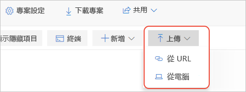

# 快速入门：迁移本地 Jupyter 笔记本

只有你才能访问在自己的计算机本地创建的 Jupyter 笔记本。 可以通过各种方式共享你的文件，但收件人在本地有他们自己的笔记本副本，你很难将他们可能做出的任何更改合并到一起。 还可以将笔记本存储在共享的联机存储库（如 GitHub）中，但这样做仍然需要每个协作者都有其自己的本地 Jupyter 安装，并且具有与你相同的配置。

通过将本地或基于存储库的笔记本迁移到 Azure Notebooks，可以将它们存储在云中，可以从中立即与协作者们共享。 这些协作者只需要一个浏览器就可以查看和运行笔记本，如果他们[登录](quickstart-sign-in-azure-notebooks.md) Azure Notebooks，也可以进行更改。

此快速入门演示了从本地计算机或其他可访问的文件 URL 迁移笔记本的过程。 若要从 GitHub 存储库迁移笔记本，请参阅[快速入门：克隆笔记本](quickstart-clone-jupyter-notebook.md)。

## 在 Azure Notebooks 上创建项目

1. 转到 [Azure Notebooks](https://notebooks.azure.com) 并登录。 （有关详细信息，请参阅[快速入门 - 登录 Azure Notebooks](quickstart-sign-in-azure-notebooks.md)）。

1. 在公用个人资料页面中，选择页面顶部的“我的项目”：

    

1. 在“我的项目”页面上，选择“+ 新建项目”（键盘快捷方式：N）；如果浏览器窗口较窄，该按钮可能仅显示为 +：

    

1. 在出现的“创建新项目”弹出窗口中，在“项目名称”和“项目 ID”字段中输入迁移笔记本的适当值，清除“公共项目”和“创建 README.md”的选项，然后选择“创建”。

## 上传本地笔记本

1. 在项目页上选择“上传”（只有当浏览器窗口很小的情况下才会显示为向上箭头），然后选择 1。 在显示的弹出窗口，如果笔记本位于本地文件系统，选择“从计算机”，如果是联机笔记本，则选择“从 URL”：

    

   （同样，如果笔记本是在 GitHub 存储库中，则执行[快速入门：克隆笔记本](quickstart-clone-jupyter-notebook.md)上的步骤。）

   - 如果使用“从计算机”，将 .ipynb 文件拖放到弹出窗口，或选择“选择文件”，然后浏览并选择要导入的文件。 然后，选择“上传”。 上传的文件与本地文件具有相同名称。 （不需要上传任何 .ipynb_checkpoints 文件夹内容。）

     

   - 如果使用“从 URL”，在“文件 URL”字段输入源地址，并在“文件名”字段输入在项目中分配给笔记本的文件名。 然后，选择“上传”。 如果你有多个具有独立 URL 的文件，请使用“+ 添加文件”命令检查输入的第一个 URL，然后弹出窗口将为另一个文件提供新字段。

     

1. 打开并运行新上传的笔记本以验证其内容和操作。 完成后，选择“文件” > “停止并关闭”关闭笔记本。

1. 若要共享上传的笔记本链接，右键单击该项目中的文件并选择“复制链接”（键盘快捷方式：y），然后将该链接粘贴到相应的消息中。 或者，可以使用项目页上的“共享”控件来共享整个项目。

1. 若要编辑笔记本以外的文件，右键单击该项目中的文件并选择“编辑文件”（键盘快捷方式：i）。 默认操作“运行”（键盘快捷方式：r）仅显示文件内容且不允许编辑。

## 后续步骤

> [!div class="nextstepaction"]
> [教程：创建并运行 Jupyter Notebook 以执行线性回归](tutorial-create-run-jupyter-notebook.md)
