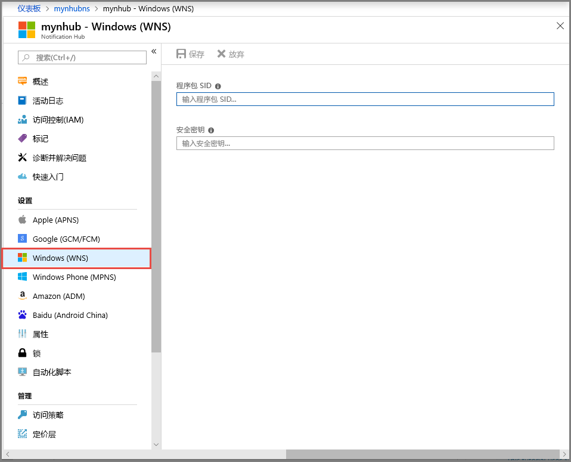
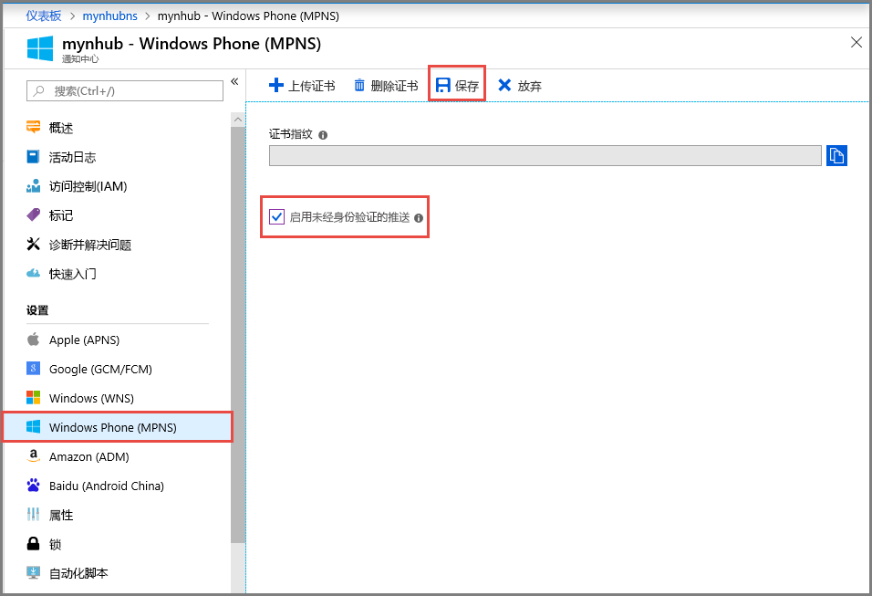

# 在 Azure 门户中使用平台通知系统设置配置 Azure 通知中心 
Azure 通知中心提供易于使用且横向扩展的推送引擎，可用于从任何后端（云或本地）向任何平台（iOS、Android、Windows、Kindle、百度等）发送通知。 有关此服务的详细信息，请参阅[什么是 Azure 通知中心？](notification-hubs-push-notification-overview.md)。

[使用 Azure 门户创建 Azure 通知中心](create-notification-hub-portal.md)（如果尚未这样做）。 本快速入门介绍如何使用平台通知系统 (PNS) 设置在 Azure 门户中配置通知中心。

## Apple 推送通知服务 (APNS)
1. 在 Azure 门户的“通知中心”页上，在左侧菜单的“设置”下选择“Apple (APNS)”。
2. 如果选择“证书”，请执行以下操作：
    1. 选择**文件图标**，然后选择要上传的 **.p12** 文件。 
    2. 指定**密码**。
    3. 选择“沙盒”模式。 仅当想要将推送通知发送给从应用商店购买应用的用户时，才使用“生产”模式。

        
3. 如果选择“令牌”，请执行以下步骤： 
    1. 输入“密钥 ID”、“捆绑 ID”、“团队 ID”和“令牌”的值。
    2. 选择“沙盒”模式。 仅当想要将推送通知发送给从应用商店购买应用的用户时，才使用“生产”模式。

        

若需通过完整的教程来了解如何使用 Azure 通知中心和 Apple Push Notification 服务 (APNS) 将通知推送到 iOS 设备，请参阅[此教程](notification-hubs-ios-apple-push-notification-apns-get-started.md)。

## Google Firebase Cloud Messaging (FCM)
1. 在 Azure 门户的“通知中心”页上，在左侧菜单的“设置”下选择“Google (GCM/FCM)”。 
2. 粘贴前面保存的 FCM 项目**服务器密钥**。 
3. 在工具栏上选择“保存”。 

    
4. 警报中会显示一条消息，指出通知中心已成功更新。 “保存”按钮已禁用。 

如需通过完整的教程来了解如何使用 Azure 通知中心和 Google Firebase Cloud Messaging 将通知推送到 Android 设备，请参阅[此教程](notification-hubs-android-push-notification-google-fcm-get-started.md)。

## Windows 推送通知服务 (WNS)
1. 在 Azure 门户的“通知中心”页上，在左侧菜单的“设置”下选择“Windows (WNS)”。
2. 输入“包 SID”和“安全密钥”的值。
3. 在工具栏上选择“保存”。

    

如需通过完整的教程来了解如何将通知推送到在 Windows 设备上运行的通用 Windows 平台 (UWP) 应用，请参阅[此教程](notification-hubs-windows-store-dotnet-get-started-wns-push-notification.md)。

## Windows Phone - Microsoft 推送通知服务
1. 在 Azure 门户的“通知中心”页上，在“设置”下选择“Windows Phone (MPNS)”。
2. 如需启用未经身份验证的推送，请选择“启用未经身份验证的推送”，然后在工具栏上选择“保存”。

    
3. 如需使用**经身份验证的**推送，请执行以下步骤：
    1. 在工具栏上选择“上传证书”。
    2. 选择**文件图标**，然后选择证书文件。
    3. 输入证书的**密码**。 
    4. 选择“确定”，关闭“上传证书”页。 
    5. 在“Windows Phone (MPNS)”页的工具栏上选择“保存”。

如需通过完整的教程来了解如何使用 Microsoft 推送通知服务 (MPNS) 将通知推送到 Windows Phone 8 应用，请参阅[此教程](notification-hubs-windows-mobile-push-notifications-mpns.md)。
      
## Amazon Device Messaging (ADM)
1. 在 Azure 门户的“通知中心”页上，在左侧菜单的“设置”下选择“Amazon (ADM)”。
2. 输入“客户端 ID”和“客户端机密”的值。
3. 在工具栏上选择“保存”。
    
    

如需通过完整的教程来了解如何使用 Azure 通知中心将通知推送到 Kindle 应用程序，请参阅[此教程](notification-hubs-kindle-amazon-adm-push-notification.md)。

## Baidu (Android China)
1. 在 Azure 门户的“通知中心”页上，在左侧菜单的“设置”下选择“Baidu (Android China)”。 
2. 在百度云推送项目中，输入从百度控制台获得的 **API 密钥**。 
3. 在百度云推送项目中，输入从百度控制台获得的**机密密钥**。 
4. 在工具栏上选择“保存”。 

    
4. 警报中会显示一条消息，指出通知中心已成功更新。 “保存”按钮已禁用。 

如需通过完整的教程来了解如何使用 Azure 通知中心和百度云推送来推送通知，请参阅[此教程](notification-hubs-baidu-china-android-notifications-get-started.md)。

## 后续步骤
本快速入门介绍了如何在 Azure 门户中为通知中心配置不同的平台通知系统。 

如需按照完整的分步说明将通知推送到这些不同的平台，请参阅“教程”部分的教程。

- [使用 Azure 通知中心和 Apple Push Notification 服务 (APNS) 将通知推送到 iOS 设备](notification-hubs-ios-apple-push-notification-apns-get-started.md)。
- [使用 Azure 通知中心和 Google Firebase Cloud Messaging 将通知推送到 Android 设备](notification-hubs-android-push-notification-google-fcm-get-started.md)。
- [将通知推送到在 Windows 设备上运行的通用 Windows 平台 (UWP) 应用](notification-hubs-windows-store-dotnet-get-started-wns-push-notification.md)。
- [使用 Microsoft 推送通知服务 (MPNS) 将通知推送到 Windows Phone 8 应用](notification-hubs-windows-mobile-push-notifications-mpns.md)。
- [将通知推送到 Kindle 应用程序](notification-hubs-kindle-amazon-adm-push-notification.md)。
- [使用 Azure 通知中心和百度云推送来推送通知](notification-hubs-baidu-china-android-notifications-get-started.md)。
