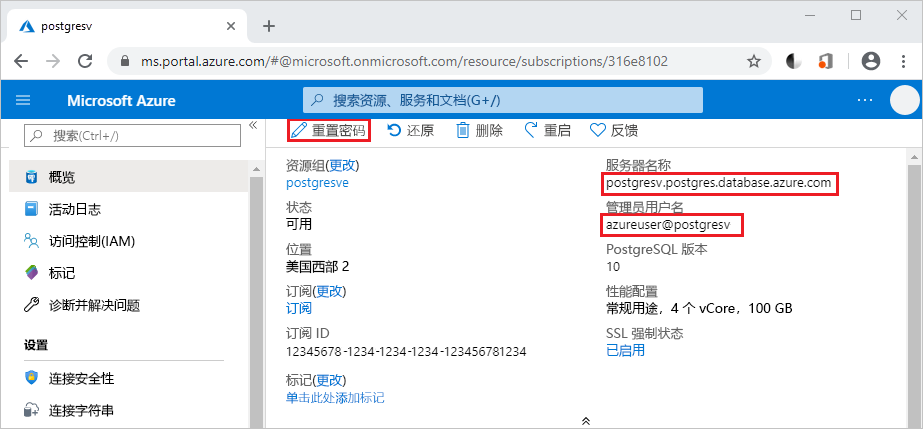

# <a name="azure-database-for-postgresql-use-python-to-connect-and-query-data"></a>Azure Database for PostgreSQL：使用 Python 进行连接并查询数据
本快速入门演示了如何使用 [Python](https://python.org) 连接到 Azure Database for PostgreSQL， 同时还演示了如何通过 macOS、Ubuntu Linux 和 Windows 平台，使用 SQL 语句在数据库中查询、插入、更新和删除数据。 本文中的步骤假定你熟悉如何使用 Python 进行开发，但不熟悉如何使用 Azure Database for PostgreSQL。

## <a name="prerequisites"></a>先决条件
此快速入门使用以下任意指南中创建的资源作为起点：
- [创建 DB - 门户](quickstart-create-server-database-portal.md)
- [创建 DB - CLI](quickstart-create-server-database-azure-cli.md)

还需要：
- 安装 [python](https://www.python.org/downloads/)
- 安装 [pip](https://pip.pypa.io/en/stable/installing/) 包（如果使用的是从 [python.org](https://python.org) 下载的 Python 2 >=2.7.9 或 Python 3 >=3.4 二进制文件，则 pip 已安装。）

## <a name="install-the-python-connection-libraries-for-postgresql"></a>安装适用于 PostgreSQL 的 Python 连接库
安装 [psycopg2](http://initd.org/psycopg/docs/install.html) 包，以便连接和查询数据库。 psycopg2 [在 PyPI 上提供](https://pypi.python.org/pypi/psycopg2/)，其形式为 [wheel](http://pythonwheels.com/) 包，适用于大多数常见的平台（Linux、OSX、Windows）。 使用 pip 安装可获取二进制版本的模块，包括所有依赖项。

1. 在自己的计算机上启动命令行界面：
    - 在 Linux 上启动 Bash Shell。
    - 在 macOS 上启动 Terminal。
    - 在 Windows 上从开始菜单启动命令提示符。
2. 通过运行如下所示的命令，确保使用的是最新版 pip：
    ```cmd
    pip install -U pip
    ```

3. 运行以下命令，安装 psycopg2 包：
    ```cmd
    pip install psycopg2
    ```

## <a name="get-connection-information"></a>获取连接信息
获取连接到 Azure Database for PostgreSQL 所需的连接信息。 需要完全限定的服务器名称和登录凭据。

1. 登录到 [Azure 门户](https://portal.azure.com/)。
2. 在 Azure 门户的左侧菜单中，单击“所有资源”，然后搜索“mypgserver-20170401”（你创建的服务器）。
3. 单击服务器名称 **mypgserver-20170401**。
4. 选择服务器的“概览”页，然后记下“服务器名称”和“服务器管理员登录名”。
 
5. 如果忘了服务器的登录信息，请导航到“概览”页，以查看服务器管理员登录名并重置密码（如果需要）。

## <a name="how-to-run-python-code"></a>如何运行 Python 代码
本文总共包含四个代码示例，每个示例执行特定的功能。 以下说明指出了如何创建文本文件，插入代码块，然后保存文件供以后运行。 请确保创建四个单独的文件，一个文件对应于一个代码块。

- 使用喜欢的文本编辑器创建新文件。
- 将以下节中的代码示例之一复制并粘贴到文本文件中。 将 host、dbname、user 和 password 参数替换为创建服务器和数据库时指定的值。
- 使用 .py 扩展名（例如 postgres.py）将文件保存到项目文件夹中。 如果在 Windows 上运行，请在保存文件时确保选择 UTF-8 编码。 
- 启动命令提示符、终端或 Bash shell，然后将目录更改为项目文件夹，例如 `cd postgres`。
-  若要运行代码，请键入后跟文件名的 Python 命令，例如 `Python postgres.py`。

> [!NOTE]
> 从 Python 版本 3 开始，运行以下代码块时可能会看到错误 `SyntaxError: Missing parentheses in call to 'print'`：如果出现这种情况，请使用括号（例如 `print("string")`）将对命令 `print "string"` 的每个调用替换为函数调用。

## <a name="connect-create-table-and-insert-data"></a>进行连接，创建表，然后插入数据
通过以下代码进行连接，然后使用 [psycopg2.connect](http://initd.org/psycopg/docs/connection.html) 函数和 **INSERT** SQL 语句加载数据。 [cursor.execute](http://initd.org/psycopg/docs/cursor.html#execute) 函数用来针对 PostgreSQL 数据库执行 SQL 查询。 将 host、dbname、user 和 password 参数替换为创建服务器和数据库时指定的值。

```Python
import psycopg2

# Update connection string information obtained from the portal
host = "mypgserver-20170401.postgres.database.azure.com"
user = "mylogin@mypgserver-20170401"
dbname = "mypgsqldb"
password = "<server_admin_password>"
sslmode = "require"

# Construct connection string
conn_string = "host={0} user={1} dbname={2} password={3} sslmode={4}".format(host, user, dbname, password, sslmode)
conn = psycopg2.connect(conn_string) 
print "Connection established"

cursor = conn.cursor()

# Drop previous table of same name if one exists
cursor.execute("DROP TABLE IF EXISTS inventory;")
print "Finished dropping table (if existed)"

# Create table
cursor.execute("CREATE TABLE inventory (id serial PRIMARY KEY, name VARCHAR(50), quantity INTEGER);")
print "Finished creating table"

# Insert some data into table
cursor.execute("INSERT INTO inventory (name, quantity) VALUES (%s, %s);", ("banana", 150))
cursor.execute("INSERT INTO inventory (name, quantity) VALUES (%s, %s);", ("orange", 154))
cursor.execute("INSERT INTO inventory (name, quantity) VALUES (%s, %s);", ("apple", 100))
print "Inserted 3 rows of data"

# Cleanup
conn.commit()
cursor.close()
conn.close()
```

代码成功运行以后，输出如下所示：


## <a name="read-data"></a>读取数据
使用以下代码读取通过 [cursor.execute](http://initd.org/psycopg/docs/cursor.html#execute) 函数和 **SELECT** SQL 语句插入的数据。 此函数可接受任何查询，并返回可使用 [cursor.fetchall()](http://initd.org/psycopg/docs/cursor.html#cursor.fetchall) 循环访问的结果集。 将 host、dbname、user 和 password 参数替换为创建服务器和数据库时指定的值。

```Python
import psycopg2

# Update connection string information obtained from the portal
host = "mypgserver-20170401.postgres.database.azure.com"
user = "mylogin@mypgserver-20170401"
dbname = "mypgsqldb"
password = "<server_admin_password>"
sslmode = "require"

# Construct connection string
conn_string = "host={0} user={1} dbname={2} password={3} sslmode={4}".format(host, user, dbname, password, sslmode)
conn = psycopg2.connect(conn_string) 
print "Connection established"

cursor = conn.cursor()

# Fetch all rows from table
cursor.execute("SELECT * FROM inventory;")
rows = cursor.fetchall()

# Print all rows
for row in rows:
    print "Data row = (%s, %s, %s)" %(str(row[0]), str(row[1]), str(row[2]))

# Cleanup
conn.commit()
cursor.close()
conn.close()
```

## <a name="update-data"></a>更新数据
使用以下代码来更新清单行，该行是以前使用 [cursor.execute](http://initd.org/psycopg/docs/cursor.html#execute) 函数和 **UPDATE** SQL 语句插入的。 将 host、dbname、user 和 password 参数替换为创建服务器和数据库时指定的值。

```Python
import psycopg2

# Update connection string information obtained from the portal
host = "mypgserver-20170401.postgres.database.azure.com"
user = "mylogin@mypgserver-20170401"
dbname = "mypgsqldb"
password = "<server_admin_password>"
sslmode = "require"

# Construct connection string
conn_string = "host={0} user={1} dbname={2} password={3} sslmode={4}".format(host, user, dbname, password, sslmode)
conn = psycopg2.connect(conn_string) 
print "Connection established"

cursor = conn.cursor()

# Update a data row in the table
cursor.execute("UPDATE inventory SET quantity = %s WHERE name = %s;", (200, "banana"))
print "Updated 1 row of data"

# Cleanup
conn.commit()
cursor.close()
conn.close()
```

## <a name="delete-data"></a>删除数据
使用以下代码来删除清单项，该项是以前使用 [cursor.execute](http://initd.org/psycopg/docs/cursor.html#execute) 函数和 **DELETE** SQL 语句插入的。 将 host、dbname、user 和 password 参数替换为创建服务器和数据库时指定的值。

```Python
import psycopg2

# Update connection string information obtained from the portal
host = "mypgserver-20170401.postgres.database.azure.com"
user = "mylogin@mypgserver-20170401"
dbname = "mypgsqldb"
password = "<server_admin_password>"
sslmode = "require"

# Construct connection string
conn_string = "host={0} user={1} dbname={2} password={3} sslmode={4}".format(host, user, dbname, password, sslmode)
conn = psycopg2.connect(conn_string) 
print "Connection established"

cursor = conn.cursor()

# Delete data row from table
cursor.execute("DELETE FROM inventory WHERE name = %s;", ("orange",))
print "Deleted 1 row of data"

# Cleanup
conn.commit()
cursor.close()
conn.close()
```

## <a name="next-steps"></a>后续步骤
> [!div class="nextstepaction"]
> [使用导出和导入功能迁移数据库](./howto-migrate-using-export-and-import.md)
