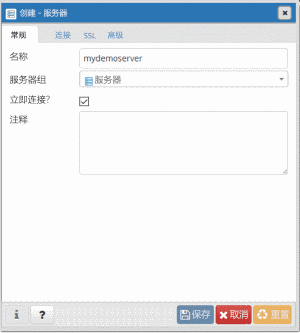
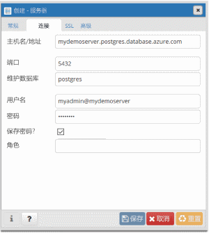
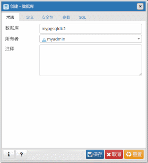

# <a name="quickstart-create-an-azure-database-for-postgresql---single-server-using-the-azure-cli"></a>快速入门：使用 Azure CLI 创建 Azure Database for PostgreSQL - 单一服务器

> [!TIP]
> 请考虑使用更简单的 [az postgres up](/cli/azure/ext/db-up/postgres#ext-db-up-az-postgres-up) Azure CLI 命令（当前为预览版）。 试用[快速入门](./quickstart-create-server-up-azure-cli.md)。

用于 PostgreSQL 的 Azure 数据库是一种托管服务，可用于在云中运行、管理和缩放具有高可用性的 PostgreSQL 数据库。 Azure CLI 用于从命令行或脚本创建和管理 Azure 资源。 本快速入门指南介绍了如何使用 Azure CLI 在 [Azure 资源组](https://docs.microsoft.com/azure/azure-resource-manager/resource-group-overview)中创建 Azure Database for PostgreSQL 服务器。

如果没有 Azure 订阅，请在开始之前创建一个[免费](https://azure.microsoft.com/free/)帐户。

[!INCLUDE [cloud-shell-try-it](../../includes/cloud-shell-try-it.md)]

如果选择在本地安装并使用 CLI，本文要求运行 Azure CLI 2.0 版或更高版本。 若要查看安装的版本，请运行 `az --version` 命令。 如果需要进行安装或升级，请参阅[安装 Azure CLI]( /cli/azure/install-azure-cli)。 

要本地运行 CLI，需要使用 [az login](/cli/azure/authenticate-azure-cli?view=interactive-log-in) 命令登录你的帐户。 记下命令行输出中相应订阅名称的 ID 属性  。
```azurecli-interactive
az login
```

如果有多个订阅，请选择应计费的资源所在的相应订阅。 使用 [az account set](/cli/azure/account) 命令选择帐户下的特定订阅 ID。 将 az login 输出中你的订阅的 ID 属性替换到订阅 ID 占位符中   。
```azurecli-interactive
az account set --subscription <subscription id>
```

## <a name="create-a-resource-group"></a>创建资源组

使用 [az group create](/cli/azure/group) 命令创建 [Azure 资源组](../azure-resource-manager/management/overview.md)。 资源组是在其中以组的形式部署和管理 Azure 资源的逻辑容器。 应提供唯一名称。 以下示例在 `westus` 位置创建名为 `myresourcegroup` 的资源组。
```azurecli-interactive
az group create --name myresourcegroup --location westus
```

## <a name="create-an-azure-database-for-postgresql-server"></a>创建 Azure Database for PostgreSQL 服务器

使用 [az postgres server create](/cli/azure/postgres/server) 命令创建 [Azure Database for PostgreSQL 服务器](overview.md)。 一台服务器可以管理多个数据库。


**设置** | **示例值** | **说明**
---|---|---
name | mydemoserver | 选择用于标识 Azure Database for PostgreSQL 服务器的唯一名称。 服务器名称只能包含小写字母、数字和连字符 (-) 字符。 必须包含 3 到 63 个字符。
resource-group | myresourcegroup | 提供 Azure 资源组的名称。
sku-name | GP_Gen5_2 | SKU 的名称。 请遵循简写约定 {pricing tier}\_{compute generation}\_{vCores}。 请参阅下表，详细了解 sku-name 参数。
backup-retention | 7 | 保留备份的时长。 单位为天。 范围为 7-35。 
geo-redundant-backup | 已禁用 | 是否应该为此服务启用异地冗余备份。 允许的值：“Enabled”、“Disabled”。
location | westus | 服务器的 Azure 位置。
ssl-enforcement | 已启用 | 是否应该为此服务启用 ssl。 允许的值：“Enabled”、“Disabled”。
storage-size | 51200 | 服务器的存储容量（单位是兆字节）。 有效的存储大小最小为 5120MB，以 1024MB 为增量。 请参阅[定价层](./concepts-pricing-tiers.md)文档，详细了解存储大小限制。 
版本 | 9.6 | PostgreSQL 主版本。
admin-user | myadmin | 用于管理员登录的用户名。 它不能为“azure_superuser”、“admin”、“administrator”、“root”、“guest”或“public”       。
admin-password | *安全密码* | 管理员用户的密码。 该密码必须包含 8 到 128 个字符。 密码必须包含以下三个类别的字符：英文大写字母、英文小写字母、数字和非字母数字字符。


sku-name 参数值遵循 {定价层}\_{计算层代}\_{vCore 数} 约定，如以下示例中所示：
+ `--sku-name B_Gen5_1` 映射到基本、第 5 代和 1 个 vCore。 此选项是可用的最小 SKU。
+ `--sku-name GP_Gen5_32` 映射到常规用途、第 5 层和 32 个 vCore。
+ `--sku-name MO_Gen5_2` 映射到内存优化、第 5 层和 2 个 vCore。

请参阅[定价层](./concepts-pricing-tiers.md)文档来了解适用于每个区域和每个层的有效值。

下面的示例使用服务器管理员登录名 `myadmin` 在资源组 `myresourcegroup` 中创建位于“美国西部”区域的名为 `mydemoserver` 的 PostgreSQL 9.6 服务器。 这是第 4 代常规用途服务器，带有 2 个 vCore    。 用自己的值替换 `<server_admin_password>`。
```azurecli-interactive
az postgres server create --resource-group myresourcegroup --name mydemoserver  --location westus --admin-user myadmin --admin-password <server_admin_password> --sku-name GP_Gen4_2 --version 9.6
```

> [!NOTE]
> 如果轻量级计算和 I/O 足以满足工作负荷要求，请考虑使用“基本”定价层。 请注意，在“基本”定价层中创建的服务器以后不能扩展到“常规用途”或“内存优化”定价层。 有关详细信息，请参阅[定价页](https://azure.microsoft.com/pricing/details/postgresql/)。
> 

## <a name="configure-a-server-level-firewall-rule"></a>配置服务器级防火墙规则

使用 [az postgres server firewall-rule create](/cli/azure/postgres/server/firewall-rule) 命令创建 Azure PostgreSQL 服务器级防火墙规则。 服务器级防火墙规则允许外部应用程序（如 [psql](https://www.postgresql.org/docs/9.2/static/app-psql.html) 或 [PgAdmin](https://www.pgadmin.org/)）通过 Azure PostgreSQL 服务防火墙连接到服务器。 

可以设置涵盖某个 IP 范围的防火墙规则，以便通过网络进行连接。 下面的示例使用 [az postgres server firewall-rule create](/cli/azure/postgres/server/firewall-rule) 为单个 IP 地址创建防火墙规则 `AllowMyIP`。
```azurecli-interactive
az postgres server firewall-rule create --resource-group myresourcegroup --server mydemoserver --name AllowMyIP --start-ip-address 192.168.0.1 --end-ip-address 192.168.0.1
```

> [!NOTE]
> Azure PostgreSQL 服务器通过端口 5432 进行通信。 从企业网络内部进行连接时，该网络的防火墙可能不允许经端口 5432 的出站流量。 让 IT 部门打开端口 5432，以便连接到 Azure PostgreSQL 服务器。

## <a name="get-the-connection-information"></a>获取连接信息

若要连接到服务器，需要提供主机信息和访问凭据。
```azurecli-interactive
az postgres server show --resource-group myresourcegroup --name mydemoserver
```

结果采用 JSON 格式。 记下 administratorLogin  和 fullyQualifiedDomainName  。
```json
{
  "administratorLogin": "myadmin",
  "earliestRestoreDate": null,
  "fullyQualifiedDomainName": "mydemoserver.postgres.database.azure.com",
  "id": "/subscriptions/00000000-0000-0000-0000-000000000000/resourceGroups/myresourcegroup/providers/Microsoft.DBforPostgreSQL/servers/mydemoserver",
  "location": "westus",
  "name": "mydemoserver",
  "resourceGroup": "myresourcegroup",
  "sku": {
    "capacity": 2,
    "family": "Gen5",
    "name": "GP_Gen5_2",
    "size": null,
    "tier": "GeneralPurpose"
  },
  "sslEnforcement": "Enabled",
  "storageProfile": {
    "backupRetentionDays": 7,
    "geoRedundantBackup": "Disabled",
    "storageMb": 5120
  },
  "tags": null,
  "type": "Microsoft.DBforPostgreSQL/servers",
  "userVisibleState": "Ready",
  "version": "9.6"
}
```

## <a name="connect-to-postgresql-database-using-psql"></a>使用 psql 连接到 PostgreSQL 数据库

如果客户端计算机已安装 PostgreSQL，则可以使用 [psql](https://www.postgresql.org/docs/current/static/app-psql.html) 的本地实例连接到 Azure PostgreSQL 服务器。 现在使用 psql 命令行实用工具连接到 Azure PostgreSQL 服务器。

1. 运行以下 psql 命令连接到 Azure Database for PostgreSQL 服务器
   ```bash
   psql --host=<servername> --port=<port> --username=<user@servername> --dbname=<dbname>
   ```

   例如，以下命令使用访问凭据连接到 PostgreSQL 服务器 mydemoserver.postgres.database.azure.com  上名为“postgres”  的默认数据库。 提示输入密码时，输入之前选择的 `<server_admin_password>`。
  
   ```bash
   psql --host=mydemoserver.postgres.database.azure.com --port=5432 --username=myadmin@mydemoserver --dbname=postgres
   ```

   > [!TIP]
   > 如果更喜欢使用 URL 路径连接到 Postgres，则 URL 会使用 `%40` 对用户名中的 @ 符号进行编码。 例如，psql 的连接字符串将是：
   > ```
   > psql postgresql://myadmin%40mydemoserver@mydemoserver.postgres.database.azure.com:5432/postgres
   > ```


2. 连接到服务器后，在出现提示时创建空数据库。
   ```sql
   CREATE DATABASE mypgsqldb;
   ```

3. 出现提示时，请执行以下命令，将连接切换到新建的数据库 mypgsqldb  ：
   ```sql
   \c mypgsqldb
   ```

## <a name="connect-to-the-postgresql-server-using-pgadmin"></a>使用 pgAdmin 连接到 PostgreSQL 服务器

pgAdmin 是用于 PostgreSQL 的开源工具。 可以从 [pgAdmin 网站](https://www.pgadmin.org/)安装 pgAdmin。 你所使用的 pgAdmin 版本可能不同于本快速入门中使用的版本。 如果需要更多指南，请阅读 pgAdmin 文档。

1. 在客户端计算机上打开 pgAdmin 应用程序。

2. 从工具栏转到“对象”  ，将鼠标指针悬停在“创建”  上，然后选择“服务器”  。

3. 在“创建 - 服务器”对话框中的“常规”选项卡上，为服务器输入唯一的友好名称，例如 **mydemoserver**。  

   

4. 在“创建 - 服务器”对话框中的“连接”选项卡上，填写设置表。  

   

    pgAdmin 参数 |值|说明
    ---|---|---
    主机名/地址 | 服务器名称 | 此前在创建用于 PostgreSQL 的 Azure 数据库服务器时使用过的服务器名称值。 示例服务器为 mydemoserver.postgres.database.azure.com。  请使用完全限定的域名 ( **\*.postgres.database.azure.com**)，如示例中所示。 如果不记得服务器名称，请按上一部分的步骤操作，以便获取连接信息。 
    端口 | 5432 | 连接到用于 PostgreSQL 的 Azure 数据库服务器时使用的端口。 
    维护数据库 |  postgres | 系统生成的默认数据库名称。
    用户名 | 服务器管理员登录名 | 此前在创建用于 PostgreSQL 的 Azure 数据库服务器时提供的服务器管理员登录用户名。 如果不记得用户名，请按上一部分的步骤操作，以便获取连接信息。 格式为 username\@servername  。
    密码 | 管理员密码 | 之前在此快速入门中创建服务器时选择的密码。
    角色 | 留空 | 此时无需提供角色名称。 此字段留空。
    SSL 模式 | *必需* | 可以在 pgAdmin 的 SSL 选项卡中设置 SSL 模式。默认情况下，所有 Azure Database for PostgreSQL 服务器在创建时都会启用“SSL 强制实施”。 若要关闭“SSL 强制实施”，请参阅 [SSL 强制实施](./concepts-ssl-connection-security.md)。
    
5. 选择“保存”。 

6. 在左侧的“浏览器”窗格中，展开“服务器”节点   。 选择服务器，例如 **mydemoserver**。 单击该服务器与它建立连接。

7. 展开服务器节点，然后展开其下的“数据库”。  此列表应包括现有 *postgres* 数据库和已创建的任何其他数据库。 可以使用 Azure Database for PostgreSQL 为每个服务器创建多个数据库。

8. 右键单击“数据库”，选择“创建”菜单，并选择“数据库”。   

9. 在“数据库”字段中键入所选的数据库名称，例如“mypgsqldb2”。  

10. 从列表框中选择数据库的“所有者”。  选择服务器管理员登录名，例如“my admin”  。

    

11. 选择“保存”创建新的空白数据库。 

12. 在“浏览器”窗格中，可以在服务器名称下的数据库列表中看到创建的数据库。 


## <a name="clean-up-resources"></a>清理资源

可以通过删除 [Azure 资源组](../azure-resource-manager/management/overview.md)来清除在此快速入门中创建的所有资源。

> [!TIP]
> 本教程系列中的其他快速入门教程是在本文的基础上制作的。 如果打算继续使用后续的快速入门，请不要清除在本快速入门中创建的资源。 如果不打算继续，请在 Azure CLI 中执行以下步骤，删除通过此快速入门创建的所有资源。

```azurecli-interactive
az group delete --name myresourcegroup
```

若要删除新创建的服务器，可运行 [az postgres server delete](/cli/azure/postgres/server) 命令。
```azurecli-interactive
az postgres server delete --resource-group myresourcegroup --name mydemoserver
```

## <a name="next-steps"></a>后续步骤
> [!div class="nextstepaction"]
> [使用导出和导入功能迁移数据库](./howto-migrate-using-export-and-import.md)

