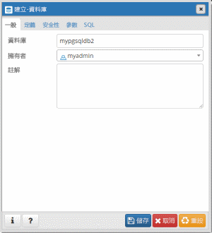

# <a name="create-an-azure-database-for-postgresql-server-in-the-azure-portal"></a>在 Azure 门户中创建用于 PostgreSQL 的 Azure 数据库服务器

用于 PostgreSQL 的 Azure 数据库是一种托管服务，可用于在云中运行、管理和缩放具有高可用性的 PostgreSQL 数据库。 本快速入门介绍如何使用 Azure 门户在大约五分钟内创建用于 PostgreSQL 的 Azure 数据库服务器。

如果还没有 Azure 订阅，可以在开始前创建一个[免费 Azure 帐户](https://azure.microsoft.com/free/)。

## <a name="sign-in-to-the-azure-portal"></a>登录到 Azure 门户
打开 Web 浏览器并转到[门户](https://portal.azure.com/)。 输入登录到门户所需的凭据。 默认视图是服务仪表板。

## <a name="create-an-azure-database-for-postgresql-server"></a>创建 Azure Database for PostgreSQL 服务器

创建的 Azure Database for PostgreSQL 服务器中包含一组已定义的[计算和存储](./concepts-compute-unit-and-storage.md)资源。 将在 [Azure 资源组](../azure-resource-manager/resource-group-overview.md)中创建服务器。

若要创建用于 PostgreSQL 的 Azure 数据库服务器，请执行以下步骤：
1. 选择门户左上角的“新建”按钮 (+)。

2. 选择“数据库” > “用于 PostgreSQL 的 Azure 数据库”。

    

3. 如上图所示，在新服务器详细信息窗体中填写以下信息：

    设置|建议的值|说明
    ---|---|---
    服务器名称 |mypgserver-20170401|用于标识用于 PostgreSQL 的 Azure 数据库服务器的唯一名称。 域名 *postgres.database.azure.com* 附加到提供的服务器名称。 服务器名称只能包含小写字母、数字和连字符 (-) 字符。 该名称必须至少包含 3 到 63 个字符。
    订阅|订阅|要用于服务器的 Azure 订阅。 如果有多个订阅，请选择要计费的资源所在的订阅。
    资源组|myresourcegroup| 新的资源组名称，或订阅中的现有资源组。
    服务器管理员登录名 |mylogin| 连接到服务器时使用的自己的登录帐户。 管理员登录名不能是 **azure_superuser**、**azure_pg_admin**、**admin**、**administrator**、**root**、**guest** 或 **public**， 不能以 **pg_** 开头。
    密码 |由用户选择 | 服务器管理员帐户的新密码。 必须包含 8 到 128 个字符。 密码必须含以下字符类别中的三类：英文大写字母、英文小写字母、数字（0 到 9）及非字母数字字符（!、$、#、% 等）。
    位置|离用户最近的区域| 最靠近用户的位置。
    PostgreSQL 版本|最新版本| 除非有特定的要求，否则请选择最新版本。
    定价层 | “基本”、“50 个计算单元”、“50 GB” | 新数据库的服务层和性能级别。 选择“定价层”。 接下来，选择“基本”选项卡。然后选择“计算单位”滑块的左端，将值调整为适用于本快速入门的最小值。 若要保存所做的定价层选择，请选择“确定”。 有关详细信息，请参阅以下屏幕截图。 
    固定到仪表板 | 勾选标记 | 可以轻松地在门户的前端仪表板页上跟踪服务器。

    > [!IMPORTANT]
    > 在此处指定的服务器管理员登录名和密码是以后在本快速入门中登录到服务器及其数据库所必需的。 请牢记或记录此信息，以后会使用到它。

    

4. 选择“创建”以预配服务器。 预配可能需要长达 20 分钟的时间。

5. 在工具栏上选择“通知”符号以监视部署过程。

    
   
  默认情况下，会在服务器下创建 **postgres** 数据库。 [postgres](https://www.postgresql.org/docs/9.6/static/app-initdb.html) 是供用户、实用工具和第三方应用程序使用的默认数据库。 

## <a name="configure-a-server-level-firewall-rule"></a>配置服务器级防火墙规则

用于 PostgreSQL 的 Azure 数据库会在服务器级别创建防火墙。 除非创建了规则来为特定的 IP 地址打开防火墙，否则此防火墙会阻止外部应用程序和工具连接到服务器和服务器上的任何数据库。 

1. 部署完成后，找到服务器。 可以根据需要进行搜索。 例如，在左侧菜单中选择“所有资源”。 键入服务器名称（例如 **mypgserver-20170401**）来搜索新建的服务器。 从搜索结果列表中选择服务器名称。 服务器的“概述”页面随即打开，其中提供了用于进一步配置的选项。
 
    

2. 在服务器页中，选择“连接安全性”。

    

3. 在“防火墙规则”标题下的“规则名称”列中选择空白文本框，开始创建防火墙规则。 

    本快速入门允许所有 IP 地址连接到服务器。 在每个列的文本框中填充以下值：

    规则名称 | 起始 IP | 结束 IP 
    ---|---|---
    AllowAllIps | 0.0.0.0 | 255.255.255.255

4. 在“连接安全性”页的上部工具栏中，选择“保存”。 等到指示连接安全性更新已成功完成的通知出现后，再继续操作。

    > [!NOTE]
    > 连接到 Azure Database for PostgreSQL 服务器时，通过端口 5432 进行通信。 如果尝试从企业网络内部进行连接，则该网络的防火墙可能不允许经端口 5432 的出站流量。 如果是这样，则无法连接到服务器，除非 IT 部门打开了端口 5432。
    >

## <a name="get-the-connection-information"></a>获取连接信息

创建用于 PostgreSQL 的 Azure 数据库服务器时，会创建名为 **postgres** 的默认数据库。 若要连接到数据库服务器，需要完整的服务器名称和管理员登录凭据。 此前可能已在本快速入门文章中记下这些值。 如果没有记下这些值，可以在门户的服务器“概览”页中轻松找到服务器名称和登录信息。

打开服务器的“概览”页。 记下“服务器名称”和“服务器管理员登录名”。 将光标悬停在每个字段，然后复制符号就会显示在文本右侧。 根据需要选择复制符号即可复制这些值。

 

## <a name="connect-to-the-postgresql-database-by-using-psql-in-cloud-shell"></a>在 Cloud Shell 中使用 psql 连接到 PostgreSQL 数据库

可以通过多个应用程序连接到 Azure Database for PostgreSQL 服务器。 让我们先使用 psql 命令行实用工具来演示如何连接到该服务器。 可以根据此处所述使用 Web 浏览器和 Azure Cloud Shell，不需安装任何其他软件。 如果已在自己的计算机上通过本地方式安装了 psql 实用工具，也可从该处进行连接。

1. 在顶部导航窗格中，选择终端符号打开 Azure Cloud Shell。

   

2. Cloud Shell 会在浏览器中打开，可在其中键入 Bash shell 命令。

   

3. 在 Cloud Shell 提示符下键入 psql 命令行，连接到用于 PostgreSQL 的 Azure 数据库服务器中的数据库。

    若要使用 [psql](https://www.postgresql.org/docs/9.6/static/app-psql.html) 实用工具连接到用于 PostgreSQL 的 Azure 数据库，请使用以下格式：
    ```bash
    psql --host=<yourserver> --port=<port> --username=<server admin login> --dbname=<database name>
    ```

    例如，以下命令连接到示例服务器：

    ```bash
    psql --host=mypgserver-20170401.postgres.database.azure.com --port=5432 --username=mylogin@mypgserver-20170401 --dbname=postgres
    ```

    psql 参数 |建议的值|说明
    ---|---|---
    --host | 服务器名称 | 此前在创建用于 PostgreSQL 的 Azure 数据库服务器时使用过的服务器名称值。 显示的示例服务器为 mypgserver-20170401.postgres.database.azure.com。请使用完全限定的域名 (**\*.postgres.database.azure.com**)，如示例中所示。 如果不记得服务器名称，请按上一部分的步骤操作，以便获取连接信息。 
    --port | 5432 | 连接到用于 PostgreSQL 的 Azure 数据库服务器时使用的端口。 
    --username | 服务器管理员登录名 |此前在创建用于 PostgreSQL 的 Azure 数据库服务器时提供的服务器管理员登录用户名。 如果不记得用户名，请按上一部分的步骤操作，以便获取连接信息。 格式为 username@servername。
    --dbname | postgres | 首次连接时系统生成的默认数据库名称。 以后可创建自己的数据库。

    使用自己的参数值运行 psql 命令以后，系统会提示输入服务器管理员密码。 此密码是在创建服务器时提供的密码。 

    psql 参数 |建议的值|说明
    ---|---|---
    password | 管理员密码 | 键入的密码字符不会显示在 bash 提示符处。 键入所有字符后，请按 **Enter** 以便进行身份验证和连接。

    连接后，psql 实用工具会显示 postgres 提示符，要求在其中键入 sql 命令。 在初始连接输出中可能会显示警告，因为 Azure Cloud Shell 中的 psql 版本可能不同于用于 PostgreSQL 的 Azure 数据库服务器的版本。 
    
    psql 输出示例：
    ```bash
    psql (9.5.7, server 9.6.2)
    WARNING: psql major version 9.5, server major version 9.6.
        Some psql features might not work.
    SSL connection (protocol: TLSv1.2, cipher: ECDHE-RSA-AES256-SHA384, bits: 256, compression: off)
    Type "help" for help.
   
    postgres=> 
    ```

    > [!TIP]
    > 如果未将防火墙配置为允许 Cloud Shell 的 IP 地址，则会出现以下错误：
    > 
    > psql: 致命错误: 主机"138.91.195.82"、用户"mylogin"、数据库"postgres"没有 pg_hba.conf 条目，SSL 出现致命错误: 需要 SSL 连接。 请指定 SSL 选项，然后重试。
    > 
    > 若要解决此错误，请确保服务器配置符合本文“配置服务器级防火墙规则”部分相关步骤的要求。

4. 在出现提示时通过键入以下命令来创建空数据库：
    ```bash
    CREATE DATABASE mypgsqldb;
    ```
    该命令可能需要几分钟时间才能完成。 

5. 在提示符下，执行以下命令来将连接切换到新建的数据库 **mypgsqldb**：
    ```bash
    \c mypgsqldb
    ```

6. 键入 `\q`，再按 **Enter** 键退出 psql。 完成后可关闭 Cloud Shell。

现已连接到用于 PostgreSQL 的 Azure 数据库服务器并创建了空白用户数据库。 请转到下一部分，使用另一常用工具 pgAdmin 进行连接。

## <a name="connect-to-the-postgresql-database-by-using-pgadmin"></a>使用 pgAdmin 连接到 PostgreSQL 数据库

使用 GUI 工具 pgAdmin 连接到 Azure PostgreSQL 服务器：
1. 在客户端计算机上打开 pgAdmin 应用程序。 可以从 [pgAdmin 网站](http://www.pgadmin.org/)安装 pgAdmin。

2. 在仪表板页上的“快速链接”部分下，选择“添加新服务器”符号。

3. 在“创建 - 服务器”对话框中的“常规”选项卡上，为服务器输入唯一的友好名称，例如 **Azure PostgreSQL Server**。

    

4. 在“创建 - 服务器”对话框中的“连接”选项卡上，使用指定的设置并选择“保存”。

   

    pgAdmin 参数 |建议的值|说明
    ---|---|---
    主机名/地址 | 服务器名称 | 此前在创建用于 PostgreSQL 的 Azure 数据库服务器时使用过的服务器名称值。 示例服务器为 **mypgserver-20170401.postgres.database.azure.com**。请使用完全限定的域名 (**\*.postgres.database.azure.com**)，如示例中所示。 如果不记得服务器名称，请按上一部分的步骤操作，以便获取连接信息。 
    端口 | 5432 | 连接到用于 PostgreSQL 的 Azure 数据库服务器时使用的端口。 
    维护数据库 | postgres | 系统生成的默认数据库名称。
    用户名 | 服务器管理员登录名 | 此前在创建用于 PostgreSQL 的 Azure 数据库服务器时提供的服务器管理员登录用户名。 如果不记得用户名，请按上一部分的步骤操作，以便获取连接信息。 格式为 username@servername。
    密码 | 管理员密码 | 之前在此快速入门中创建服务器时选择的密码。
    角色 | 留空 | 此时无需提供角色名称。 此字段留空。
    SSL 模式 | 必选 | 默认情况下，所有 Azure PostgreSQL 服务器在创建时都会启用 SSL 强制实施。 若要关闭 SSL 强制实施，请参阅[强制实施 SSL](./concepts-ssl-connection-security.md)。
    
5. 选择“保存”。

6. 在左侧的“浏览器”窗格中，展开“服务器”节点。 选择服务器，例如“Azure PostgreSQL Server”。 单击该服务器与它建立连接。

7. 展开服务器节点，然后展开其下的“数据库”。 列表应包括现有的 postgres 数据库，以及任何新建的用户数据库，例如在上一部分创建的 mypgsqldb。 请注意，在使用用于 PostgreSQL 的 Azure 数据库时，可为单个服务器创建多个数据库。

8. 右键单击“数据库”，选择“创建”菜单，并选择“数据库”。

9. 在“数据库”字段中键入所选的数据库名称，例如 **mypgsqldb**，如示例所示。

10. 从列表框中选择数据库的“所有者”。 选择服务器管理员登录名，例如 mylogin。

11. 选择“保存”创建新的空白数据库。

12. 在“浏览器”窗格中，可以在服务器名称下的“数据库”列表中看到创建的数据库。

    


## <a name="clean-up-resources"></a>清理资源
可以通过两种方法之一清理在快速入门中创建的资源。 可以删除 [Azure 资源组](../azure-resource-manager/resource-group-overview.md)，其中包括资源组中的所有资源。 若要保持其他资源原封不动，请只删除单个服务器资源。

> [!TIP]
> 本教程系列中的其他快速入门教程是在本文的基础上制作的。 如果打算继续使用快速入门，请不要清除在本快速入门中创建的资源。 如果不打算继续，请在门户中执行以下步骤来删除本快速入门创建的资源。

若要删除包括新建服务器在内的整个资源组，请执行以下操作：
1. 在门户中找到自己的资源组。 在左侧菜单中，选择“资源组”。 然后选择资源组的名称，例如 myresourcegroup。

2. 在资源组页上，选择“删除”。 在文本框中键入确认删除的资源组的名称，例如 myresourcegroup。 选择“删除”。

仅删除新建的服务器：
1. 在门户中找到自己的服务器（如果尚未将其打开）。 在左侧菜单中选择“所有资源”。 然后搜索所创建的服务器。

2. 在“概览”页上，选择“删除”。

    

3. 确认要删除的服务器名称并显示其下受影响的数据库。 在文本框中键入服务器名称，例如 mypgserver-20170401。 选择“删除”。

## <a name="next-steps"></a>后续步骤
> [!div class="nextstepaction"]
> [使用导出和导入功能迁移数据库](./howto-migrate-using-export-and-import.md)
