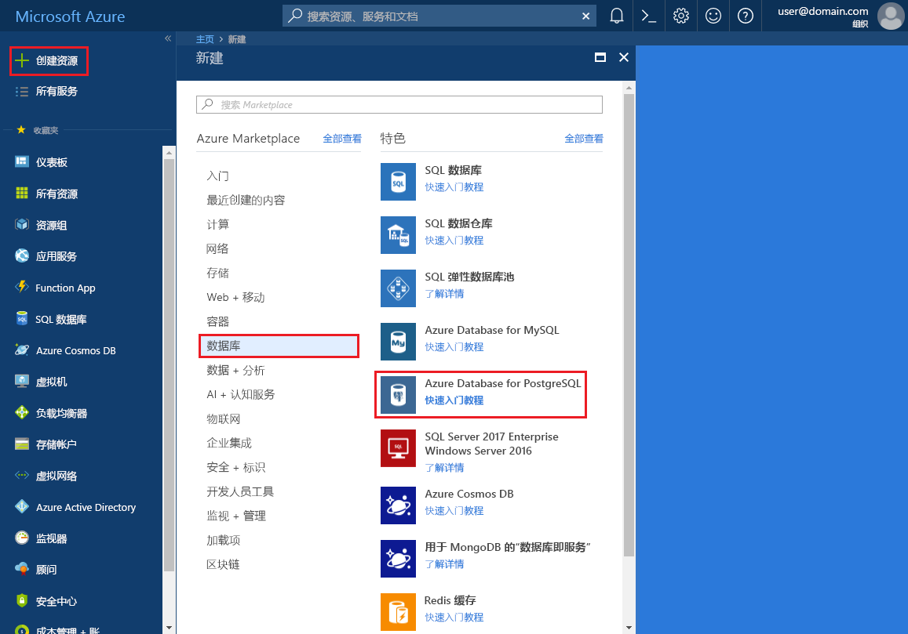
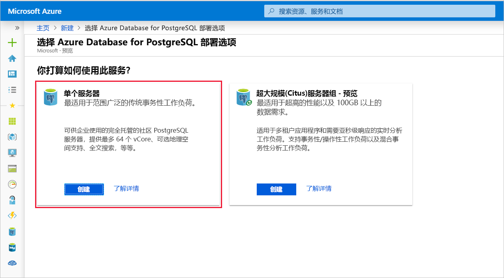
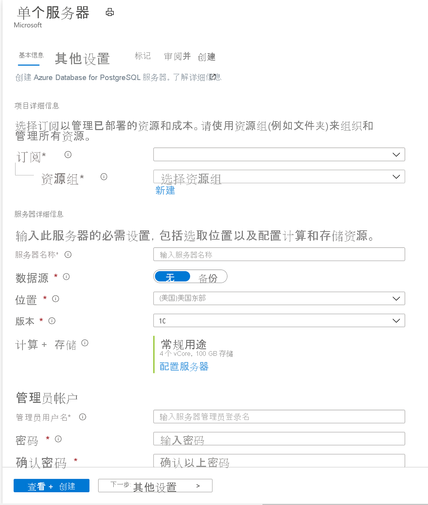
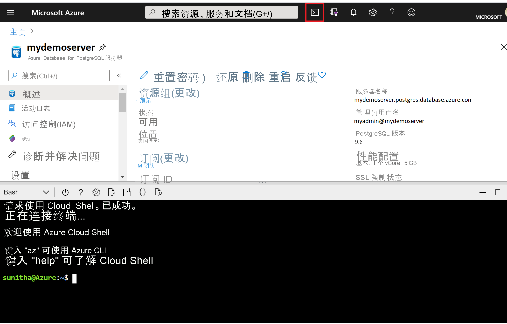

# <a name="quickstart-create-an-azure-database-for-postgresql-server-in-the-azure-portal"></a>快速入门：在 Azure 门户中创建用于 PostgreSQL 的 Azure 数据库服务器

用于 PostgreSQL 的 Azure 数据库是一种托管服务，可用于在云中运行、管理和缩放具有高可用性的 PostgreSQL 数据库。 本快速入门介绍如何使用 Azure 门户在大约五分钟内创建 Azure Database for PostgreSQL 服务器。

如果还没有 Azure 订阅，可以在开始前创建一个[免费 Azure 帐户](https://azure.microsoft.com/free/)。

## <a name="sign-in-to-the-azure-portal"></a>登录到 Azure 门户
打开 Web 浏览器并转到[门户](https://portal.azure.com/)。 输入登录到门户所需的凭据。 默认视图是服务仪表板。

## <a name="create-an-azure-database-for-postgresql-server"></a>创建 Azure Database for PostgreSQL 服务器

创建的 Azure Database for PostgreSQL 服务器中包含一组已配置的[计算和存储资源](./concepts-pricing-tiers.md)。 将在 [Azure 资源组](../azure-resource-manager/management/overview.md)中创建服务器。

若要创建用于 PostgreSQL 的 Azure 数据库服务器，请执行以下步骤：
1. 在门户左上角选择“创建资源”(+)。

2. 选择“数据库” > “用于 PostgreSQL 的 Azure 数据库”。

   > [!div class="mx-imgBorder"]
   > 

3. 选择“单个服务器”部署选项。

   > [!div class="mx-imgBorder"]
   > 

4. 填写“基本”表单，其中包含以下信息：

   > [!div class="mx-imgBorder"]
   > 

   设置|建议的值|说明
   ---|---|---
   订阅|订阅名称|要用于服务器的 Azure 订阅。 如果有多个订阅，请选择要计费的资源所在的订阅。
   资源组|myresourcegroup| 新的资源组名称，或订阅中的现有资源组。
   服务器名称 |*mydemoserver*|用于标识用于 PostgreSQL 的 Azure 数据库服务器的唯一名称。 域名 *postgres.database.azure.com* 附加到提供的服务器名称。 服务器名称只能包含小写字母、数字和连字符 (-) 字符。 该名称必须至少包含 3 到 63 个字符。
   数据源 | *无* | 选择“无”，从头开始创建新的服务器。 （如果是从现有 Azure Database for PostgreSQL 服务器的异地备份创建服务器，则会选择“备份”）。
   管理员用户名 |*myadmin*| 连接到服务器时使用的自己的登录帐户。 管理员登录名不能是 **azure_superuser**、**azure_pg_admin**、**admin**、**administrator**、**root**、**guest** 或 **public**， 不能以 **pg_** 开头。
   密码 |你的密码| 服务器管理员帐户的新密码。 该密码必须包含 8 到 128 个字符。 密码必须包含以下三个类别的字符：英文大写字母、英文小写字母、数字 (0 到 9)和非字母数字字符（!, $, #, % 等）。
   位置|离用户最近的区域| 最靠近用户的位置。
   版本|最新主版本| 除非另有特定的要求，否则为最新 PostgreSQL 主版本。
   计算 + 存储 | **常规用途**、**第 5 代**、**2 vCore**、**5 GB**、**7 天**、**异地冗余** | 新服务器的计算、存储和备份配置。 选择“配置服务器”。 接下来，选择适当的定价层，有关详细信息，请参阅[定价详细信息](https://azure.microsoft.com/pricing/details/postgresql/server/)。 若要在异地冗余存储中启用服务器备份，请从**备份冗余选项**中选择“异地冗余”。 选择“确定”。

   > [!NOTE]
   > 如果轻量级计算和 I/O 足以满足工作负荷要求，请考虑使用“基本”定价层。 请注意，在“基本”定价层中创建的服务器以后不能扩展到“常规用途”或“内存优化”定价层。 
   
5. 选择“查看 + 创建”，查看所选内容。 选择“创建”以预配服务器。 此操作可能需要几分钟的时间。

6. 在工具栏上选择“通知”图标（铃铛）以监视部署过程。 部署完成后，选择“转到资源”，打开服务器的“概览”页面 。

将创建一个空数据库“postgres”。 你还将找到用于将托管服务进程与用户操作分离的“azure_maintenance”数据库。你无法访问“azure_maintenance”数据库 。

## <a name="configure-a-server-level-firewall-rule"></a>配置服务器级防火墙规则
默认情况下，创建的服务器不可公开进行访问，需要为你的 IP 授予相应权限。 若要授予对 IP 的访问权限，请转到 Azure 门户中的服务器资源，然后从左侧菜单中为服务器资源选择“连接安全性”。 如果你不确定如何找到资源，请参阅[如何打开资源](https://docs.microsoft.com/azure/azure-resource-manager/management/manage-resources-portal#open-resources)。

> [!div class="mx-imgBorder"]
> 
  
现在选择“添加当前客户端 IP 地址”，然后选择“保存” 。 你可以添加其他 IP 或提供一个 IP 范围，从该范围中的 IP 连接到服务器。 有关详细信息，请参阅[如何管理防火墙规则](./concepts-firewall-rules.md)
   
> [!NOTE]
> 检查网络是否允许通过端口 5432 送出出站流量，该端口由 Azure Database for PostgreSQL 使用，旨在避免连接问题。  

## <a name="connect-to-azure-database-for-postgresql-server-using-psql"></a>使用 psql 连接到 Azure Database for PostgreSQL 服务器

可以使用 [psql](http://postgresguide.com/utilities/psql.html) 或 [pgAdmin](https://www.pgadmin.org/docs/pgadmin4/latest/connecting.html)，这是常用的 PostgreSQL 客户端。 在本快速入门中，我们将在 Azure 门户的 [Azure Cloud Shell](https://docs.microsoft.com/azure/cloud-shell/overview) 中使用 psql 进行连接。

1. 通过服务器的“概述”部分记录下你的服务器名称、服务器管理员登录名、密码和新创建的服务器的订阅 ID，如下图所示。

2. 通过选择左上角的图标（如下图所示）在门户中启动 Azure Cloud Shell。

   > [!NOTE]
   > 如果你是第一次启动 Cloud Shell，会看到一个提示，提示你创建资源组、存储帐户。 这是一个一次性步骤，将来会针对所有会话自动附加。 

   > [!div class="mx-imgBorder"]
   > 

3. 在 Azure Cloud Shell 终端上运行此命令。 将值替换为实际的服务器名称和管理员用户登录名。 通过管理员用户身份使用空数据库 postgres，格式采用 '<admin-username>@<servername>，如下所示，适用于 Azure database for PostgreSQL。

   ```azurecli-interactive
   psql --host=mydemoserver.postgres.database.azure.com --port=5432 --username=myadmin@mydemoserver --dbname=postgres
   ```
 
   下图显示了 Cloud Shell 终端中的该体验过程
   
   ```bash
    Requesting a Cloud Shell.Succeeded.
    Connecting terminal...

    Welcome to Azure Cloud Shell
 
    Type "az" to use Azure CLI
    Type "help" to learn about Cloud Shell

    user@Azure:~$psql --host=mydemoserver.postgres.database.azure.com --port=5432 --username=myadmin@mydemoserver --dbname=postgres
    Password for user myadmin@mydemoserver.postgres.database.azure.com:
    psql (12.2 (Ubuntu 12.2-2.pgdg16.04+1), server 11.6)
    SSL connection (protocol: TLSv1.2, cipher: ECDHE-RSA-AES256-GCM-SHA384, bits: 256, compression: off)
    Type "help" for help.

    postgres=>
    ```
4. 在同一个 Azure Cloud Shell 终端中，创建一个数据库“guest”
   ```bash
   postgres=> CREATE DATABASE guest;
   ```

5. 现在切换为与新创建的数据库“guest”之间的连接

   ```bash
   \c guest
   ```
6. 键入 `\q`，再按 Enter 键退出 psql。 

## <a name="clean-up-resources"></a>清理资源
现在已成功在资源组中创建了 Azure Database for PostgreSQL 服务器。  如果将来不再需要这些资源，可以通过删除资源组或只删除 PostgreSQL 服务器来删除它们。 若要删除资源组，请执行以下步骤：

1. 在 Azure 门户中，搜索并选择“资源组”。 
2. 在资源组列表中，选择你的资源组的名称。
3. 在资源组的概述页面中，选择“删除资源组”。
4. 在确认对话框中，键入资源组的名称，然后选择“删除”。

若要删除服务器，可以单击服务器的“概述”页面上的“删除”按钮，如下所示 ：
> [!div class="mx-imgBorder"]
> 

## <a name="next-steps"></a>后续步骤
> [!div class="nextstepaction"]
> [使用导出和导入功能迁移数据库](./howto-migrate-using-export-and-import.md)
