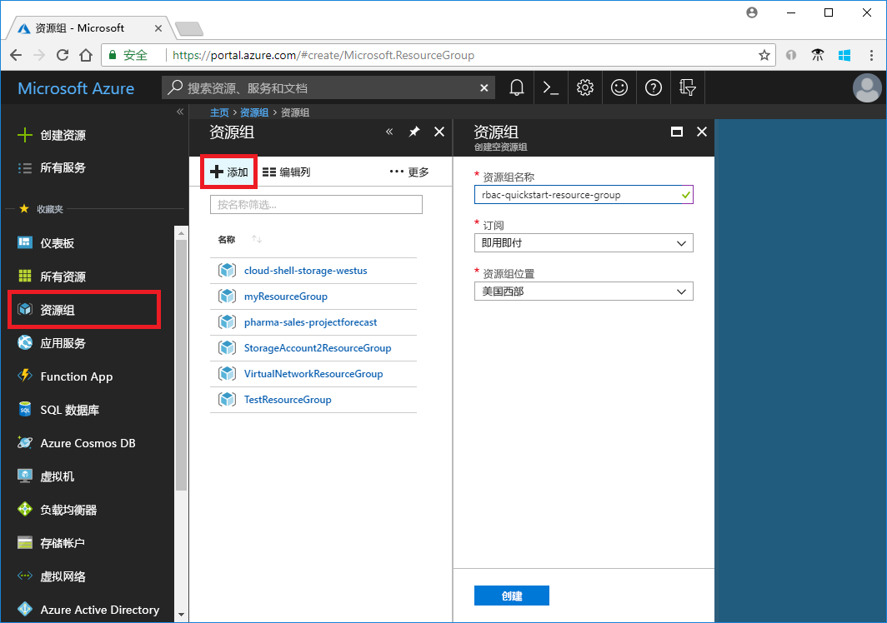
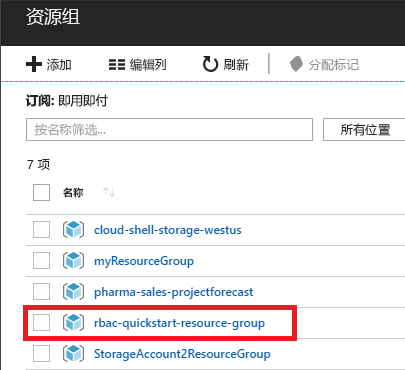
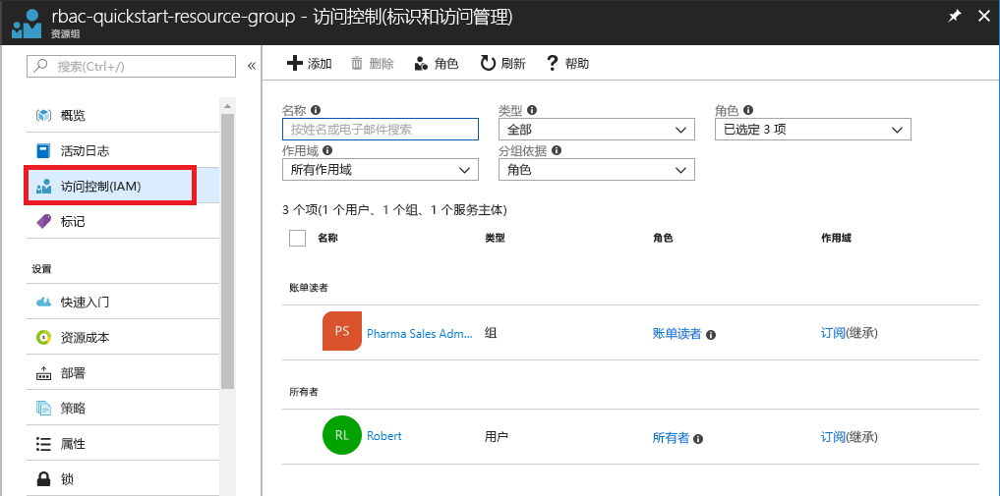
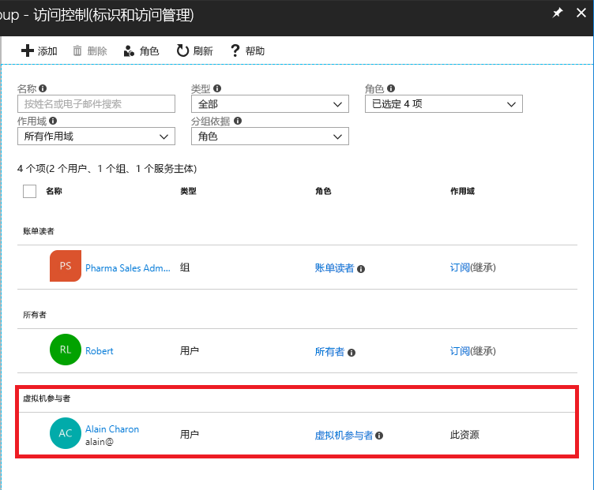
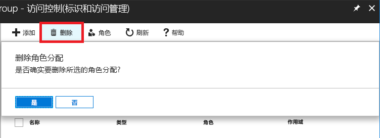

# 教程：使用 RBAC 和 Azure 门户授予用户对 Azure 资源的访问权限

可以通过[基于角色的访问控制 (RBAC)](overview.md) 管理对 Azure 资源的访问权限。 在本教程中，你将授权用户在某个资源组中创建和管理虚拟机。

在本教程中，你将了解如何执行以下操作：

> [!div class="checklist"]
> * 在资源组范围内为用户授予访问权限
> * 删除访问权限

如果没有 Azure 订阅，请在开始之前创建一个[免费帐户](https://azure.microsoft.com/free/?WT.mc_id=A261C142F)。

## 登录 Azure

通过 https://portal.azure.com 登录到 Azure 门户。

## 创建资源组

1. 在导航列表中，单击“资源组”  。

1. 单击“添加”以打开“资源组”边栏选项卡。  

   

1. 对于“资源组名称”  ，输入 **rbac-resource-group**。

1. 选择订阅和位置。

1. 单击“创建”创建资源组。 

1. 单击“刷新”  以刷新资源组的列表。

   新资源组将出现在你的资源组列表中。

   

## 授予访问权限

在 RBAC 中，若要授予访问权限，请创建角色分配。

1. 在“资源组”  列表中，单击新的 rbac-resource-group  资源组。

1. 单击“访问控制(IAM)”  。

1. 单击“角色分配”  选项卡以查看当前的角色分配列表。

   

1. 单击“添加” > “添加角色分配”以打开“添加角色分配”窗格。  

   如果没有分配角色的权限，则将禁用“添加角色分配”选项。

   

   

1. 在“角色”下拉列表中，选择“虚拟机参与者”。  

1. 在“选择”  列表中，选择你自己或其他用户。

1. 单击“保存”，创建角色分配  。

   片刻之后，将在 rbac-resource-group 资源组范围内为用户分配“虚拟机参与者”角色。

   

## 删除访问权限

在 RBAC 中，若要删除访问权限，请删除角色分配。

1. 在角色分配列表中，在具有“虚拟机参与者”角色的用户旁边添加复选标记。

1. 单击 **“删除”** 。

   

1. 在显示的“删除角色分配”消息中，单击“是”。 

## 清除

1. 在导航列表中，单击“资源组”  。

1. 单击“rbac-resource-group”  以打开该资源组。

1. 单击“删除资源组”  以删除该资源组。

   

1. 在“是否确定要删除”  边栏选项卡上，键入资源组名称：**rbac-resource-group**。

1. 单击“删除”  以删除该资源组。

## 后续步骤

> [!div class="nextstepaction"]
> [教程：使用 RBAC 和 Azure PowerShell 授予用户对 Azure 资源的访问权限](tutorial-role-assignments-user-powershell.md)
