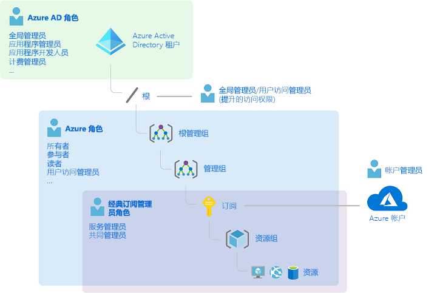
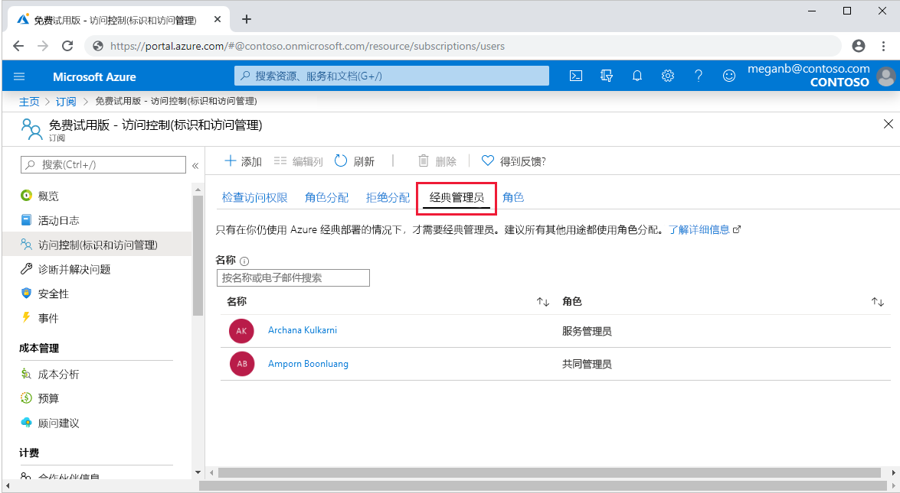
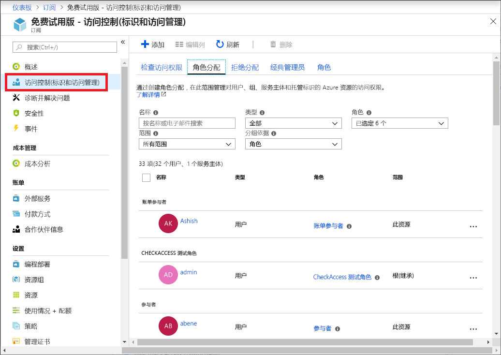
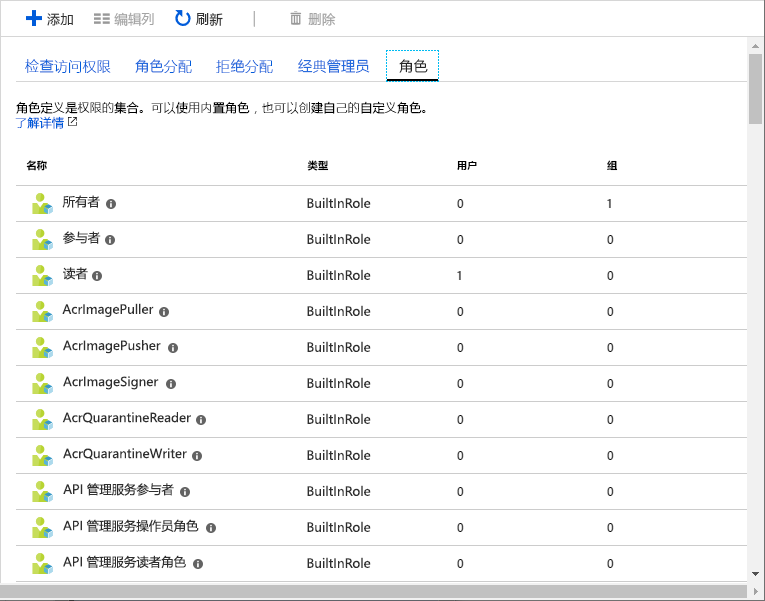
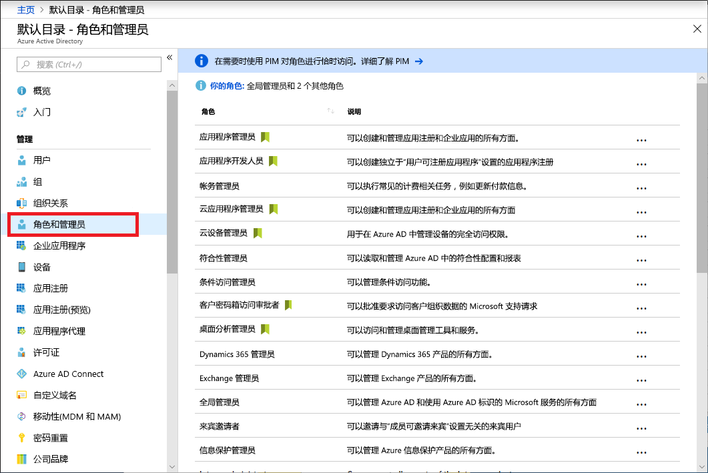
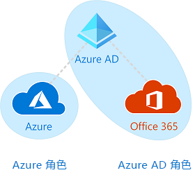

# 经典订阅管理员角色、Azure 角色和 Azure AD 角色

如果你不熟悉 Azure，可能会发现，要理解 Azure 中的所有不同角色存在一定的难度。 本文将帮助解释以下角色，以及应在何时使用其中的每种角色：
- 经典订阅管理员角色
- Azure 角色
- Azure Active Directory (Azure AD) 角色

## 角色之间的相互关系

若要更好地理解 Azure 中的角色，最好是先了解一些历史信息。 Azure 最初发布时，对资源的访问权限只是通过以下三种管理员角色进行管理：帐户管理员、服务管理员和共同管理员。 稍后，添加了 Azure 基于角色的访问控制 (Azure RBAC)。 Azure RBAC 是一个较新的授权系统，它针对 Azure 资源提供精细的访问管理。 Azure RBAC 包括许多内置角色，可在不同的范围进行分配，并允许你创建自己的自定义角色。 若要管理 Azure AD 中的资源（例如用户、组和域），可以使用多种 Azure AD 角色。

下图从较高的层面显示了经典订阅管理员角色、Azure 角色与 Azure AD 角色之间的相互关系。

## 经典订阅管理员角色

帐户管理员、服务管理员和共同管理员是 Azure 中的三种经典订阅管理员角色。 经典订阅管理员对 Azure 订阅拥有完全访问权限。 他们可以使用 Azure 门户、Azure 资源管理器 API 和经典部署模型 API 来管理资源。 用于注册 Azure 的帐户会自动同时设置为帐户管理员和服务管理员。 然后，可以添加其他共同管理员。 服务管理员和共同管理员拥有在订阅范围内分配有“所有者”角色（一个 Azure 角色）的用户的等效访问权限。 下表描述了这三种经典订阅管理角色之间的差别。

| 经典订阅管理员 | 限制 | 权限 | 说明 |
| --- | --- | --- | --- |
| 帐户管理员 | 每个 Azure 帐户有 1 个 | <ul><li>[在 Azure 门户](https://portal.azure.com/#blade/Microsoft_Azure_Billing/SubscriptionsBlade)中管理计费</li><li>管理帐户中的所有订阅</li><li>创建新订阅</li><li>取消订阅</li><li>更改订阅的计费</li><li>更改服务管理员</li></ul> | 在概念上是订阅的计费所有者。 帐户管理员无权访问 Azure 门户。 |
| 服务管理员 | 每个 Azure 订阅有 1 个 | <ul><li>在 [Azure 门户](https://portal.azure.com)中管理服务</li><li>取消订阅</li><li>将用户分配到共同管理员角色</li></ul> | 默认情况下，新订阅的帐户管理员也是服务管理员。 服务管理员拥有在订阅范围内分配有“所有者”角色的用户的等效访问权限。 服务管理员具有 Azure 门户的完全访问权限。 |
| 共同管理员 | 每个订阅有 200 个 | <ul><li>与服务管理员的访问特权相同，但无法更改订阅与 Azure 目录之间的关联。</li><li>将用户分配到共同管理员角色，但无法更改服务管理员</li></ul> | 共同管理员拥有在订阅范围内分配有“所有者”角色的用户的等效访问权限。 |

在 Azure 门户中，可以使用“经典管理员”选项卡管理共同管理员或查看服务管理员。

在 Azure 门户中，可以在订阅的属性边栏选项卡上，查看或更改服务管理员，或是查看帐户管理员。

有关详细信息，请参阅 [Azure 经典订阅管理员](classic-administrators.md)。

### Azure 帐户和 Azure 订阅

Azure 帐户代表计费关系。 一个 Azure 帐户代表一个用户标识、一个或多个 Azure 订阅和一组关联的 Azure 资源。 创建帐户的人员是该帐户中创建的所有订阅的帐户管理员。 此人也是订阅的默认服务管理员。

Azure 订阅可帮助你组织 Azure 资源的访问权限。 它们还可帮助控制如何根据资源使用量生成报告、计费及付费。 每个订阅可以采用不同的计费和付款设置，因此，根据办公室、部门、项目等因素，可以采用不同的订阅和不同的计划。 每个服务属于一个订阅，执行编程操作时可能需要订阅 ID。

每个订阅都与一个 Azure AD 目录相关联。 若要查找与订阅关联的目录，请在 Azure 门户中打开“订阅”，然后选择一个订阅以查看目录。

帐户和订阅在 [Azure 门户](https://portal.azure.com/#blade/Microsoft_Azure_Billing/SubscriptionsBlade)中进行管理。

## Azure 角色

Azure RBAC 是基于 [Azure 资源管理器](../azure-resource-manager/management/overview.md)构建的授权系统，它针对 Azure 资源（例如计算和存储）提供精细的访问权限管理。 Azure RBAC 包括 70 多个内置角色。 有四个基本的 Azure 角色。 前三个角色适用于所有资源类型：

| Azure 角色 | 权限 | 说明 |
| --- | --- | --- |
| [所有者](built-in-roles.md#owner) | <ul><li>对所有资源的完全访问权限</li><li>将访问权限委托给其他人</li></ul> | 服务管理员和共同管理员在订阅范围内分配有“所有者”角色 适用于所有资源类型。 |
| [参与者](built-in-roles.md#contributor) | <ul><li>创建和管理所有类型的 Azure 资源</li><li>在 Azure Active Directory 中创建一个新租户</li><li>无法将访问权限授予其他人</li></ul> | 适用于所有资源类型。 |
| [读取者](built-in-roles.md#reader) | <ul><li>查看 Azure 资源</li></ul> | 适用于所有资源类型。 |
| [用户访问管理员](built-in-roles.md#user-access-administrator) | <ul><li>管理用户对 Azure 资源的访问</li></ul> |  |

剩余的内置角色允许管理特定的 Azure 资源。 例如，[虚拟机参与者](built-in-roles.md#virtual-machine-contributor)角色允许用户创建和管理虚拟机。 有关所有内置角色的列表，请参阅 [Azure 内置角色](built-in-roles.md)。

只有 Azure 门户和 Azure 资源管理器 API 支持 Azure RBAC。 分配有 Azure 角色的用户、组和应用程序无法使用 [Azure 经典部署模型 API](../azure-resource-manager/management/deployment-models.md)。

在 Azure 门户中，使用 Azure RBAC 的角色分配显示在“访问控制(标识和访问管理)”边栏选项卡上。 在整个门户中都可以找到此边栏选项卡，例如，在管理组、订阅、资源组和各种资源所在的部分。

单击“角色”选项卡时，会看到内置角色和自定义角色的列表。

有关详细信息，请参阅[使用 Azure 门户添加或删除 Azure 角色分配](role-assignments-portal.md)。

## Azure AD 角色

Azure AD 角色用于管理目录中的 Azure AD 资源，例如，创建或编辑用户、将管理角色分配给其他人、重置用户密码、管理用户许可证以及管理域。 下表描述了几个更重要的 Azure AD 角色。

| Azure AD 角色 | 权限 | 说明 |
| --- | --- | --- |
| [全局管理员](../active-directory/users-groups-roles/directory-assign-admin-roles.md#company-administrator-permissions) | <ul><li>管理对 Azure Active Directory 中所有管理功能的访问，以及与 Azure Active Directory 联合的服务</li><li>将管理员角色分配给其他人</li><li>重置任何用户和其他所有管理员的密码</li></ul> | 注册 Azure Active Directory 租户的人员将成为全局管理员。 |
| [用户管理员](../active-directory/users-groups-roles/directory-assign-admin-roles.md#user-administrator) | <ul><li>创建和管理用户与组的所有方面</li><li>管理支持票证</li><li>监视服务运行状况</li><li>更改用户、支持管理员和其他用户帐户管理员的密码</li></ul> |  |
| [计费管理员](../active-directory/users-groups-roles/directory-assign-admin-roles.md#billing-administrator) | <ul><li>购买产品</li><li>管理订阅</li><li>管理支持票证</li><li>监视服务运行状况</li></ul> |  |

在 Azure 门户中的“角色和管理员”边栏选项卡上，可以看到 Azure AD 角色的列表。 有关所有 Azure AD 角色的列表，请参阅 [Azure Active Directory 中的管理员角色权限](../active-directory/users-groups-roles/directory-assign-admin-roles.md)。

## Azure 角色与 Azure AD 角色之间的差别

从较高层面讲，Azure 角色控制 Azure 资源的管理权限，而 Azure AD 角色控制 Azure Active Directory 资源的管理权限。 下表比较了两者之间的一些差别。

| Azure 角色 | Azure AD 角色 |
| --- | --- |
| 管理对 Azure 资源的访问 | 管理对 Azure Active Directory 资源的访问 |
| 支持自定义角色 | 支持自定义角色 |
| 可在多个级别（管理组、订阅、资源组、资源）指定范围 | 范围为租户级别 |
| 可在 Azure 门户、Azure CLI、Azure PowerShell、Azure 资源管理器模板、REST API 中访问角色信息 | 可在 Azure 管理门户、Microsoft 365 管理中心、Microsoft Graph、AzureAD PowerShell 中访问角色信息 |

### Azure 角色与 Azure AD 角色是否重叠？

默认情况下，Azure 角色与 Azure AD 角色不会跨越 Azure 与 Azure AD。 但是，如果全局管理员通过在 Azure 门户中选择“Azure 资源的访问管理”开关，提升了自己的访问权限，则会针对特定租户的所有订阅为全局管理员授予[用户访问管理员](built-in-roles.md#user-access-administrator)角色（Azure 角色）。 “用户访问管理员”角色允许用户向其他用户授予对 Azure 资源的访问权限。 此开关可帮助重新获取订阅的访问权限。 有关详细信息，请参阅[提升访问权限以管理所有 Azure 订阅和管理组](elevate-access-global-admin.md)。

有多个 Azure AD 角色（例如全局管理员和用户管理员角色）可跨越 Azure AD 和 Microsoft Office 365。 例如，如果你是全局管理员角色的成员，则会获得 Azure AD 和 Office 365 中的全局管理员功能，例如，对 Microsoft Exchange 和 Microsoft SharePoint 进行更改。 但是，在默认情况下，全局管理员无权访问 Azure 资源。

## 后续步骤

- [什么是 Azure 基于角色的访问控制 (Azure RBAC)？](overview.md)
- [Azure Active Directory 中的管理员角色权限](../active-directory/users-groups-roles/directory-assign-admin-roles.md)
- [Azure 经典订阅管理员](classic-administrators.md)
