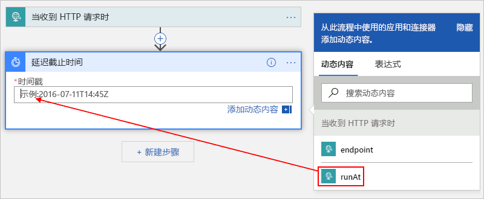
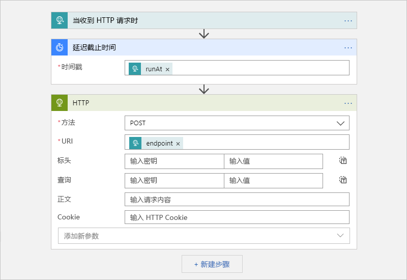

# 将 Azure 计划程序作业迁移到 Azure 逻辑应用

> [!IMPORTANT]
> Azure 逻辑应用将替换即将停用的 Azure 计划程序。 若要安排作业，请按照本文说明迁移到 Azure 逻辑应用。

本文介绍如何通过使用 Azure 逻辑应用而非 Azure 计划程序来创建自动化工作流，从而安排一次性作业和重复作业。 使用逻辑应用创建计划的作业时，将获得以下好处：

* 不必担心*作业集合*的概念，因为每个逻辑应用都是一个单独的 Azure 资源。

* 可以使用单个逻辑应用运行多个一次性作业。

* Azure 逻辑应用服务支持时区和夏令时 (DST)。

若要了解详细信息，请参阅[什么是 Azure 逻辑应用？](../logic-apps/logic-apps-overview.md) 或者尝试在此快速入门中创建第一个逻辑应用：[创建第一个逻辑应用](../logic-apps/quickstart-create-first-logic-app-workflow.md)。

## 必备组件

* Azure 订阅。 如果没有 Azure 订阅，请<a href="https://azure.microsoft.com/free/" target="_blank">注册一个免费 Azure 帐户</a>。

* 若要通过发送 HTTP 请求来触发逻辑应用，请使用 [Postman 桌面应用](https://www.getpostman.com/apps)等工具。

## 安排一次性作业

只需创建一个逻辑应用即可运行多个一次性作业。 

### 创建逻辑应用

1. 在 [Azure 门户](https://portal.azure.com)的逻辑应用设计器中创建一个空白的逻辑应用。 

   有关的基本步骤，请按照[快速入门：创建第一个逻辑应用](../logic-apps/quickstart-create-first-logic-app-workflow.md)。

1. 在搜索框中，输入“收到 http 请求时”作为筛选器。 从触发器列表中选择此触发器：**收到 HTTP 请求时** 

   

1. 对于请求触发器，可以选择提供 JSON 架构，这有助于逻辑应用设计器了解传入请求的输入结构，使你稍后在工作流中更易选择输出。

   若要指定架构，请在“请求正文 JSON 架构”框中输入架构，例如： 

   

   如果你没有架构，但有一个 JSON 格式的示例有效负载，则可以基于该有效负载生成一个架构。

   1. 在请求触发器中，选择“使用示例有效负载生成架构”。

   1. 在“输入或粘贴示例 JSON 有效负载”下，提供示例有效负载并选择“完成”，例如：

      

1. 在触发器下，选择“下一步”。 

1. 在搜索框中，输入“延迟截止时间”作为筛选器。 在操作列表中选择以下操作：**延迟截止时间**

   此操作会暂停逻辑应用工作流，直到指定的日期和时间。

   

1. 输入要启动逻辑应用工作流的时间戳。 

   在“时间戳”框内单击时，会显示动态内容列表，以便根据需要选择触发器的输出。

   

1. 通过从[大约 200 多个连接器](../connectors/apis-list.md)中进行选择，来添加要运行的任何其他操作。 

   例如，可以包含向 URL 发送请求的 HTTP 操作，或包含处理存储队列、服务总线队列或服务总线主题的操作： 

   

1. 完成后，保存逻辑应用。

   

   第一次保存逻辑应用时，逻辑应用的请求触发器的终结点 URL 会显示在“HTTP POST URL”框中。 
   如果要调用逻辑应用并将输入发送到逻辑应用进行处理，请使用此 URL 作为调用目标。

   

1. 复制并保存此终结点 URL，以便稍后发送触发逻辑应用的手动请求。 

## 启动一次性作业

若要手动运行或触发一次性作业，请发送对逻辑应用的请求触发器终结点 URL 的调用。 在此调用中，请指定要发送的输入或有效负载，你之前可能已通过指定架构进行了描述。 

例如，通过使用 Postman 应用，可以采用与此示例类似的设置创建 POST 请求，然后选择“发送”以发出请求。

| 请求方法 | 代码 | Body | 标头 |
|----------------|-----|------|---------| 
| **POST** | <endpoint-URL> | **raw** 
**JSON(application/json)** 
在“raw”框中，输入要在请求中发送的有效负载。 
**注意**：此设置自动配置**标头**值。 | **密钥**：Content-Type  **值**：application/json
 |||| 

发送调用后，逻辑应用的响应会显示在“正文”选项卡中的“raw”框下方。 

> [!IMPORTANT]
>
> 如果稍后想取消作业，请选择“标头”选项卡。在响应中查找并复制 **x-ms-workflow-run-id** 标头值。 
>
> 

## 取消一次性作业

在逻辑应用中，每个一次性作业均作为单个逻辑应用运行实例执行。 若要取消一次性作业，可以使用逻辑应用 REST API 中的[工作流运行 - 取消](https://docs.microsoft.com/rest/api/logic/workflowruns/cancel)。 发送对触发器的调用时，请提供[工作流运行 ID](#workflow-run-id)。

## 安排重复作业

### 创建逻辑应用

1. 在 [Azure 门户](https://portal.azure.com)的逻辑应用设计器中创建一个空白的逻辑应用。 

   有关的基本步骤，请按照[快速入门：创建第一个逻辑应用](../logic-apps/quickstart-create-first-logic-app-workflow.md)。

1. 在搜索框中，输入“定期”作为筛选器。 从触发器列表中选择此触发器：**定期** 

   

1. 如果需要，可以设置更高级的计划。

   

   有关高级计划选项的详细信息，请参阅[使用 Azure 逻辑应用创建和运行重复任务和工作流](../connectors/connectors-native-recurrence.md)

1. 通过从 [200 多个连接器](../connectors/apis-list.md)中进行选择，来添加所需的其他操作。 在触发器下，选择“下一步”。 查找并选择所需的操作。

   例如，可以包含向 URL 发送请求的 HTTP 操作，或包含处理存储队列、服务总线队列或服务总线主题的操作： 

   

1. 完成后，保存逻辑应用。

   

## 高级设置

下面是可以自定义作业的其他方法。

### 重试策略

若要控制在出现间歇性失败时操作尝试在逻辑应用中重新运行的方式，可以在每个操作的设置中设置[重试策略](../logic-apps/logic-apps-exception-handling.md#retry-policies)，例如：

1. 打开该操作的 (**...**) 菜单，选择“设置”。

   

1. 选择所需的重试策略。 有关每个策略的详细信息，请参阅[重试策略](../logic-apps/logic-apps-exception-handling.md#retry-policies)。

   

## 处理异常和错误

在 Azure 计划程序中，如果默认操作无法运行，则可以运行解决错误情况的替代操作。 在 Azure 逻辑应用中，也可以执行相同的任务。

1. 在逻辑应用设计器中要处理的操作上方，将指针移到各步骤之间的箭头上，然后选择“添加并行分支”。 

   

1. 查找并选择要作为替代操作运行的操作。

   

1. 在替代操作上，打开 (**...**) 菜单，选择“配置随后运行”。

   

1. 清除“成功”属性的相应框。 选择以下属性：“失败”、“已跳过”和“已超时”

   

1. 完成后，选择“完成”。

若要详细了解异常处理，请参阅[处理错误和异常 - RunAfter 属性](../logic-apps/logic-apps-exception-handling.md#catch-and-handle-failures-with-the-runafter-property)。

## 常见问题解答

 

**问**：何时 Azure 计划程序即将停用？  
**答**：Azure 计划程序计划上 2019 年 9 月 30 日停用。

**问**：该服务停用后我的计划程序作业集合和作业的怎么办？  
**答**：将从系统中删除所有计划程序作业集合和作业。

**问**：我是否需要备份或迁移到逻辑应用我的计划程序作业之前执行任何其他任务？  
**答**：最佳做法是，始终备份您的工作。 在删除或禁用计划程序作业之前，请检查你创建的逻辑应用是否按预期运行。 

**问**：是否有可以帮助我将我的作业计划程序迁移到逻辑应用的工具？  
**答**：每个计划程序作业是唯一的因此不存在通用的工具。 但是，可以使用各种脚本来根据需要进行修改。 对于脚本可用性，请以后再回来查看。

**问**：哪里可以获得迁移我的计划程序作业的支持？  
**答**：下面是获取支持的一些方法： 

**Azure 门户**

如果 Azure 订阅具有付费支持计划，则可以在 Azure 门户中创建技术支持请求。 如果没有，则可以选择其他支持选项。

1. 在 [Azure 门户](https://portal.azure.com)主菜单中，选择“帮助和支持”。

1. 在“支持”下，选择“新建支持请求”。 为请求提供以下详细信息：

   | 设置 | 值 |
   |---------|-------|
   | **问题类型** | **技术** | 
   | **订阅** | <*your-Azure-subscription*> | 
   | **服务** | 在“监视和管理”下，选择“计划程序”。 | 
   ||| 

1. 选择所需的支持选项。 如果有付费支持计划，请选择“下一步”。

**社区**

* [Azure 逻辑应用论坛](https://social.msdn.microsoft.com/Forums/en-US/home?forum=azurelogicapps)
* [Stack Overflow](https://stackoverflow.com/questions/tagged/azure-scheduler)

## 后续步骤

* [使用 Azure 逻辑应用创建定期运行的任务和工作流](../connectors/connectors-native-recurrence.md)
* [教程：使用基于计划的逻辑应用检查流量](../logic-apps/tutorial-build-schedule-recurring-logic-app-workflow.md)